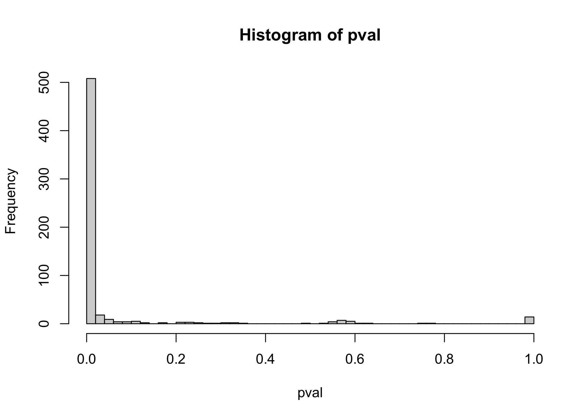
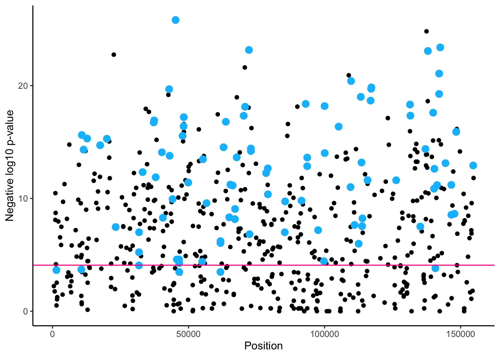

Analysis of pooled-continuous freebayes vcf file
================
2023-07-25

#### Load in libraries needed for analysis

``` r
# load library
# install.packages("vcfR")
library(vcfR)
```

    ## 
    ##    *****       ***   vcfR   ***       *****
    ##    This is vcfR 1.14.0 
    ##      browseVignettes('vcfR') # Documentation
    ##      citation('vcfR') # Citation
    ##    *****       *****      *****       *****

``` r
# install.packages("SNPfiltR")
library(SNPfiltR)
```

    ## This is SNPfiltR v.1.0.1
    ## 
    ## Detailed usage information is available at: devonderaad.github.io/SNPfiltR/ 
    ## 
    ## If you use SNPfiltR in your published work, please cite the following papers: 
    ## 
    ## DeRaad, D.A. (2022), SNPfiltR: an R package for interactive and reproducible SNP filtering. Molecular Ecology Resources, 22, 2443-2453. http://doi.org/10.1111/1755-0998.13618 
    ## 
    ## Knaus, Brian J., and Niklaus J. Grunwald. 2017. VCFR: a package to manipulate and visualize variant call format data in R. Molecular Ecology Resources, 17.1:44-53. http://doi.org/10.1111/1755-0998.12549

``` r
library(ggplot2)
```

#### Read in vcf, filter it, and generate a dataframe that includes the position, allele counts, and bases for each SNP separated by reference and alternate allele. Only considering biallelic SNPs here.

``` r
# read in vcf
DiNV_vcf <- read.vcfR("~/Desktop/KU/sequences/16Cq-DiNV-Test/freebayes/continuous-DiNV.vcf")
```

    ## Scanning file to determine attributes.
    ## File attributes:
    ##   meta lines: 59
    ##   header_line: 60
    ##   variant count: 13116
    ##   column count: 11
    ## Meta line 59 read in.
    ## All meta lines processed.
    ## gt matrix initialized.
    ## Character matrix gt created.
    ##   Character matrix gt rows: 13116
    ##   Character matrix gt cols: 11
    ##   skip: 0
    ##   nrows: 13116
    ##   row_num: 0
    ## Processed variant 1000Processed variant 2000Processed variant 3000Processed variant 4000Processed variant 5000Processed variant 6000Processed variant 7000Processed variant 8000Processed variant 9000Processed variant 10000Processed variant 11000Processed variant 12000Processed variant 13000Processed variant: 13116
    ## All variants processed

``` r
# filter vcf to remove sites (SNPs) with more than two alleles present (from SNPfiltR package)
DiNV_vcf <- filter_biallelic(DiNV_vcf)
```

    ## 2668 SNPs, 0.203% of all input SNPs, contained more than 2 alleles, and were removed from the VCF

<!-- -->

``` r
# extract the number of reads supporting the reference allele for each sample at each SNP 
# DiNV_vcf has a column containing RO or reference allele information
# the extract.gt function will subset from that column
# the same column contains a lot of other information separated by : and , which is why a specific function is needed 
ref <- as.data.frame(extract.gt(DiNV_vcf, element = "RO"))
# extract the number of reads supporting the alternate allele for each sample at each SNP 
# AO is alternate allele
# because I removed all SNPs that are more than biallelic, there should only be 1 alternate allele
alt <- as.data.frame(extract.gt(DiNV_vcf, element = "AO"))

# ref and alt are just SNPs and the number of reads
# But I want to also add other information with these, like what are the actual bases for the alleles, and have a column for the position 
# that information is in the fix portion of the vcf file, which is hard to look at 
# check what it looks like by naming it and looking at it 
x<-DiNV_vcf@fix
# after looking at x, I can see that the columns I want are 1: chromosome, 2: position, 4: reference allele, and 5: alternate allele
# subset out those columns 
DiNV_SNPs<-as.data.frame(DiNV_vcf@fix[,c(1,2,4,5)])
# add the read counts supporting the reference and alternate alleles for each of the two sequenced strains as their own columns
DiNV_SNPs$inn.ref<-ref$INN
DiNV_SNPs$inn.alt<-alt$INN
DiNV_SNPs$vir.ref<-ref$VIR
DiNV_SNPs$vir.alt<-alt$VIR

# there might be some missing data in this file, which would come out as rows where either inn or vir have an NA for alleles 
# remove any rows that have an NA 
DiNV_SNPs <- na.omit(DiNV_SNPs)

# additionally, the position needs to be read as a number by R
# turn it into numeric
head(DiNV_SNPs) # check numbers before
```

    ##         CHROM POS REF ALT inn.ref inn.alt vir.ref vir.alt
    ## 1 NC_040699.1  43   A   C       8       0      47       1
    ## 2 NC_040699.1  47   T   G       9       0      55       1
    ## 3 NC_040699.1  66   T   G      10       0      80       1
    ## 4 NC_040699.1  70   T   A      11       0      79       2
    ## 5 NC_040699.1  79   A   C      12       0      90       1
    ## 6 NC_040699.1  84   T   A      13       0      93       1

``` r
DiNV_SNPs$POS <- as.numeric(DiNV_SNPs$POS)
head(DiNV_SNPs) # check to make sure numbers stay the same, sometimes as.numeric can change numbers
```

    ##         CHROM POS REF ALT inn.ref inn.alt vir.ref vir.alt
    ## 1 NC_040699.1  43   A   C       8       0      47       1
    ## 2 NC_040699.1  47   T   G       9       0      55       1
    ## 3 NC_040699.1  66   T   G      10       0      80       1
    ## 4 NC_040699.1  70   T   A      11       0      79       2
    ## 5 NC_040699.1  79   A   C      12       0      90       1
    ## 6 NC_040699.1  84   T   A      13       0      93       1

Looks good.

#### From the SNPs, run a Fisher’s Exact Test on each one and determine the p-value. “Fisher’s exact test is a statistical test used to determine if there are nonrandom associations between two categorical variables.” Basically, I want to see if the number of alleles is specifically associated with one sample type or the other.

<https://mathworld.wolfram.com/FishersExactTest.html>

``` r
# this will need to be run in a loop because there are 10,437 SNPs and each one needs an individual dataframe 
# and a test run on them 
# starting by testing the process with just one SNP
# start by making the first column be the reference allele: reference=
# give reference a list of the numbers I want it to be: the first allele count entry in DiNV_SNPs for innubila reference and virilis reference 
# then the second column is the alternative allele: alt=
# and do the same thing, the first entry in DiNV_SNPs for innubila alternate and virilis alternate 
# then I give the dataframe row names, which are in the same order as the allele counts are specified 
test_df <- data.frame(reference=as.numeric(c(DiNV_SNPs$inn.ref[1],DiNV_SNPs$vir.ref[1])), 
                alt=as.numeric(c(DiNV_SNPs$inn.alt[1],DiNV_SNPs$vir.alt[1])),
                row.names = c("inn","vir"))

# use this test_df to perform a Fisher's Exact Test
test1<-fisher.test(test_df)
# look at the p-value
test1$p.value
```

    ## [1] 1

``` r
# check the test_df
head(test_df)
```

    ##     reference alt
    ## inn         8   0
    ## vir        47   1

A p-value of 1 makes sense because if you look at this SNP, there really
isn’t a difference between the alleles, which you can see in the
test_df.

#### Scale up making the test dataframe for each SNP, and run the Fisher’s Exact Test, and extract p-values and add them to the DiNV_SNPs dataframe

``` r
# open an empty vector to hold each p-value
# this is so R has somewhere to put the p-values
pval<-c()
# for loop to iterate over each row in the dataframe named 'DiNV_SNPs' one after the other and record p-value for each row (ie, SNP)
# usesi in 1 through nrow because it will use the exact number of rows in the SNP dataframe
for (i in 1:nrow(DiNV_SNPs)){
  # make 1 data frame for the given SNP with numbers of alleles 
  df1<-data.frame(reference=as.numeric(c(DiNV_SNPs$inn.ref[i],DiNV_SNPs$vir.ref[i])),
                alt=as.numeric(c(DiNV_SNPs$inn.alt[i],DiNV_SNPs$vir.alt[i])),
                row.names = c("inn","vir"))
  #perform a fisher's exact test for above dataframe
  test2<-fisher.test(df1)
  # store p value for this test in our vector 'pval'
  # the [i] tells R to store the value in the i-th position
  pval[i]<-test2$p.value
}

# check out my p-values

hist(pval, breaks = 50)
```

<!-- -->

``` r
# add in the pval vector to the DiNV_SNPs and name it 
DiNV_SNPs$fisher_pval<-pval

# check  new DiNV_SNPs to make sure it looks right
head(DiNV_SNPs)
```

    ##         CHROM POS REF ALT inn.ref inn.alt vir.ref vir.alt fisher_pval
    ## 1 NC_040699.1  43   A   C       8       0      47       1           1
    ## 2 NC_040699.1  47   T   G       9       0      55       1           1
    ## 3 NC_040699.1  66   T   G      10       0      80       1           1
    ## 4 NC_040699.1  70   T   A      11       0      79       2           1
    ## 5 NC_040699.1  79   A   C      12       0      90       1           1
    ## 6 NC_040699.1  84   T   A      13       0      93       1           1

Most p-values should be 1 because the SNP allele counts are not
significantly different between the samples.

#### Make a scatterplot of the p-values on the y-axis and the position in the DiNV genome on the x-axis. This is basically a manhattan plot. The p-value is transformed into the negative log of the p-value. And a multiple test correction (bonferroni) line is applied to the plot to show SNPs that are significant above that line.

``` r
# first want to transform the p-value in to the negative log 10 so that really small p-values get plotted as larger 
# create a new column in the dataframe 
DiNV_SNPs$neg_log_pval <- (log10(DiNV_SNPs$fisher_pval))*-1

# get multiple testing corrected p value (0.05/ number of tests)
MTC <- 0.05/nrow(DiNV_SNPs)

# plot scatter plot and add in the line for the MTC (must take negative log10 of that value)
ggplot(DiNV_SNPs, aes(x=POS, y=neg_log_pval))+
  geom_point()+
  geom_hline(yintercept = -log10(MTC), color="blueviolet")+
  theme_classic() + xlab("Position") + ylab("Negative log10 p-value")
```

<!-- -->

``` r
# which SNPs have a p-value less than the multiple testing threshold
sig.snps<-DiNV_SNPs[DiNV_SNPs$fisher_pval < MTC,]
```

There are 355 significant SNPs with this method of multiple test
corrections.

#### Looking for the SNPs from Hill and Unckless (2020) (<https://elifesciences.org/articles/58931>) in this data

``` r
# list of positions of important SNPs (12)
snps <- c(14249,41210,42389,59194,59275,59276,66615,78978,78991,126118,132593,140117)

# which SNPs are present in the DiNV_SNPs (not just significant ones)
table(snps %in% DiNV_SNPs$POS)
```

    ## 
    ## FALSE  TRUE 
    ##     6     6

``` r
# 6 are SNPs, and 6 were not found as SNPs

# isolate the details of the found SNPs
# separate out the 6 that are present in DiNV_SNPs
found.snps <- snps[snps %in% DiNV_SNPs$POS]
# show the p-values and allele frequency differences between the samples for these SNPs of interest
DiNV_SNPs[DiNV_SNPs$POS %in% found.snps,]
```

    ##            CHROM    POS REF ALT inn.ref inn.alt vir.ref vir.alt fisher_pval
    ## 897  NC_040699.1  14249   G   T       1      15       0      10  1.00000000
    ## 3923 NC_040699.1  59194   A   G       0      12       0      15  1.00000000
    ## 4411 NC_040699.1  66615   G   A       3       3       0      11  0.02941176
    ## 5352 NC_040699.1  78978   C   T       0       4       0       3  1.00000000
    ## 5353 NC_040699.1  78991   G   A       0       5       0       3  1.00000000
    ## 9402 NC_040699.1 140117   T   C       0      14       0      11  1.00000000
    ##      neg_log_pval
    ## 897      0.000000
    ## 3923     0.000000
    ## 4411     1.531479
    ## 5352     0.000000
    ## 5353     0.000000
    ## 9402     0.000000

Interestingly, for most of these SNPs, they aren’t really SNPs between
the two samples, just between the reference. This doesn’t track what Rob
said about the D. virilis sample where all the SNPs should be present,
both the reference and the alternate.

#### Another thing to look at is the raw allele frequency differences between the two samples

``` r
# allele frequency is the reads for the allele divided by all alleles 
# ex. alternate allele frequency is the number of alternate alleles divided by the number of alt alleles plus reference alleles
# calculate frequency of alternate allele in innubila
freq.in <- as.numeric(DiNV_SNPs$inn.alt)/(as.numeric(DiNV_SNPs$inn.alt)+as.numeric(DiNV_SNPs$inn.ref))
# calculate frequency of alternate allele in virilis
freq.vir <- as.numeric(DiNV_SNPs$vir.alt)/(as.numeric(DiNV_SNPs$vir.alt)+as.numeric(DiNV_SNPs$vir.ref))
# calculate allele frequency difference between the two samples by subtracting innubila frequency from virilis 
DiNV_SNPs$af.dif<-abs(freq.in-freq.vir)
# how many SNPs are fixed for the alternate allele in innubila?
table(freq.in == 1)
```

    ## 
    ## FALSE  TRUE 
    ## 10405    32

``` r
# how many SNPs are fixed for the alternate allele in virilis?
table(freq.vir == 1)
```

    ## 
    ## FALSE  TRUE 
    ##  9961   476

``` r
# how many SNPs are fixed different between the samples?
table(DiNV_SNPs$af.dif == 1)
```

    ## 
    ## FALSE  TRUE 
    ## 10325   112

``` r
# plot a histogram of the allele freq divergence from the ref genome for innubila with mean value highlighted by vertical red line
hist(freq.in, breaks=100, xlab = "allele frequency divergence from reference genome")
abline(v=mean(freq.in), col="red")
```

<!-- -->

``` r
# plot a histogram of the allele freq divergence from the ref genome for virilus with mean value highlighted by vertical red line
hist(freq.vir, breaks=100, xlab = "allele frequency divergence from reference genome")
abline(v=mean(freq.vir), col="red")
```

<!-- -->

It seems a little strange how many fixed differences from the reference
genome the D. virilis sample has compared to the D. innubila sample. 476
versus 32.

112 fixed differences between the two samples is interesting. It is hard
to say if any of these are adaptive or not, but they do show clear
evolution between the two viral populations.

#### Plot manhattan plot with fixed differences between the samples highlighted in blue

``` r
#isolate a dataframe containing only those fixed SNPs
fixed <- DiNV_SNPs[DiNV_SNPs$af.dif== 1,]

#plot overlaid onto same plot as above, just add in another geom_point
ggplot(DiNV_SNPs, aes(x=POS, y=neg_log_pval))+
  geom_point()+
  geom_point(data=fixed,
             aes(x=POS,y=neg_log_pval), color = "deepskyblue", size=3)+
  geom_hline(yintercept = -log10(MTC), color="deeppink")+
  theme_classic() + xlab("Position") + ylab("Negative log10 p-value")
```

<!-- -->

#### Look at the raw read counts for SNPs Tom found and plot them,

``` r
# starting with the 6 SNPs originally found in Tom's work
# these didn't show much, but I can plot the counts 
found_snps_table <- DiNV_SNPs[DiNV_SNPs$POS %in% found.snps,]

# separate out the table above into 4 tables, 1 for each allele, and the combine them together

inn_ref <- found_snps_table[0,c(2:5,9:11)]
# make in.ref dataframe
  for(i in 1:nrow(found_snps_table)){
  #isolate the row (SNP) you want to work on
  inn_ref[i,]<-found_snps_table[i,c(2:5,9:11)]
  }
inn_ref$cell_type <- rep("innubila", times = nrow(inn_ref))
inn_ref$allele <- rep("reference", times = nrow(inn_ref))

inn_alt <- found_snps_table[0,c(2:5,9:11)]
# make in.ref dataframe
  for(i in 1:nrow(found_snps_table)){
  #isolate the row (SNP) you want to work on
  inn_alt[i,]<-found_snps_table[i,c(2:4,6, 9:11)]
  }
inn_alt$cell_type <- rep("innubila", times = nrow(inn_alt))
inn_alt$allele <- rep("alternate", times = nrow(inn_alt))

vir_ref <- found_snps_table[0,c(2:5,9:11)]
# make in.ref dataframe
  for(i in 1:nrow(found_snps_table)){
  #isolate the row (SNP) you want to work on
  vir_ref[i,]<-found_snps_table[i,c(2:4,7,9:11)]
  }
vir_ref$cell_type <- rep("Dv-1", times = nrow(vir_ref))
vir_ref$allele <- rep("reference", times = nrow(vir_ref))

vir_alt <- found_snps_table[0,c(2:5,9:11)]
# make in.ref dataframe
  for(i in 1:nrow(found_snps_table)){
  #isolate the row (SNP) you want to work on
  vir_alt[i,]<-found_snps_table[i,c(2:4,8:11)]
  }
vir_alt$cell_type <- rep("Dv-1", times = nrow(vir_alt))
vir_alt$allele <- rep("alternate", times = nrow(vir_alt))

found_snps_tidy <- rbind(inn_alt, inn_ref, vir_alt, vir_ref)
colnames(found_snps_tidy)[4] <- "count"

found_snps_tidy$count <- as.numeric(found_snps_tidy$count)

ggplot(data=found_snps_tidy, aes(x=allele, y=count, fill = cell_type)) +
  geom_bar(stat="identity", position=position_dodge()) + facet_grid(~POS) + theme_bw() + theme(axis.text.x = element_text(angle = 45, vjust = 1, hjust=1)) + geom_text(aes(label=count), position=position_dodge(width=0.8), vjust=-0.35)
```

<!-- -->

#### Look at the raw read counts for highly significant SNPs and plot them

``` r
# make an adjusted pval column for my significant SNPs
sig.snps$adjusted_pval <- sig.snps$fisher_pval*10437

# order the sig.snps dataframe 
sig.snps <- sig.snps[order(sig.snps$adjusted_pval),]

# separate out the lowesst 25 adjusted pvalues
top_25_sig_snps <- sig.snps[1:25,]

# separate out the table above into 4 tables, 1 for each allele, and the combine them together

inn_ref <- top_25_sig_snps[0,c(2:5,9:11)]
# make in.ref dataframe
  for(i in 1:nrow(top_25_sig_snps)){
  #isolate the row (SNP) you want to work on
  inn_ref[i,]<-top_25_sig_snps[i,c(2:5,9:11)]
  }
inn_ref$cell_type <- rep("innubila", times = nrow(inn_ref))
inn_ref$allele <- rep("reference", times = nrow(inn_ref))

inn_alt <- top_25_sig_snps[0,c(2:5,9:11)]
# make in.ref dataframe
  for(i in 1:nrow(top_25_sig_snps)){
  #isolate the row (SNP) you want to work on
  inn_alt[i,]<-top_25_sig_snps[i,c(2:4,6, 9:11)]
  }
inn_alt$cell_type <- rep("innubila", times = nrow(inn_alt))
inn_alt$allele <- rep("alternate", times = nrow(inn_alt))

vir_ref <- top_25_sig_snps[0,c(2:5,9:11)]
# make in.ref dataframe
  for(i in 1:nrow(top_25_sig_snps)){
  #isolate the row (SNP) you want to work on
  vir_ref[i,]<-top_25_sig_snps[i,c(2:4,7,9:11)]
  }
vir_ref$cell_type <- rep("Dv-1", times = nrow(vir_ref))
vir_ref$allele <- rep("reference", times = nrow(vir_ref))

vir_alt <- top_25_sig_snps[0,c(2:5,9:11)]
# make in.ref dataframe
  for(i in 1:nrow(top_25_sig_snps)){
  #isolate the row (SNP) you want to work on
  vir_alt[i,]<-top_25_sig_snps[i,c(2:4,8:11)]
  }
vir_alt$cell_type <- rep("Dv-1", times = nrow(vir_alt))
vir_alt$allele <- rep("alternate", times = nrow(vir_alt))

top_25_snps_tidy <- rbind(inn_alt, inn_ref, vir_alt, vir_ref)
colnames(top_25_snps_tidy)[4] <- "count"

top_25_snps_tidy$count <- as.numeric(top_25_snps_tidy$count)

ggplot(data=top_25_snps_tidy, aes(x=allele, y=count, fill = cell_type)) +
  geom_bar(stat="identity", position=position_dodge()) + scale_y_continuous(limits = c(0, 150))+ facet_wrap(~POS, nrow = 5) + theme_bw() + theme(axis.text.x = element_text(angle = 45, vjust = 1, hjust=1)) + geom_text(aes(label=count), position=position_dodge(width=0.8), vjust=-0.35)
```

<!-- -->

Check for Tom’s important SNPs in case they were filtered out with
biallelic filter

``` r
# read in vcf again 
DiNV_vcf_all <- read.vcfR("~/Desktop/KU/sequences/16Cq-DiNV-Test/freebayes/continuous-DiNV.vcf")
```

    ## Scanning file to determine attributes.
    ## File attributes:
    ##   meta lines: 59
    ##   header_line: 60
    ##   variant count: 13116
    ##   column count: 11
    ## Meta line 59 read in.
    ## All meta lines processed.
    ## gt matrix initialized.
    ## Character matrix gt created.
    ##   Character matrix gt rows: 13116
    ##   Character matrix gt cols: 11
    ##   skip: 0
    ##   nrows: 13116
    ##   row_num: 0
    ## Processed variant 1000Processed variant 2000Processed variant 3000Processed variant 4000Processed variant 5000Processed variant 6000Processed variant 7000Processed variant 8000Processed variant 9000Processed variant 10000Processed variant 11000Processed variant 12000Processed variant 13000Processed variant: 13116
    ## All variants processed

``` r
# look at vcf
y<-DiNV_vcf_all@fix
# extract out all columns 
DiNV_SNPs_all<-as.data.frame(DiNV_vcf_all@fix[,c(1,2,4,5,8)])

# search for the SNPs 
table(snps %in% DiNV_SNPs_all$POS)
```

    ## 
    ## FALSE  TRUE 
    ##     4     8

``` r
# ok so now there are 8 found and 4 not found 
# isolate the details of the found SNPs
# separate out the 6 that are present in DiNV_SNPs
found.snps.all <- snps[snps %in% DiNV_SNPs_all$POS]
found.snps.all
```

    ## [1]  14249  41210  59194  59275  66615  78978  78991 140117

``` r
# what are the alleles 
DiNV_SNPs_all[DiNV_SNPs_all$POS %in% found.snps.all,]
```

    ##             CHROM    POS    REF                           ALT
    ## 1079  NC_040699.1  14249      G                             T
    ## 3323  NC_040699.1  41210 CTTTCC TTTTCCC,CTTTTCC,TTTTCC,CTTTTC
    ## 4896  NC_040699.1  59194      A                             G
    ## 4903  NC_040699.1  59275     CT                            AC
    ## 5536  NC_040699.1  66615      G                             A
    ## 6713  NC_040699.1  78978      C                             T
    ## 6715  NC_040699.1  78991      G                             A
    ## 11801 NC_040699.1 140117      T                             C
    ##                                                                                                                                                                                                                                                                                                                                                                                                                                                                                                                                                                                                                        INFO
    ## 1079                                                                                                                                                                                                                                                                       AB=0;ABP=0;AC=4;AF=1;AN=4;AO=25;CIGAR=1X;DP=26;DPB=26;DPRA=0;EPP=3.09716;EPPR=5.18177;GTI=0;LEN=1;MEANALT=1;MQM=60;MQMR=60;NS=2;NUMALT=1;ODDS=15.6793;PAIRED=0;PAIREDR=0;PAO=0;PQA=0;PQR=0;PRO=0;QA=939;QR=37;RO=1;RPL=13;RPP=3.09716;RPPR=5.18177;RPR=12;RUN=1;SAF=10;SAP=5.18177;SAR=15;SRF=1;SRP=5.18177;SRR=0;TYPE=snp;technology.ILLUMINA=1
    ## 3323  AB=0,0.454545,0.363636,0.181818;ABP=0,3.20771,4.78696,12.6832;AC=2,1,1,0;AF=0.5,0.25,0.25,0;AN=4;AO=1,5,4,2;CIGAR=1X3M1I2M,1M1I5M,1X5M,4M1X1M;DP=12;DPB=13;DPRA=0,11,11,11;EPP=5.18177,6.91895,5.18177,7.35324;EPPR=0;GTI=1;LEN=7,1,1,1;MEANALT=1,3,3,3;MQM=60,60,60,60;MQMR=0;NS=2;NUMALT=4;ODDS=0.693147;PAIRED=0,0,0,0;PAIREDR=0;PAO=0,3,0,0;PQA=0,111,0,0;PQR=0;PRO=0;QA=37,173,136,74;QR=0;RO=0;RPL=1,3,1,2;RPP=5.18177,3.44459,5.18177,7.35324;RPPR=0;RPR=0,2,3,0;RUN=1,1,1,1;SAF=1,2,2,0;SAP=5.18177,3.44459,3.0103,7.35324;SAR=0,3,2,2;SRF=0;SRP=0;SRR=0;TYPE=complex,ins,snp,snp;technology.ILLUMINA=1,1,1,1
    ## 4896                                                                                                                                                                                                                                                                                            AB=0;ABP=0;AC=4;AF=1;AN=4;AO=27;CIGAR=1X;DP=27;DPB=27;DPRA=0;EPP=3.09072;EPPR=0;GTI=0;LEN=1;MEANALT=1;MQM=60;MQMR=0;NS=2;NUMALT=1;ODDS=21.789;PAIRED=0;PAIREDR=0;PAO=0;PQA=0;PQR=0;PRO=0;QA=1024;QR=0;RO=0;RPL=18;RPP=9.52472;RPPR=0;RPR=9;RUN=1;SAF=11;SAP=5.02092;SAR=16;SRF=0;SRP=0;SRR=0;TYPE=snp;technology.ILLUMINA=1
    ## 4903                                                                                                                                                                                                                                                            AB=0.181818;ABP=12.6832;AC=3;AF=0.75;AN=4;AO=9;CIGAR=2X;DP=18;DPB=18;DPRA=0;EPP=3.25157;EPPR=14.8328;GTI=0;LEN=2;MEANALT=1;MQM=60;MQMR=60;NS=2;NUMALT=1;ODDS=3.3615;PAIRED=0;PAIREDR=0;PAO=0;PQA=0;PQR=0;PRO=0;QA=357;QR=333;RO=9;RPL=5;RPP=3.25157;RPPR=3.25157;RPR=4;RUN=1;SAF=5;SAP=3.25157;SAR=4;SRF=5;SRP=3.25157;SRR=4;TYPE=mnp;technology.ILLUMINA=1
    ## 5536                                                                                                                                                                                                                                                                AB=0.5;ABP=3.0103;AC=3;AF=0.75;AN=4;AO=14;CIGAR=1X;DP=17;DPB=17;DPRA=0;EPP=3.63072;EPPR=3.73412;GTI=0;LEN=1;MEANALT=1;MQM=60;MQMR=60;NS=2;NUMALT=1;ODDS=9.37129;PAIRED=0;PAIREDR=0;PAO=0;PQA=0;PQR=0;PRO=0;QA=562;QR=111;RO=3;RPL=3;RPP=12.937;RPPR=3.73412;RPR=11;RUN=1;SAF=5;SAP=5.49198;SAR=9;SRF=2;SRP=3.73412;SRR=1;TYPE=snp;technology.ILLUMINA=1
    ## 6713                                                                                                                                                                                                                                                                                                    AB=0;ABP=0;AC=4;AF=1;AN=4;AO=7;CIGAR=1X;DP=7;DPB=7;DPRA=0;EPP=3.32051;EPPR=0;GTI=0;LEN=1;MEANALT=1;MQM=60;MQMR=0;NS=2;NUMALT=1;ODDS=9.797;PAIRED=0;PAIREDR=0;PAO=0;PQA=0;PQR=0;PRO=0;QA=271;QR=0;RO=0;RPL=3;RPP=3.32051;RPPR=0;RPR=4;RUN=1;SAF=3;SAP=3.32051;SAR=4;SRF=0;SRP=0;SRR=0;TYPE=snp;technology.ILLUMINA=1
    ## 6715                                                                                                                                                                                                                                                                                                   AB=0;ABP=0;AC=4;AF=1;AN=4;AO=8;CIGAR=1X;DP=8;DPB=8;DPRA=0;EPP=4.09604;EPPR=0;GTI=0;LEN=1;MEANALT=1;MQM=60;MQMR=0;NS=2;NUMALT=1;ODDS=10.0847;PAIRED=0;PAIREDR=0;PAO=0;PQA=0;PQR=0;PRO=0;QA=308;QR=0;RO=0;RPL=3;RPP=4.09604;RPPR=0;RPR=5;RUN=1;SAF=4;SAP=3.0103;SAR=4;SRF=0;SRP=0;SRR=0;TYPE=snp;technology.ILLUMINA=1
    ## 11801                                                                                                                                                                                                                                                                                          AB=0;ABP=0;AC=4;AF=1;AN=4;AO=25;CIGAR=1X;DP=25;DPB=25;DPRA=0;EPP=5.18177;EPPR=0;GTI=0;LEN=1;MEANALT=1;MQM=60;MQMR=0;NS=2;NUMALT=1;ODDS=20.5205;PAIRED=0;PAIREDR=0;PAO=0;PQA=0;PQR=0;PRO=0;QA=965;QR=0;RO=0;RPL=15;RPP=5.18177;RPPR=0;RPR=10;RUN=1;SAF=15;SAP=5.18177;SAR=10;SRF=0;SRP=0;SRR=0;TYPE=snp;technology.ILLUMINA=1
