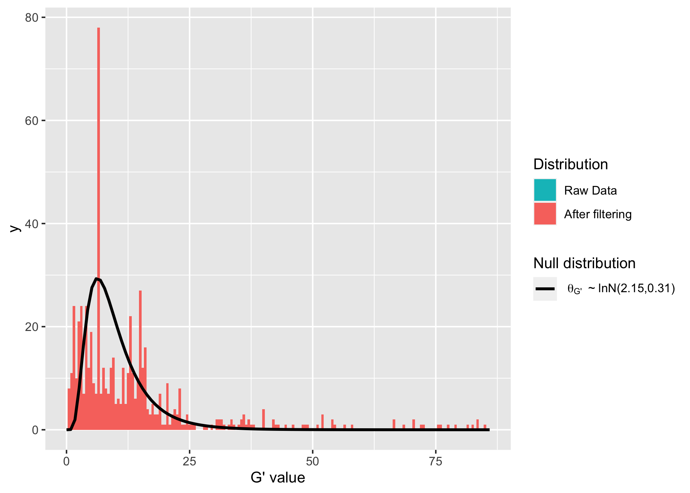
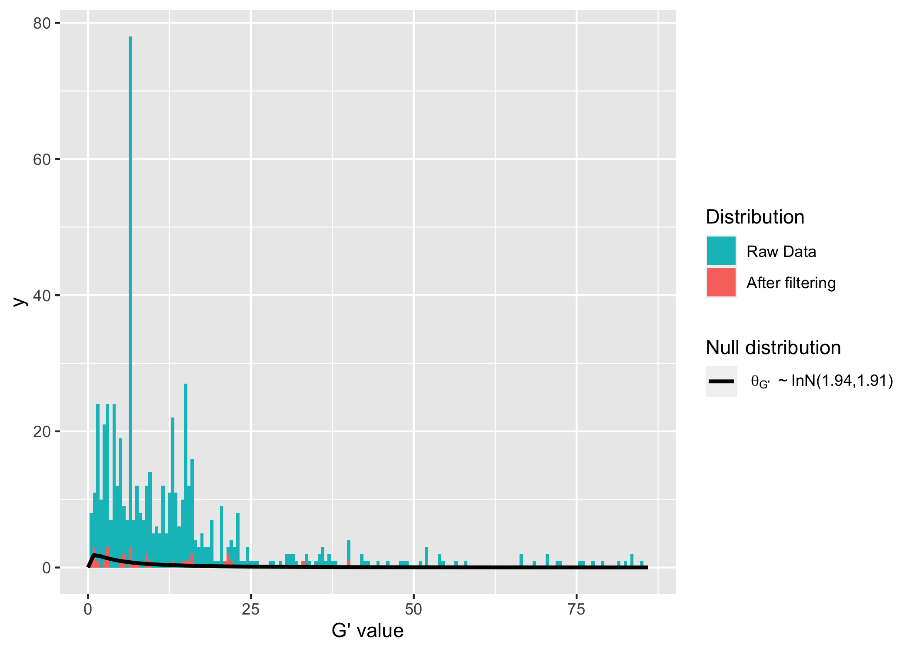

# Gprime-pooled-continuous-analysis

Load packages

``` r
#install.packages("devtools")
#devtools::install_github("bmansfeld/QTLseqr")
# install.packages("vcfR")
#install.packages("SNPfiltR")
library(SNPfiltR)
```

    This is SNPfiltR v.1.0.1

    Detailed usage information is available at: devonderaad.github.io/SNPfiltR/ 

    If you use SNPfiltR in your published work, please cite the following papers: 

    DeRaad, D.A. (2022), SNPfiltR: an R package for interactive and reproducible SNP filtering. Molecular Ecology Resources, 22, 2443-2453. http://doi.org/10.1111/1755-0998.13618 

    Knaus, Brian J., and Niklaus J. Grunwald. 2017. VCFR: a package to manipulate and visualize variant call format data in R. Molecular Ecology Resources, 17.1:44-53. http://doi.org/10.1111/1755-0998.12549

``` r
library(QTLseqr)
library(ggplot2)
library(vcfR)
```


       *****       ***   vcfR   ***       *****
       This is vcfR 1.14.0 
         browseVignettes('vcfR') # Documentation
         citation('vcfR') # Citation
       *****       *****      *****       *****

#### Load in dataset

``` r
# read in vcf
DiNV_vcf <- read.vcfR("~/Desktop/KU/sequences/16Cq-DiNV-Test/freebayes/continuous-DiNV.vcf")
```

    Scanning file to determine attributes.
    File attributes:
      meta lines: 59
      header_line: 60
      variant count: 13116
      column count: 11

    Meta line 59 read in.
    All meta lines processed.
    gt matrix initialized.
    Character matrix gt created.
      Character matrix gt rows: 13116
      Character matrix gt cols: 11
      skip: 0
      nrows: 13116
      row_num: 0

    Processed variant 1000
    Processed variant 2000
    Processed variant 3000
    Processed variant 4000
    Processed variant 5000
    Processed variant 6000
    Processed variant 7000
    Processed variant 8000
    Processed variant 9000
    Processed variant 10000
    Processed variant 11000
    Processed variant 12000
    Processed variant 13000
    Processed variant: 13116
    All variants processed

``` r
# filter vcf to remove sites (SNPs) with more than two alleles present (from SNPfiltR package)
DiNV_vcf <- filter_biallelic(DiNV_vcf)
```

    2668 SNPs, 0.203% of all input SNPs, contained more than 2 alleles, and were removed from the VCF


``` r
# extract the number of reads supporting the reference allele for each sample at each SNP 
# DiNV_vcf has a column containing RO or reference allele information
# the extract.gt function will subset from that column
# the same column contains a lot of other information separated by : and , which is why a specific function is needed 
ref <- as.data.frame(extract.gt(DiNV_vcf, element = "RO"))
# extract the number of reads supporting the alternate allele for each sample at each SNP 
# AO is alternate allele
# because I removed all SNPs that are more than biallelic, there should only be 1 alternate allele
alt <- as.data.frame(extract.gt(DiNV_vcf, element = "AO"))
DiNV_SNPs<-as.data.frame(DiNV_vcf@fix[,c(1,2,4,5)])
# add the read counts supporting the reference and alternate alleles for each of the two sequenced strains as their own columns
DiNV_SNPs$inn.ref<-ref$INN
DiNV_SNPs$inn.alt<-alt$INN
DiNV_SNPs$vir.ref<-ref$VIR
DiNV_SNPs$vir.alt<-alt$VIR

# there might be some missing data in this file, which would come out as rows where either inn or vir have an NA for alleles 
# remove any rows that have an NA 
DiNV_SNPs <- na.omit(DiNV_SNPs)
```

#### Prepare SNP dataset for Gprime format. Based off of QTLSeqr program.

``` r
# what I need is columns that say:
# chrom, position, ref base, alt base, and allele counts per sample
# but the allele counts have to be named AD_ALT.sample or AD_REF.sample 
# so I need AD_ALT.inn, AD_REF.inn, AD_ALT.vir, and AD_REF.vir

colnames(DiNV_SNPs)[5] ="AD_REF.inn"
colnames(DiNV_SNPs)[6] ="AD_ALT.inn"
colnames(DiNV_SNPs)[7] ="AD_REF.vir"
colnames(DiNV_SNPs)[8] ="AD_ALT.vir"

head(DiNV_SNPs)
```

            CHROM POS REF ALT AD_REF.inn AD_ALT.inn AD_REF.vir AD_ALT.vir
    1 NC_040699.1  43   A   C          8          0         47          1
    2 NC_040699.1  47   T   G          9          0         55          1
    3 NC_040699.1  66   T   G         10          0         80          1
    4 NC_040699.1  70   T   A         11          0         79          2
    5 NC_040699.1  79   A   C         12          0         90          1
    6 NC_040699.1  84   T   A         13          0         93          1

``` r
# looks good so far

# save this as a csv because the program doesn't seem to want it in R 
write.csv(DiNV_SNPs, file = "~/Desktop/KU/sequences/16Cq-DiNV-Test/freebayes/DiNV_SNPs_For_Gprime.csv", row.names = FALSE)
```

#### More preparing the table and loading in

``` r
# vignette says "We define the sample name for each of the bulks."
# from what I can tell, a bulk is a pooled sample or a bulked sample
# for whatever reason this program calls them a high bulk and a low bulk 
# but I'm not sure what those terms mean 

# naming the samples exactly what it says after AD_REF. 
# also want to 
HighBulk <- "inn"
LowBulk <- "vir"
# assuming this is the way they want to represent chromosomes
# they usually want you to specify which chromosomes to use
# because there is just one it doesn't matter probably 
Chroms <- "NC_040699.1"

# see if importing the table works 
Gprime_df <- importFromTable(file = "~/Desktop/KU/sequences/16Cq-DiNV-Test/freebayes/DiNV_SNPs_For_Gprime.csv",
                      highBulk = HighBulk,
                      lowBulk = LowBulk,
                      chromList = Chroms)
```

    Removing the following chromosomes: 

    Renaming the following columns: AD_REF.inn, AD_ALT.inn

    Renaming the following columns: AD_REF.vir, AD_ALT.vir

``` r
# for whatever reason it renamed my columns, so I will just have to remember that high is innubila cells and low is virilis cells
```

The import from table function has added in some columns. They mean:

- GQ.HIGH - The genotype quality score, (how confident we are in the
  genotyping)
- SNPindex.HIGH - The calculated SNP-index for the high bulk. SNP index
  is alternate allele depth over total read depth
- Same as above for the low bulk
- REF_FRQ - reference allele depth for both samples divided by total
  read depth for both samples
- deltaSNP - The change in SNP index, high bulk index minus low bulk
  index

#### Looking at SNPs to get an idea for filtering

“QTLseqr offers some options for filtering that may help reduce noise
and improve results. Filtering is mainly based on read depth for each
SNP, such that we can try to eliminate SNPs with low confidence, due to
low coverage, and SNPs that may be in repetitive regions and thus have
inflated read depth. You can also filter based on the absolute
difference in read depth between the bulks.”

``` r
#One way to assess filtering thresholds and check the quality of our data is by plotting histograms of the read depths. We can get an idea of where to draw our thresholds

# total read depth histogram:

ggplot(data = Gprime_df) + 
    geom_histogram(aes(x = DP.HIGH + DP.LOW), bins = 50) + 
    xlim(0,500)
```

    Warning: Removed 2 rows containing missing values (`geom_bar()`).


``` r
# total reference allele frequency:
ggplot(data = Gprime_df) +
    geom_histogram(aes(x = REF_FRQ), bins = 50)
```


``` r
# this one looks different than their example, their ref_frq was centered around 0.5... but maybe their data is really different. This looks like the vast majority of the SNPs are reference allele? Not sure exactly what that means...


# We can plot our per-bulk SNP-index to check if our data is good.We expect to find two small peaks on each end and most of the SNPs should be approximiately normally distributed arround 0.5 in an F2 population. Here is the HIGH bulk for example:

# for innubila sample
ggplot(data = Gprime_df) +
    geom_histogram(aes(x = SNPindex.HIGH, bins = 50))
```

    Warning in geom_histogram(aes(x = SNPindex.HIGH, bins = 50)): Ignoring unknown
    aesthetics: bins

    `stat_bin()` using `bins = 30`. Pick better value with `binwidth`.


``` r
# for vir sample
ggplot(data = Gprime_df) +
    geom_histogram(aes(x = SNPindex.LOW), bins = 50)
```


``` r
# this is not an F2 population (not even possible with our virus) so this is maybe why these don't look as expected 
```

#### Filtering SNPs

“Now that we have an idea about our read depth distribution we can
filter out low confidence SNPS. In general we recommend filtering
extremely low and high coverage SNPs, either in both bulks
(`minTotalDepth/maxTotalDepth`) and/or in each bulk separately
(`minSampleDepth`). We have the option to filter based on reference
allele frequency (`refAlleleFreq`), this removes SNPs that for some
reason are over- or under-represented in *BOTH* bulks. We can also
filter SNPs that have large discrepancies in read depth between the
bulks(i.e. one bulk has a depth of 500 and the other has 5). Such
discrepancies can throw off the G statistic. We can also use the GATK GQ
score (Genotype Quality) to filter out low confidence SNPs. If the
`verbose` parameter is set to `TRUE` (default) the function will report
the numbers of SNPs filtered in each step.”

``` r
# use the filtering snps 
# minimum depth should probably be 6? This is total so both samples 
# max depth of 200? not sure 
# don't have GATK score so not filtering by that 
# min coverage per sample of 4 reads, seems pretty low but there are inn samples that I'm sure have few reads 
# for refAlleleFreq this is keeping all SNPs with a REF_FRQ of less than or equal to 0.999. Which seems high but I have so many SNPs where the REF_FRQ is almost 1... 

Gprime_df_filt <-
    filterSNPs(
        SNPset = Gprime_df,
        refAlleleFreq = 0.001,
        minTotalDepth = 6,
        maxTotalDepth = 200, 
        minSampleDepth = 4,
        verbose = TRUE
    )
```

    Filtering by reference allele frequency: 0.001 <= REF_FRQ <= 0.999

    ...Filtered 17 SNPs

    Filtering by total sample read depth: Total DP >= 6

    ...Filtered 5 SNPs

    Filtering by total sample read depth: Total DP <= 200

    ...Filtered 8 SNPs

    Filtering by per sample read depth: DP >= 4

    ...Filtered 86 SNPs

    Original SNP number: 10437, Filtered: 116, Remaining: 10321

#### Running G prime analysis

``` r
Gprime_df_filt_prime <- runGprimeAnalysis(Gprime_df_filt,
    windowSize = 2000,
    outlierFilter = "deltaSNP",
    filterThreshold = 0.1)
```

    Counting SNPs in each window...

    Calculating tricube smoothed delta SNP index...

    Calculating G and G' statistics...

    Warning: There were 11 warnings in `dplyr::mutate()`.
    The first warning was:
    ℹ In argument: `Gprime = tricubeStat(POS = POS, Stat = G, windowSize =
      windowSize, ...)`.
    ℹ In group 1: `CHROM = NC_040699.1`.
    Caused by warning in `lfproc()`:
    ! procv: no points with non-zero weight
    ℹ Run `dplyr::last_dplyr_warnings()` to see the 10 remaining warnings.

    Using deltaSNP-index to filter outlier regions with a threshold of 0.1

    Estimating the mode of a trimmed G prime set using the 'modeest' package...

    Calculating p-values...

    Warning: There was 1 warning in `dplyr::mutate()`.
    ℹ In argument: `pvalue = getPvals(...)`.
    Caused by warning:
    ! encountered a tie, and the difference between minimal and 
                       maximal value is > length('x') * 'tie.limit'
    the distribution could be multimodal

``` r
# there are many errors with this... 


#Due to the fact that p-values are estimated from the null distribution of G', an important check is to see if the null distribution of G' values is close to log normally distributed. For this purpose we use the `plotGprimeDist` function, which plots the G' histograms of both raw and filtered G' sets alongside the log-normal null distribution (which is reported in the legend). We can also use this to test which filtering method (Hampel or DeltaSNP) estimates a more accurate null distribution. If you use the `"deltaSNP"` method plotting G' distributions with different filter thresholds might also help reveal a better G' null distribution. 

# Hampel method
plotGprimeDist(SNPset = Gprime_df_filt_prime, outlierFilter = "Hampel")
```

    Warning: encountered a tie, and the difference between minimal and 
                       maximal value is > length('x') * 'tie.limit'
    the distribution could be multimodal

    Warning: Removed 2 rows containing missing values (`geom_bar()`).
    Removed 2 rows containing missing values (`geom_bar()`).



``` r
# deltaSNP method 
plotGprimeDist(SNPset = Gprime_df_filt_prime, outlierFilter = "deltaSNP", filterThreshold = 0.1)
```

    Warning: encountered a tie, and the difference between minimal and 
                       maximal value is > length('x') * 'tie.limit'
    the distribution could be multimodal

    Warning: Removed 2 rows containing missing values (`geom_bar()`).

    Warning: Removed 2 rows containing missing values (`geom_bar()`).



``` r
# both of these plots sort of look like a log normal distribution

# plot number of SNPs in a window
p1 <- plotQTLStats(SNPset = Gprime_df_filt_prime, var = "nSNPs")
p1
```


``` r
# plot the G' statistic
# try to plot the thereshold can pass the FDR (q) of 0.01.
p3 <- plotQTLStats(SNPset = Gprime_df_filt_prime, var = "Gprime", plotThreshold = TRUE, q = 0.01)
```

    Warning in plotQTLStats(SNPset = Gprime_df_filt_prime, var = "Gprime",
    plotThreshold = TRUE, : The q threshold is too low. No threshold line will be
    drawn

``` r
# nope, nothing can pass the threshold of 0.01, actually it has to get to 0.7 to draw the line which is pretty bad 
p3
```


``` r
# nothing significant for this statistic 
```
