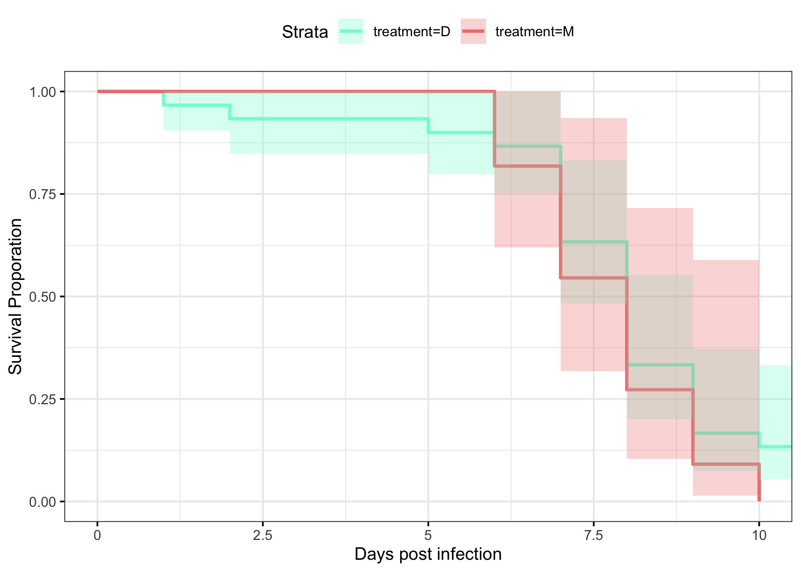

20220915-DiNV-infections-survival-analysis
================
2022-09-28

This is an analysis of data from an infection experiment where 7-10 day
old Drosophila innubila (males and females) were either poked with
sterile cell culture medium or fluids from primary D. innubila cells
infected with DiNV (day 26). The goal is to test the infectivity of the
cell culture fluid/the virons in the fluid. Mortality in each vial was
monitored for 11 days, however half the vials were frozen after day 7.

This script is written with help from this website
<http://www.sthda.com/english/wiki/survival-analysis-basics> , example
code from Rob (see below), and help from Devon DeRaad.

Load in packages needed for the analysis

``` r
library("survival")
library("survminer")
```

    ## Loading required package: ggplot2

    ## Loading required package: ggpubr

    ## 
    ## Attaching package: 'survminer'

    ## The following object is masked from 'package:survival':
    ## 
    ##     myeloma

### Rob’s example code for me

``` r
#generate example data
vial=c(1,2)
gt=c("wt","mut")
D0=c(10,10)
D1=c(10,9)
D2=c(10,8)
D3=c(10,5)
D4=c(9,3)

#generate example data frames
df=data.frame(vial,gt,D0,D1,D2,D3,D4)
results=data.frame(vial=character(),gt=character(),dead=numeric(),status=numeric())
head(df)
```

    ##   vial  gt D0 D1 D2 D3 D4
    ## 1    1  wt 10 10 10 10  9
    ## 2    2 mut 10  9  8  5  3

``` r
head(results)
```

    ## [1] vial   gt     dead   status
    ## <0 rows> (or 0-length row.names)

``` r
#loop to convert the example dataframe 'df' into properly formatted dataframe 'results'
for(i in 1:length(df$vial)){
temp=df[i,]
  for(j in 4:7){
    k=temp[1,j-1]-temp[1,j]
    if(k>0){
      for(kk in 1:k){
      results[length(results$vial)+1,]=c(temp[1,1],temp[1,2],j-3,0)
        }
  }
}
k=temp[1,j]
if(k>0) {
  for(kk in 1:k) {results[length(results$vial)+1,]=c(temp[1,1],temp[1,2],j-3,1)}
}}

#make sure it worked properly
head(results)
```

    ##   vial gt dead status
    ## 1    1 wt    4      0
    ## 2    1 wt    4      1
    ## 3    1 wt    4      1
    ## 4    1 wt    4      1
    ## 5    1 wt    4      1
    ## 6    1 wt    4      1

### Commented and adapted version

### Loop to convert the example data.frame ‘df’ into properly formatted data.frame ‘results’

``` r
#write a function to transform a data.frame that has the column format 'vial | treatment | D0 | D1 | D2...', with one row for each vial
#into a long version in tidy format that can be input to make a survivorship curve
convert_df<-function(df){
  #open empty data.frame to store results
  results<-data.frame(vial=character(),treatment=character(),dead=numeric(),status=numeric())
  #This loop will index out each row (one row per vial) one at a time, transform it into long format (one row per fly), and add the information to the empty data.frame called results
  for(i in 1:nrow(df)){
  #isolate the row (vial) you want to work on
  temp<-df[i,]
    #iteratively isolate each day for this vial (day 0 must be column 3, day 1 column 4, etc.). Loop stops the column before the last day
    for(j in 3:(ncol(temp)-1)){
      #assign the number of flies that died in the vial on that day (starting with day 1) to the variable 'z'
      z<-temp[1,j]-temp[1,j+1]
        #if >0 flies died add this information to the results dataframe
        if(z>0){
          #iterate over 1 through total number of dead flies
          for(k in 1:z){
            #add a new row to the 'results' data.frame for the given dead fly, specifying vial #, treatment, day died, and
            #record the current vial #
            vial<-temp[,1]
            #record the genotype of the current vial
            treatment<-temp[,2]
            #record the death date of the flies that died on this day (assumes that your input DF starts with day 0 in column 3)
            dd<-j-2
            #append this information into a new row in the 'results' data.frame, and add a '1' in the 4th column to indicate mortality
            results[nrow(results)+1,]<- c(vial,treatment,dd,1)
          } #close for loop
        } #close if loop
    } #close for loop
  
  #now assign the number of flies remaining in the vial on the last day (value in the last column of the row) to the variable 'z'
  z<-temp[1,j+1]
    #if there are any flies alive in the vial on the last day
    if(z>0){
      #iterate over 1:(number of flies alive on the last day)
      for(l in 1:z){
        #record the current vial #
        vial<-temp[,1]
        #record the genotype of the current vial
        treatment<-temp[,2]
        #record the last day we recorded this fly alive (assumes that your input DF starts with day 0 in column 3)
        dd<-j-2
        #append this information into a new row in the 'results' data.frame, and add a '0' in the 4th column to indicate that the fly made it to the end of the experiment
        results[nrow(results)+1,]<- c(vial,treatment,dd,0)
      } #close for loop
    } #close if loop
  } #close original for loop
results$dead<-as.numeric(results$dead)  #reiterate that this column must be class numeric
results$status<-as.numeric(results$status)  #reiterate that this column must be class numeric
results$vial <- as.factor(results$vial) # make sure vial is considered a factor
# gives you only the results dataframe as output from function 
return(results) 
} #close function

#make sure it generates an identical output to Rob's function
function.results<-convert_df(df)
results == function.results
```

    ##    vial   gt dead status
    ## 1  TRUE TRUE TRUE  FALSE
    ## 2  TRUE TRUE TRUE  FALSE
    ## 3  TRUE TRUE TRUE  FALSE
    ## 4  TRUE TRUE TRUE  FALSE
    ## 5  TRUE TRUE TRUE  FALSE
    ## 6  TRUE TRUE TRUE  FALSE
    ## 7  TRUE TRUE TRUE  FALSE
    ## 8  TRUE TRUE TRUE  FALSE
    ## 9  TRUE TRUE TRUE  FALSE
    ## 10 TRUE TRUE TRUE  FALSE
    ## 11 TRUE TRUE TRUE  FALSE
    ## 12 TRUE TRUE TRUE  FALSE
    ## 13 TRUE TRUE TRUE  FALSE
    ## 14 TRUE TRUE TRUE  FALSE
    ## 15 TRUE TRUE TRUE  FALSE
    ## 16 TRUE TRUE TRUE  FALSE
    ## 17 TRUE TRUE TRUE  FALSE
    ## 18 TRUE TRUE TRUE  FALSE
    ## 19 TRUE TRUE TRUE  FALSE
    ## 20 TRUE TRUE TRUE  FALSE

``` r
#note that the entire status column should return false, because we switched the specification of 0 and 1 for death and life from Rob's example code, to follow the input needed for the 'surv' package
```

### Read in the real raw data and make subsets

``` r
#read the file from csv
df<-read.csv("~/Desktop/Github/Unckless_Lab_Resources/Infection_survival_analyses/20220915/20220915.DiNV.infections.raw.data.csv")

#make subsets of the data frame based on males and females
df.male<-df[df$sex == "M",]
df.female<-df[df$sex == "F",]

#remove extraneous columns (3&4) from each to get them in proper format
df.male<-df.male[,c(1,2,5:16)]
df.female<-df.female[,c(1,2,5:16)]

#subset each of those dataframes to only vials that had data to day 11 (remove rows with NAs)
df.male.complete<-na.exclude(df.male)
df.female.complete<-na.exclude(df.female)

#subset each male and female dataset to only the first 7 days to remove incomplete vials from days 8-11
df.male.seven<-df.male[,1:10]
df.female.seven<-df.female[,1:10]
```

### Convert each of these dataframes to long and tidy format using function defined above

``` r
df.male.complete<-convert_df(df.male.complete)
df.female.complete<-convert_df(df.female.complete)
df.male.seven<-convert_df(df.male.seven)
df.female.seven<-convert_df(df.female.seven)
```

### make survivorship curves

### Male all 11 days

``` r
male_eleven_fit<- survfit(Surv(dead, status) ~ treatment, data=df.male.complete)
ggsurvplot(male_eleven_fit,
          pval = TRUE, conf.int = TRUE,
          risk.table = TRUE, # Add risk table
          risk.table.col = "strata", # Change risk table color by groups
          linetype = "strata", # Change line type by groups
          surv.median.line = "hv", # Specify median survival
          ggtheme = theme_bw(), # Change ggplot2 theme
          palette = c("#E7B800", "#2E9FDF"))
```

<!-- -->

### Males 7 days

``` r
male_seven_fit<- survfit(Surv(dead, status) ~ treatment, data=df.male.seven)
ggsurvplot(male_seven_fit,
          pval = TRUE, conf.int = TRUE,
          risk.table = TRUE, # Add risk table
          risk.table.col = "strata", # Change risk table color by groups
          linetype = "strata", # Change line type by groups
          surv.median.line = "hv", # Specify median survival
          ggtheme = theme_bw(), # Change ggplot2 theme
          palette = c("#E7B800", "#2E9FDF"))
```

<!-- -->

### Female 11 days

``` r
female_eleven_fit<- survfit(Surv(dead, status) ~ treatment, data=df.female.complete)
ggsurvplot(female_eleven_fit,
          pval = TRUE, conf.int = TRUE,
          risk.table = TRUE, # Add risk table
          risk.table.col = "strata", # Change risk table color by groups
          linetype = "strata", # Change line type by groups
          surv.median.line = "hv", # Specify median survival
          ggtheme = theme_bw(), # Change ggplot2 theme
          palette = c("#E7B800", "#2E9FDF"))
```

<!-- -->

# Female 7 days

``` r
female_seven_fit<- survfit(Surv(dead, status) ~ treatment, data=df.female.seven)
#plot(km_fit, xlab="Days", main = 'Kaplan Meyer Plot')
ggsurvplot(female_seven_fit,
          pval = TRUE, conf.int = TRUE,
          risk.table = TRUE, # Add risk table
          risk.table.col = "strata", # Change risk table color by groups
          linetype = "strata", # Change line type by groups
          surv.median.line = "hv", # Specify median survival
          ggtheme = theme_bw(), # Change ggplot2 theme
          palette = c("#E7B800", "#2E9FDF"))
```

<!-- -->
