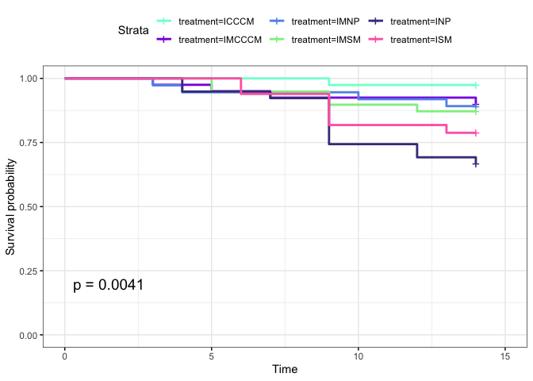
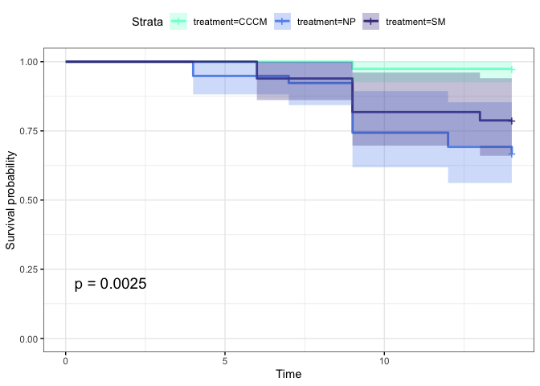
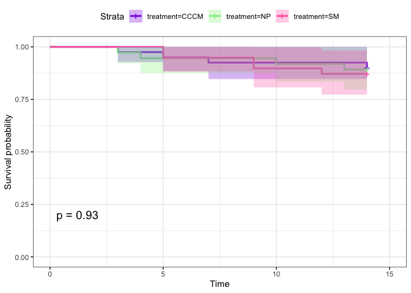
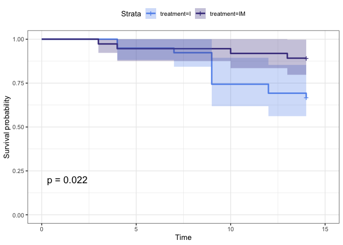
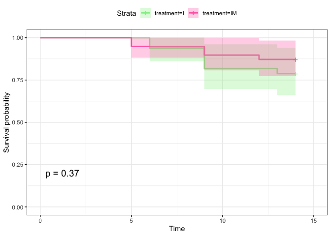
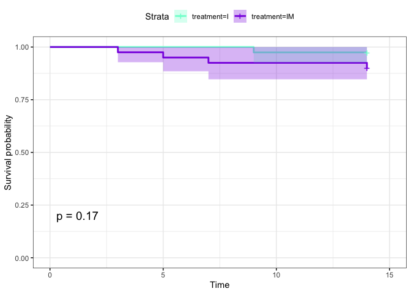

20221201-innubila-food-and-control-poke-test
================
2022-12-16

Load in packages needed for the analysis

``` r
library("survival")
library("survminer")
```

    ## Loading required package: ggplot2

    ## Loading required package: ggpubr

    ## 
    ## Attaching package: 'survminer'

    ## The following object is masked from 'package:survival':
    ## 
    ##     myeloma

### Loop to convert the example data.frame ‘df’ into properly formatted data.frame ‘results’

``` r
#write a function to transform a data.frame that has the column format 'vial | treatment | D0 | D1 | D2...', with one row for each vial
#into a long version in tidy format that can be input to make a survivorship curve
convert_df<-function(df){
  #open empty data.frame to store results
  results<-data.frame(vial=character(),treatment=character(),dead=numeric(),status=numeric())
  #This loop will index out each row (one row per vial) one at a time, transform it into long format (one row per fly), and add the information to the empty data.frame called results
  for(i in 1:nrow(df)){
  #isolate the row (vial) you want to work on
  temp<-df[i,]
    #iteratively isolate each day for this vial (day 0 must be column 3, day 1 column 4, etc.). Loop stops the column before the last day
    for(j in 3:(ncol(temp)-1)){
      #assign the number of flies that died in the vial on that day (starting with day 1) to the variable 'z'
      z<-temp[1,j]-temp[1,j+1]
        #if >0 flies died add this information to the results dataframe
        if(z>0){
          #iterate over 1 through total number of dead flies
          for(k in 1:z){
            #add a new row to the 'results' data.frame for the given dead fly, specifying vial #, treatment, day died, and
            #record the current vial #
            vial<-temp[,1]
            #record the genotype of the current vial
            treatment<-temp[,2]
            #record the death date of the flies that died on this day (assumes that your input DF starts with day 0 in column 3)
            dd<-j-2
            #append this information into a new row in the 'results' data.frame, and add a '1' in the 4th column to indicate mortality
            results[nrow(results)+1,]<- c(vial,treatment,dd,1)
          } #close for loop
        } #close if loop
    } #close for loop
  
  #now assign the number of flies remaining in the vial on the last day (value in the last column of the row) to the variable 'z'
  z<-temp[1,j+1]
    #if there are any flies alive in the vial on the last day
    if(z>0){
      #iterate over 1:(number of flies alive on the last day)
      for(l in 1:z){
        #record the current vial #
        vial<-temp[,1]
        #record the genotype of the current vial
        treatment<-temp[,2]
        #record the last day we recorded this fly alive (assumes that your input DF starts with day 0 in column 3)
        dd<-j-2
        #append this information into a new row in the 'results' data.frame, and add a '0' in the 4th column to indicate that the fly made it to the end of the experiment
        results[nrow(results)+1,]<- c(vial,treatment,dd,0)
      } #close for loop
    } #close if loop
  } #close original for loop
results$dead<-as.numeric(results$dead)  #reiterate that this column must be class numeric
results$status<-as.numeric(results$status)  #reiterate that this column must be class numeric
results$vial <- as.factor(results$vial) # make sure vial is considered a factor
# gives you only the results dataframe as output from function 
return(results) 
} #close function
```

### Read in the real raw data and make subsets if wanted

``` r
#read the file from csv
df<-read.csv("~/Desktop/Github/Unckless_Lab_Resources/Infection_survival_analyses/20221201/20221201 _innubila_mushroom_control_experiment.csv")

# make subsets based on food type
# instant mushroom food
df.IM<-df[df$Food_type == "IM",]
# just instant food
df.I<-df[df$Food_type == "I",]

# make subsets based on poke type 
# not poked only flies
df.NP<-df[df$Poke_type == "NP",]
# only schneider's medium flies
df.SM<-df[df$Poke_type == "SM",]
# only complete cell culture medium flies
df.CCCM<-df[df$Poke_type == "CCCM",]


# remove columns not needed for each subset
df<-df[,c(1,4,14:28)]
df.IM<-df.IM[,c(1,6,14:28)]
df.I<-df.I[,c(1,6,14:28)]
df.NP<-df.NP[,c(1,5,14:28)]
df.SM<-df.SM[,c(1,5,14:28)]
df.CCCM<-df.CCCM[,c(1,5,14:28)]
```

### Convert each of these dataframes to long and tidy format using function defined above

``` r
df.convert<-convert_df(df)
df.IM.convert<-convert_df(df.IM)
df.I.convert<-convert_df(df.I)
df.NP.convert<-convert_df(df.NP)
df.SM.convert<-convert_df(df.SM)
df.CCCM.convert<-convert_df(df.CCCM)
```

# plot the entire dataset

``` r
# change to not have confidence intervals in this one so you can see them 
df_fit<- survfit(Surv(dead, status) ~ treatment, data=df.convert)
ggsurvplot(df_fit,
          pval = TRUE, conf.int = FALSE,
          #risk.table = TRUE, # Add risk table
          #risk.table.col = "strata", # Change risk table color by groups
          #linetype = "strata", # Change line type by groups
          #surv.median.line = "hv", # Specify median survival
          ggtheme = theme_bw(), # Change ggplot2 theme
          palette = c("aquamarine", "blueviolet","cornflowerblue", "lightgreen", "slateblue4", "hotpink"))
```

<!-- -->

# Plot the different poke types for instant food only

``` r
# change to not have confidence intervals in this one so you can see them 
df.I_fit<- survfit(Surv(dead, status) ~ treatment, data=df.I.convert)
ggsurvplot(df.I_fit,
          pval = TRUE, conf.int = TRUE,
          #risk.table = TRUE, # Add risk table
          #risk.table.col = "strata", # Change risk table color by groups
          #linetype = "strata", # Change line type by groups
          #surv.median.line = "hv", # Specify median survival
          ggtheme = theme_bw(), # Change ggplot2 theme
          palette = c("aquamarine","cornflowerblue", "slateblue4"))
```

<!-- -->

# Plot the different poke types for instant food with musroom only

``` r
# change to not have confidence intervals in this one so you can see them 
df.IM_fit<- survfit(Surv(dead, status) ~ treatment, data=df.IM.convert)
ggsurvplot(df.IM_fit,
          pval = TRUE, conf.int = TRUE,
          #risk.table = TRUE, # Add risk table
          #risk.table.col = "strata", # Change risk table color by groups
          #linetype = "strata", # Change line type by groups
          #surv.median.line = "hv", # Specify median survival
          ggtheme = theme_bw(), # Change ggplot2 theme
          palette = c("blueviolet", "lightgreen", "hotpink"))
```

<!-- -->

# Plot different food types for Not poked only

``` r
# change to not have confidence intervals in this one so you can see them 
df.NP_fit<- survfit(Surv(dead, status) ~ treatment, data=df.NP.convert)
ggsurvplot(df.NP_fit,
          pval = TRUE, conf.int = TRUE,
          #risk.table = TRUE, # Add risk table
          #risk.table.col = "strata", # Change risk table color by groups
          #linetype = "strata", # Change line type by groups
          #surv.median.line = "hv", # Specify median survival
          ggtheme = theme_bw(), # Change ggplot2 theme
          palette = c("cornflowerblue", "slateblue4"))
```

<!-- -->

# Plot different food types for Schneider’s medium poked only

``` r
# change to not have confidence intervals in this one so you can see them 
df.SM_fit<- survfit(Surv(dead, status) ~ treatment, data=df.SM.convert)
ggsurvplot(df.SM_fit,
          pval = TRUE, conf.int = TRUE,
          #risk.table = TRUE, # Add risk table
          #risk.table.col = "strata", # Change risk table color by groups
          #linetype = "strata", # Change line type by groups
          #surv.median.line = "hv", # Specify median survival
          ggtheme = theme_bw(), # Change ggplot2 theme
          palette = c("lightgreen", "hotpink"))
```

<!-- -->

# Plot different food types for complete cell culture medium poked only

``` r
# change to not have confidence intervals in this one so you can see them 
df.CCCM_fit<- survfit(Surv(dead, status) ~ treatment, data=df.CCCM.convert)
ggsurvplot(df.CCCM_fit,
          pval = TRUE, conf.int = TRUE,
          #risk.table = TRUE, # Add risk table
          #risk.table.col = "strata", # Change risk table color by groups
          #linetype = "strata", # Change line type by groups
          #surv.median.line = "hv", # Specify median survival
          ggtheme = theme_bw(), # Change ggplot2 theme
          palette = c("aquamarine", "blueviolet"))
```

<!-- -->
