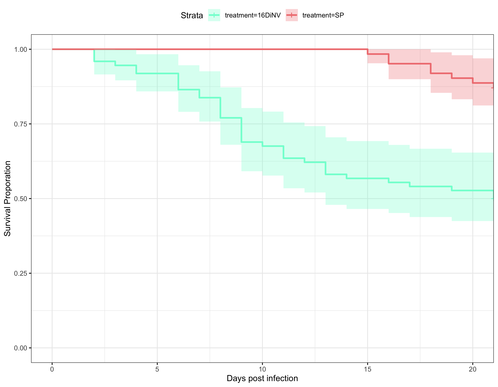

20230509 innubila 16 Cq DiNv
================
2023-06-01

Load in packages needed for the analysis

``` r
library("survival")
library("survminer")
```

    ## Loading required package: ggplot2

    ## Loading required package: ggpubr

    ## 
    ## Attaching package: 'survminer'

    ## The following object is masked from 'package:survival':
    ## 
    ##     myeloma

``` r
library(tidyr)
library(stringr)
```

### Loop to convert the example data.frame ‘df’ into properly formatted data.frame ‘results’

``` r
#write a function to transform a data.frame that has the column format 'vial | treatment | D0 | D1 | D2...', with one row for each vial
#into a long version in tidy format that can be input to make a survivorship curve
convert_df<-function(df){
  #open empty data.frame to store results
  results<-data.frame(vial=character(),treatment=character(),dead=numeric(),status=numeric())
  #This loop will index out each row (one row per vial) one at a time, transform it into long format (one row per fly), and add the information to the empty data.frame called results
  for(i in 1:nrow(df)){
  #isolate the row (vial) you want to work on
  temp<-df[i,]
    #iteratively isolate each day for this vial (day 0 must be column 3, day 1 column 4, etc.). Loop stops the column before the last day
    for(j in 3:(ncol(temp)-1)){
      #assign the number of flies that died in the vial on that day (starting with day 1) to the variable 'z'
      z<-temp[1,j]-temp[1,j+1]
        #if >0 flies died add this information to the results dataframe
        if(z>0){
          #iterate over 1 through total number of dead flies
          for(k in 1:z){
            #add a new row to the 'results' data.frame for the given dead fly, specifying vial #, treatment, day died, and
            #record the current vial #
            vial<-temp[,1]
            #record the genotype of the current vial
            treatment<-temp[,2]
            #record the death date of the flies that died on this day (assumes that your input DF starts with day 0 in column 3)
            dd<-j-2
            #append this information into a new row in the 'results' data.frame, and add a '1' in the 4th column to indicate mortality
            results[nrow(results)+1,]<- c(vial,treatment,dd,1)
          } #close for loop
        } #close if loop
    } #close for loop
  
  #now assign the number of flies remaining in the vial on the last day (value in the last column of the row) to the variable 'z'
  z<-temp[1,j+1]
    #if there are any flies alive in the vial on the last day
    if(z>0){
      #iterate over 1:(number of flies alive on the last day)
      for(l in 1:z){
        #record the current vial #
        vial<-temp[,1]
        #record the genotype of the current vial
        treatment<-temp[,2]
        #record the last day we recorded this fly alive (assumes that your input DF starts with day 0 in column 3)
        dd<-j-2
        #append this information into a new row in the 'results' data.frame, and add a '0' in the 4th column to indicate that the fly made it to the end of the experiment
        results[nrow(results)+1,]<- c(vial,treatment,dd,0)
      } #close for loop
    } #close if loop
  } #close original for loop
results$dead<-as.numeric(results$dead)  #reiterate that this column must be class numeric
results$status<-as.numeric(results$status)  #reiterate that this column must be class numeric
results$vial <- as.factor(results$vial) # make sure vial is considered a factor
# gives you only the results dataframe as output from function 
return(results) 
} #close function
```

Read in raw data

``` r
#read the file from csv
df<-read.csv("~/Desktop/Github/Unckless_Lab_Resources/Infection_survival_analyses/20230509-inn-16Cq/20230509-16Cq-innubila-infection-2.csv")

# only want columns with vial, treatment, and daily mortality
# remove columns not needed for each subset
df<-df[,c(1,4,12:33)]

# remove the last row
# for some reason it is left on there
df <- df[-16,]
```

### Convert each of these dataframes to long and tidy format using function defined above

``` r
df.convert<-convert_df(df)
```

# plot the survival curve not including confidence intervals

``` r
# change to not have confidence intervals in this one so you can see them 
df_fit<- survfit(Surv(dead, status) ~ treatment, data=df.convert)
ggsurvplot(df_fit,
          pval = FALSE, conf.int = TRUE,
          #risk.table = TRUE, # Add risk table
          #risk.table.col = "strata", # Change risk table color by groups
          #linetype = "strata", # Change line type by groups
          #surv.median.line = "hv", # Specify median survival
          ggtheme = theme_bw(), # Change ggplot2 theme
          palette = c ("aquamarine", "lightcoral")) + ylab("Survival Proporation") + xlab("Days post infection")
```

<!-- -->

Get some model summary statistics

``` r
# new model using cox proportional hazard (which is basically what above is doing)
df_fit2<- coxph(Surv(dead, status) ~ treatment, data=df.convert)
# look at the statistics of the model
summary(df_fit2)
```

    ## Call:
    ## coxph(formula = Surv(dead, status) ~ treatment, data = df.convert)
    ## 
    ##   n= 136, number of events= 45 
    ## 
    ##                coef exp(coef) se(coef)      z Pr(>|z|)    
    ## treatmentSP -1.6994    0.1828   0.3909 -4.347 1.38e-05 ***
    ## ---
    ## Signif. codes:  0 '***' 0.001 '**' 0.01 '*' 0.05 '.' 0.1 ' ' 1
    ## 
    ##             exp(coef) exp(-coef) lower .95 upper .95
    ## treatmentSP    0.1828       5.47   0.08497    0.3933
    ## 
    ## Concordance= 0.693  (se = 0.027 )
    ## Likelihood ratio test= 25.24  on 1 df,   p=5e-07
    ## Wald test            = 18.9  on 1 df,   p=1e-05
    ## Score (logrank) test = 23.8  on 1 df,   p=1e-06

Combine replicates 1 and 2

``` r
#read the file from csv
df2<-read.csv("~/Desktop/Github/Unckless_Lab_Resources/Infection_survival_analyses/20230509-inn-16Cq/combined-poked-16Cq-infections.csv")

# only want columns with vial, treatment, and daily mortality
# remove columns not needed for each subset
df2<-df2[,c(1,6,14:34)]
```

### Convert each of these dataframes to long and tidy format using function defined above

``` r
df2.convert<-convert_df(df2)

# split the column 
df2.convert_S <- str_split_fixed(df2.convert$treatment, "-", 2)

# change column names
colnames(df2.convert_S) <- c("Treatment", "block")

# add columns to df 
df.convert_full <- cbind(df2.convert,df2.convert_S)
```

# plot the survival curve not including confidence intervals

``` r
# change to not have confidence intervals in this one so you can see them 
df2_fit<- survfit(Surv(dead, status) ~ Treatment, data=df.convert_full)
ggsurvplot(df2_fit, size = 3,
          pval = FALSE, conf.int = FALSE,
          ggtheme = theme_light(), # Change ggplot2 theme
          font.tickslab = c(12),
          font.x = c(14),
          font.y = c(14),
          title = "Male D. innubila Poked with 16Cq DiNV",
          legend.title="Treatment",
          legend.labs=c( "16Cq DiNV", "Sterile Poke"),
          font.legend = c(12),
          palette = c("#DF65B0", "#E7E1EF")) + ylab("Survival Proporation") + xlab("Days post infection") 
```

<!-- -->

Model with treatment and block considered

``` r
# model with just treatment
df_fit_t<- coxph(Surv(dead, status) ~ Treatment, data=df.convert_full)
summary(df_fit_t)
```

    ## Call:
    ## coxph(formula = Surv(dead, status) ~ Treatment, data = df.convert_full)
    ## 
    ##   n= 193, number of events= 58 
    ## 
    ##                coef exp(coef) se(coef)      z Pr(>|z|)    
    ## TreatmentSP -1.5026    0.2225   0.3482 -4.316 1.59e-05 ***
    ## ---
    ## Signif. codes:  0 '***' 0.001 '**' 0.01 '*' 0.05 '.' 0.1 ' ' 1
    ## 
    ##             exp(coef) exp(-coef) lower .95 upper .95
    ## TreatmentSP    0.2225      4.493    0.1125    0.4403
    ## 
    ## Concordance= 0.666  (se = 0.024 )
    ## Likelihood ratio test= 24.51  on 1 df,   p=7e-07
    ## Wald test            = 18.63  on 1 df,   p=2e-05
    ## Score (logrank) test = 22.36  on 1 df,   p=2e-06

``` r
# model with treatment and block 
df_fit_tb<- coxph(Surv(dead, status) ~ Treatment + block, data=df.convert_full)
# look at the statistics of the model
summary(df_fit_tb)
```

    ## Call:
    ## coxph(formula = Surv(dead, status) ~ Treatment + block, data = df.convert_full)
    ## 
    ##   n= 193, number of events= 58 
    ## 
    ##                coef exp(coef) se(coef)      z Pr(>|z|)    
    ## TreatmentSP -1.5492    0.2124   0.3501 -4.425 9.64e-06 ***
    ## blockB      -0.3489    0.7055   0.2954 -1.181    0.238    
    ## ---
    ## Signif. codes:  0 '***' 0.001 '**' 0.01 '*' 0.05 '.' 0.1 ' ' 1
    ## 
    ##             exp(coef) exp(-coef) lower .95 upper .95
    ## TreatmentSP    0.2124      4.708    0.1070    0.4219
    ## blockB         0.7055      1.418    0.3954    1.2587
    ## 
    ## Concordance= 0.687  (se = 0.029 )
    ## Likelihood ratio test= 25.97  on 2 df,   p=2e-06
    ## Wald test            = 20.11  on 2 df,   p=4e-05
    ## Score (logrank) test = 23.87  on 2 df,   p=7e-06

``` r
# model with interaction term 
df_fit_tbin<- coxph(Surv(dead, status) ~ Treatment + block + Treatment * block, data=df.convert_full)
# look at the statistics of the model
summary(df_fit_tbin)
```

    ## Call:
    ## coxph(formula = Surv(dead, status) ~ Treatment + block + Treatment * 
    ##     block, data = df.convert_full)
    ## 
    ##   n= 193, number of events= 58 
    ## 
    ##                       coef exp(coef) se(coef)      z Pr(>|z|)    
    ## TreatmentSP        -1.7495    0.1739   0.4147 -4.219 2.46e-05 ***
    ## blockB             -0.4768    0.6208   0.3249 -1.467    0.142    
    ## TreatmentSP:blockB  0.8282    2.2892   0.7628  1.086    0.278    
    ## ---
    ## Signif. codes:  0 '***' 0.001 '**' 0.01 '*' 0.05 '.' 0.1 ' ' 1
    ## 
    ##                    exp(coef) exp(-coef) lower .95 upper .95
    ## TreatmentSP           0.1739     5.7517   0.07713    0.3919
    ## blockB                0.6208     1.6108   0.32839    1.1735
    ## TreatmentSP:blockB    2.2892     0.4368   0.51335   10.2084
    ## 
    ## Concordance= 0.694  (se = 0.028 )
    ## Likelihood ratio test= 27.06  on 3 df,   p=6e-06
    ## Wald test            = 21.33  on 3 df,   p=9e-05
    ## Score (logrank) test = 25.94  on 3 df,   p=1e-05

``` r
# block is not significant, but I will test if I should keep the block in there 

# no block
extractAIC(df_fit_t)
```

    ## [1]   1.0000 568.8226

``` r
# 568.8226

# with block 
extractAIC(df_fit_tb)
```

    ## [1]   2.0000 569.3603

``` r
# 569.3603 

# Compare AICs

exp((569.3603 - 568.8226)/2)
```

    ## [1] 1.308459

``` r
# 1.308459
# this would be a p value comparing the block and non-block models. There is no significant difference between the two AICs, so either one is a good fit 
```
