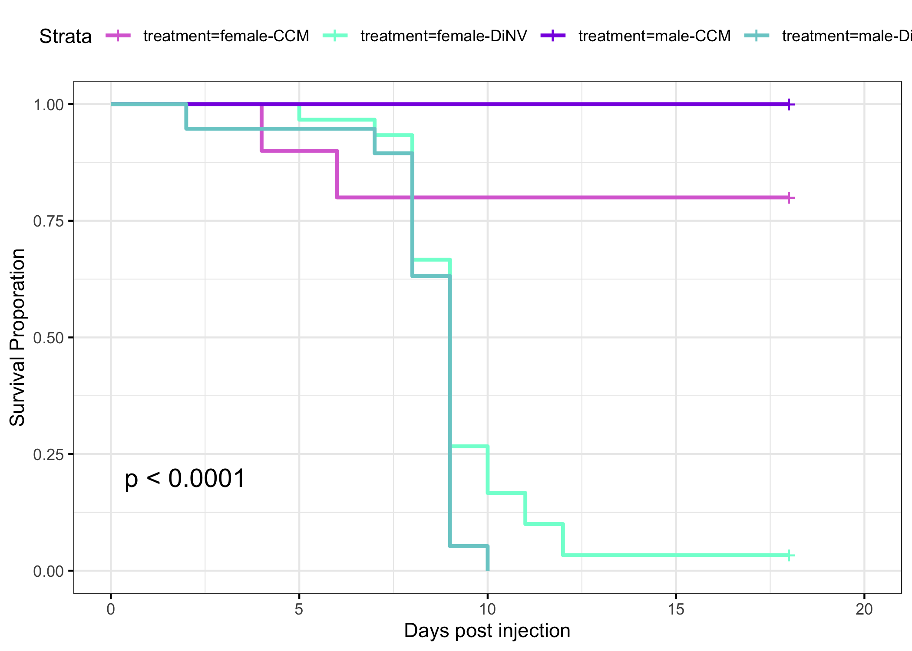
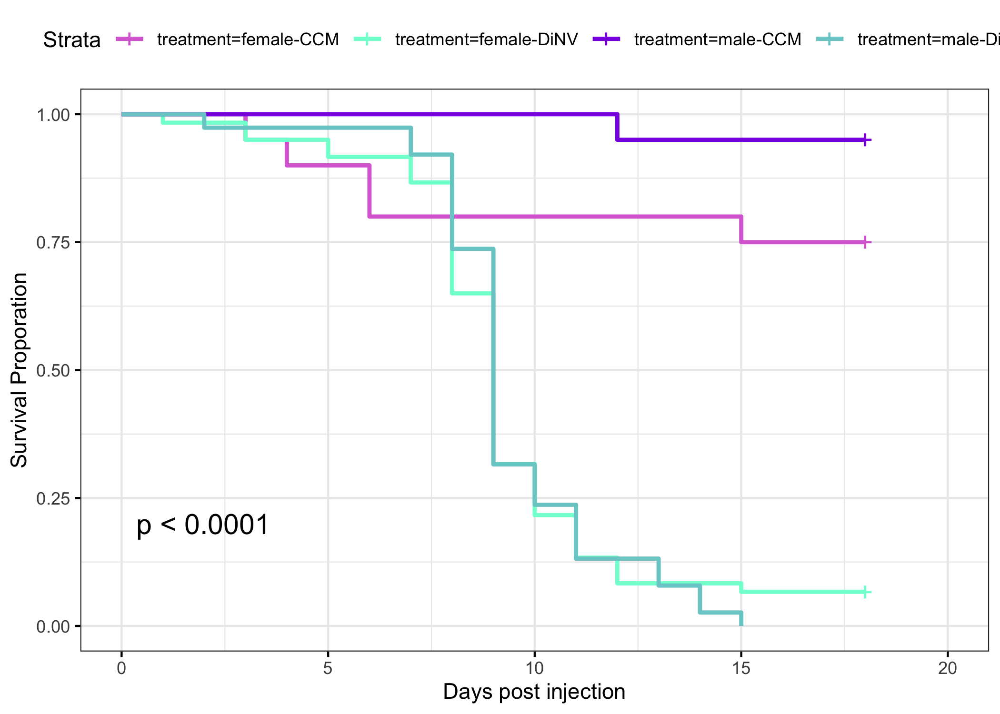
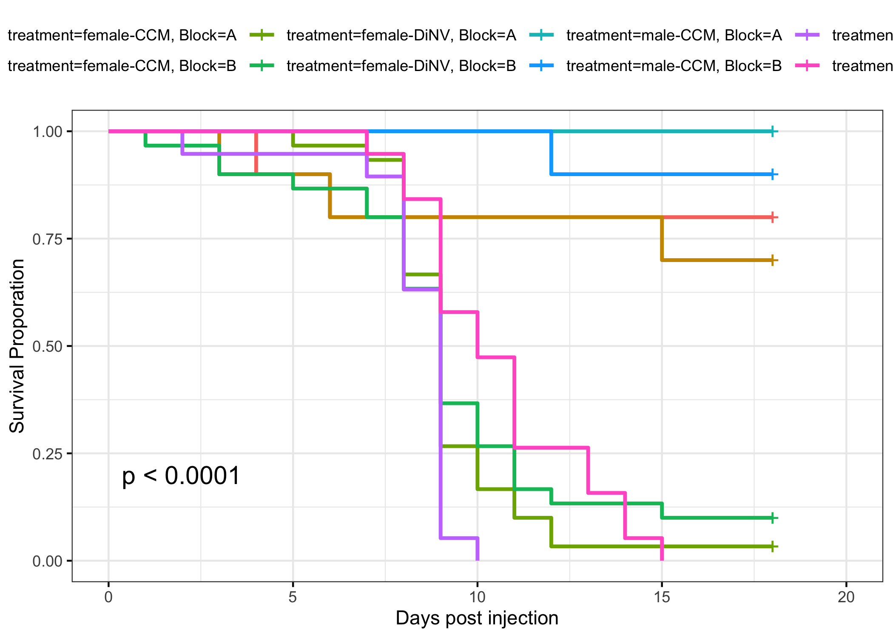

# 20231006-male-and-female-DiNV-injections-rep-2

Load in packages needed for the analysis

``` r
library("survival")
library("survminer")
```

    Loading required package: ggplot2

    Loading required package: ggpubr


    Attaching package: 'survminer'

    The following object is masked from 'package:survival':

        myeloma

### Loop to convert the example data.frame ‘df’ into properly formatted data.frame ‘results’

``` r
#write a function to transform a data.frame that has the column format 'vial | treatment | D0 | D1 | D2...', with one row for each vial
#into a long version in tidy format that can be input to make a survivorship curve
convert_df<-function(df){
  #open empty data.frame to store results
  results<-data.frame(vial=character(),treatment=character(),dead=numeric(),status=numeric())
  #This loop will index out each row (one row per vial) one at a time, transform it into long format (one row per fly), and add the information to the empty data.frame called results
  for(i in 1:nrow(df)){
  #isolate the row (vial) you want to work on
  temp<-df[i,]
    #iteratively isolate each day for this vial (day 0 must be column 3, day 1 column 4, etc.). Loop stops the column before the last day
    for(j in 3:(ncol(temp)-1)){
      #assign the number of flies that died in the vial on that day (starting with day 1) to the variable 'z'
      z<-temp[1,j]-temp[1,j+1]
        #if >0 flies died add this information to the results dataframe
        if(z>0){
          #iterate over 1 through total number of dead flies
          for(k in 1:z){
            #add a new row to the 'results' data.frame for the given dead fly, specifying vial #, treatment, day died, and
            #record the current vial #
            vial<-temp[,1]
            #record the genotype of the current vial
            treatment<-temp[,2]
            #record the death date of the flies that died on this day (assumes that your input DF starts with day 0 in column 3)
            dd<-j-2
            #append this information into a new row in the 'results' data.frame, and add a '1' in the 4th column to indicate mortality
            results[nrow(results)+1,]<- c(vial,treatment,dd,1)
          } #close for loop
        } #close if loop
    } #close for loop
  
  #now assign the number of flies remaining in the vial on the last day (value in the last column of the row) to the variable 'z'
  z<-temp[1,j+1]
    #if there are any flies alive in the vial on the last day
    if(z>0){
      #iterate over 1:(number of flies alive on the last day)
      for(l in 1:z){
        #record the current vial #
        vial<-temp[,1]
        #record the genotype of the current vial
        treatment<-temp[,2]
        #record the last day we recorded this fly alive (assumes that your input DF starts with day 0 in column 3)
        dd<-j-2
        #append this information into a new row in the 'results' data.frame, and add a '0' in the 4th column to indicate that the fly made it to the end of the experiment
        results[nrow(results)+1,]<- c(vial,treatment,dd,0)
      } #close for loop
    } #close if loop
  } #close original for loop
results$dead<-as.numeric(results$dead)  #reiterate that this column must be class numeric
results$status<-as.numeric(results$status)  #reiterate that this column must be class numeric
results$vial <- as.factor(results$vial) # make sure vial is considered a factor
# gives you only the results dataframe as output from function 
return(results) 
} #close function
```

Read in raw data

``` r
#read the file from csv
df<-read.csv("/Users/maggieschedl/Desktop/Github/Unckless_Lab_Resources/Infection_survival_analyses/20231006-rep-2-male-female-nanoject-16Cq/20231006-counts.csv")

# no need to cut down on the file because I already separated out to to be the columns needed 
```

### Convert each of these dataframes to long and tidy format using function defined above

``` r
df.convert<-convert_df(df)
```

Plot the survival curve

``` r
# change to not have confidence intervals in this one so you can see them 
df_fit<- survfit(Surv(dead, status) ~ treatment, data=df.convert)
ggsurvplot(df_fit,
          pval = TRUE, conf.int = FALSE,
          #risk.table = TRUE, # Add risk table
          #risk.table.col = "strata", # Change risk table color by groups
          #linetype = "strata", # Change line type by groups
          #surv.median.line = "hv", # Specify median survival
          ggtheme = theme_bw(), # Change ggplot2 theme
          palette = c("orchid", "aquamarine", "blueviolet", "darkslategray3")) + ylab("Survival Proporation") + xlab("Days post injection")
```



``` r
df_fit_t<- coxph(Surv(dead, status) ~ treatment, data=df.convert)
```

    Warning in coxph.fit(X, Y, istrat, offset, init, control, weights = weights, :
    Loglik converged before variable 2 ; coefficient may be infinite.

``` r
summary(df_fit_t)
```

    Call:
    coxph(formula = Surv(dead, status) ~ treatment, data = df.convert)

      n= 69, number of events= 50 

                               coef  exp(coef)   se(coef)      z Pr(>|z|)    
    treatmentfemale-DiNV  2.450e+00  1.159e+01  7.474e-01  3.278 0.001044 ** 
    treatmentmale-CCM    -1.776e+01  1.939e-08  4.551e+03 -0.004 0.996887    
    treatmentmale-DiNV    2.943e+00  1.898e+01  7.808e-01  3.769 0.000164 ***
    ---
    Signif. codes:  0 '***' 0.001 '**' 0.01 '*' 0.05 '.' 0.1 ' ' 1

                         exp(coef) exp(-coef) lower .95 upper .95
    treatmentfemale-DiNV 1.159e+01  8.628e-02     2.679     50.15
    treatmentmale-CCM    1.939e-08  5.157e+07     0.000       Inf
    treatmentmale-DiNV   1.898e+01  5.269e-02     4.108     87.69

    Concordance= 0.745  (se = 0.046 )
    Likelihood ratio test= 57.19  on 3 df,   p=2e-12
    Wald test            = 14.43  on 3 df,   p=0.002
    Score (logrank) test = 42.92  on 3 df,   p=3e-09

### look at combined data from rep one and two of this infection experiment

Read in data and convert

``` r
#read the file from csv
df2<-read.csv("/Users/maggieschedl/Desktop/Github/Unckless_Lab_Resources/Infection_survival_analyses/20231006-rep-2-male-female-nanoject-16Cq/male-female-rep-1-2-counts-combo.csv")

# no need to cut down on the file because I already separated out to to be the columns needed 

df2.convert<-convert_df(df2)
# add in a column for block/replicate
# repeate the letter A 69 times (number of rows for block 1), then after that repeate B 69 times (number of rows for block 2)
df2.convert$Block <- rep(c("A","B"), c(69, 69))
```

Plot the survival curve without the blocks separated

``` r
# change to not have confidence intervals in this one so you can see them 
df2_fit<- survfit(Surv(dead, status) ~ treatment, data=df2.convert)
ggsurvplot(df2_fit,
          pval = TRUE, conf.int = FALSE,
          #risk.table = TRUE, # Add risk table
          #risk.table.col = "strata", # Change risk table color by groups
          #linetype = "strata", # Change line type by groups
          #surv.median.line = "hv", # Specify median survival
          ggtheme = theme_bw(), # Change ggplot2 theme
          palette = c("orchid", "aquamarine", "blueviolet", "darkslategray3")) + ylab("Survival Proporation") + xlab("Days post injection")
```



Plot the survival curve with the blocks separated

``` r
# change to not have confidence intervals in this one so you can see them 
df3_fit<- survfit(Surv(dead, status) ~ treatment + Block, data=df2.convert)
ggsurvplot(df3_fit,
          pval = TRUE, conf.int = FALSE,
          #risk.table = TRUE, # Add risk table
          #risk.table.col = "strata", # Change risk table color by groups
          #linetype = "strata", # Change line type by groups
          #surv.median.line = "hv", # Specify median survival
          ggtheme = theme_bw() # Change ggplot2 theme
          ) + ylab("Survival Proporation") + xlab("Days post injection")
```



Model with block as a factor

``` r
df_fit4<- coxph(Surv(dead, status) ~ treatment + Block, data=df2.convert)
summary(df_fit4)
```

    Call:
    coxph(formula = Surv(dead, status) ~ treatment + Block, data = df2.convert)

      n= 138, number of events= 100 

                            coef exp(coef) se(coef)      z Pr(>|z|)    
    treatmentfemale-DiNV  2.3246   10.2223   0.4797  4.846 1.26e-06 ***
    treatmentmale-CCM    -1.8168    0.1625   1.0954 -1.658   0.0972 .  
    treatmentmale-DiNV    2.4337   11.4005   0.4964  4.903 9.44e-07 ***
    BlockB               -0.4547    0.6346   0.2110 -2.155   0.0312 *  
    ---
    Signif. codes:  0 '***' 0.001 '**' 0.01 '*' 0.05 '.' 0.1 ' ' 1

                         exp(coef) exp(-coef) lower .95 upper .95
    treatmentfemale-DiNV   10.2223    0.09783   3.99222   26.1745
    treatmentmale-CCM       0.1625    6.15205   0.01899    1.3913
    treatmentmale-DiNV     11.4005    0.08772   4.30935   30.1602
    BlockB                  0.6346    1.57574   0.41967    0.9597

    Concordance= 0.726  (se = 0.033 )
    Likelihood ratio test= 98.74  on 4 df,   p=<2e-16
    Wald test            = 41.98  on 4 df,   p=2e-08
    Score (logrank) test = 76.32  on 4 df,   p=1e-15

Not sure what this is comparing here, maybe I need to separate out sex
differently?
