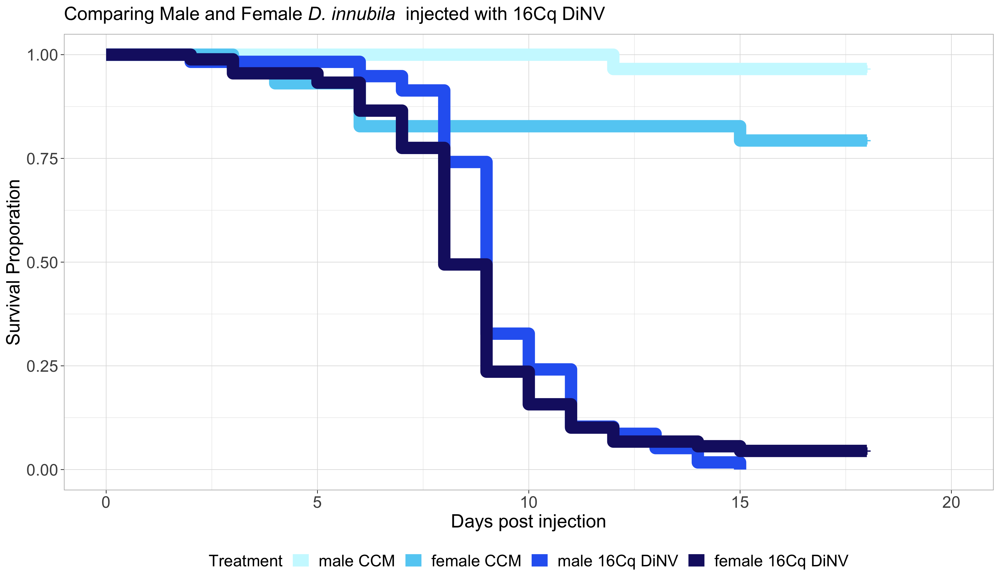

# 20231025-male-female-rep3-16Cq-nanoject

Load in packages needed for the analysis

``` r
library("survival")
library("survminer")
```

    Loading required package: ggplot2

    Loading required package: ggpubr


    Attaching package: 'survminer'

    The following object is masked from 'package:survival':

        myeloma

``` r
library(dplyr)
```


    Attaching package: 'dplyr'

    The following objects are masked from 'package:stats':

        filter, lag

    The following objects are masked from 'package:base':

        intersect, setdiff, setequal, union

``` r
library(tidyr)
library(stringr)
```

### Loop to convert the example data.frame ‘df’ into properly formatted data.frame ‘results’

``` r
#write a function to transform a data.frame that has the column format 'vial | treatment | D0 | D1 | D2...', with one row for each vial
#into a long version in tidy format that can be input to make a survivorship curve
convert_df<-function(df){
  #open empty data.frame to store results
  results<-data.frame(vial=character(),treatment=character(),dead=numeric(),status=numeric())
  #This loop will index out each row (one row per vial) one at a time, transform it into long format (one row per fly), and add the information to the empty data.frame called results
  for(i in 1:nrow(df)){
  #isolate the row (vial) you want to work on
  temp<-df[i,]
    #iteratively isolate each day for this vial (day 0 must be column 3, day 1 column 4, etc.). Loop stops the column before the last day
    for(j in 3:(ncol(temp)-1)){
      #assign the number of flies that died in the vial on that day (starting with day 1) to the variable 'z'
      z<-temp[1,j]-temp[1,j+1]
        #if >0 flies died add this information to the results dataframe
        if(z>0){
          #iterate over 1 through total number of dead flies
          for(k in 1:z){
            #add a new row to the 'results' data.frame for the given dead fly, specifying vial #, treatment, day died, and
            #record the current vial #
            vial<-temp[,1]
            #record the genotype of the current vial
            treatment<-temp[,2]
            #record the death date of the flies that died on this day (assumes that your input DF starts with day 0 in column 3)
            dd<-j-2
            #append this information into a new row in the 'results' data.frame, and add a '1' in the 4th column to indicate mortality
            results[nrow(results)+1,]<- c(vial,treatment,dd,1)
          } #close for loop
        } #close if loop
    } #close for loop
  
  #now assign the number of flies remaining in the vial on the last day (value in the last column of the row) to the variable 'z'
  z<-temp[1,j+1]
    #if there are any flies alive in the vial on the last day
    if(z>0){
      #iterate over 1:(number of flies alive on the last day)
      for(l in 1:z){
        #record the current vial #
        vial<-temp[,1]
        #record the genotype of the current vial
        treatment<-temp[,2]
        #record the last day we recorded this fly alive (assumes that your input DF starts with day 0 in column 3)
        dd<-j-2
        #append this information into a new row in the 'results' data.frame, and add a '0' in the 4th column to indicate that the fly made it to the end of the experiment
        results[nrow(results)+1,]<- c(vial,treatment,dd,0)
      } #close for loop
    } #close if loop
  } #close original for loop
results$dead<-as.numeric(results$dead)  #reiterate that this column must be class numeric
results$status<-as.numeric(results$status)  #reiterate that this column must be class numeric
results$vial <- as.factor(results$vial) # make sure vial is considered a factor
# gives you only the results dataframe as output from function 
return(results) 
} #close function
```

Read in raw data

``` r
#read the file from csv
df<-read.csv("/Users/maggieschedl/Desktop/Github/Unckless_Lab_Resources/Infection_survival_analyses/20231025-rep-3-male-female-nanoject-16Cq/20231025-sheet.csv")

# separate out columns needed
df<-df[,c(1,3,14:32)]
```

Convert dataframe

``` r
df.convert<-convert_df(df)
```

Plot survivial curve

``` r
# change to not have confidence intervals in this one so you can see them 
df_fit<- survfit(Surv(dead, status) ~ treatment, data=df.convert)
ggsurvplot(df_fit,
          pval = TRUE, conf.int = FALSE,
          #risk.table = TRUE, # Add risk table
          #risk.table.col = "strata", # Change risk table color by groups
          #linetype = "strata", # Change line type by groups
          #surv.median.line = "hv", # Specify median survival
          ggtheme = theme_bw(), # Change ggplot2 theme
          palette = c("orchid", "aquamarine", "blueviolet", "darkslategray3")) + ylab("Survival Proporation") + xlab("Days post injection")
```


Combined replicates 1, 2, and 3

``` r
#read the file from csv
df2<-read.csv("/Users/maggieschedl/Desktop/Github/Unckless_Lab_Resources/Infection_survival_analyses/20231025-rep-3-male-female-nanoject-16Cq/male-female-rep-1-2-3-counts-combo.csv")

# convert dataframe

df2.convert <- convert_df(df2)

# add in block information 
# first 69 rows are block A, second 69 rows are block B, and last 68 rows are block C
df2.convert$Block <- rep(c("A","B", "C"), c(69, 69,68))

# add in sex information and DiNV information as separate columns by splitting the treatment column 
# split the columns 
df2.convert_S <- str_split_fixed(df2.convert$treatment, "-", 2)
# change column names
colnames(df2.convert_S) <- c("sex", "injection")

# add columns to df 
df2.convert_full <- cbind(df2.convert,df2.convert_S )
```

Plot all replicates as one

``` r
df_fit_combo_1 <- survfit(Surv(dead, status) ~ treatment, data=df2.convert_full)
ggsurvplot(df_fit_combo_1,
          pval = FALSE, conf.int = FALSE,
          #risk.table = TRUE, # Add risk table
          #risk.table.col = "strata", # Change risk table color by groups
          #linetype = "strata", # Change line type by groups
          #surv.median.line = "hv", # Specify median survival
          ggtheme = theme_bw(), # Change ggplot2 theme
          palette = c("orchid", "aquamarine", "blueviolet", "darkslategray3")) + ylab("Survival Proporation") + xlab("Days post injection")
```



Start looking at models

Model just looking at significance of block and treatment

``` r
# model including block 
df_fit_combo_2<- coxph(Surv(dead, status) ~ treatment + Block, data=df2.convert_full)
summary(df_fit_combo_2)
```

    Call:
    coxph(formula = Surv(dead, status) ~ treatment + Block, data = df2.convert_full)

      n= 206, number of events= 151 

                            coef exp(coef) se(coef)      z Pr(>|z|)    
    treatmentfemale-DiNV  2.8561   17.3932   0.4376  6.527 6.73e-11 ***
    treatmentmale-CCM    -1.9583    0.1411   1.0801 -1.813   0.0698 .  
    treatmentmale-DiNV    2.5997   13.4601   0.4463  5.825 5.70e-09 ***
    BlockB               -0.3810    0.6832   0.2062 -1.848   0.0646 .  
    BlockC                0.3182    1.3747   0.2066  1.540   0.1235    
    ---
    Signif. codes:  0 '***' 0.001 '**' 0.01 '*' 0.05 '.' 0.1 ' ' 1

                         exp(coef) exp(-coef) lower .95 upper .95
    treatmentfemale-DiNV   17.3932    0.05749   7.37712    41.008
    treatmentmale-CCM       0.1411    7.08755   0.01699     1.172
    treatmentmale-DiNV     13.4601    0.07429   5.61280    32.279
    BlockB                  0.6832    1.46369   0.45610     1.023
    BlockC                  1.3747    0.72743   0.91694     2.061

    Concordance= 0.77  (se = 0.026 )
    Likelihood ratio test= 170  on 5 df,   p=<2e-16
    Wald test            = 67.91  on 5 df,   p=3e-13
    Score (logrank) test = 131.3  on 5 df,   p=<2e-16

Model just looking at significance of block and treatment without sex

``` r
# model including block 
df_fit_combo_3<- coxph(Surv(dead, status) ~ injection + Block, data=df2.convert_full)
summary(df_fit_combo_3)
```

    Call:
    coxph(formula = Surv(dead, status) ~ injection + Block, data = df2.convert_full)

      n= 206, number of events= 151 

                     coef exp(coef) se(coef)      z Pr(>|z|)    
    injectionDiNV  3.3805   29.3859   0.4049  8.350   <2e-16 ***
    BlockB        -0.4206    0.6567   0.2051 -2.051   0.0403 *  
    BlockC         0.2429    1.2749   0.1996  1.217   0.2237    
    ---
    Signif. codes:  0 '***' 0.001 '**' 0.01 '*' 0.05 '.' 0.1 ' ' 1

                  exp(coef) exp(-coef) lower .95 upper .95
    injectionDiNV   29.3859    0.03403   13.2898   64.9771
    BlockB           0.6567    1.52280    0.4393    0.9816
    BlockC           1.2749    0.78435    0.8621    1.8854

    Concordance= 0.753  (se = 0.026 )
    Likelihood ratio test= 163  on 3 df,   p=<2e-16
    Wald test            = 75.35  on 3 df,   p=3e-16
    Score (logrank) test = 127.3  on 3 df,   p=<2e-16

Model looking at significance of block and treatment with sex

``` r
# model including block 
df_fit_combo_4<- coxph(Surv(dead, status) ~ injection + Block + sex, data=df2.convert_full)
summary(df_fit_combo_4)
```

    Call:
    coxph(formula = Surv(dead, status) ~ injection + Block + sex, 
        data = df2.convert_full)

      n= 206, number of events= 151 

                     coef exp(coef) se(coef)      z Pr(>|z|)    
    injectionDiNV  3.3445   28.3467   0.4040  8.279   <2e-16 ***
    BlockB        -0.3701    0.6907   0.2058 -1.798   0.0722 .  
    BlockC         0.3409    1.4062   0.2062  1.654   0.0982 .  
    sexmale       -0.3267    0.7213   0.1734 -1.884   0.0595 .  
    ---
    Signif. codes:  0 '***' 0.001 '**' 0.01 '*' 0.05 '.' 0.1 ' ' 1

                  exp(coef) exp(-coef) lower .95 upper .95
    injectionDiNV   28.3467    0.03528   12.8425    62.568
    BlockB           0.6907    1.44783    0.4614     1.034
    BlockC           1.4062    0.71114    0.9388     2.106
    sexmale          0.7213    1.38639    0.5135     1.013

    Concordance= 0.766  (se = 0.026 )
    Likelihood ratio test= 166.7  on 4 df,   p=<2e-16
    Wald test            = 79.03  on 4 df,   p=3e-16
    Score (logrank) test = 130.6  on 4 df,   p=<2e-16
