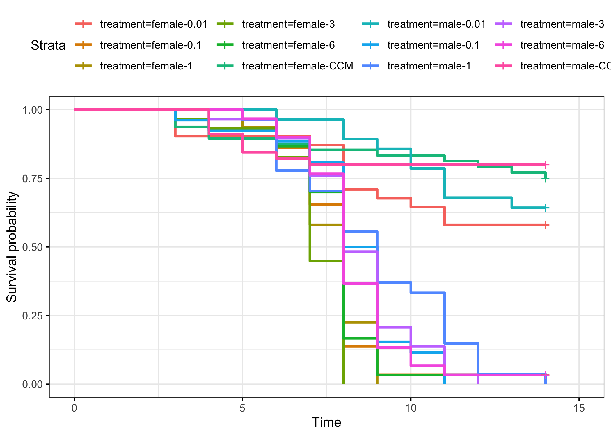
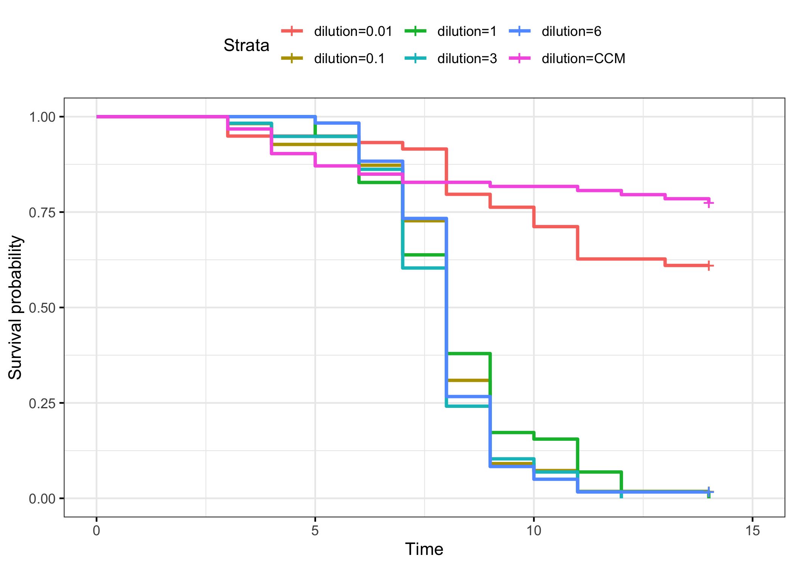
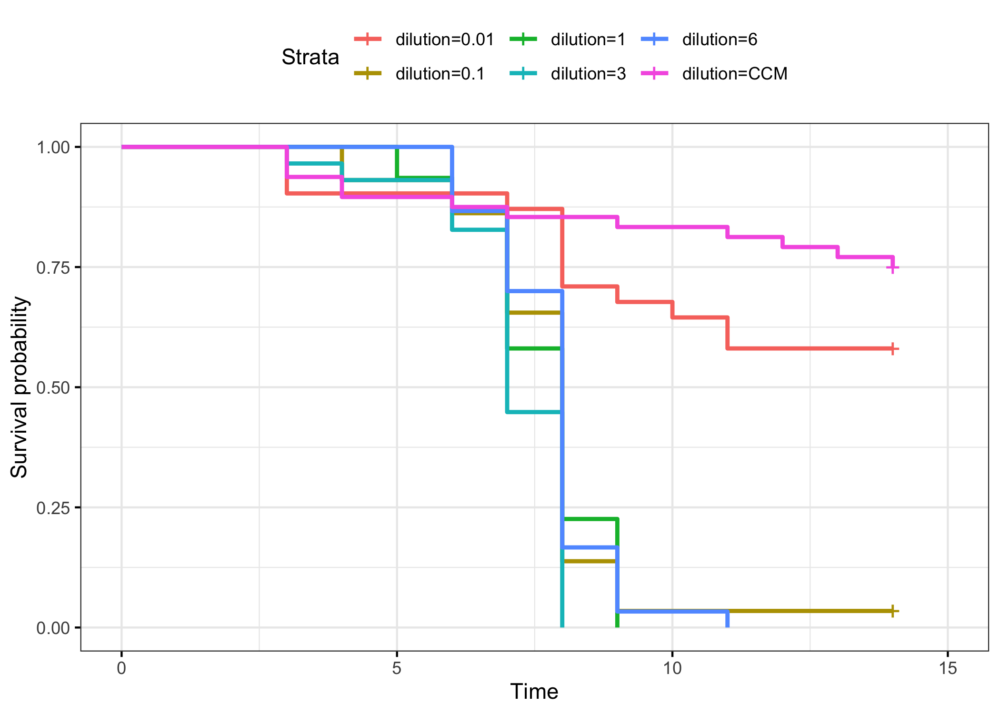
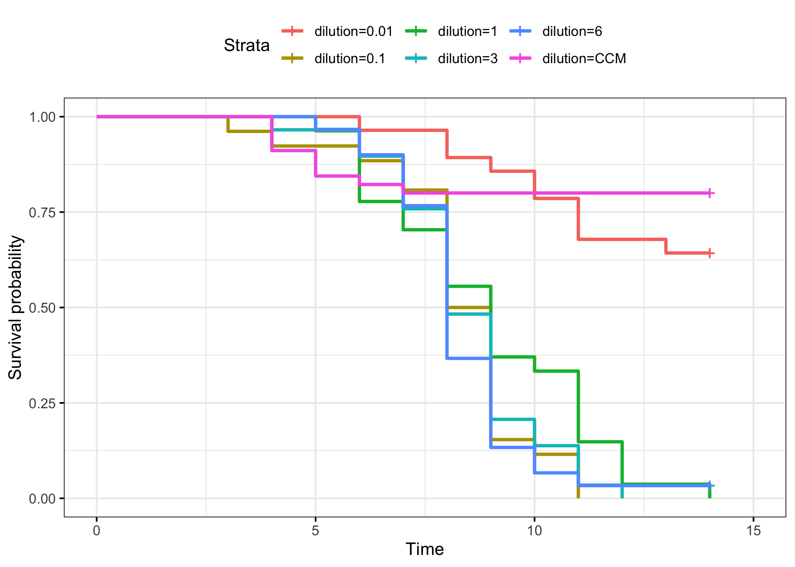

# P4-Dilutions-combo

Load in packages needed for the analysis

``` r
library("survival")
library("survminer")
```

    Loading required package: ggplot2

    Loading required package: ggpubr


    Attaching package: 'survminer'

    The following object is masked from 'package:survival':

        myeloma

``` r
library(dplyr)
```


    Attaching package: 'dplyr'

    The following objects are masked from 'package:stats':

        filter, lag

    The following objects are masked from 'package:base':

        intersect, setdiff, setequal, union

``` r
library(tidyr)
library(stringr)
```

### Loop to convert the example data.frame ‘df’ into properly formatted data.frame ‘results’

``` r
#write a function to transform a data.frame that has the column format 'vial | treatment | D0 | D1 | D2...', with one row for each vial
#into a long version in tidy format that can be input to make a survivorship curve
convert_df<-function(df){
  #open empty data.frame to store results
  results<-data.frame(vial=character(),treatment=character(),dead=numeric(),status=numeric())
  #This loop will index out each row (one row per vial) one at a time, transform it into long format (one row per fly), and add the information to the empty data.frame called results
  for(i in 1:nrow(df)){
  #isolate the row (vial) you want to work on
  temp<-df[i,]
    #iteratively isolate each day for this vial (day 0 must be column 3, day 1 column 4, etc.). Loop stops the column before the last day
    for(j in 3:(ncol(temp)-1)){
      #assign the number of flies that died in the vial on that day (starting with day 1) to the variable 'z'
      z<-temp[1,j]-temp[1,j+1]
        #if >0 flies died add this information to the results dataframe
        if(z>0){
          #iterate over 1 through total number of dead flies
          for(k in 1:z){
            #add a new row to the 'results' data.frame for the given dead fly, specifying vial #, treatment, day died, and
            #record the current vial #
            vial<-temp[,1]
            #record the genotype of the current vial
            treatment<-temp[,2]
            #record the death date of the flies that died on this day (assumes that your input DF starts with day 0 in column 3)
            dd<-j-2
            #append this information into a new row in the 'results' data.frame, and add a '1' in the 4th column to indicate mortality
            results[nrow(results)+1,]<- c(vial,treatment,dd,1)
          } #close for loop
        } #close if loop
    } #close for loop
  
  #now assign the number of flies remaining in the vial on the last day (value in the last column of the row) to the variable 'z'
  z<-temp[1,j+1]
    #if there are any flies alive in the vial on the last day
    if(z>0){
      #iterate over 1:(number of flies alive on the last day)
      for(l in 1:z){
        #record the current vial #
        vial<-temp[,1]
        #record the genotype of the current vial
        treatment<-temp[,2]
        #record the last day we recorded this fly alive (assumes that your input DF starts with day 0 in column 3)
        dd<-j-2
        #append this information into a new row in the 'results' data.frame, and add a '0' in the 4th column to indicate that the fly made it to the end of the experiment
        results[nrow(results)+1,]<- c(vial,treatment,dd,0)
      } #close for loop
    } #close if loop
  } #close original for loop
results$dead<-as.numeric(results$dead)  #reiterate that this column must be class numeric
results$status<-as.numeric(results$status)  #reiterate that this column must be class numeric
results$vial <- as.factor(results$vial) # make sure vial is considered a factor
# gives you only the results dataframe as output from function 
return(results) 
} #close function
```

Read in raw data

**Note that for these datasets, the adjusted N number is the number of
flies alive on day 2 because there seemed to be more early death in
these experiments than usual**

``` r
#read the file from csv
df<-read.csv("/Users/maggieschedl/Desktop/Github/Unckless_Lab_Resources/Infection_survival_analyses/20231205-dilution-rep-3/dilution-infection-combo-sheet.csv")

# Remove the rows of the undiluted samples because I did not do those for the other replicates
df <- df[c(1:12, 15:42),]
# separate out columns needed
df <- df[,c(1,3,15:29)]
```

Convert dataframe

``` r
df.convert<-convert_df(df)
```

Plot survivial curve with every line separate, yes this is a mess

``` r
# change to not have confidence intervals in this one so you can see them 
df_fit<- survfit(Surv(dead, status) ~ treatment, data=df.convert)
ggsurvplot(df_fit,
          pval = FALSE, conf.int = FALSE,
          #risk.table = TRUE, # Add risk table
          #risk.table.col = "strata", # Change risk table color by groups
          #linetype = "strata", # Change line type by groups
          #surv.median.line = "hv", # Specify median survival
          ggtheme = theme_bw()) # Change ggplot2 theme
```



``` r
          # palette = c("orchid", "aquamarine", "blueviolet", "darkslategray3")) + ylab("Survival Proporation") + xlab("Days post injection")
```

Add in columns for sex and dilution separately

``` r
# add in sex information and DiNV information as separate columns by splitting the treatment column 
# split the columns 
df.convert_S <- str_split_fixed(df.convert$treatment, "-", 2)

# change column names
colnames(df.convert_S) <- c("sex", "dilution")

# add columns to df 
df.convert_full <- cbind(df.convert,df.convert_S)

# add in block information 
# this was not reproducable to count but I don't know how else to do it
# first 118 rows are block A, second 127 rows are block B, and last 138 rows are block C
df.convert_full$Block <- rep(c("A","B", "C"), c(118, 127, 138))
```

Plot survival curve by dilution with the sexes combined

``` r
# change to not have confidence intervals in this one so you can see them 
df2_fit<- survfit(Surv(dead, status) ~ dilution, data=df.convert_full)
ggsurvplot(df2_fit,
          pval = FALSE, conf.int = FALSE,
          #risk.table = TRUE, # Add risk table
          #risk.table.col = "strata", # Change risk table color by groups
          #linetype = "strata", # Change line type by groups
          #surv.median.line = "hv", # Specify median survival
          ggtheme = theme_bw()) # Change ggplot2 theme
```



``` r
          # palette = c("orchid", "aquamarine", "blueviolet", "darkslategray3")) + ylab("Survival Proporation") + xlab("Days post injection")
```

Plot survival curve with only females

``` r
df.convert_fem <- df.convert_full[which(df.convert_full$sex != "male"),]

# change to not have confidence intervals in this one so you can see them 
df3_fit<- survfit(Surv(dead, status) ~ dilution, data=df.convert_fem)
ggsurvplot(df3_fit,
          pval = FALSE, conf.int = FALSE,
          #risk.table = TRUE, # Add risk table
          #risk.table.col = "strata", # Change risk table color by groups
          #linetype = "strata", # Change line type by groups
          #surv.median.line = "hv", # Specify median survival
          ggtheme = theme_bw()) # Change ggplot2 theme
```



``` r
          # palette = c("orchid", "aquamarine", "blueviolet", "darkslategray3")) + ylab("Survival Proporation") + xlab("Days post injection")
```

Plot survival curve with only males

``` r
df.convert_m <- df.convert_full[which(df.convert_full$sex != "female"),]

# change to not have confidence intervals in this one so you can see them 
df4_fit<- survfit(Surv(dead, status) ~ dilution, data=df.convert_m)
ggsurvplot(df4_fit,
          pval = FALSE, conf.int = FALSE,
          #risk.table = TRUE, # Add risk table
          #risk.table.col = "strata", # Change risk table color by groups
          #linetype = "strata", # Change line type by groups
          #surv.median.line = "hv", # Specify median survival
          ggtheme = theme_bw()) # Change ggplot2 theme
```



``` r
          # palette = c("orchid", "aquamarine", "blueviolet", "darkslategray3")) + ylab("Survival Proporation") + xlab("Days post injection")
```

Models

``` r
# standard model with both sexes
df_fit_combo<- coxph(Surv(dead, status) ~ treatment, data=df.convert_full)
summary(df_fit_combo)
```

    Call:
    coxph(formula = Surv(dead, status) ~ treatment, data = df.convert_full)

      n= 383, number of events= 273 

                           coef exp(coef) se(coef)      z Pr(>|z|)    
    treatmentfemale-0.1  2.1294    8.4096   0.3458  6.158 7.36e-10 ***
    treatmentfemale-1    2.2161    9.1715   0.3448  6.427 1.30e-10 ***
    treatmentfemale-3    2.6670   14.3966   0.3535  7.545 4.51e-14 ***
    treatmentfemale-6    2.1510    8.5935   0.3451  6.232 4.59e-10 ***
    treatmentfemale-CCM -0.7078    0.4927   0.4004 -1.767   0.0771 .  
    treatmentmale-0.01  -0.3357    0.7148   0.4206 -0.798   0.4248    
    treatmentmale-0.1    1.6846    5.3904   0.3485  4.834 1.34e-06 ***
    treatmentmale-1      1.4117    4.1028   0.3411  4.138 3.50e-05 ***
    treatmentmale-3      1.6497    5.2052   0.3412  4.834 1.34e-06 ***
    treatmentmale-6      1.7605    5.8151   0.3419  5.149 2.61e-07 ***
    treatmentmale-CCM   -0.8943    0.4089   0.4338 -2.061   0.0393 *  
    ---
    Signif. codes:  0 '***' 0.001 '**' 0.01 '*' 0.05 '.' 0.1 ' ' 1

                        exp(coef) exp(-coef) lower .95 upper .95
    treatmentfemale-0.1    8.4096    0.11891    4.2702   16.5618
    treatmentfemale-1      9.1715    0.10903    4.6660   18.0274
    treatmentfemale-3     14.3966    0.06946    7.2010   28.7823
    treatmentfemale-6      8.5935    0.11637    4.3691   16.9024
    treatmentfemale-CCM    0.4927    2.02950    0.2248    1.0801
    treatmentmale-0.01     0.7148    1.39891    0.3134    1.6303
    treatmentmale-0.1      5.3904    0.18551    2.7228   10.6717
    treatmentmale-1        4.1028    0.24374    2.1025    8.0062
    treatmentmale-3        5.2052    0.19212    2.6667   10.1600
    treatmentmale-6        5.8151    0.17197    2.9754   11.3650
    treatmentmale-CCM      0.4089    2.44561    0.1747    0.9569

    Concordance= 0.751  (se = 0.021 )
    Likelihood ratio test= 263.9  on 11 df,   p=<2e-16
    Wald test            = 188.7  on 11 df,   p=<2e-16
    Score (logrank) test = 252.5  on 11 df,   p=<2e-16

``` r
# standard model only males
df_fit_combo_m<- coxph(Surv(dead, status) ~ treatment, data=df.convert_m)
summary(df_fit_combo_m)
```

    Call:
    coxph(formula = Surv(dead, status) ~ treatment, data = df.convert_m)

      n= 185, number of events= 130 

                         coef exp(coef) se(coef)      z Pr(>|z|)    
    treatmentmale-0.1  2.1580    8.6538   0.3889  5.549 2.88e-08 ***
    treatmentmale-1    1.8119    6.1222   0.3769  4.808 1.53e-06 ***
    treatmentmale-3    2.1009    8.1735   0.3809  5.515 3.48e-08 ***
    treatmentmale-6    2.2098    9.1143   0.3815  5.792 6.96e-09 ***
    treatmentmale-CCM -0.5808    0.5595   0.4598 -1.263    0.207    
    ---
    Signif. codes:  0 '***' 0.001 '**' 0.01 '*' 0.05 '.' 0.1 ' ' 1

                      exp(coef) exp(-coef) lower .95 upper .95
    treatmentmale-0.1    8.6538     0.1156    4.0380    18.546
    treatmentmale-1      6.1222     0.1633    2.9249    12.814
    treatmentmale-3      8.1735     0.1223    3.8741    17.244
    treatmentmale-6      9.1143     0.1097    4.3148    19.253
    treatmentmale-CCM    0.5595     1.7874    0.2272     1.378

    Concordance= 0.713  (se = 0.031 )
    Likelihood ratio test= 116.2  on 5 df,   p=<2e-16
    Wald test            = 78.19  on 5 df,   p=2e-15
    Score (logrank) test = 106  on 5 df,   p=<2e-16

``` r
# standard model only females
df_fit_combo_f<- coxph(Surv(dead, status) ~ treatment, data=df.convert_fem)
summary(df_fit_combo_f)
```

    Call:
    coxph(formula = Surv(dead, status) ~ treatment, data = df.convert_fem)

      n= 198, number of events= 143 

                           coef exp(coef) se(coef)      z Pr(>|z|)    
    treatmentfemale-0.1  1.9181    6.8082   0.3538  5.421 5.93e-08 ***
    treatmentfemale-1    1.9491    7.0227   0.3526  5.529 3.23e-08 ***
    treatmentfemale-3    2.4438   11.5173   0.3670  6.659 2.75e-11 ***
    treatmentfemale-6    1.9060    6.7260   0.3528  5.402 6.60e-08 ***
    treatmentfemale-CCM -0.6743    0.5095   0.4006 -1.683   0.0923 .  
    ---
    Signif. codes:  0 '***' 0.001 '**' 0.01 '*' 0.05 '.' 0.1 ' ' 1

                        exp(coef) exp(-coef) lower .95 upper .95
    treatmentfemale-0.1    6.8082    0.14688    3.4029    13.621
    treatmentfemale-1      7.0227    0.14240    3.5189    14.015
    treatmentfemale-3     11.5173    0.08683    5.6101    23.644
    treatmentfemale-6      6.7260    0.14868    3.3683    13.431
    treatmentfemale-CCM    0.5095    1.96270    0.2323     1.117

    Concordance= 0.741  (se = 0.028 )
    Likelihood ratio test= 130.6  on 5 df,   p=<2e-16
    Wald test            = 90.56  on 5 df,   p=<2e-16
    Score (logrank) test = 121.2  on 5 df,   p=<2e-16

``` r
# model with block both sexes
df_fit_combo_b<- coxph(Surv(dead, status) ~ treatment + Block, data=df.convert_full)
summary(df_fit_combo_b)
```

    Call:
    coxph(formula = Surv(dead, status) ~ treatment + Block, data = df.convert_full)

      n= 383, number of events= 273 

                            coef exp(coef) se(coef)      z Pr(>|z|)    
    treatmentfemale-0.1  2.17584   8.80961  0.34805  6.251 4.07e-10 ***
    treatmentfemale-1    2.23406   9.33771  0.34557  6.465 1.01e-10 ***
    treatmentfemale-3    2.70729  14.98865  0.35522  7.621 2.51e-14 ***
    treatmentfemale-6    2.18496   8.89026  0.34678  6.301 2.96e-10 ***
    treatmentfemale-CCM -0.70517   0.49402  0.40048 -1.761   0.0783 .  
    treatmentmale-0.01  -0.31904   0.72685  0.42086 -0.758   0.4484    
    treatmentmale-0.1    1.73351   5.66050  0.35120  4.936 7.97e-07 ***
    treatmentmale-1      1.45923   4.30265  0.34337  4.250 2.14e-05 ***
    treatmentmale-3      1.66198   5.26974  0.34173  4.863 1.15e-06 ***
    treatmentmale-6      1.80209   6.06230  0.34397  5.239 1.61e-07 ***
    treatmentmale-CCM   -0.89801   0.40738  0.43399 -2.069   0.0385 *  
    BlockB               0.13704   1.14688  0.15392  0.890   0.3733    
    BlockC              -0.09546   0.90895  0.14899 -0.641   0.5217    
    ---
    Signif. codes:  0 '***' 0.001 '**' 0.01 '*' 0.05 '.' 0.1 ' ' 1

                        exp(coef) exp(-coef) lower .95 upper .95
    treatmentfemale-0.1    8.8096    0.11351    4.4534   17.4270
    treatmentfemale-1      9.3377    0.10709    4.7434   18.3819
    treatmentfemale-3     14.9886    0.06672    7.4714   30.0695
    treatmentfemale-6      8.8903    0.11248    4.5054   17.5425
    treatmentfemale-CCM    0.4940    2.02419    0.2254    1.0830
    treatmentmale-0.01     0.7268    1.37580    0.3186    1.6584
    treatmentmale-0.1      5.6605    0.17666    2.8439   11.2666
    treatmentmale-1        4.3027    0.23241    2.1951    8.4336
    treatmentmale-3        5.2697    0.18976    2.6972   10.2960
    treatmentmale-6        6.0623    0.16495    3.0892   11.8966
    treatmentmale-CCM      0.4074    2.45471    0.1740    0.9537
    BlockB                 1.1469    0.87193    0.8482    1.5507
    BlockC                 0.9090    1.10017    0.6788    1.2172

    Concordance= 0.753  (se = 0.02 )
    Likelihood ratio test= 266.3  on 13 df,   p=<2e-16
    Wald test            = 188.8  on 13 df,   p=<2e-16
    Score (logrank) test = 253.6  on 13 df,   p=<2e-16

``` r
# model with block males
df_fit_combo_b_m<- coxph(Surv(dead, status) ~ treatment + Block, data=df.convert_m)
summary(df_fit_combo_b_m)
```

    Call:
    coxph(formula = Surv(dead, status) ~ treatment + Block, data = df.convert_m)

      n= 185, number of events= 130 

                          coef exp(coef) se(coef)      z Pr(>|z|)    
    treatmentmale-0.1  2.22177   9.22362  0.39276  5.657 1.54e-08 ***
    treatmentmale-1    1.86808   6.47587  0.37960  4.921 8.60e-07 ***
    treatmentmale-3    2.09833   8.15251  0.38188  5.495 3.91e-08 ***
    treatmentmale-6    2.24352   9.42647  0.38527  5.823 5.77e-09 ***
    treatmentmale-CCM -0.62475   0.53540  0.46140 -1.354    0.176    
    BlockB             0.27625   1.31818  0.22874  1.208    0.227    
    BlockC            -0.05795   0.94370  0.21380 -0.271    0.786    
    ---
    Signif. codes:  0 '***' 0.001 '**' 0.01 '*' 0.05 '.' 0.1 ' ' 1

                      exp(coef) exp(-coef) lower .95 upper .95
    treatmentmale-0.1    9.2236     0.1084    4.2715    19.917
    treatmentmale-1      6.4759     0.1544    3.0774    13.627
    treatmentmale-3      8.1525     0.1227    3.8569    17.232
    treatmentmale-6      9.4265     0.1061    4.4300    20.058
    treatmentmale-CCM    0.5354     1.8678    0.2167     1.323
    BlockB               1.3182     0.7586    0.8419     2.064
    BlockC               0.9437     1.0597    0.6207     1.435

    Concordance= 0.719  (se = 0.031 )
    Likelihood ratio test= 118.6  on 7 df,   p=<2e-16
    Wald test            = 79.32  on 7 df,   p=2e-14
    Score (logrank) test = 107.3  on 7 df,   p=<2e-16

``` r
# model with block females
df_fit_combo_b_f<- coxph(Surv(dead, status) ~ treatment + Block, data=df.convert_fem)
summary(df_fit_combo_b_f)
```

    Call:
    coxph(formula = Surv(dead, status) ~ treatment + Block, data = df.convert_fem)

      n= 198, number of events= 143 

                           coef exp(coef) se(coef)      z Pr(>|z|)    
    treatmentfemale-0.1  1.9486    7.0192   0.3569  5.460 4.75e-08 ***
    treatmentfemale-1    1.9566    7.0752   0.3533  5.537 3.07e-08 ***
    treatmentfemale-3    2.4716   11.8417   0.3695  6.690 2.24e-11 ***
    treatmentfemale-6    1.9293    6.8845   0.3551  5.433 5.53e-08 ***
    treatmentfemale-CCM -0.6698    0.5118   0.4007 -1.672   0.0946 .  
    BlockB               0.0385    1.0393   0.2083  0.185   0.8534    
    BlockC              -0.1280    0.8799   0.2085 -0.614   0.5393    
    ---
    Signif. codes:  0 '***' 0.001 '**' 0.01 '*' 0.05 '.' 0.1 ' ' 1

                        exp(coef) exp(-coef) lower .95 upper .95
    treatmentfemale-0.1    7.0192    0.14247    3.4875    14.128
    treatmentfemale-1      7.0752    0.14134    3.5397    14.142
    treatmentfemale-3     11.8417    0.08445    5.7402    24.429
    treatmentfemale-6      6.8845    0.14525    3.4326    13.808
    treatmentfemale-CCM    0.5118    1.95389    0.2333     1.123
    BlockB                 1.0393    0.96223    0.6909     1.563
    BlockC                 0.8799    1.13653    0.5848     1.324

    Concordance= 0.743  (se = 0.029 )
    Likelihood ratio test= 131.3  on 7 df,   p=<2e-16
    Wald test            = 90.3  on 7 df,   p=<2e-16
    Score (logrank) test = 121.5  on 7 df,   p=<2e-16
