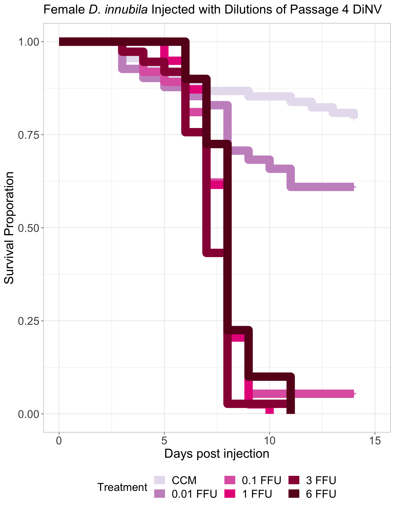
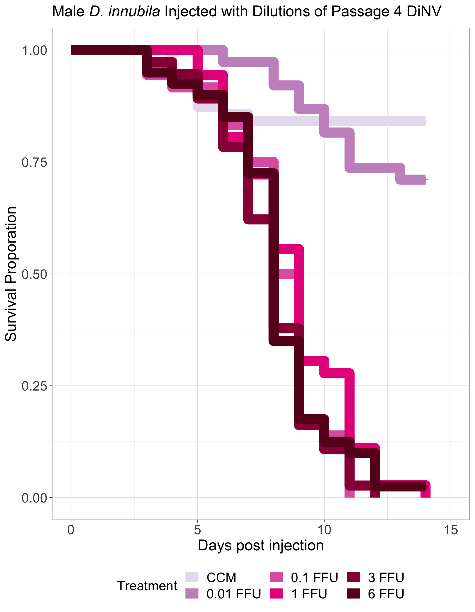

# p4-Dilutions-4-rep-combo

Load in packages needed for the analysis

``` r
library("survival")
library("survminer")
```

    Loading required package: ggplot2

    Loading required package: ggpubr


    Attaching package: 'survminer'

    The following object is masked from 'package:survival':

        myeloma

``` r
library(dplyr)
```


    Attaching package: 'dplyr'

    The following objects are masked from 'package:stats':

        filter, lag

    The following objects are masked from 'package:base':

        intersect, setdiff, setequal, union

``` r
library(tidyr)
library(stringr)
```

### Loop to convert the example data.frame ‘df’ into properly formatted data.frame ‘results’

``` r
#write a function to transform a data.frame that has the column format 'vial | treatment | D0 | D1 | D2...', with one row for each vial
#into a long version in tidy format that can be input to make a survivorship curve
convert_df<-function(df){
  #open empty data.frame to store results
  results<-data.frame(vial=character(),treatment=character(),dead=numeric(),status=numeric())
  #This loop will index out each row (one row per vial) one at a time, transform it into long format (one row per fly), and add the information to the empty data.frame called results
  for(i in 1:nrow(df)){
  #isolate the row (vial) you want to work on
  temp<-df[i,]
    #iteratively isolate each day for this vial (day 0 must be column 3, day 1 column 4, etc.). Loop stops the column before the last day
    for(j in 3:(ncol(temp)-1)){
      #assign the number of flies that died in the vial on that day (starting with day 1) to the variable 'z'
      z<-temp[1,j]-temp[1,j+1]
        #if >0 flies died add this information to the results dataframe
        if(z>0){
          #iterate over 1 through total number of dead flies
          for(k in 1:z){
            #add a new row to the 'results' data.frame for the given dead fly, specifying vial #, treatment, day died, and
            #record the current vial #
            vial<-temp[,1]
            #record the genotype of the current vial
            treatment<-temp[,2]
            #record the death date of the flies that died on this day (assumes that your input DF starts with day 0 in column 3)
            dd<-j-2
            #append this information into a new row in the 'results' data.frame, and add a '1' in the 4th column to indicate mortality
            results[nrow(results)+1,]<- c(vial,treatment,dd,1)
          } #close for loop
        } #close if loop
    } #close for loop
  
  #now assign the number of flies remaining in the vial on the last day (value in the last column of the row) to the variable 'z'
  z<-temp[1,j+1]
    #if there are any flies alive in the vial on the last day
    if(z>0){
      #iterate over 1:(number of flies alive on the last day)
      for(l in 1:z){
        #record the current vial #
        vial<-temp[,1]
        #record the genotype of the current vial
        treatment<-temp[,2]
        #record the last day we recorded this fly alive (assumes that your input DF starts with day 0 in column 3)
        dd<-j-2
        #append this information into a new row in the 'results' data.frame, and add a '0' in the 4th column to indicate that the fly made it to the end of the experiment
        results[nrow(results)+1,]<- c(vial,treatment,dd,0)
      } #close for loop
    } #close if loop
  } #close original for loop
results$dead<-as.numeric(results$dead)  #reiterate that this column must be class numeric
results$status<-as.numeric(results$status)  #reiterate that this column must be class numeric
results$vial <- as.factor(results$vial) # make sure vial is considered a factor
# gives you only the results dataframe as output from function 
return(results) 
} #close function
```

Read in raw data

**Note that for these datasets, the adjusted N number is the number of
flies alive on day 2 because there seemed to be more early death in
these experiments than usual**

``` r
#read the file from csv
df<-read.csv("/Users/maggieschedl/Desktop/Github/Unckless_Lab_Resources/Infection_survival_analyses/20240209-dilution-rep-4/dilution-infection-combo-sheet.csv")

# Remove the rows of the undiluted samples because I did not do those for the other replicates
df <- df[c(1:12, 15:56),]
# separate out columns needed
df <- df[,c(1,3,15:29)]
```

Convert dataframe

``` r
df.convert<-convert_df(df)
```

Plot survivial curve with every line separate, yes this is a mess

``` r
# change to not have confidence intervals in this one so you can see them 
df_fit<- survfit(Surv(dead, status) ~ treatment, data=df.convert)
ggsurvplot(df_fit,
          pval = FALSE, conf.int = FALSE,
          #risk.table = TRUE, # Add risk table
          #risk.table.col = "strata", # Change risk table color by groups
          #linetype = "strata", # Change line type by groups
          #surv.median.line = "hv", # Specify median survival
          ggtheme = theme_bw()) # Change ggplot2 theme
```


``` r
          # palette = c("orchid", "aquamarine", "blueviolet", "darkslategray3")) + ylab("Survival Proporation") + xlab("Days post injection")
```

Add in columns for sex and dilution separately

``` r
# add in sex information and DiNV information as separate columns by splitting the treatment column 
# split the columns 
df.convert_S <- str_split_fixed(df.convert$treatment, "-", 2)

# change column names
colnames(df.convert_S) <- c("sex", "dilution")

# add columns to df 
df.convert_full <- cbind(df.convert,df.convert_S)

# add in block information 
# this was not reproducable to count but I don't know how else to do it
# first 118 rows are block A, second 127 rows are block B, the third 138 rows are block C, and the last 133 rows are block D
df.convert_full$Block <- rep(c("A","B", "C", "D"), c(118, 127, 138, 129))
```

Plot survival curve with only females

``` r
df.convert_fem <- df.convert_full[which(df.convert_full$sex != "male"),]

# order treatments 
df.convert_fem <- df.convert_fem %>% 
  mutate(dilution = factor(dilution, levels = c("CCM", "0.01", "0.1", "1", "3", "6")))

# change to not have confidence intervals in this one so you can see them 
df_fit_fem<- survfit(Surv(dead, status) ~ dilution, data=df.convert_fem)
ggsurvplot(df_fit_fem, size = 5,
          pval = FALSE, conf.int = FALSE,
          legend = "bottom",
          font.tickslab = c(14),
          font.x = c(16),
          font.y = c(16),
          ggtheme = theme_light(),
          title = "Female D. innubila Injected with Dilutions of Passage 4 DiNV",
          legend.title="Treatment",
          legend.labs=c("CCM", "0.01 FFU", "0.1 FFU", "1 FFU", "3 FFU", "6 FFU"),
          font.legend = c(14),
          palette = c("#E7E1EF", "#C994C7","#DF65B0","#E7298A" ,"#980043", "#67001F")) + ylab("Survival Proporation") + xlab("Days post injection")
```



Plot survival curve with only males

``` r
df.convert_m <- df.convert_full[which(df.convert_full$sex != "female"),]

# order treatments 
df.convert_m <- df.convert_m %>% 
  mutate(dilution = factor(dilution, levels = c("CCM", "0.01", "0.1", "1", "3", "6")))

# change to not have confidence intervals in this one so you can see them 
df_fit_m<- survfit(Surv(dead, status) ~ dilution, data=df.convert_m)
ggsurvplot(df_fit_m, size = 5,
          pval = FALSE, conf.int = FALSE,
          legend = "bottom",
          font.tickslab = c(14),
          font.x = c(16),
          font.y = c(16),
          ggtheme = theme_light(),
          title = "Male D. innubila Injected with Dilutions of Passage 4 DiNV",
          legend.title="Treatment",
          legend.labs=c("CCM", "0.01 FFU", "0.1 FFU", "1 FFU", "3 FFU", "6 FFU"),
          font.legend = c(14),
          palette = c("#E7E1EF", "#C994C7","#DF65B0","#E7298A" ,"#980043", "#67001F")) + ylab("Survival Proporation") + xlab("Days post injection")
```



Look at median survival time

``` r
# females 
surv_median(df_fit_fem, combine = FALSE)
```

    Warning: `select_()` was deprecated in dplyr 0.7.0.
    ℹ Please use `select()` instead.
    ℹ The deprecated feature was likely used in the survminer package.
      Please report the issue at <https://github.com/kassambara/survminer/issues>.

             strata median lower upper
    1  dilution=CCM     NA    NA    NA
    2 dilution=0.01     NA    11    NA
    3  dilution=0.1      8     7     8
    4    dilution=1      8     7     8
    5    dilution=3      7     7     8
    6    dilution=6      8     8     8

``` r
# males 
surv_median(df_fit_m, combine = FALSE)
```

             strata median lower upper
    1  dilution=CCM     NA    NA    NA
    2 dilution=0.01     NA    NA    NA
    3  dilution=0.1    8.5     8     9
    4    dilution=1    9.0     8     9
    5    dilution=3    8.0     7     9
    6    dilution=6    8.0     8     9

Look at model for males comparing dilutions

``` r
male_1 <- coxph(Surv(dead, status) ~ dilution + Block, data=df.convert_m)
summary(male_1)
```

    Call:
    coxph(formula = Surv(dead, status) ~ dilution + Block, data = df.convert_m)

      n= 250, number of events= 169 

                     coef exp(coef) se(coef)      z Pr(>|z|)    
    dilution0.01  0.64137   1.89909  0.43786  1.465    0.143    
    dilution0.1   3.07911  21.73895  0.38150  8.071 6.97e-16 ***
    dilution1     2.82666  16.88900  0.37428  7.552 4.27e-14 ***
    dilution3     3.16419  23.66966  0.37827  8.365  < 2e-16 ***
    dilution6     3.02622  20.61908  0.36992  8.181 2.82e-16 ***
    BlockB        0.26764   1.30688  0.22586  1.185    0.236    
    BlockC       -0.03467   0.96592  0.21220 -0.163    0.870    
    BlockD        0.11904   1.12641  0.22580  0.527    0.598    
    ---
    Signif. codes:  0 '***' 0.001 '**' 0.01 '*' 0.05 '.' 0.1 ' ' 1

                 exp(coef) exp(-coef) lower .95 upper .95
    dilution0.01    1.8991    0.52657    0.8051     4.480
    dilution0.1    21.7389    0.04600   10.2922    45.917
    dilution1      16.8890    0.05921    8.1100    35.171
    dilution3      23.6697    0.04225   11.2774    49.679
    dilution6      20.6191    0.04850    9.9861    42.574
    BlockB          1.3069    0.76518    0.8394     2.035
    BlockC          0.9659    1.03528    0.6373     1.464
    BlockD          1.1264    0.88778    0.7236     1.753

    Concordance= 0.748  (se = 0.025 )
    Likelihood ratio test= 184.4  on 8 df,   p=<2e-16
    Wald test            = 113.7  on 8 df,   p=<2e-16
    Score (logrank) test = 168.1  on 8 df,   p=<2e-16

Look at model for females comparing dilutions

``` r
female_1 <- coxph(Surv(dead, status) ~ dilution + Block, data=df.convert_fem)
summary(female_1)
```

    Call:
    coxph(formula = Surv(dead, status) ~ dilution + Block, data = df.convert_fem)

      n= 262, number of events= 181 

                     coef exp(coef) se(coef)      z Pr(>|z|)    
    dilution0.01  0.79530   2.21511  0.36634  2.171   0.0299 *  
    dilution0.1   2.66335  14.34427  0.33233  8.014 1.11e-15 ***
    dilution1     2.75607  15.73781  0.33261  8.286  < 2e-16 ***
    dilution3     3.18544  24.17803  0.33988  9.372  < 2e-16 ***
    dilution6     2.63422  13.93248  0.32875  8.013 1.12e-15 ***
    BlockB        0.04832   1.04950  0.20808  0.232   0.8164    
    BlockC       -0.09536   0.90904  0.20733 -0.460   0.6456    
    BlockD       -0.38127   0.68299  0.22644 -1.684   0.0922 .  
    ---
    Signif. codes:  0 '***' 0.001 '**' 0.01 '*' 0.05 '.' 0.1 ' ' 1

                 exp(coef) exp(-coef) lower .95 upper .95
    dilution0.01     2.215    0.45144    1.0804     4.542
    dilution0.1     14.344    0.06971    7.4782    27.515
    dilution1       15.738    0.06354    8.2002    30.204
    dilution3       24.178    0.04136   12.4198    47.068
    dilution6       13.932    0.07177    7.3147    26.537
    BlockB           1.050    0.95283    0.6980     1.578
    BlockC           0.909    1.10006    0.6055     1.365
    BlockD           0.683    1.46414    0.4382     1.065

    Concordance= 0.749  (se = 0.025 )
    Likelihood ratio test= 177.1  on 8 df,   p=<2e-16
    Wald test            = 119.9  on 8 df,   p=<2e-16
    Score (logrank) test = 164.6  on 8 df,   p=<2e-16

Models to compare differences between sexes by each dilution

6 FFU

``` r
# I want to keep both 6 and CCM 
df.convert_6 <- df.convert_full[which(df.convert_full$dilution == "6"),]
df.convert_ccm <-  df.convert_full[which(df.convert_full$dilution == "CCM"),]
# combine back together 
df.convert_6 <- rbind(df.convert_ccm, df.convert_6)

# model no interaction 
six_1 <- coxph(Surv(dead, status) ~ dilution + Block + sex , data=df.convert_6)
summary(six_1)
```

    Call:
    coxph(formula = Surv(dead, status) ~ dilution + Block + sex, 
        data = df.convert_6)

      n= 211, number of events= 103 

                    coef exp(coef) se(coef)      z Pr(>|z|)    
    dilutionCCM -2.64733   0.07084  0.26699 -9.916   <2e-16 ***
    BlockB       0.08522   1.08896  0.28721  0.297    0.767    
    BlockC      -0.10411   0.90113  0.28708 -0.363    0.717    
    BlockD      -0.40349   0.66798  0.30694 -1.315    0.189    
    sexmale     -0.20877   0.81158  0.19941 -1.047    0.295    
    ---
    Signif. codes:  0 '***' 0.001 '**' 0.01 '*' 0.05 '.' 0.1 ' ' 1

                exp(coef) exp(-coef) lower .95 upper .95
    dilutionCCM   0.07084    14.1163   0.04198    0.1195
    BlockB        1.08896     0.9183   0.62020    1.9120
    BlockC        0.90113     1.1097   0.51336    1.5818
    BlockD        0.66798     1.4970   0.36601    1.2191
    sexmale       0.81158     1.2322   0.54903    1.1997

    Concordance= 0.77  (se = 0.028 )
    Likelihood ratio test= 133.3  on 5 df,   p=<2e-16
    Wald test            = 99.55  on 5 df,   p=<2e-16
    Score (logrank) test = 147.7  on 5 df,   p=<2e-16

``` r
# model with interaction
six_2 <- coxph(Surv(dead, status) ~ dilution + Block + sex + sex * dilution, data=df.convert_6)
summary(six_2)
```

    Call:
    coxph(formula = Surv(dead, status) ~ dilution + Block + sex + 
        sex * dilution, data = df.convert_6)

      n= 211, number of events= 103 

                            coef exp(coef) se(coef)      z Pr(>|z|)    
    dilutionCCM         -2.62451   0.07248  0.34051 -7.708 1.28e-14 ***
    BlockB               0.08593   1.08973  0.28728  0.299    0.765    
    BlockC              -0.10393   0.90128  0.28709 -0.362    0.717    
    BlockD              -0.40207   0.66893  0.30722 -1.309    0.191    
    sexmale             -0.19698   0.82121  0.22767 -0.865    0.387    
    dilutionCCM:sexmale -0.05070   0.95057  0.47261 -0.107    0.915    
    ---
    Signif. codes:  0 '***' 0.001 '**' 0.01 '*' 0.05 '.' 0.1 ' ' 1

                        exp(coef) exp(-coef) lower .95 upper .95
    dilutionCCM           0.07248    13.7978   0.03718    0.1413
    BlockB                1.08973     0.9177   0.62056    1.9136
    BlockC                0.90128     1.1095   0.51345    1.5821
    BlockD                0.66893     1.4949   0.36633    1.2215
    sexmale               0.82121     1.2177   0.52561    1.2830
    dilutionCCM:sexmale   0.95057     1.0520   0.37644    2.4003

    Concordance= 0.77  (se = 0.028 )
    Likelihood ratio test= 133.3  on 6 df,   p=<2e-16
    Wald test            = 99.44  on 6 df,   p=<2e-16
    Score (logrank) test = 148  on 6 df,   p=<2e-16

``` r
# compare AICs of models 
extractAIC(six_1)
```

    [1]   5.0000 918.5369

``` r
# 1283.805
extractAIC(six_2)
```

    [1]   6.0000 920.5253

``` r
# 1285.713
# compare models 
exp((1283.805 - 1285.713)/2)
```

    [1] 0.3851971

``` r
# 0.3851971 no sig difference between models 
```

3 FFU

``` r
# I want to keep both 3 and CCM 
df.convert_3 <- df.convert_full[which(df.convert_full$dilution == "3"),]
# combine back together 
df.convert_3 <- rbind(df.convert_ccm, df.convert_3)

# model no interaction 
three_1 <- coxph(Surv(dead, status) ~ dilution + Block + sex , data=df.convert_3)
summary(three_1)
```

    Call:
    coxph(formula = Surv(dead, status) ~ dilution + Block + sex, 
        data = df.convert_3)

      n= 205, number of events= 98 

                    coef exp(coef) se(coef)      z Pr(>|z|)    
    dilutionCCM -2.78455   0.06176  0.27985 -9.950   <2e-16 ***
    BlockB       0.18752   1.20625  0.29199  0.642   0.5207    
    BlockC       0.26174   1.29919  0.28364  0.923   0.3561    
    BlockD       0.18687   1.20547  0.32464  0.576   0.5649    
    sexmale     -0.38394   0.68117  0.21091 -1.820   0.0687 .  
    ---
    Signif. codes:  0 '***' 0.001 '**' 0.01 '*' 0.05 '.' 0.1 ' ' 1

                exp(coef) exp(-coef) lower .95 upper .95
    dilutionCCM   0.06176    16.1925   0.03568    0.1069
    BlockB        1.20625     0.8290   0.68061    2.1379
    BlockC        1.29919     0.7697   0.74514    2.2652
    BlockD        1.20547     0.8295   0.63800    2.2777
    sexmale       0.68117     1.4681   0.45054    1.0299

    Concordance= 0.775  (se = 0.028 )
    Likelihood ratio test= 133.7  on 5 df,   p=<2e-16
    Wald test            = 100.7  on 5 df,   p=<2e-16
    Score (logrank) test = 152.7  on 5 df,   p=<2e-16

``` r
# model with interaction
three_2 <- coxph(Surv(dead, status) ~ dilution + Block + sex + sex * dilution, data=df.convert_3)
summary(three_2)
```

    Call:
    coxph(formula = Surv(dead, status) ~ dilution + Block + sex + 
        sex * dilution, data = df.convert_3)

      n= 205, number of events= 98 

                            coef exp(coef) se(coef)      z Pr(>|z|)    
    dilutionCCM         -2.86232   0.05714  0.35410 -8.083  6.3e-16 ***
    BlockB               0.18667   1.20523  0.29203  0.639    0.523    
    BlockC               0.25950   1.29628  0.28372  0.915    0.360    
    BlockD               0.17739   1.19409  0.32561  0.545    0.586    
    sexmale             -0.42885   0.65125  0.24415 -1.756    0.079 .  
    dilutionCCM:sexmale  0.17580   1.19220  0.48082  0.366    0.715    
    ---
    Signif. codes:  0 '***' 0.001 '**' 0.01 '*' 0.05 '.' 0.1 ' ' 1

                        exp(coef) exp(-coef) lower .95 upper .95
    dilutionCCM           0.05714    17.5020   0.02854    0.1144
    BlockB                1.20523     0.8297   0.67997    2.1362
    BlockC                1.29628     0.7714   0.74335    2.2605
    BlockD                1.19409     0.8375   0.63078    2.2605
    sexmale               0.65125     1.5355   0.40358    1.0509
    dilutionCCM:sexmale   1.19220     0.8388   0.46459    3.0593

    Concordance= 0.779  (se = 0.028 )
    Likelihood ratio test= 133.9  on 6 df,   p=<2e-16
    Wald test            = 101.6  on 6 df,   p=<2e-16
    Score (logrank) test = 155.6  on 6 df,   p=<2e-16

``` r
# compare AICs of models 
extractAIC(three_1)
```

    [1]   5.0000 863.3738

``` r
# 863.3738
extractAIC(three_2)
```

    [1]   6.0000 865.2409

``` r
# 865.2409
# compare models 
exp((863.3738 - 865.2409)/2)
```

    [1] 0.3931555

``` r
# 0.3931555 no sig difference between models 
```

1 FFU

``` r
# I want to keep both 1 and CCM 
df.convert_1 <- df.convert_full[which(df.convert_full$dilution == "1"),]
# combine back together 
df.convert_1 <- rbind(df.convert_ccm, df.convert_1)

# model no interaction 
one_1 <- coxph(Surv(dead, status) ~ dilution + Block + sex , data=df.convert_1)
summary(one_1)
```

    Call:
    coxph(formula = Surv(dead, status) ~ dilution + Block + sex, 
        data = df.convert_1)

      n= 206, number of events= 99 

                    coef exp(coef) se(coef)      z Pr(>|z|)    
    dilutionCCM -2.75305   0.06373  0.27581 -9.982   <2e-16 ***
    BlockB       0.48144   1.61841  0.29558  1.629    0.103    
    BlockC       0.36073   1.43437  0.28393  1.270    0.204    
    BlockD       0.06649   1.06875  0.31558  0.211    0.833    
    sexmale     -0.41217   0.66221  0.21117 -1.952    0.051 .  
    ---
    Signif. codes:  0 '***' 0.001 '**' 0.01 '*' 0.05 '.' 0.1 ' ' 1

                exp(coef) exp(-coef) lower .95 upper .95
    dilutionCCM   0.06373    15.6904   0.03712    0.1094
    BlockB        1.61841     0.6179   0.90675    2.8886
    BlockC        1.43437     0.6972   0.82220    2.5023
    BlockD        1.06875     0.9357   0.57578    1.9838
    sexmale       0.66221     1.5101   0.43778    1.0017

    Concordance= 0.784  (se = 0.029 )
    Likelihood ratio test= 135.2  on 5 df,   p=<2e-16
    Wald test            = 103.9  on 5 df,   p=<2e-16
    Score (logrank) test = 152.5  on 5 df,   p=<2e-16

``` r
# model with interaction
one_2 <- coxph(Surv(dead, status) ~ dilution + Block + sex + sex * dilution, data=df.convert_1)
summary(one_2)
```

    Call:
    coxph(formula = Surv(dead, status) ~ dilution + Block + sex + 
        sex * dilution, data = df.convert_1)

      n= 206, number of events= 99 

                            coef exp(coef) se(coef)      z Pr(>|z|)    
    dilutionCCM         -2.84054   0.05839  0.35266 -8.055 7.97e-16 ***
    BlockB               0.47173   1.60276  0.29652  1.591    0.112    
    BlockC               0.35912   1.43207  0.28398  1.265    0.206    
    BlockD               0.06329   1.06533  0.31570  0.200    0.841    
    sexmale             -0.46249   0.62972  0.24490 -1.888    0.059 .  
    dilutionCCM:sexmale  0.19617   1.21673  0.48158  0.407    0.684    
    ---
    Signif. codes:  0 '***' 0.001 '**' 0.01 '*' 0.05 '.' 0.1 ' ' 1

                        exp(coef) exp(-coef) lower .95 upper .95
    dilutionCCM           0.05839    17.1251   0.02925    0.1166
    BlockB                1.60276     0.6239   0.89634    2.8660
    BlockC                1.43207     0.6983   0.82081    2.4986
    BlockD                1.06533     0.9387   0.57380    1.9779
    sexmale               0.62972     1.5880   0.38966    1.0177
    dilutionCCM:sexmale   1.21673     0.8219   0.47345    3.1269

    Concordance= 0.79  (se = 0.027 )
    Likelihood ratio test= 135.4  on 6 df,   p=<2e-16
    Wald test            = 104.8  on 6 df,   p=<2e-16
    Score (logrank) test = 155.8  on 6 df,   p=<2e-16

``` r
# compare AICs of models 
extractAIC(one_1)
```

    [1]   5.0000 872.5189

``` r
# 872.5189
extractAIC(one_2)
```

    [1]   6.000 874.354

``` r
# 874.354
# compare models 
exp((872.5189 - 874.354)/2)
```

    [1] 0.3994966

``` r
# 0.3994966 no sig difference between models 
```

0.1 FFU

``` r
# I want to keep both 0.1 and CCM 
df.convert_01 <- df.convert_full[which(df.convert_full$dilution == "0.1"),]
# combine back together 
df.convert_01 <- rbind(df.convert_ccm, df.convert_01)

# model no interaction 
one0_1 <- coxph(Surv(dead, status) ~ dilution + Block + sex , data=df.convert_01)
summary(one0_1)
```

    Call:
    coxph(formula = Surv(dead, status) ~ dilution + Block + sex, 
        data = df.convert_01)

      n= 204, number of events= 95 

                    coef exp(coef) se(coef)      z Pr(>|z|)    
    dilutionCCM -2.59435   0.07469  0.26580 -9.760   <2e-16 ***
    BlockB       0.46906   1.59849  0.30301  1.548    0.122    
    BlockC       0.22190   1.24845  0.28826  0.770    0.441    
    BlockD      -0.13273   0.87570  0.31544 -0.421    0.674    
    sexmale     -0.19928   0.81932  0.20866 -0.955    0.340    
    ---
    Signif. codes:  0 '***' 0.001 '**' 0.01 '*' 0.05 '.' 0.1 ' ' 1

                exp(coef) exp(-coef) lower .95 upper .95
    dilutionCCM   0.07469    13.3878   0.04436    0.1258
    BlockB        1.59849     0.6256   0.88264    2.8949
    BlockC        1.24845     0.8010   0.70958    2.1965
    BlockD        0.87570     1.1419   0.47190    1.6250
    sexmale       0.81932     1.2205   0.54431    1.2333

    Concordance= 0.779  (se = 0.027 )
    Likelihood ratio test= 122  on 5 df,   p=<2e-16
    Wald test            = 97.38  on 5 df,   p=<2e-16
    Score (logrank) test = 139.8  on 5 df,   p=<2e-16

``` r
# model with interaction
one0_2 <- coxph(Surv(dead, status) ~ dilution + Block + sex + sex * dilution, data=df.convert_01)
summary(one0_2)
```

    Call:
    coxph(formula = Surv(dead, status) ~ dilution + Block + sex + 
        sex * dilution, data = df.convert_01)

      n= 204, number of events= 95 

                            coef exp(coef) se(coef)      z Pr(>|z|)    
    dilutionCCM         -2.55827   0.07744  0.33904 -7.546  4.5e-14 ***
    BlockB               0.47363   1.60582  0.30422  1.557    0.120    
    BlockC               0.22476   1.25202  0.28873  0.778    0.436    
    BlockD              -0.13012   0.87799  0.31577 -0.412    0.680    
    sexmale             -0.17830   0.83669  0.24248 -0.735    0.462    
    dilutionCCM:sexmale -0.08162   0.92162  0.48072 -0.170    0.865    
    ---
    Signif. codes:  0 '***' 0.001 '**' 0.01 '*' 0.05 '.' 0.1 ' ' 1

                        exp(coef) exp(-coef) lower .95 upper .95
    dilutionCCM           0.07744    12.9134   0.03984    0.1505
    BlockB                1.60582     0.6227   0.88459    2.9151
    BlockC                1.25202     0.7987   0.71096    2.2048
    BlockD                0.87799     1.1390   0.47283    1.6303
    sexmale               0.83669     1.1952   0.52020    1.3457
    dilutionCCM:sexmale   0.92162     1.0850   0.35922    2.3645

    Concordance= 0.778  (se = 0.028 )
    Likelihood ratio test= 122  on 6 df,   p=<2e-16
    Wald test            = 97.08  on 6 df,   p=<2e-16
    Score (logrank) test = 140.5  on 6 df,   p=<2e-16

``` r
# compare AICs of models 
extractAIC(one0_1)
```

    [1]   5.0000 845.7176

``` r
# 845.7176
extractAIC(one0_2)
```

    [1]   6.0000 847.6887

``` r
# 847.6887
# compare models 
exp((845.7176 - 847.6887)/2)
```

    [1] 0.3732339

``` r
# 0.3732339 no sig difference between models 
```

0.01 FFU

``` r
# I want to keep both 0.01 and CCM 
df.convert_001 <- df.convert_full[which(df.convert_full$dilution == "0.01"),]
# combine back together 
df.convert_001 <- rbind(df.convert_ccm, df.convert_001)

# model no interaction 
one00_1 <- coxph(Surv(dead, status) ~ dilution + Block + sex , data=df.convert_001)
summary(one00_1)
```

    Call:
    coxph(formula = Surv(dead, status) ~ dilution + Block + sex, 
        data = df.convert_001)

      n= 210, number of events= 51 

                   coef exp(coef) se(coef)      z Pr(>|z|)  
    dilutionCCM -0.6770    0.5081   0.2828 -2.394   0.0167 *
    BlockB       0.3029    1.3538   0.4239  0.715   0.4749  
    BlockC       0.5401    1.7162   0.4034  1.339   0.1806  
    BlockD      -0.5752    0.5626   0.5063 -1.136   0.2560  
    sexmale     -0.3509    0.7040   0.2848 -1.232   0.2179  
    ---
    Signif. codes:  0 '***' 0.001 '**' 0.01 '*' 0.05 '.' 0.1 ' ' 1

                exp(coef) exp(-coef) lower .95 upper .95
    dilutionCCM    0.5081     1.9680    0.2919    0.8846
    BlockB         1.3538     0.7387    0.5898    3.1073
    BlockC         1.7162     0.5827    0.7784    3.7837
    BlockD         0.5626     1.7775    0.2085    1.5177
    sexmale        0.7040     1.4204    0.4029    1.2303

    Concordance= 0.65  (se = 0.037 )
    Likelihood ratio test= 15.1  on 5 df,   p=0.01
    Wald test            = 14  on 5 df,   p=0.02
    Score (logrank) test = 14.77  on 5 df,   p=0.01

``` r
# model with interaction
one00_2 <- coxph(Surv(dead, status) ~ dilution + Block + sex + sex * dilution, data=df.convert_001)
summary(one00_2)
```

    Call:
    coxph(formula = Surv(dead, status) ~ dilution + Block + sex + 
        sex * dilution, data = df.convert_001)

      n= 210, number of events= 51 

                           coef exp(coef) se(coef)      z Pr(>|z|)  
    dilutionCCM         -0.7415    0.4764   0.3672 -2.019   0.0435 *
    BlockB               0.2975    1.3465   0.4244  0.701   0.4833  
    BlockC               0.5381    1.7127   0.4035  1.334   0.1823  
    BlockD              -0.5762    0.5620   0.5064 -1.138   0.2552  
    sexmale             -0.4248    0.6539   0.3923 -1.083   0.2788  
    dilutionCCM:sexmale  0.1574    1.1705   0.5708  0.276   0.7827  
    ---
    Signif. codes:  0 '***' 0.001 '**' 0.01 '*' 0.05 '.' 0.1 ' ' 1

                        exp(coef) exp(-coef) lower .95 upper .95
    dilutionCCM            0.4764     2.0990    0.2320    0.9786
    BlockB                 1.3465     0.7427    0.5861    3.0934
    BlockC                 1.7127     0.5839    0.7767    3.7768
    BlockD                 0.5620     1.7792    0.2083    1.5164
    sexmale                0.6539     1.5293    0.3031    1.4106
    dilutionCCM:sexmale    1.1705     0.8543    0.3824    3.5830

    Concordance= 0.653  (se = 0.037 )
    Likelihood ratio test= 15.18  on 6 df,   p=0.02
    Wald test            = 14.29  on 6 df,   p=0.03
    Score (logrank) test = 15.28  on 6 df,   p=0.02

``` r
# compare AICs of models 
extractAIC(one00_1)
```

    [1]   5.0000 527.0507

``` r
# 527.0507
extractAIC(one00_2)
```

    [1]   6.0000 528.9747

``` r
# 528.9747
# compare models 
exp((527.0507 - 528.9747)/2)
```

    [1] 0.3821279

``` r
# 0.3821279 no sig difference between models 
```

Compare all dilutions with sex as an interaction term Using continuous
variables

``` r
# make dilution as a numeric/continuous variable
# make a duplicate column 
df.convert_full$numeric.dilution <- df.convert_full$dilution
# set CCM to a dose of 0
df.convert_full$numeric.dilution[which(df.convert_full$numeric.dilution == "CCM")] = 0
# make all values numeric 
df.convert_full$numeric.dilution <- as.numeric(df.convert_full$numeric.dilution)

df_all_fit<- coxph(Surv(dead, status) ~ sex*numeric.dilution + Block, data=df.convert_full)
summary(df_all_fit)
```

    Call:
    coxph(formula = Surv(dead, status) ~ sex * numeric.dilution + 
        Block, data = df.convert_full)

      n= 512, number of events= 350 

                                  coef exp(coef)  se(coef)      z Pr(>|z|)    
    sexmale                  -0.207558  0.812566  0.140707 -1.475   0.1402    
    numeric.dilution          0.233196  1.262629  0.028954  8.054 8.01e-16 ***
    BlockB                   -0.112934  0.893210  0.150880 -0.749   0.4542    
    BlockC                   -0.166504  0.846620  0.147131 -1.132   0.2578    
    BlockD                   -0.352383  0.703011  0.156659 -2.249   0.0245 *  
    sexmale:numeric.dilution -0.005473  0.994542  0.040956 -0.134   0.8937    
    ---
    Signif. codes:  0 '***' 0.001 '**' 0.01 '*' 0.05 '.' 0.1 ' ' 1

                             exp(coef) exp(-coef) lower .95 upper .95
    sexmale                     0.8126      1.231    0.6167    1.0706
    numeric.dilution            1.2626      0.792    1.1930    1.3364
    BlockB                      0.8932      1.120    0.6645    1.2006
    BlockC                      0.8466      1.181    0.6345    1.1296
    BlockD                      0.7030      1.422    0.5171    0.9557
    sexmale:numeric.dilution    0.9945      1.005    0.9178    1.0777

    Concordance= 0.676  (se = 0.016 )
    Likelihood ratio test= 108.8  on 6 df,   p=<2e-16
    Wald test            = 121.9  on 6 df,   p=<2e-16
    Score (logrank) test = 135.4  on 6 df,   p=<2e-16

``` r
extractAIC(df_all_fit)
```

    [1]    6.000 3944.023

Compare above model with no sex

``` r
df_all_nosex_fit<- coxph(Surv(dead, status) ~ numeric.dilution + Block, data=df.convert_full)
summary(df_all_nosex_fit)
```

    Call:
    coxph(formula = Surv(dead, status) ~ numeric.dilution + Block, 
        data = df.convert_full)

      n= 512, number of events= 350 

                        coef exp(coef) se(coef)      z Pr(>|z|)    
    numeric.dilution  0.2286    1.2569   0.0214 10.685   <2e-16 ***
    BlockB           -0.1056    0.8998   0.1508 -0.701   0.4836    
    BlockC           -0.1659    0.8471   0.1471 -1.128   0.2594    
    BlockD           -0.3359    0.7147   0.1563 -2.149   0.0317 *  
    ---
    Signif. codes:  0 '***' 0.001 '**' 0.01 '*' 0.05 '.' 0.1 ' ' 1

                     exp(coef) exp(-coef) lower .95 upper .95
    numeric.dilution    1.2569     0.7956    1.2053    1.3107
    BlockB              0.8997     1.1114    0.6695    1.2092
    BlockC              0.8471     1.1805    0.6349    1.1302
    BlockD              0.7147     1.3992    0.5261    0.9709

    Concordance= 0.676  (se = 0.017 )
    Likelihood ratio test= 104.6  on 4 df,   p=<2e-16
    Wald test            = 117.7  on 4 df,   p=<2e-16
    Score (logrank) test = 129.8  on 4 df,   p=<2e-16

``` r
extractAIC(df_all_nosex_fit)
```

    [1]    4.00 3944.21

Model with numeric dilution, block, and sex with no interaction

``` r
df_all_noint_fit<- coxph(Surv(dead, status) ~ numeric.dilution + Block + sex, data=df.convert_full)
summary(df_all_noint_fit)
```

    Call:
    coxph(formula = Surv(dead, status) ~ numeric.dilution + Block + 
        sex, data = df.convert_full)

      n= 512, number of events= 350 

                         coef exp(coef) se(coef)      z Pr(>|z|)    
    numeric.dilution  0.23058   1.25934  0.02141 10.770   <2e-16 ***
    BlockB           -0.11333   0.89286  0.15085 -0.751   0.4525    
    BlockC           -0.16683   0.84634  0.14711 -1.134   0.2568    
    BlockD           -0.35168   0.70351  0.15657 -2.246   0.0247 *  
    sexmale          -0.21968   0.80278  0.10762 -2.041   0.0412 *  
    ---
    Signif. codes:  0 '***' 0.001 '**' 0.01 '*' 0.05 '.' 0.1 ' ' 1

                     exp(coef) exp(-coef) lower .95 upper .95
    numeric.dilution    1.2593     0.7941    1.2076    1.3133
    BlockB              0.8929     1.1200    0.6643    1.2000
    BlockC              0.8463     1.1816    0.6343    1.1292
    BlockD              0.7035     1.4214    0.5176    0.9562
    sexmale             0.8028     1.2457    0.6501    0.9913

    Concordance= 0.676  (se = 0.016 )
    Likelihood ratio test= 108.8  on 5 df,   p=<2e-16
    Wald test            = 121.7  on 5 df,   p=<2e-16
    Score (logrank) test = 134  on 5 df,   p=<2e-16

``` r
extractAIC(df_all_noint_fit)
```

    [1]    5.00 3942.04

Compare all three models together

``` r
# compare model with sex as interaction term to no interaction term 
exp((3942.04 -3944.023)/2)
```

    [1] 0.3710197

``` r
# 0.3710197 
# neither model is more fit than the other 

# compare model with sex as interaction term to the model without sex  
exp((3944.023 - 3944.21)/2)
```

    [1] 0.910738

``` r
# 0.910738
# neither model is more fit than the other

# compare model with no interaction term to the model without sex
exp((3942.04 - 3944.21)/2)
```

    [1] 0.3379018

``` r
# 0.3379018
# neither model is more fit than the other
```

Use the model with the interaction term because it can potentially tell
us the most?

Compare 0.1 FFU, 1 FFU, 3 FFU, and 6 FFU together

``` r
# remove CCM or 0 dose treatment 
df_highdils <- df.convert_full[which(df.convert_full$numeric.dilution != 0),]
# remove 0.01 FFU dose treatment 
df_highdils <- df_highdils[which(df_highdils$numeric.dilution != 0.01),]

df_highdils_fit<- coxph(Surv(dead, status) ~ numeric.dilution*sex + Block, data=df_highdils)
summary(df_highdils_fit)
```

    Call:
    coxph(formula = Surv(dead, status) ~ numeric.dilution * sex + 
        Block, data = df_highdils)

      n= 302, number of events= 299 

                                  coef exp(coef)  se(coef)      z Pr(>|z|)   
    numeric.dilution         -0.003255  0.996750  0.033535 -0.097  0.92267   
    sexmale                  -0.567023  0.567212  0.177636 -3.192  0.00141 **
    BlockB                    0.163581  1.177720  0.164958  0.992  0.32137   
    BlockC                   -0.239321  0.787162  0.162469 -1.473  0.14075   
    BlockD                   -0.173238  0.840938  0.168902 -1.026  0.30505   
    numeric.dilution:sexmale  0.022955  1.023221  0.049498  0.464  0.64282   
    ---
    Signif. codes:  0 '***' 0.001 '**' 0.01 '*' 0.05 '.' 0.1 ' ' 1

                             exp(coef) exp(-coef) lower .95 upper .95
    numeric.dilution            0.9968     1.0033    0.9333    1.0645
    sexmale                     0.5672     1.7630    0.4004    0.8034
    BlockB                      1.1777     0.8491    0.8524    1.6273
    BlockC                      0.7872     1.2704    0.5725    1.0823
    BlockD                      0.8409     1.1891    0.6039    1.1709
    numeric.dilution:sexmale    1.0232     0.9773    0.9286    1.1275

    Concordance= 0.588  (se = 0.023 )
    Likelihood ratio test= 24.18  on 6 df,   p=5e-04
    Wald test            = 24.15  on 6 df,   p=5e-04
    Score (logrank) test = 24.56  on 6 df,   p=4e-04

Compare 0.01 FFU and CCM together

``` r
# remove 1, 3, 6, 0.1 dose treatment 
df_lowdils <- df.convert_full[which(df.convert_full$numeric.dilution != 0.1),]
# remove 0.01 FFU dose treatment 
df_lowdils <- df_lowdils[which(df_lowdils$numeric.dilution != 1),]
df_lowdils <- df_lowdils[which(df_lowdils$numeric.dilution != 3),]
df_lowdils <- df_lowdils[which(df_lowdils$numeric.dilution != 6),]

df_lowdils_fit<- coxph(Surv(dead, status) ~ numeric.dilution*sex + Block, data=df_lowdils)
summary(df_lowdils_fit)
```

    Call:
    coxph(formula = Surv(dead, status) ~ numeric.dilution * sex + 
        Block, data = df_lowdils)

      n= 210, number of events= 51 

                                   coef  exp(coef)   se(coef)      z Pr(>|z|)  
    numeric.dilution          7.415e+01  1.588e+32  3.672e+01  2.019   0.0435 *
    sexmale                  -2.674e-01  7.654e-01  4.143e-01 -0.645   0.5187  
    BlockB                    2.975e-01  1.347e+00  4.244e-01  0.701   0.4833  
    BlockC                    5.381e-01  1.713e+00  4.035e-01  1.334   0.1823  
    BlockD                   -5.762e-01  5.620e-01  5.064e-01 -1.138   0.2552  
    numeric.dilution:sexmale -1.574e+01  1.457e-07  5.708e+01 -0.276   0.7827  
    ---
    Signif. codes:  0 '***' 0.001 '**' 0.01 '*' 0.05 '.' 0.1 ' ' 1

                             exp(coef) exp(-coef) lower .95 upper .95
    numeric.dilution         1.588e+32  6.297e-33 8.735e+00 2.887e+63
    sexmale                  7.654e-01  1.307e+00 3.398e-01 1.724e+00
    BlockB                   1.347e+00  7.427e-01 5.861e-01 3.093e+00
    BlockC                   1.713e+00  5.839e-01 7.767e-01 3.777e+00
    BlockD                   5.620e-01  1.779e+00 2.083e-01 1.516e+00
    numeric.dilution:sexmale 1.457e-07  6.864e+06 3.757e-56 5.648e+41

    Concordance= 0.653  (se = 0.037 )
    Likelihood ratio test= 15.18  on 6 df,   p=0.02
    Wald test            = 14.29  on 6 df,   p=0.03
    Score (logrank) test = 15.28  on 6 df,   p=0.02
