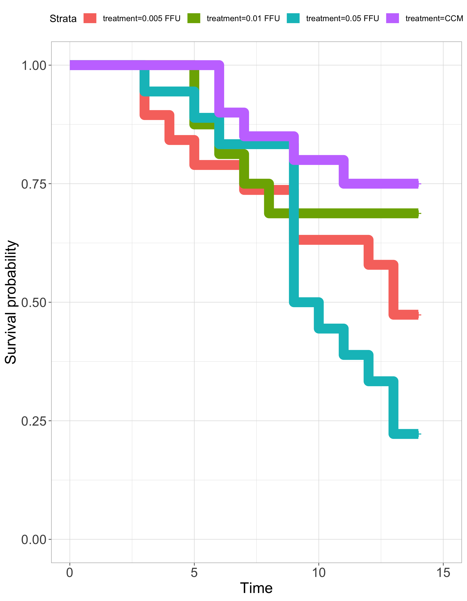
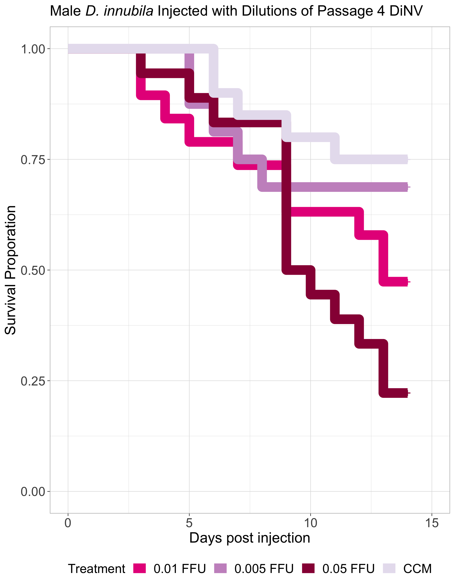

# 20240221-low-dilutions-rep-2-male

Load in packages needed for the analysis

``` r
library("survival")
library("survminer")
```

    Loading required package: ggplot2

    Loading required package: ggpubr


    Attaching package: 'survminer'

    The following object is masked from 'package:survival':

        myeloma

``` r
library(dplyr)
```


    Attaching package: 'dplyr'

    The following objects are masked from 'package:stats':

        filter, lag

    The following objects are masked from 'package:base':

        intersect, setdiff, setequal, union

``` r
library(tidyr)
library(stringr)
```

### Loop to convert the example data.frame ‘df’ into properly formatted data.frame ‘results’

``` r
#write a function to transform a data.frame that has the column format 'vial | treatment | D0 | D1 | D2...', with one row for each vial
#into a long version in tidy format that can be input to make a survivorship curve
convert_df<-function(df){
  #open empty data.frame to store results
  results<-data.frame(vial=character(),treatment=character(),dead=numeric(),status=numeric())
  #This loop will index out each row (one row per vial) one at a time, transform it into long format (one row per fly), and add the information to the empty data.frame called results
  for(i in 1:nrow(df)){
  #isolate the row (vial) you want to work on
  temp<-df[i,]
    #iteratively isolate each day for this vial (day 0 must be column 3, day 1 column 4, etc.). Loop stops the column before the last day
    for(j in 3:(ncol(temp)-1)){
      #assign the number of flies that died in the vial on that day (starting with day 1) to the variable 'z'
      z<-temp[1,j]-temp[1,j+1]
        #if >0 flies died add this information to the results dataframe
        if(z>0){
          #iterate over 1 through total number of dead flies
          for(k in 1:z){
            #add a new row to the 'results' data.frame for the given dead fly, specifying vial #, treatment, day died, and
            #record the current vial #
            vial<-temp[,1]
            #record the genotype of the current vial
            treatment<-temp[,2]
            #record the death date of the flies that died on this day (assumes that your input DF starts with day 0 in column 3)
            dd<-j-2
            #append this information into a new row in the 'results' data.frame, and add a '1' in the 4th column to indicate mortality
            results[nrow(results)+1,]<- c(vial,treatment,dd,1)
          } #close for loop
        } #close if loop
    } #close for loop
  
  #now assign the number of flies remaining in the vial on the last day (value in the last column of the row) to the variable 'z'
  z<-temp[1,j+1]
    #if there are any flies alive in the vial on the last day
    if(z>0){
      #iterate over 1:(number of flies alive on the last day)
      for(l in 1:z){
        #record the current vial #
        vial<-temp[,1]
        #record the genotype of the current vial
        treatment<-temp[,2]
        #record the last day we recorded this fly alive (assumes that your input DF starts with day 0 in column 3)
        dd<-j-2
        #append this information into a new row in the 'results' data.frame, and add a '0' in the 4th column to indicate that the fly made it to the end of the experiment
        results[nrow(results)+1,]<- c(vial,treatment,dd,0)
      } #close for loop
    } #close if loop
  } #close original for loop
results$dead<-as.numeric(results$dead)  #reiterate that this column must be class numeric
results$status<-as.numeric(results$status)  #reiterate that this column must be class numeric
results$vial <- as.factor(results$vial) # make sure vial is considered a factor
# gives you only the results dataframe as output from function 
return(results) 
} #close function
```

Read in raw data

**Note that for these datasets, the adjusted N number is the number of
flies alive on day 2 because there seemed to be more early death in
these experiments than usual**

``` r
#read the file from csv
df<-read.csv("/Users/maggieschedl/Desktop/Github/Unckless_Lab_Resources/Infection_survival_analyses/20240221-low-dilutions-rep-2-male/20240221-male-low-dil-rep2.csv")

# now extra rows, I already separated the females out 
# separate out columns needed
df <- df[,c(1,9,14:28)]
```

Convert dataframe

``` r
df.convert<-convert_df(df)
```

Plot survivial curve with every line separate

``` r
# change to not have confidence intervals in this one so you can see them 
df_fit<- survfit(Surv(dead, status) ~ treatment, data=df.convert)
ggsurvplot(df_fit, size = 5,
          pval = FALSE, conf.int = FALSE,
          font.tickslab = c(14),
          font.x = c(16),
          font.y = c(16),
          ggtheme = theme_light())
```



**Combine Replicates 1 and 2**

``` r
#read the file from csv
df2<-read.csv("/Users/maggieschedl/Desktop/Github/Unckless_Lab_Resources/Infection_survival_analyses/20240221-low-dilutions-rep-2-male/low-dil-male-combo.csv")

# now extra rows, I already separated the females out 
# separate out columns needed
df2 <- df2[,c(1,8,13:27)]
```

Convert dataframe

``` r
df2.convert<-convert_df(df2)
```

Plot survivial curve with every line separate

``` r
# level the treatments so they go in an order 
df2.convert <- df2.convert %>% 
  mutate(treatment = factor(treatment, levels = c("CCM", "0.005 FFU", "0.01 FFU", "0.05 FFU")))
# I'm not sure this worked

# change to not have confidence intervals in this one so you can see them 
# for some reason when I render this plot it does not do the colors in the order I see them in R. I'm not sure why 
df2_fit<- survfit(Surv(dead, status) ~ treatment, data=df2.convert)
ggsurvplot(df_fit, size = 5,
          pval = FALSE, conf.int = FALSE,
          legend = "right",
          font.tickslab = c(14),
          font.x = c(16),
          font.y = c(16),
          ggtheme = theme_light(),
          title = "Male D. innubila Injected with Dilutions of Passage 4 DiNV",
          legend.title="Treatment",
          legend.labs=c(  "0.01 FFU", "0.005 FFU", "0.05 FFU", "CCM"),
          font.legend = c(14),
          palette = c(  "#E7298A","#C994C7", "#980043", "#E7E1EF")) + ylab("Survival Proporation") + xlab("Days post injection")
```



Find median survival time by treatment

``` r
surv_median(df2_fit, combine = FALSE)
```

    Warning: `select_()` was deprecated in dplyr 0.7.0.
    ℹ Please use `select()` instead.
    ℹ The deprecated feature was likely used in the survminer package.
      Please report the issue at <https://github.com/kassambara/survminer/issues>.

                   strata median lower upper
    1       treatment=CCM     NA    NA    NA
    2 treatment=0.005 FFU     NA    14    NA
    3  treatment=0.01 FFU     12    10    NA
    4  treatment=0.05 FFU      9     9    12

Model just looking at significance of block and treatment

``` r
# add in block 
df2.convert$Block <- rep(c("A","B"), c(77, 73))
# model including block 
df3_fit<- coxph(Surv(dead, status) ~ treatment + Block, data=df2.convert)
summary(df3_fit)
```

    Call:
    coxph(formula = Surv(dead, status) ~ treatment + Block, data = df2.convert)

      n= 150, number of events= 72 

                           coef exp(coef) se(coef)      z Pr(>|z|)    
    treatment0.005 FFU  0.80493   2.23654  0.47544  1.693   0.0905 .  
    treatment0.01 FFU   1.14824   3.15265  0.47072  2.439   0.0147 *  
    treatment0.05 FFU   1.82658   6.21258  0.45096  4.050 5.11e-05 ***
    BlockB             -0.03506   0.96555  0.23931 -0.147   0.8835    
    ---
    Signif. codes:  0 '***' 0.001 '**' 0.01 '*' 0.05 '.' 0.1 ' ' 1

                       exp(coef) exp(-coef) lower .95 upper .95
    treatment0.005 FFU    2.2365     0.4471    0.8808     5.679
    treatment0.01 FFU     3.1527     0.3172    1.2531     7.932
    treatment0.05 FFU     6.2126     0.1610    2.5669    15.036
    BlockB                0.9655     1.0357    0.6041     1.543

    Concordance= 0.651  (se = 0.034 )
    Likelihood ratio test= 24.37  on 4 df,   p=7e-05
    Wald test            = 22.33  on 4 df,   p=2e-04
    Score (logrank) test = 25.73  on 4 df,   p=4e-05

Look at model using dilution as a continuous variable

``` r
# make dilution as a numeric/continuous variable
# make a duplicate column 
df2.convert$numeric.dilution <- df2.convert$treatment
# set CCM to a dose of 0
df2.convert$numeric.dilution <- str_replace_all(df2.convert$numeric.dilution, 'CCM', '0')
# remove FFU and make numeric
df2.convert$numeric.dilution <- as.numeric(gsub("FFU", "", df2.convert$numeric.dilution))

# model including block 
df4_fit<- coxph(Surv(dead, status) ~ numeric.dilution + Block, data=df2.convert)
summary(df4_fit)
```

    Call:
    coxph(formula = Surv(dead, status) ~ numeric.dilution + Block, 
        data = df2.convert)

      n= 150, number of events= 72 

                           coef  exp(coef)   se(coef)      z Pr(>|z|)    
    numeric.dilution  2.519e+01  8.709e+10  5.374e+00  4.687 2.77e-06 ***
    BlockB           -9.531e-02  9.091e-01  2.366e-01 -0.403    0.687    
    ---
    Signif. codes:  0 '***' 0.001 '**' 0.01 '*' 0.05 '.' 0.1 ' ' 1

                     exp(coef) exp(-coef) lower .95 upper .95
    numeric.dilution 8.709e+10  1.148e-11 2.320e+06 3.269e+15
    BlockB           9.091e-01  1.100e+00 5.718e-01 1.445e+00

    Concordance= 0.651  (se = 0.034 )
    Likelihood ratio test= 20.12  on 2 df,   p=4e-05
    Wald test            = 21.99  on 2 df,   p=2e-05
    Score (logrank) test = 24.14  on 2 df,   p=6e-06

Only look at 0.05 and 0.01

``` r
df2.convert_51 <- df2.convert[which(df2.convert$numeric.dilution != 0),]
df2.convert_51 <- df2.convert_51[which(df2.convert_51$numeric.dilution != 0.005),]

df5_fit<- coxph(Surv(dead, status) ~ numeric.dilution + Block, data=df2.convert_51)
summary(df5_fit)
```

    Call:
    coxph(formula = Surv(dead, status) ~ numeric.dilution + Block, 
        data = df2.convert_51)

      n= 74, number of events= 48 

                           coef  exp(coef)   se(coef)      z Pr(>|z|)  
    numeric.dilution  1.815e+01  7.655e+07  7.427e+00  2.444   0.0145 *
    BlockB           -4.472e-01  6.394e-01  2.970e-01 -1.506   0.1321  
    ---
    Signif. codes:  0 '***' 0.001 '**' 0.01 '*' 0.05 '.' 0.1 ' ' 1

                     exp(coef) exp(-coef) lower .95 upper .95
    numeric.dilution 7.655e+07  1.306e-08   36.4758 1.607e+14
    BlockB           6.394e-01  1.564e+00    0.3572 1.144e+00

    Concordance= 0.616  (se = 0.05 )
    Likelihood ratio test= 7.83  on 2 df,   p=0.02
    Wald test            = 7.65  on 2 df,   p=0.02
    Score (logrank) test = 7.88  on 2 df,   p=0.02

Only look at and 0.01 and .005

``` r
df2.convert_051 <- df2.convert[which(df2.convert$numeric.dilution != 0),]
df2.convert_051 <- df2.convert_051[which(df2.convert_051$numeric.dilution != 0.050),]

df5_fit<- coxph(Surv(dead, status) ~ numeric.dilution + Block, data=df2.convert_051)
summary(df5_fit)
```

    Call:
    coxph(formula = Surv(dead, status) ~ numeric.dilution + Block, 
        data = df2.convert_051)

      n= 83, number of events= 37 

                           coef  exp(coef)   se(coef)      z Pr(>|z|)
    numeric.dilution  6.472e+01  1.280e+28  6.618e+01  0.978    0.328
    BlockB           -2.731e-02  9.731e-01  3.365e-01 -0.081    0.935

                     exp(coef) exp(-coef) lower .95 upper .95
    numeric.dilution 1.280e+28  7.811e-29 5.920e-29 2.768e+84
    BlockB           9.731e-01  1.028e+00 5.032e-01 1.882e+00

    Concordance= 0.519  (se = 0.047 )
    Likelihood ratio test= 0.96  on 2 df,   p=0.6
    Wald test            = 0.96  on 2 df,   p=0.6
    Score (logrank) test = 0.96  on 2 df,   p=0.6

Only look at and CCM and .005

``` r
df2.convert_05C <- df2.convert[which(df2.convert$numeric.dilution != 0.010),]
df2.convert_05C <- df2.convert_05C[which(df2.convert_05C$numeric.dilution != 0.050),]

df6_fit<- coxph(Surv(dead, status) ~ numeric.dilution + Block, data=df2.convert_05C)
summary(df6_fit)
```

    Call:
    coxph(formula = Surv(dead, status) ~ numeric.dilution + Block, 
        data = df2.convert_05C)

      n= 76, number of events= 24 

                          coef exp(coef)  se(coef)     z Pr(>|z|)  
    numeric.dilution 1.989e+02 2.495e+86 9.631e+01 2.066   0.0389 *
    BlockB           7.813e-01 2.184e+00 4.309e-01 1.813   0.0698 .
    ---
    Signif. codes:  0 '***' 0.001 '**' 0.01 '*' 0.05 '.' 0.1 ' ' 1

                     exp(coef) exp(-coef) lower .95  upper .95
    numeric.dilution 2.495e+86  4.008e-87 2.599e+04 2.396e+168
    BlockB           2.184e+00  4.578e-01 9.387e-01  5.083e+00

    Concordance= 0.642  (se = 0.052 )
    Likelihood ratio test= 6.63  on 2 df,   p=0.04
    Wald test            = 6.29  on 2 df,   p=0.04
    Score (logrank) test = 6.48  on 2 df,   p=0.04
