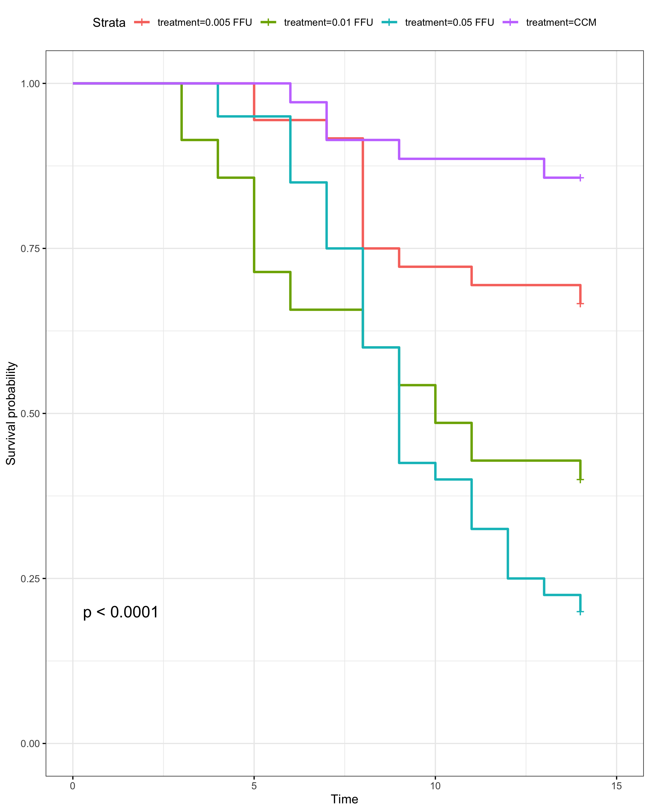
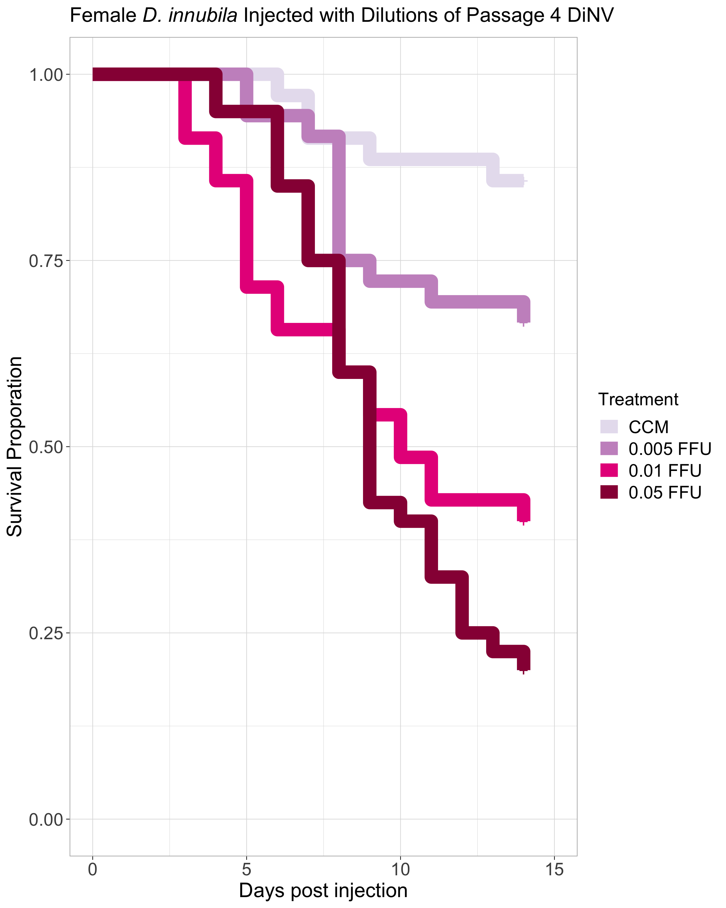

# 20240315-female-low-dilutions-P4

Load in packages needed for the analysis

``` r
library("survival")
library("survminer")
```

    Loading required package: ggplot2

    Loading required package: ggpubr


    Attaching package: 'survminer'

    The following object is masked from 'package:survival':

        myeloma

``` r
library(dplyr)
```


    Attaching package: 'dplyr'

    The following objects are masked from 'package:stats':

        filter, lag

    The following objects are masked from 'package:base':

        intersect, setdiff, setequal, union

``` r
library(tidyr)
library(stringr)
```

### Loop to convert the example data.frame ‘df’ into properly formatted data.frame ‘results’

``` r
#write a function to transform a data.frame that has the column format 'vial | treatment | D0 | D1 | D2...', with one row for each vial
#into a long version in tidy format that can be input to make a survivorship curve
convert_df<-function(df){
  #open empty data.frame to store results
  results<-data.frame(vial=character(),treatment=character(),dead=numeric(),status=numeric())
  #This loop will index out each row (one row per vial) one at a time, transform it into long format (one row per fly), and add the information to the empty data.frame called results
  for(i in 1:nrow(df)){
  #isolate the row (vial) you want to work on
  temp<-df[i,]
    #iteratively isolate each day for this vial (day 0 must be column 3, day 1 column 4, etc.). Loop stops the column before the last day
    for(j in 3:(ncol(temp)-1)){
      #assign the number of flies that died in the vial on that day (starting with day 1) to the variable 'z'
      z<-temp[1,j]-temp[1,j+1]
        #if >0 flies died add this information to the results dataframe
        if(z>0){
          #iterate over 1 through total number of dead flies
          for(k in 1:z){
            #add a new row to the 'results' data.frame for the given dead fly, specifying vial #, treatment, day died, and
            #record the current vial #
            vial<-temp[,1]
            #record the genotype of the current vial
            treatment<-temp[,2]
            #record the death date of the flies that died on this day (assumes that your input DF starts with day 0 in column 3)
            dd<-j-2
            #append this information into a new row in the 'results' data.frame, and add a '1' in the 4th column to indicate mortality
            results[nrow(results)+1,]<- c(vial,treatment,dd,1)
          } #close for loop
        } #close if loop
    } #close for loop
  
  #now assign the number of flies remaining in the vial on the last day (value in the last column of the row) to the variable 'z'
  z<-temp[1,j+1]
    #if there are any flies alive in the vial on the last day
    if(z>0){
      #iterate over 1:(number of flies alive on the last day)
      for(l in 1:z){
        #record the current vial #
        vial<-temp[,1]
        #record the genotype of the current vial
        treatment<-temp[,2]
        #record the last day we recorded this fly alive (assumes that your input DF starts with day 0 in column 3)
        dd<-j-2
        #append this information into a new row in the 'results' data.frame, and add a '0' in the 4th column to indicate that the fly made it to the end of the experiment
        results[nrow(results)+1,]<- c(vial,treatment,dd,0)
      } #close for loop
    } #close if loop
  } #close original for loop
results$dead<-as.numeric(results$dead)  #reiterate that this column must be class numeric
results$status<-as.numeric(results$status)  #reiterate that this column must be class numeric
results$vial <- as.factor(results$vial) # make sure vial is considered a factor
# gives you only the results dataframe as output from function 
return(results) 
} #close function
```

Read in raw data

``` r
#read the file from csv
df<-read.csv("/Users/maggieschedl/Desktop/Github/Unckless_Lab_Resources/Infection_survival_analyses/20240315-combo-female-low-dilutions/combo-female-low-dil-infections.csv")

# separate out columns needed
df<-df[,c(1,9,15:29)]
```

Convert dataframe

``` r
df.convert<-convert_df(df)
```

basic plot

``` r
df_fit<- survfit(Surv(dead, status) ~ treatment, data=df.convert)
ggsurvplot(df_fit,
          pval = TRUE, conf.int = FALSE,
          #risk.table = TRUE, # Add risk table
          #risk.table.col = "strata", # Change risk table color by groups
          #linetype = "strata", # Change line type by groups
          #surv.median.line = "hv", # Specify median survival
          ggtheme = theme_bw()) # Change ggplot2 theme
```



``` r
# level the treatments so they go in an order 
df.convert <- df.convert %>% 
  mutate(treatment = factor(treatment, levels = c("CCM", "0.005 FFU", "0.01 FFU", "0.05 FFU")))

# change to not have confidence intervals in this one so you can see them 
df_fit<- survfit(Surv(dead, status) ~ treatment, data=df.convert)
ggsurvplot(df_fit, size = 5,
          pval = FALSE, conf.int = FALSE,
          legend = "right",
          font.tickslab = c(14),
          font.x = c(16),
          font.y = c(16),
          ggtheme = theme_light(),
          title = "Female D. innubila Injected with Dilutions of Passage 4 DiNV",
          legend.title="Treatment",
          legend.labs=c("CCM", "0.005 FFU", "0.01 FFU", "0.05 FFU"),
          font.legend = c(14),
          palette = c("#E7E1EF", "#C994C7", "#E7298A", "#980043")) + ylab("Survival Proporation") + xlab("Days post injection")
```



Find median survival time by treatment

``` r
surv_median(df_fit, combine = FALSE)
```

    Warning: `select_()` was deprecated in dplyr 0.7.0.
    ℹ Please use `select()` instead.
    ℹ The deprecated feature was likely used in the survminer package.
      Please report the issue at <https://github.com/kassambara/survminer/issues>.

                   strata median lower upper
    1       treatment=CCM     NA    NA    NA
    2 treatment=0.005 FFU     NA    NA    NA
    3  treatment=0.01 FFU     10     8    NA
    4  treatment=0.05 FFU      9     8    12

Model just looking at significance of block and treatment

``` r
# add in block 
df.convert$Block <- rep(c("A","B"), c(72, 74))
# model including block 
df2_fit<- coxph(Surv(dead, status) ~ treatment + Block, data=df.convert)
summary(df2_fit)
```

    Call:
    coxph(formula = Surv(dead, status) ~ treatment + Block, data = df.convert)

      n= 146, number of events= 70 

                         coef exp(coef) se(coef)     z Pr(>|z|)    
    treatment0.005 FFU 0.9878    2.6853   0.5326 1.855 0.063625 .  
    treatment0.01 FFU  1.8815    6.5633   0.4983 3.776 0.000159 ***
    treatment0.05 FFU  2.1778    8.8267   0.4834 4.505 6.65e-06 ***
    BlockB             0.2388    1.2698   0.2401 0.995 0.319764    
    ---
    Signif. codes:  0 '***' 0.001 '**' 0.01 '*' 0.05 '.' 0.1 ' ' 1

                       exp(coef) exp(-coef) lower .95 upper .95
    treatment0.005 FFU     2.685     0.3724    0.9455     7.626
    treatment0.01 FFU      6.563     0.1524    2.4717    17.428
    treatment0.05 FFU      8.827     0.1133    3.4221    22.767
    BlockB                 1.270     0.7875    0.7932     2.033

    Concordance= 0.694  (se = 0.029 )
    Likelihood ratio test= 37.95  on 4 df,   p=1e-07
    Wald test            = 28.84  on 4 df,   p=8e-06
    Score (logrank) test = 36.2  on 4 df,   p=3e-07
