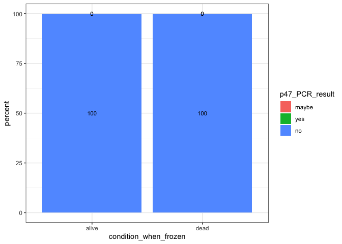

Infection-PCR-Alive-Dead-Results-Analysis
================
2023-03-27

Save your R markdown document in the same folder on your computer where
you will put the spreadsheet. This should be a folder for just this
analysis.

Load in packages needed

``` r
library(ggplot2)
library(dplyr)
```

    ## 
    ## Attaching package: 'dplyr'

    ## The following objects are masked from 'package:stats':
    ## 
    ##     filter, lag

    ## The following objects are masked from 'package:base':
    ## 
    ##     intersect, setdiff, setequal, union

The process for making the percentage graphs is very similar to making
the PCR results graphs.

First you will download and input the data for this process. Download
the “datasheet with treatment info” tab in this document again as a csv
file:
<https://docs.google.com/spreadsheets/d/1Kg863kyNMu37U_wI46kjYXtnXs2pncHTuuwqeX-f_wo/edit#gid=995836122>
it now has the information on whether flies were alive or dead when
frozen for the experiment.

Save that as “20221015-DiNV-infections-mortality-PCR-info.csv”

Read in your dataset

``` r
# make sure you use the full path to your file 
# look at old R scrips to remind you how to do the path 
# the path will be different for a Windows computer 

raw_Mort_PCR_data <- read.csv("~/Desktop/Github/Unckless_Lab_Resources/Mentoring_Resources/R_scripts_Learning_R_and_Stats/20221015-DiNV-infections-mortality-PCR-info.csv")

# check your dataset to make sure it looks right 
head(raw_Mort_PCR_data)
```

    ##   tube_number Extraction_date Extraced_by CO1_PCR_date p47_PCR_date
    ## 1           1       2/25/2023        Huan     3/3/2023     3/3/2023
    ## 2           2       1/19/2023        Huan    1/27/2023    1/28/2023
    ## 3           3      12/18/2022        Huan   12/27/2022   12/29/2022
    ## 4           4       2/25/2023        Huan     3/3/2023     3/3/2023
    ## 5           5        3/5/2023        Huan     3/6/2023     3/6/2023
    ## 6           6       2/25/2023        Huan     3/3/2023     3/3/2023
    ##   CO1_PCR_Results p47_PCR_results treatment.abrev alive_when_frozen
    ## 1             yes             yes             CCM               yes
    ## 2             yes              no             CCM               yes
    ## 3             yes              no             CCM               yes
    ## 4             yes           maybe            DiNV               yes
    ## 5             yes           maybe            DiNV               yes
    ## 6             yes             yes            DiNV               yes

Separate out dataframes for CCM, NP (no poke) and DiNV treatments

``` r
CCM_data <- subset(raw_Mort_PCR_data, treatment.abrev == "CCM")
#check subsetted data 
head(CCM_data)
```

    ##    tube_number Extraction_date Extraced_by CO1_PCR_date p47_PCR_date
    ## 1            1       2/25/2023        Huan     3/3/2023     3/3/2023
    ## 2            2       1/19/2023        Huan    1/27/2023    1/28/2023
    ## 3            3      12/18/2022        Huan   12/27/2022   12/29/2022
    ## 10          10       1/19/2023        Huan    1/27/2023    1/28/2023
    ## 15          15       2/25/2023        Huan     3/3/2023     3/3/2023
    ## 28          28       2/25/2023        Huan     3/3/2023     3/3/2023
    ##    CO1_PCR_Results p47_PCR_results treatment.abrev alive_when_frozen
    ## 1              yes             yes             CCM               yes
    ## 2              yes              no             CCM               yes
    ## 3              yes              no             CCM               yes
    ## 10             yes              no             CCM                no
    ## 15              no              no             CCM                no
    ## 28             yes              no             CCM               yes

``` r
# do the same for NP and DiNV
```

Look at the CCM dataframe. We want to calculate how many p47 yes, no,
and maybes there are, by whether they are alive or dead when frozen.
This can be done easier by splitting the CCM dataframe into yes and no
alive first

``` r
# separate out all alive when frozen
CCM_alive_data <- subset(CCM_data, alive_when_frozen == "yes")
print(CCM_alive_data)
```

    ##     tube_number Extraction_date Extraced_by CO1_PCR_date p47_PCR_date
    ## 1             1       2/25/2023        Huan     3/3/2023     3/3/2023
    ## 2             2       1/19/2023        Huan    1/27/2023    1/28/2023
    ## 3             3      12/18/2022        Huan   12/27/2022   12/29/2022
    ## 28           28       2/25/2023        Huan     3/3/2023     3/3/2023
    ## 29           29        3/5/2023        Huan     3/6/2023     3/6/2023
    ## 30           30       1/21/2023        Huan    2/18/2023    2/19/2023
    ## 31           31       1/21/2023        Huan    2/18/2023    2/19/2023
    ## 32           32        3/5/2023        Huan     3/6/2023     3/6/2023
    ## 33           33       1/21/2023        Huan    2/18/2023    2/19/2023
    ## 34           34        1/7/2023        Huan     1/8/2023    1/12/2023
    ## 35           35       2/25/2023        Huan     3/3/2023     3/3/2023
    ## 78           78       1/19/2023        Huan    1/27/2023    1/28/2023
    ## 79           79        3/5/2023        Huan     3/6/2023     3/6/2023
    ## 80           80        1/7/2023        Huan     1/8/2023    1/12/2023
    ## 81           81      12/18/2022        Huan   12/27/2022   12/29/2022
    ## 82           82        1/7/2023        Huan     1/8/2023    1/12/2023
    ## 83           83       2/25/2023        Huan     3/3/2023     3/3/2023
    ## 84           84        1/7/2023        Huan     1/8/2023    1/12/2023
    ## 85           85        1/7/2023        Huan     1/8/2023    1/12/2023
    ## 86           86       2/25/2023        Huan     3/3/2023     3/3/2023
    ## 87           87      12/18/2022        Huan   12/27/2022   12/29/2022
    ## 106         106       2/25/2023        Huan     3/3/2023     3/3/2023
    ## 107         107            1/19        Huan    1/27/2023    1/28/2023
    ## 108         108       1/19/2023        Huan    1/27/2023    1/28/2023
    ## 109         109      12/18/2022        Huan   12/27/2022   12/29/2022
    ## 110         110       1/19/2023        Huan    1/27/2023    1/28/2023
    ## 111         111       1/21/2023        Huan    2/18/2023    2/19/2023
    ## 112         112       1/21/2023        Huan    2/18/2023    2/19/2023
    ## 113         113       1/19/2023        Huan    1/27/2023    1/28/2023
    ## 114         114       1/21/2023        Huan    2/18/2023    2/19/2023
    ##     CO1_PCR_Results p47_PCR_results treatment.abrev alive_when_frozen
    ## 1               yes             yes             CCM               yes
    ## 2               yes              no             CCM               yes
    ## 3               yes              no             CCM               yes
    ## 28              yes              no             CCM               yes
    ## 29              yes           maybe             CCM               yes
    ## 30              yes              no             CCM               yes
    ## 31              yes              no             CCM               yes
    ## 32              yes              no             CCM               yes
    ## 33              yes              no             CCM               yes
    ## 34               no              no             CCM               yes
    ## 35              yes             yes             CCM               yes
    ## 78              yes              no             CCM               yes
    ## 79            maybe           maybe             CCM               yes
    ## 80              yes              no             CCM               yes
    ## 81              yes              no             CCM               yes
    ## 82               no              no             CCM               yes
    ## 83              yes             yes             CCM               yes
    ## 84              yes              no             CCM               yes
    ## 85              yes              no             CCM               yes
    ## 86              yes             yes             CCM               yes
    ## 87              yes              no             CCM               yes
    ## 106             yes             yes             CCM               yes
    ## 107              no              no             CCM               yes
    ## 108             yes              no             CCM               yes
    ## 109             yes              no             CCM               yes
    ## 110             yes              no             CCM               yes
    ## 111             yes              no             CCM               yes
    ## 112             yes              no             CCM               yes
    ## 113             yes              no             CCM               yes
    ## 114             yes              no             CCM               yes

``` r
# how many rows are there? 
nrow(CCM_alive_data)
```

    ## [1] 30

``` r
# remember this number 

# separate out all dead when frozen 
CCM_dead_data <- subset(CCM_data, alive_when_frozen == "no")
print(CCM_dead_data)
```

    ##    tube_number Extraction_date Extraced_by CO1_PCR_date p47_PCR_date
    ## 10          10       1/19/2023        Huan    1/27/2023    1/28/2023
    ## 15          15       2/25/2023        Huan     3/3/2023     3/3/2023
    ## 36          36       1/21/2023        Huan    2/18/2023    2/19/2023
    ##    CO1_PCR_Results p47_PCR_results treatment.abrev alive_when_frozen
    ## 10             yes              no             CCM                no
    ## 15              no              no             CCM                no
    ## 36             yes              no             CCM                no

``` r
# how many rows are there? 
nrow(CCM_dead_data)
```

    ## [1] 3

``` r
# remember this number

# Now to count up the numbers 
# it can be easier to count the numbers of yes, no, and maybes by clicking on the name of the dataframe 
# in the environment section on the top right of R studio
# then it will bring you into a new window with the full dataframe which is easier to look at 

#again you only want to look at the the p47 PCR info here
# count the number of yeses for the p47 primer for the alive and put that number in the CCM_Mort_data sheet in this spreadsheet https://docs.google.com/spreadsheets/d/1Kg863kyNMu37U_wI46kjYXtnXs2pncHTuuwqeX-f_wo/edit#gid=1987650703
# repeat for the nos and maybes. And repeat for the yes, no, and maybes for the dead datasheet
# put all that information in the CCM_Mort_data spreadsheet, then calculate the percentage
# Divide the number in each row by the number of rows calculated above, and multiply it by 100 
# this will get you the percent PCR result for each result for either alive or dead 
# then reduce the number of significant figures to 1 (ex. 16.5) so that it will be cleaner
```

Do this same calculations of percentages for the NP and DiNV treatment
data subsets. These datasets are ready in the other tabs in the same
Google Sheets file

Now you want to download those three spreadsheets separately as csv
files, name them as CCM_Mort_data.csv, NP_Mort_data.csv, and
DiNV_Mort_data.csv, save them in your folder, and load them into R

``` r
# read in your CCM data file
CCM_M_data <- read.csv("~/Desktop/Github/Unckless_Lab_Resources/Mentoring_Resources/R_scripts_Learning_R_and_Stats/Extraction_spreadsheet_for_20220q015_infections_percent_alive_R.csv")

# check dataframe
head(CCM_M_data)
```

    ##   condition_when_frozen p47_PCR_result percent
    ## 1                 alive             no     100
    ## 2                 alive            yes       0
    ## 3                 alive          maybe       0
    ## 4                  dead             no     100
    ## 5                  dead            yes       0
    ## 6                  dead          maybe       0

``` r
# to make plotting make sense, we want to add "levels" to the PCR results 
# first order the results 
results_factor_levels <- c("maybe", "yes", "no")
# then apply this to the CCM data
CCM_M_data$p47_PCR_result <- factor(CCM_M_data$p47_PCR_result, levels=results_factor_levels)
```

Now we can plot the percentages for each primer using ggbar plot,
starting with the CCM data

``` r
# ggbarplot with the percentage numbers on the bars 
# use CCM_data as the input, for the aesthetics, the x axis will show which primer was used 
# the y axis should be the percentage 
# the fill of the bars will be by the PCR result (either yes, no, or maybe)
# and you want the label to be percentage so that it will label each part of the bar with the actual percent value
# you can change the text size if you want 
# the position_stack(vjust = 0.5) puts the text of the percentage in the middle of the bar and stacks the bars
ggplot(CCM_M_data, aes(x = condition_when_frozen, y = percent, fill = p47_PCR_result, label = percent)) +
    geom_bar(stat = "identity") + geom_text(size = 3, position = position_stack(vjust = 0.5)) + theme_bw()
```

<!-- -->

Now do the same thing for the NP data and the DiNV data. Load in the
datasets, check them, and re-level the results. Then plot them using
geom_bar.
