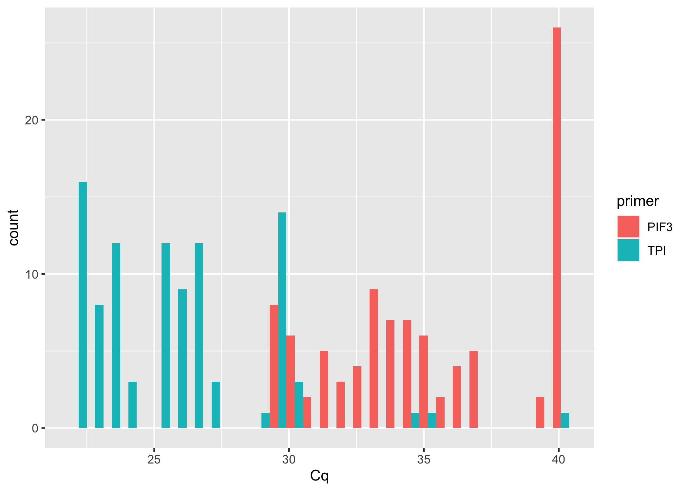
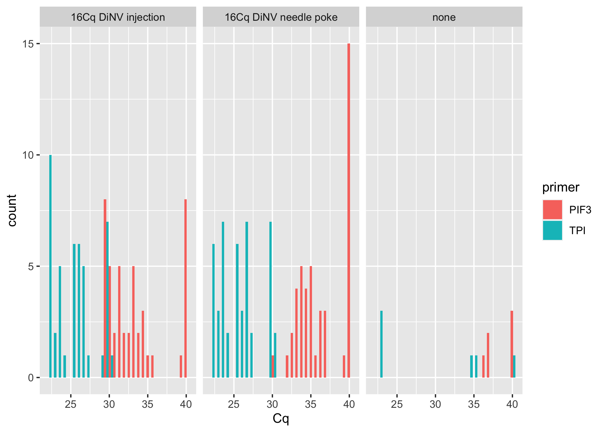
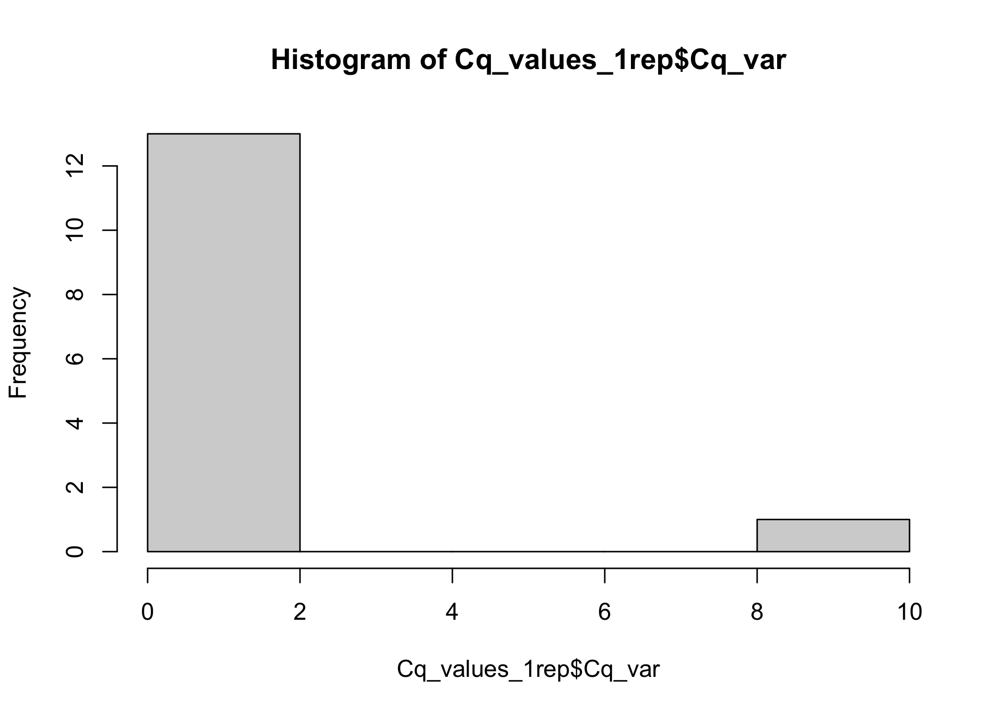
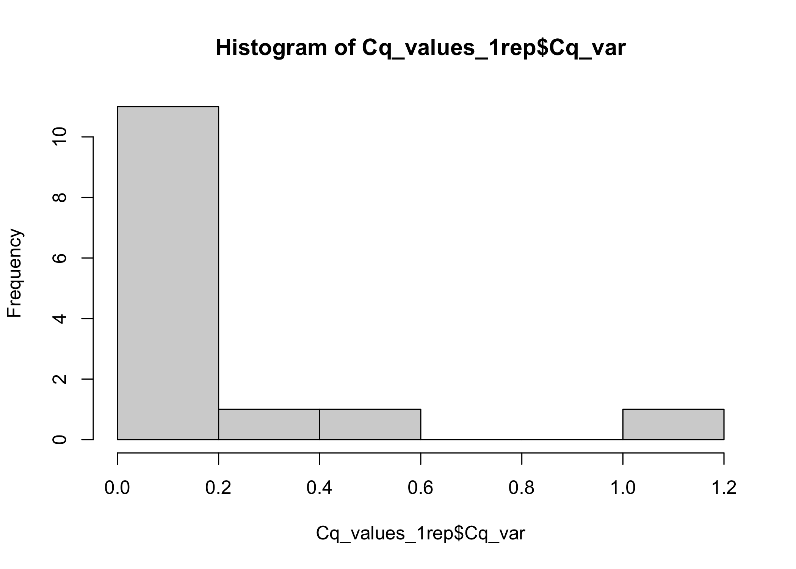
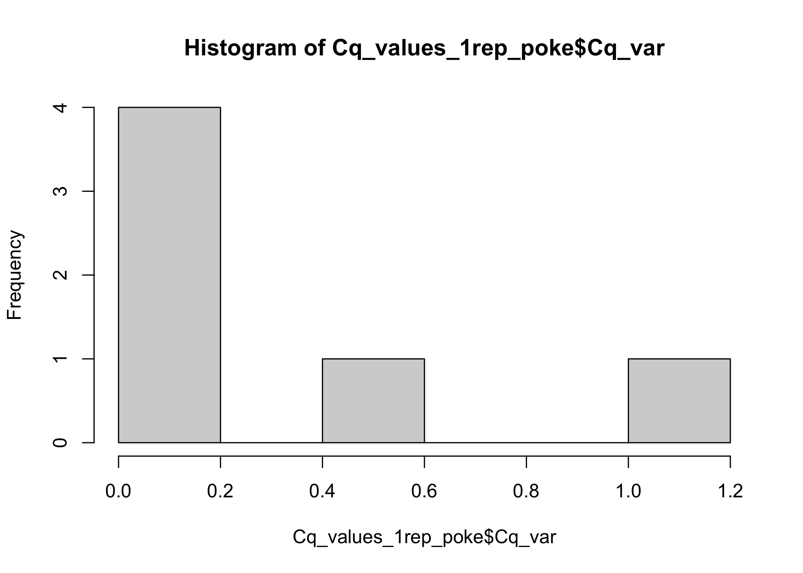
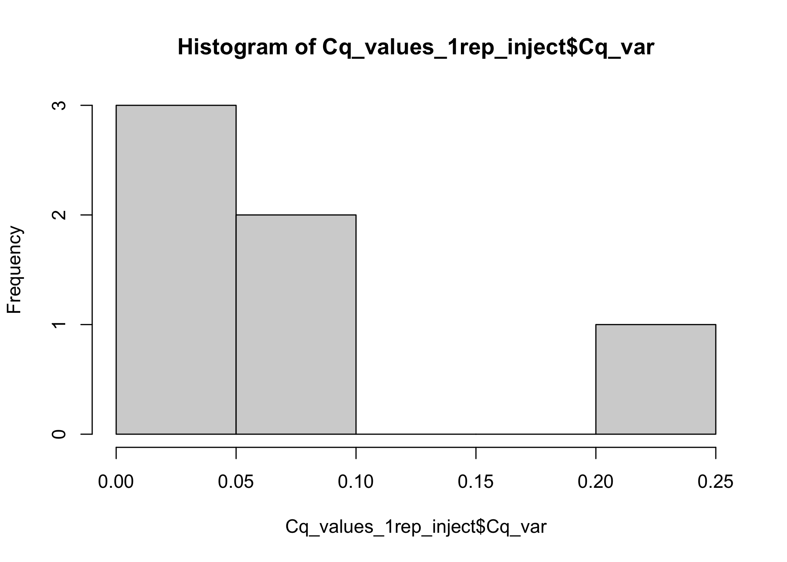
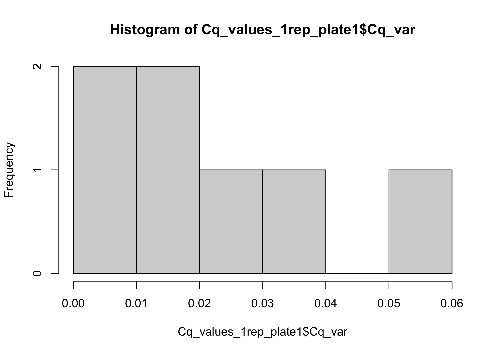
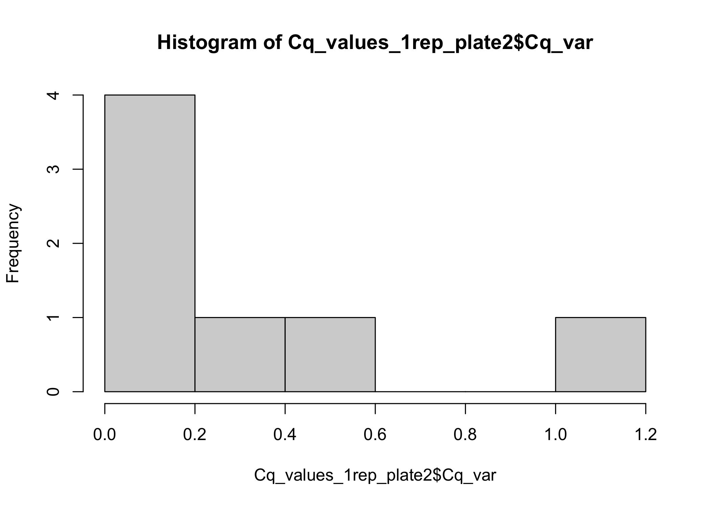
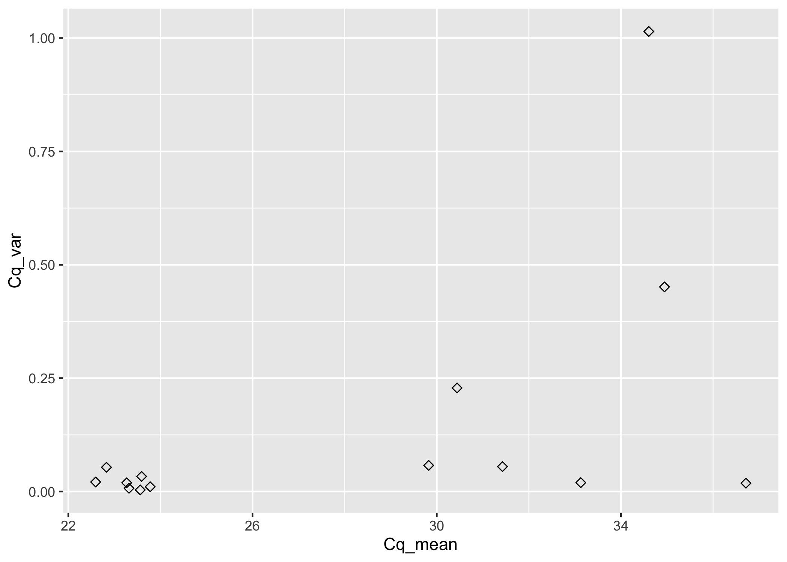
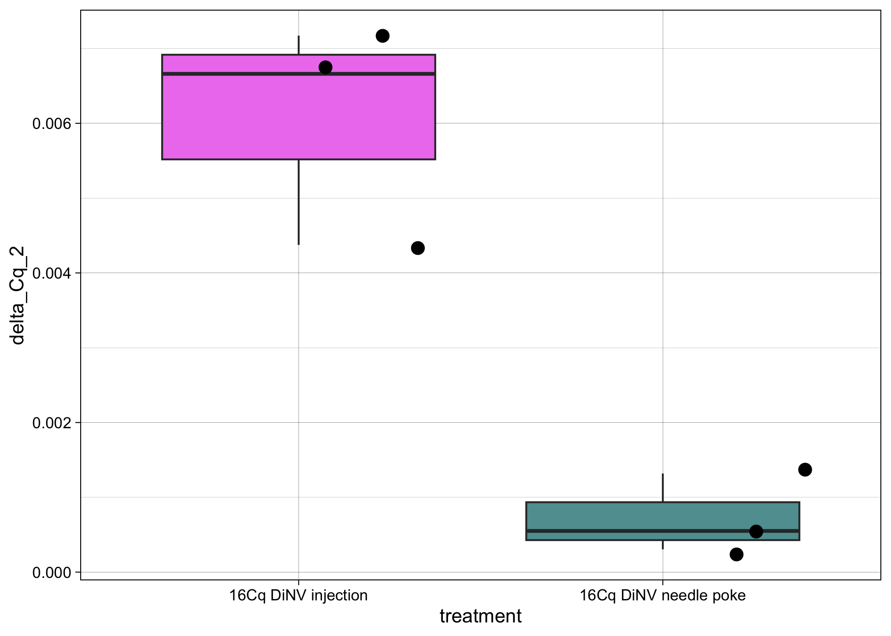

# qPCR analysis training

Load packages needed

``` r
library(ggplot2)
library(dplyr)
```


    Attaching package: 'dplyr'

    The following objects are masked from 'package:stats':

        filter, lag

    The following objects are masked from 'package:base':

        intersect, setdiff, setequal, union

``` r
library(tidyr)
```

Load in dataset

Expectation is that your dataset looks something like this, notice here
that there is a column that specifically says unique_name. This column
will help out in the analysis downstream. The column should include
something that will separate out your samples between the primers, in
this example it shows sample 6-TPI, because this row contains only the
data for sample 6 for TPI.

| well | plate | tube number | treatment             | other_sample_information | unique_name | replicate | primer | Cq    |
|------|-------|-------------|-----------------------|--------------------------|-------------|-----------|--------|-------|
| A01  | 1     | 6           | 16Cq DiNV needle poke |                          | 6-TPI       | 1         | TPI    | 23.42 |
| A02  | 1     | 6           | 16Cq DiNV needle poke |                          | 6-TPI       | 2         | TPI    | 23.23 |
| A03  | 1     | 6           | 16Cq DiNV needle poke |                          | 6-TPI       | 3         | TPI    | 23.15 |
| A04  | 1     | 8           | 16Cq DiNV needle poke |                          | 8-TPI       | 1         | TPI    | 26.43 |
| A05  | 1     | 8           | 16Cq DiNV needle poke |                          | 8-TPI       | 2         | TPI    | 26.47 |
| A06  | 1     | 8           | 16Cq DiNV needle poke |                          | 8-TPI       | 3         | TPI    | 26.59 |
| A07  | 1     | 9           | 16Cq DiNV needle poke |                          | 9-TPI       | 1         | TPI    | 29.66 |

``` r
Cq_values <- read.csv("/Users/maggieschedl/Desktop/Github/Unckless_Lab_Resources/qPCR_analysis/20230928-poke-vs-inject-16Cq-dilutions/poke-inject-dil-sheet_40s.csv")
head(Cq_values)
```

      well plate well.code tube.number             treatment dilution
    1  A01     1     6 1ng           6 16Cq DiNV needle poke      1ng
    2  A02     1     6 1ng           6 16Cq DiNV needle poke      1ng
    3  A03     1     6 1ng           6 16Cq DiNV needle poke      1ng
    4  A04     1   6 0.1ng           6 16Cq DiNV needle poke    0.1ng
    5  A05     1   6 0.1ng           6 16Cq DiNV needle poke    0.1ng
    6  A06     1   6 0.1ng           6 16Cq DiNV needle poke    0.1ng
       dilution.long unique.name replicate primer    Cq
    1      1nanogram   6-1ng-TPI         1    TPI 23.42
    2      1nanogram   6-1ng-TPI         2    TPI 23.23
    3      1nanogram   6-1ng-TPI         3    TPI 23.15
    4 point1nanogram 6-0.1ng-TPI         1    TPI 26.43
    5 point1nanogram 6-0.1ng-TPI         2    TPI 26.47
    6 point1nanogram 6-0.1ng-TPI         3    TPI 26.59

First thing to do is look at raw Cq values in a histogram

``` r
# plot raw Cqs, x is the Cq column, and the fill or color is by the primer type 
ggplot(Cq_values, aes(x= Cq, fill = primer)) + geom_histogram(position = "dodge")  
```

    `stat_bin()` using `bins = 30`. Pick better value with `binwidth`.



``` r
# if you want to also include another varaible to separate out the histogram by, you can include a facet 
ggplot(Cq_values, aes(x= Cq, fill = primer)) + geom_histogram(position = "dodge") + facet_grid(~treatment) 
```

    `stat_bin()` using `bins = 30`. Pick better value with `binwidth`.



With these you can look at general patterns in your data, and see if
there are any samples that look obviously different than others.

Because each sample gets 3 technical replicates for each primer, we want
to average the Cq values between the replicates. However we first want
to check to see how variable the values are between technical
replicates. If you are doing the same PCR reaction on the same amount of
sample 3 times, there really shouldn’t be any difference in the Cq
value. But often times there is a difference, and it is ok if it is
small, but large variations can be an indication of an issue or
unreliable data.

Calculate the variances in Cq and the mean Cq between the qPCR
replicates

``` r
# for this example dataset we will only be going through the 1ng diluted samples
Cq_values <- Cq_values[which(Cq_values$dilution == "1ng"),]
# and because this removed some rows, we want to re-set the row numbers to be in order again
rownames(Cq_values) = NULL

# calculate variances in Cq value 
# use the variance function, and calculates the variance in Cq by the unique.name (each sample/primer has 3 Cq values to 
# calculate the variance by)
Cq_values$Cq_var <- ave(Cq_values$Cq, Cq_values$unique.name, FUN=var)
# this adds a column with the variances, however because there are 3 replicates for each sample/dilution, 
# there are all three columns retained. We want to keep those right now for calculating the mean Cq

# calculate mean in Cq value
# use the mean function, and calculates the mean of Cq values by the unique.name (each sample/primer has 3 Cq values to 
# calculate the mean by)
Cq_values$Cq_mean <- ave(Cq_values$Cq, Cq_values$unique.name, FUN=mean)

# but retained are 3 rows for every sample, and if we already averaged over them, the other two rows per sample are not necessary
# Keep all rows where the replicate is 1 (or you could do 2 or 3)
# make into new Df so we keep the original with all the Cq values
Cq_values_1rep <- Cq_values[which(Cq_values$replicate == "1"),]

# histogram of all variances
hist(Cq_values_1rep$Cq_var)
```



``` r
# most are pretty low, and one sample is really high
# we probably want to remove the sample with the really high variance, or remove one of the technical replicates 
Cq_values[which(Cq_values$Cq_var >2),]
```

       well plate well.code tube.number             treatment dilution
    22  A01     2     6 1ng           6 16Cq DiNV needle poke      1ng
    23  A02     2     6 1ng           6 16Cq DiNV needle poke      1ng
    24  A03     2     6 1ng           6 16Cq DiNV needle poke      1ng
       dilution.long unique.name replicate primer    Cq Cq_var Cq_mean
    22     1nanogram   6-1ng-pif         1   PIF3 40.00 8.7433   36.63
    23     1nanogram   6-1ng-pif         2   PIF3 34.47 8.7433   36.63
    24     1nanogram   6-1ng-pif         3   PIF3 35.42 8.7433   36.63

``` r
# this prints a table where we can see in the Cq column, that one replicate out of the others is a lot different
# we can remove that replicate and see if the variances go down 
# we see that the row this sample is in is 22, and the total number of rows is 42
# tell R to make Cq_values (original dataset) everything but row 22
Cq_values <- Cq_values[c(1:21, 23:42),]

# the you need to calculate the variances and means again 

# calculate variances in Cq value 
# use the variance function, and calculates the variance in Cq by the unique.name (each sample/primer has 3 Cq values to 
# calculate the variance by)
Cq_values$Cq_var <- ave(Cq_values$Cq, Cq_values$unique.name, FUN=var)
# this adds a column with the variances, however because there are 3 replicates for each sample/dilution, 
# there are all three columns retained. We want to keep those right now for calculating the mean Cq

# calculate mean in Cq value
# use the mean function, and calculates the mean of Cq values by the unique.name (each sample/primer has 3 Cq values to 
# calculate the mean by)
Cq_values$Cq_mean <- ave(Cq_values$Cq, Cq_values$unique.name, FUN=mean)

# but retained are 3 rows for every sample, and if we already averaged over them, the other two rows per sample are not necessary
# Keep all rows where the replicate is# 2 (we can't do replicate 1 because I removed the replicate 1 for sample 6 PIF3)
# make into new Df so we keep the original with all the Cq values
Cq_values_1rep <- Cq_values[which(Cq_values$replicate == "2"),]

# histogram of all variances
hist(Cq_values_1rep$Cq_var)
```



``` r
# again we can see there is an outlier 
Cq_values[which(Cq_values$Cq_var >1),]
```

       well plate well.code tube.number             treatment dilution
    25  B04     2     8 1ng           8 16Cq DiNV needle poke      1ng
    26  B05     2     8 1ng           8 16Cq DiNV needle poke      1ng
    27  B06     2     8 1ng           8 16Cq DiNV needle poke      1ng
       dilution.long unique.name replicate primer    Cq   Cq_var  Cq_mean
    25     1nanogram   8-1ng-pif         1   PIF3 35.76 1.014433 34.60333
    26     1nanogram   8-1ng-pif         2   PIF3 33.92 1.014433 34.60333
    27     1nanogram   8-1ng-pif         3   PIF3 34.13 1.014433 34.60333

``` r
# when we do this and look at the Cq values, we see that there isn't an obvious sample to remove, the Cq values 
# for now we will keep this sample in the analysis
# but a sample like this would be something you would bring up with Rob and see if you should remove it or not from the analysis
```

You can also separate out your treatments, to see if there is a
treatment effect on the variance in Cq values

``` r
# is there a difference in variance between the two treatments?
# just poke
Cq_values_1rep_poke <- Cq_values_1rep[which(Cq_values_1rep$treatment == "16Cq DiNV needle poke"),]
# just inject
Cq_values_1rep_inject <- Cq_values_1rep[which(Cq_values_1rep$treatment == "16Cq DiNV injection"),]

# histogram of poke variances
hist(Cq_values_1rep_poke$Cq_var)
```



``` r
# histogram of inject variances
hist(Cq_values_1rep_inject$Cq_var)
```



``` r
# in this example, there seems to be slightly more variance in Cq value in replicate in the poked samples, than the injected samples
# but the difference is small 

# You can also check between plates, in this example half my samples were run on 1 plate, the other half on another
# separate out plate 1
Cq_values_1rep_plate1 <- Cq_values_1rep[which(Cq_values_1rep$plate == "1"),]
# separate out plate 2
Cq_values_1rep_plate2 <- Cq_values_1rep[which(Cq_values_1rep$plate == "2"),]

# histogram of plate1 variances
hist(Cq_values_1rep_plate1$Cq_var)
```



``` r
# histogram of plate 2 variances
hist(Cq_values_1rep_plate2$Cq_var)
```



``` r
#You can see here that there is a kind of large effect of which plate the samples were run on, the largest variance 
# for plate 1 was 0.06, but the largest for plate 2 1.2, with others at 0.6
```

Another way to explore your data is to look at how the mean Cq value and
the variance in the Cq values compare to each other

``` r
ggplot(Cq_values_1rep, aes(x=Cq_mean, y=Cq_var)) +
  geom_point(size=2, shape=23)
```



In this polt you can really only see that one outlier sample, and all
others have low variance at any Cq value. What we have seen in other
experiments is that at the higher Cq values (close to 40) the variance
increases, and we think that is because of the machine’s ability to
quantify the higher Cqs might not be as accurate.

Now that you have explored your data, we move on to analyze in it by
calculating the delta Cq. This is the difference in Cq value between
your control primer and your experimental primer. In this case, the
control primer is TPI, and the experimental primer is PIF3.

``` r
# currently the samples are not ordered by the sample, but by the plate, so I need each sample one right after the other
# alternating primers for this analysis to work 
head(Cq_values_1rep)
```

       well plate well.code tube.number             treatment dilution
    2   A02     1     6 1ng           6 16Cq DiNV needle poke      1ng
    5   B05     1     8 1ng           8 16Cq DiNV needle poke      1ng
    8   C08     1    14 1ng          14 16Cq DiNV needle poke      1ng
    11  D11     1    17 1ng          17   16Cq DiNV injection      1ng
    14  F02     1    22 1ng          22   16Cq DiNV injection      1ng
    17  G05     1    24 1ng          24   16Cq DiNV injection      1ng
       dilution.long unique.name replicate primer    Cq      Cq_var  Cq_mean
    2      1nanogram   6-1ng-TPI         2    TPI 23.23 0.019233333 23.26667
    5      1nanogram   8-1ng-TPI         2    TPI 23.69 0.010533333 23.77667
    8      1nanogram  14-1ng-TPI         2    TPI 23.56 0.003600000 23.56000
    11     1nanogram  17-1ng-TPI         2    TPI 22.59 0.021033333 22.59333
    14     1nanogram  22-1ng-TPI         2    TPI 23.32 0.007233333 23.31667
    17     1nanogram  24-1ng-TPI         2    TPI 23.47 0.033300000 23.59000

``` r
# I can order them by well code
Cq_values_1rep <- Cq_values_1rep[order(Cq_values_1rep$well.code),]
# check how it looks
head(Cq_values_1rep)
```

       well plate well.code tube.number             treatment dilution
    8   C08     1    14 1ng          14 16Cq DiNV needle poke      1ng
    29  C08     2    14 1ng          14 16Cq DiNV needle poke      1ng
    11  D11     1    17 1ng          17   16Cq DiNV injection      1ng
    32  D11     2    17 1ng          17   16Cq DiNV injection      1ng
    14  F02     1    22 1ng          22   16Cq DiNV injection      1ng
    35  F02     2    22 1ng          22   16Cq DiNV injection      1ng
       dilution.long unique.name replicate primer    Cq      Cq_var  Cq_mean
    8      1nanogram  14-1ng-TPI         2    TPI 23.56 0.003600000 23.56000
    29     1nanogram  14-1ng-pif         2   PIF3 32.97 0.019633333 33.12667
    11     1nanogram  17-1ng-TPI         2    TPI 22.59 0.021033333 22.59333
    32     1nanogram  17-1ng-pif         2   PIF3 30.03 0.057633333 29.82333
    14     1nanogram  22-1ng-TPI         2    TPI 23.32 0.007233333 23.31667
    35     1nanogram  22-1ng-pif         2   PIF3 30.54 0.228400000 30.44000

``` r
# here for each sample, there is the TPI Cq then the PIF3 Cq in order

# In this example dataset I want to remove the control sample right now for this analysis
Cq_values_1rep <- Cq_values_1rep[which(Cq_values_1rep$treatment != "none"),]

# How to separate out the Cq mean values from the two primers?
# how many rows are there in the dataframe?
nrow(Cq_values_1rep)
```

    [1] 12

``` r
# Separate that dataframe, incriminating by 2, every number between 1-12 (number of rows in dataframe)
Cq_values_1rep$Cq_mean[seq(1,12,2)] # these are the TPI Cq means 
```

    [1] 23.56000 22.59333 23.31667 23.59000 23.26667 23.77667

``` r
Cq_values_1rep$Cq_mean[seq(2,12,2)] # these are the PIF 3 primer Cq means 
```

    [1] 33.12667 29.82333 30.44000 31.42667 34.94500 34.60333

``` r
# make the delta Cq by subtracting the PIF 3 values from the TPI primer values
# and this is saved as a vector in R 
delta_Cqs <- Cq_values_1rep$Cq_mean[seq(1,12,2)] - Cq_values_1rep$Cq_mean[seq(2,12,2)]

delta_Cqs
```

    [1]  -9.566667  -7.230000  -7.123333  -7.836667 -11.678333 -10.826667

``` r
# You want to add the delta as a column to our df, but first need to remove one of the primer rows
# Keep only rows that are PIF3
Cq_values1rep_Delta <- Cq_values_1rep[which(Cq_values_1rep$primer == "PIF3"),]
# And then add in the delta Cqs as a new column
Cq_values1rep_Delta$delta_Cq <- delta_Cqs

# An we usually look at delta Cq as 2^delta Cq as a way to transform the data 
# The 2^deltaCq represents a relative copy number of virus genome to fly genome
# It is easier to plot that way, and you won't get any negative values
Cq_values1rep_Delta$delta_Cq_2 <- 2^(delta_Cqs)

#Plot by treatment or whatever conditions you are comparing 

ggplot(Cq_values1rep_Delta, aes(y= delta_Cq_2, x=treatment, fill=treatment)) + geom_boxplot()  + theme_linedraw() + geom_point(position="jitter", size=3) + scale_fill_manual(values = c('violet', 'cadetblue')) + theme(legend.position = "none")
```


