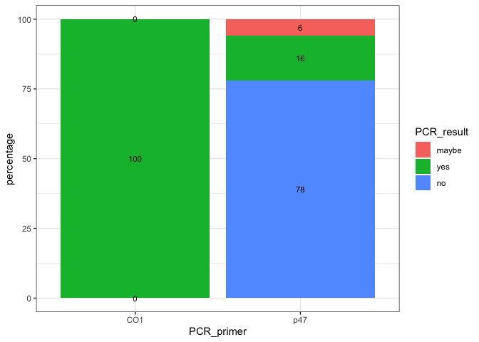
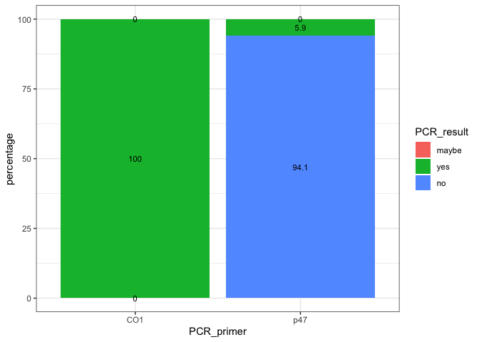
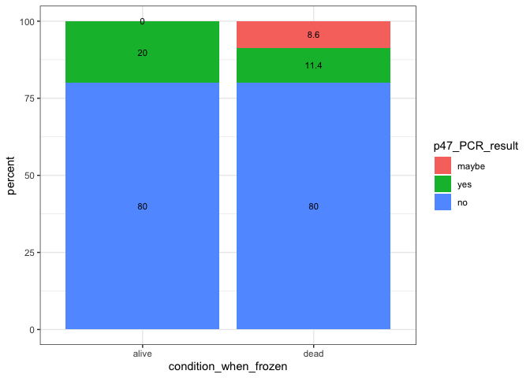
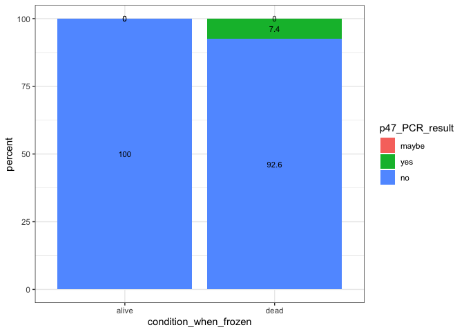

20220915-DiNV-innubila-Infections-PCR-results
================
2022-11-11

``` r
library(ggplot2)
library(dplyr)
```

    ## 
    ## Attaching package: 'dplyr'

    ## The following objects are masked from 'package:stats':
    ## 
    ##     filter, lag

    ## The following objects are masked from 'package:base':
    ## 
    ##     intersect, setdiff, setequal, union

### Read in csv files

``` r
# male percentages
Male_PCR_results <- read.csv("~/Desktop/Github/Unckless_Lab_Resources/PCR_analysis/20220915-DiNV-infections/Extraction_spreadsheet_for_20220915_infections_M_percentages_for_R.csv")

#females 
Female_PCR_results <- read.csv("~/Desktop/Github/Unckless_Lab_Resources/PCR_analysis/20220915-DiNV-infections/Extraction_spreadsheet_for_20220915_infections_F_percentage_for_R.csv")
```

### Order the PCR result so they will be prettier in the plot

``` r
# make the PCR result into a certain order
results_factor_levels <- c("maybe", "yes", "no")
# apply that order to the dataframes
Male_PCR_results$PCR_result <- factor(Male_PCR_results$PCR_result, levels=results_factor_levels)
Female_PCR_results$PCR_result <- factor(Female_PCR_results$PCR_result, levels=results_factor_levels)
```

### Percentage plot for Males

``` r
# ggbarplot with the percentage numbers on the bars 

ggplot(Male_PCR_results, aes(x = PCR_primer, y = percentage, fill = PCR_result, label = percentage)) +
    geom_bar(stat = "identity") + geom_text(size = 3, position = position_stack(vjust = 0.5)) + theme_bw()
```

<!-- -->
\### Percentage plot for Females

``` r
# ggbarplot with the percentage numbers on the bars 

ggplot(Female_PCR_results, aes(x = PCR_primer, y = percentage, fill = PCR_result, label = percentage)) +
    geom_bar(stat = "identity") + geom_text(size = 3, position = position_stack(vjust = 0.5)) + theme_bw()
```

<!-- -->

## Looking at whether flies were alive or dead when they were frozen and how that breaks down into the positive/negative p47 result

### input new csvs

``` r
Male_alive_PCR_results <- read.csv("~/Desktop/Github/Unckless_Lab_Resources/PCR_analysis/20220915-DiNV-infections/Extraction_spreadsheet_for_20220915_infections_M_percent_alive_R.csv")

Female_alive_PCR_results <- read.csv("~/Desktop/Github/Unckless_Lab_Resources/PCR_analysis/20220915-DiNV-infections/Extraction_spreadsheet_for_20220915_infections_F_percent_alive_R.csv")
```

### Order the PCR result so they will be prettier in the plot

``` r
# apply order to the dataframes
Male_alive_PCR_results$p47_PCR_result <- factor(Male_alive_PCR_results$p47_PCR_result, levels=results_factor_levels)
Female_alive_PCR_results$p47_PCR_result <- factor(Female_alive_PCR_results$p47_PCR_result, levels=results_factor_levels)
```

### Male percent PCR result whether alive or dead

``` r
# ggbarplot with the percentage numbers on the bars 

ggplot(Male_alive_PCR_results, aes(x = condition_when_frozen, y = percent, fill = p47_PCR_result, label = percent)) +
    geom_bar(stat = "identity") + geom_text(size = 3, position = position_stack(vjust = 0.5)) + theme_bw()
```

<!-- -->

### Female percent PCR result whether alive or dead

``` r
# ggbarplot with the percentage numbers on the bars 

ggplot(Female_alive_PCR_results, aes(x = condition_when_frozen, y = percent, fill = p47_PCR_result, label = percent)) +
    geom_bar(stat = "identity") + geom_text(size = 3, position = position_stack(vjust = 0.5)) + theme_bw()
```

<!-- -->
