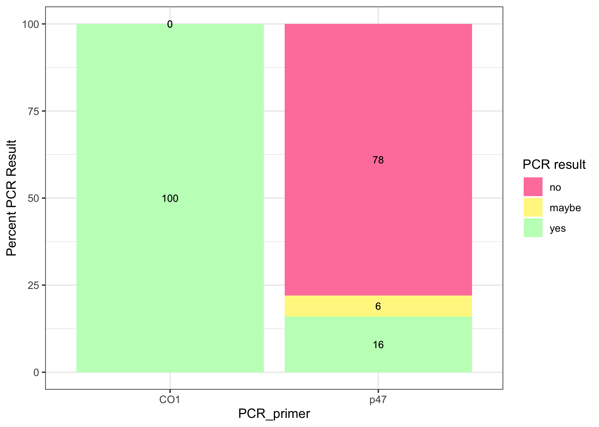

20220915-DiNV-innubila-Infections-PCR-results
================
2022-11-11

``` r
library(ggplot2)
library(dplyr)
```

    ## 
    ## Attaching package: 'dplyr'

    ## The following objects are masked from 'package:stats':
    ## 
    ##     filter, lag

    ## The following objects are masked from 'package:base':
    ## 
    ##     intersect, setdiff, setequal, union

### Read in csv files

``` r
# male percentages
Male_PCR_results <- read.csv("~/Desktop/Github/Unckless_Lab_Resources/PCR_analysis/20220915-DiNV-infections/Extraction_spreadsheet_for_20220915_infections_M_percentages_for_R.csv")

#females 
Female_PCR_results <- read.csv("~/Desktop/Github/Unckless_Lab_Resources/PCR_analysis/20220915-DiNV-infections/Extraction_spreadsheet_for_20220915_infections_F_percentage_for_R.csv")
```

### Order the PCR result so they will be prettier in the plot

``` r
# make the PCR result into a certain order
results_factor_levels <- c("maybe", "yes", "no")
# apply that order to the dataframes
Male_PCR_results$PCR_result <- factor(Male_PCR_results$PCR_result, levels=results_factor_levels)
Female_PCR_results$PCR_result <- factor(Female_PCR_results$PCR_result, levels=results_factor_levels)
```

### Percentage plot for Males

``` r
# ggbarplot with the percentage numbers on the bars 
legend_title <- "PCR result"
ggplot(Male_PCR_results, aes(x = PCR_primer, y = percentage, fill = factor(PCR_result, level=c('no', 'maybe', 'yes')), label = percentage)) +
    geom_bar(stat = "identity") + geom_text(size = 3, position = position_stack(vjust = 0.5)) + theme_bw() +
  scale_fill_manual(values = c( 'palevioletred1', "khaki1", 'darkseagreen1'), legend_title ) + 
    ylab("Percent PCR Result") +  geom_text(size = 3, position = position_stack(vjust = 0.5))
```

<!-- -->

### Percentage plot for females

``` r
# ggbarplot with the percentage numbers on the bars 

ggplot(Female_PCR_results, aes(x = PCR_primer, y = percentage, fill = PCR_result, label = percentage)) +
    geom_bar(stat = "identity") + geom_text(size = 3, position = position_stack(vjust = 0.5)) + theme_bw()
```

<!-- -->

## Looking at whether flies were alive or dead when they were frozen and how that breaks down into the positive/negative p47 result

### input new csvs

``` r
Male_alive_PCR_results <- read.csv("~/Desktop/Github/Unckless_Lab_Resources/PCR_analysis/20220915-DiNV-infections/Extraction_spreadsheet_for_20220915_infections_M_percent_alive_R.csv")

Female_alive_PCR_results <- read.csv("~/Desktop/Github/Unckless_Lab_Resources/PCR_analysis/20220915-DiNV-infections/Extraction_spreadsheet_for_20220915_infections_F_percent_alive_R.csv")
```

### Order the PCR result so they will be prettier in the plot

``` r
# apply order to the dataframes
Male_alive_PCR_results$p47_PCR_result <- factor(Male_alive_PCR_results$p47_PCR_result, levels=results_factor_levels)
Female_alive_PCR_results$p47_PCR_result <- factor(Female_alive_PCR_results$p47_PCR_result, levels=results_factor_levels)
```

### Male percent PCR result whether alive or dead

``` r
# ggbarplot with the percentage numbers on the bars 

ggplot(Male_alive_PCR_results, aes(x = condition_when_frozen, y = percent, fill = p47_PCR_result, label = percent)) +
    geom_bar(stat = "identity") + geom_text(size = 3, position = position_stack(vjust = 0.5)) + theme_bw()
```

<!-- -->

### Female percent PCR result whether alive or dead

``` r
# ggbarplot with the percentage numbers on the bars 

ggplot(Female_alive_PCR_results, aes(x = condition_when_frozen, y = percent, fill = p47_PCR_result, label = percent)) +
    geom_bar(stat = "identity") + geom_text(size = 3, position = position_stack(vjust = 0.5)) + theme_bw()
```

<!-- -->

Redo analysis

read in df

``` r
PCR_results <- read.csv("/Users/maggieschedl/Desktop/Github/Unckless_Lab_Resources/PCR_analysis/20220915-DiNV-infections/20220915-PCR-sheet.csv")

# for some reason it has extra columns so I am going to remove them 
PCR_results<- PCR_results[,1:7]

# I only want to look at males for now 
PCR_results <- subset(PCR_results, sex == "M")
```

Make percentages for CCM poked flies

``` r
PCR_results_C <- subset(PCR_results, treatment.abrev == "M")

# how many rows does this DF have?
nrow(PCR_results_C)
```

    ## [1] 21

``` r
# how many yes, no, and maybe PCR results are there for the p47 PCR for the DiNV poked flies?
# make this into a table 
C_p47_results <- PCR_results_C %>% 
                    count(PCR.results.p47)

# add a column to that table that is the count (column name is n) divided by the number of rows to get a proportion

C_p47_results$Result_prop <- C_p47_results$n / nrow(PCR_results_C)

# add a column to that table with the percentage (proportion *100)
C_p47_results$Result_percent <- C_p47_results$Result_prop * 100

# add a column to that table with the primer name

C_p47_results$Primer <- "p47"

# add a column that says treatment
C_p47_results$Treatment <- "CCM"

# they were only no so this table is a lil silly 
```

Percentages for DiNV poked flies

``` r
PCR_results_D <- subset(PCR_results, treatment.abrev == "D")

# how many rows does this DF have?
nrow(PCR_results_D)
```

    ## [1] 50

``` r
# how many yes, no, and maybe PCR results are there for the p47 PCR for the DiNV poked flies?
# make this into a table 
D_p47_results <- PCR_results_D %>% 
                    count(PCR.results.p47)

# add a column to that table that is the count (column name is n) divided by the number of rows to get a proportion

D_p47_results$Result_prop <- D_p47_results$n / nrow(PCR_results_D)

# add a column to that table with the percentage (proportion *100)
D_p47_results$Result_percent <- D_p47_results$Result_prop * 100

# add a column to that table with the primer name

D_p47_results$Primer <- "p47"

# add a column that says treatment
D_p47_results$Treatment <- "DiNV"
```

Combine dataframes and plot them

``` r
percent_table_p47 <- rbind(D_p47_results, C_p47_results)

# round percent column 
percent_table_p47$Round_percent <- round(percent_table_p47$Result_percent)

legend_title <- "PCR result"
ggplot(percent_table_p47, aes(x =Treatment, y = Round_percent, label=Round_percent,
                              fill =factor(PCR.results.p47, level=c('no', 'maybe', 'yes')))) +
    geom_bar(stat = "identity")  + theme_bw() + xlab("Treatment") +
    theme(legend.text=element_text(size=12), axis.text=element_text(size=12)) + 
    scale_fill_manual(values = c( 'palevioletred1', "khaki1", 'darkseagreen1'), legend_title ) + 
    ylab("Percent PCR Result") +  geom_text(size = 3, position = position_stack(vjust = 0.5))
```

<!-- -->
