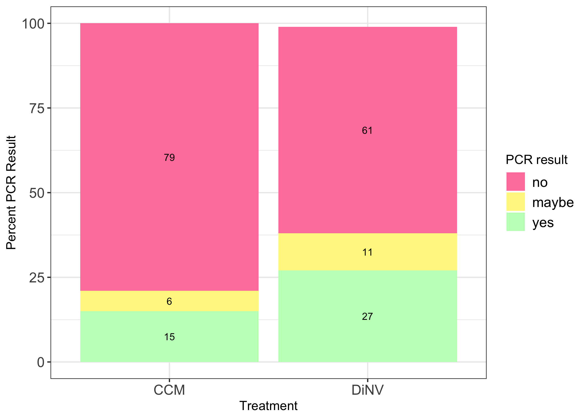

# 20221015-infection-PCR-analysis

Load in packages necessary

``` r
library(ggplot2)
library(dplyr)
```


    Attaching package: 'dplyr'

    The following objects are masked from 'package:stats':

        filter, lag

    The following objects are masked from 'package:base':

        intersect, setdiff, setequal, union

Load in dataset

``` r
PCR_results <- read.csv("/Users/maggieschedl/Desktop/Github/Unckless_Lab_Resources/PCR_analysis/20221015-DiNV-infections/20221015-infection-data.csv")

# separate out just the DiNV poke and the CCM poke flies, don't need the not poked flies

PCR_results_s <- subset(PCR_results, treatment.abrev != "NP")
```

Try to make the proportions with R code

Just DiNV poked flies

``` r
PCR_results_D <- subset(PCR_results_s, treatment.abrev == "DiNV")

# how many rows does this DF have?
nrow(PCR_results_D)
```

    [1] 62

``` r
# how many yes, no, and maybe PCR results are there for the p47 PCR for the DiNV poked flies?
# make this into a table 
D_p47_results <- PCR_results_D %>% 
                    count(p47_PCR_results)

# add a column to that table that is the count (column name is n) divided by the number of rows to get a proportion

D_p47_results$Result_prop <- D_p47_results$n / nrow(PCR_results_D)

# add a column to that table with the percentage (proportion *100)
D_p47_results$Result_percent <- D_p47_results$Result_prop * 100

# add a column to that table with the primer name

D_p47_results$Primer <- "p47"

# add a column that says treatment
D_p47_results$Treatment <- "DiNV"
```

Just CCM poked flies

``` r
PCR_results_C <- subset(PCR_results_s, treatment.abrev == "CCM")

# how many rows does this DF have?
nrow(PCR_results_C)
```

    [1] 33

``` r
# how many yes, no, and maybe PCR results are there for the p47 PCR for the DiNV poked flies?
# make this into a table 
C_p47_results <- PCR_results_C %>% 
                    count(p47_PCR_results)

# add a column to that table that is the count (column name is n) divided by the number of rows to get a proportion

C_p47_results$Result_prop <- C_p47_results$n / nrow(PCR_results_C)

# add a column to that table with the percentage (proportion *100)
C_p47_results$Result_percent <- C_p47_results$Result_prop * 100

# add a column to that table with the primer name

C_p47_results$Primer <- "p47"

# add a column that says treatment
C_p47_results$Treatment <- "CCM"
```

Combine dataframes and plot them

``` r
percent_table_p47 <- rbind(D_p47_results, C_p47_results)

# round percent column 
percent_table_p47$Round_percent <- round(percent_table_p47$Result_percent)

legend_title <- "PCR result"
ggplot(percent_table_p47, aes(x =Treatment, y = Round_percent, label=Round_percent,
                              fill =factor(p47_PCR_results, level=c('no', 'maybe', 'yes')))) +
    geom_bar(stat = "identity")  + theme_bw() + xlab("Treatment") +
    theme(legend.text=element_text(size=12), axis.text=element_text(size=12)) + 
    scale_fill_manual(values = c( 'palevioletred1', "khaki1", 'darkseagreen1'), legend_title ) + 
    ylab("Percent PCR Result") +  geom_text(size = 3, position = position_stack(vjust = 0.5))
```


