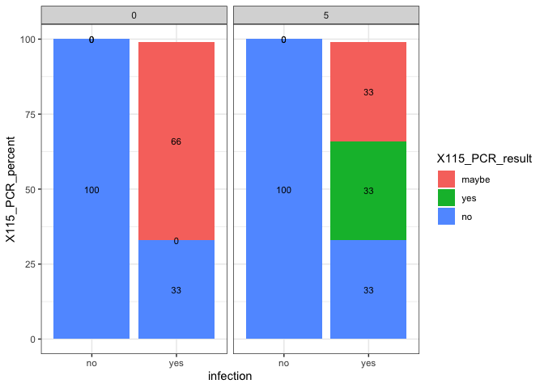
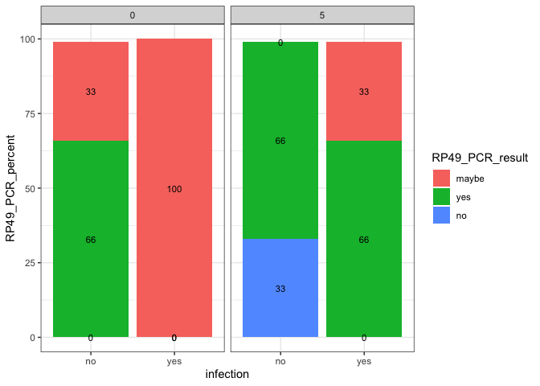

20230206-Myd88-Dv1-Cell-Infection-Analysis
================
2023-02-22

Load in packages necessary

``` r
library(ggplot2)
library(dplyr)
```

    ## 
    ## Attaching package: 'dplyr'

    ## The following objects are masked from 'package:stats':
    ## 
    ##     filter, lag

    ## The following objects are masked from 'package:base':
    ## 
    ##     intersect, setdiff, setequal, union

Load in Dataset from
<https://docs.google.com/spreadsheets/d/1fi2Mtt8IbXCSx1YuVR9IfkkJxQe9vNylgJKMFb96UTY/edit#gid=0>

``` r
cell_PCR_results <- read.csv("~/Desktop/Github/Unckless_Lab_Resources/PCR_analysis/20230206-Myd88-Dv1-cell-infections/20230206-Myd88-Dv1-DiNV-PCR.csv")
```

Order PCR results

``` r
# make the PCR result into a certain order
results_factor_levels <- c("maybe", "yes", "no")
# apply to dataframe to each column 
#lambda results
cell_PCR_results$lambda_PCR_score <- factor(cell_PCR_results$lambda_PCR_score, levels=results_factor_levels)
# RPL11 results
cell_PCR_results$RPL11_PCR_score <- factor(cell_PCR_results$RPL11_PCR_score, levels=results_factor_levels)
# 115 consensus results
cell_PCR_results$consensus_115_score <- factor(cell_PCR_results$consensus_115_score, levels=results_factor_levels)
# consensus RP49 score
cell_PCR_results$consensus_RP49_score <- factor(cell_PCR_results$consensus_RP49_score, levels=results_factor_levels)
```

Subset to just the Dv1 samples, and subset cells and supernatant within

``` r
# Dv1
DV1_PCR_results <- subset(cell_PCR_results, cell_type == "Dv1")
# cells 
DV1_cells_results <- subset(DV1_PCR_results, sample_type == "cells")
# supernatant 
DV1_supernatant_results <- subset(DV1_PCR_results, sample_type == "supernatant")
```

Subset within Dv1 cells to day and infection status

``` r
# day 0 
DV1_cells_0_results <- subset(DV1_cells_results, plate_day == "0")
# day 5 
DV1_cells_5_results <- subset(DV1_cells_results, plate_day == "5")
# day 0 infected 
DV1_cells_0_inf_results <- subset(DV1_cells_0_results, infection == "yes")
# day 5 infected 
DV1_cells_5_inf_results <- subset(DV1_cells_5_results, infection == "yes")
# day 0 not infected
DV1_cells_0_ninf_results <- subset(DV1_cells_0_results, infection == "no")
# day 5 not infected 
DV1_cells_5_ninf_results <- subset(DV1_cells_5_results, infection == "no")
```

The percentages of positive/maybe/no results for the PCRs from these
were put into a separate spread sheet here
<https://docs.google.com/spreadsheets/d/1ncCo3tv83MN0f3u6OO7hrErllC7dfitPR_sNB3Q4OD8/edit#gid=0>
Basically I looked at each spreadsheet and scored whether each PCR was
either a yes, no, or maybe and if it was 0, 33, 66, or 100 percent for
that result

Subset within Dv1 supernatant to day and infection status

``` r
# day 0 
DV1_sup_0_results <- subset(DV1_supernatant_results, plate_day == "0")
# day 5 
DV1_sup_5_results <- subset(DV1_supernatant_results, plate_day == "5")
# day 0 infected 
DV1_sup_0_inf_results <- subset(DV1_sup_0_results, infection == "yes")
# day 5 infected 
DV1_sup_5_inf_results <- subset(DV1_sup_5_results, infection == "yes")
# day 0 not infected
DV1_sup_0_ninf_results <- subset(DV1_sup_0_results, infection == "no")
# day 5 not infected 
DV1_sup_5_ninf_results <- subset(DV1_sup_5_results, infection == "no")
```

I did the same with the percentates of positive/maybe/no results here as
above in that spreadsheet

Then I want to do the same subsets with the Myd88 results

Subset to just the Myd88 samples, and subset cells and supernatant
within

``` r
# Myd88
Myd88_PCR_results <- subset(cell_PCR_results, cell_type == "Myd88")
# cells 
Myd88_cells_results <- subset(Myd88_PCR_results, sample_type == "cells")
# supernatant 
Myd88_supernatant_results <- subset(Myd88_PCR_results, sample_type == "supernatant")
```

Subset within Myd88 cells to day and infection status

``` r
# day 0 
Myd88_cells_0_results <- subset(Myd88_cells_results, plate_day == "0")
# day 5 
Myd88_cells_5_results <- subset(Myd88_cells_results, plate_day == "5")
# day 0 infected 
Myd88_cells_0_inf_results <- subset(Myd88_cells_0_results, infection == "yes")
# day 5 infected 
Myd88_cells_5_inf_results <- subset(Myd88_cells_5_results, infection == "yes")
# day 0 not infected
Myd88_cells_0_ninf_results <- subset(Myd88_cells_0_results, infection == "no")
# day 5 not infected 
Myd88_cells_5_ninf_results <- subset(Myd88_cells_5_results, infection == "no")
```

Subset within Myd88 supernatant to day and infection status

``` r
# day 0 
Myd88_sup_0_results <- subset(Myd88_supernatant_results, plate_day == "0")
# day 5 
Myd88_sup_5_results <- subset(Myd88_supernatant_results, plate_day == "5")
# day 0 infected 
Myd88_sup_0_inf_results <- subset(Myd88_sup_0_results, infection == "yes")
# day 5 infected 
Myd88_sup_5_inf_results <- subset(Myd88_sup_5_results, infection == "yes")
# day 0 not infected
Myd88_sup_0_ninf_results <- subset(Myd88_sup_0_results, infection == "no")
# day 5 not infected 
Myd88_sup_5_ninf_results <- subset(Myd88_sup_5_results, infection == "no")
```

Bring in the percentages spreadsheet

``` r
percentage_PCR_results <- read.csv("~/Desktop/Github/Unckless_Lab_Resources/PCR_analysis/20230206-Myd88-Dv1-cell-infections/20230206-Myd88-Dv1-DiNV-PCR-percentages.csv")
```

Order PCR results again (I didn’t need to do it above) Order PCR results

``` r
# make the PCR result into a certain order
results_factor_levels <- c("maybe", "yes", "no")
# apply to dataframe to each column 
#lambda results
percentage_PCR_results$lambda_PCR_result <- factor(percentage_PCR_results$lambda_PCR_result, levels=results_factor_levels)
# RPL11 results
percentage_PCR_results$RPL11_PCR_Result <- factor(percentage_PCR_results$RPL11_PCR_Result, levels=results_factor_levels)
# 115 consensus results
percentage_PCR_results$X115_PCR_result <- factor(percentage_PCR_results$X115_PCR_result, levels=results_factor_levels)
# consensus RP49 score
percentage_PCR_results$RP49_PCR_result <- factor(percentage_PCR_results$RP49_PCR_result, levels=results_factor_levels)
```

Lets look at Dv1 cells

``` r
# subset to Dv1
Dv1_percentages <- subset(percentage_PCR_results, cell_type == "Dv1")
# subset to cells 
Dv1_cells_percentages <- subset(Dv1_percentages, sample_type == "cells")
```

Plot Dv1 cells 115 PCR result both days and both infection status

``` r
# ggbarplot with the percentage numbers on the bars 
# Use facet to show both day 0 and day 5 
ggplot(Dv1_cells_percentages, aes(x = infection, y = X115_PCR_percent, fill = X115_PCR_result, label = X115_PCR_percent)) +
    geom_bar(stat = "identity") + geom_text(size = 3, position = position_stack(vjust = 0.5)) + theme_bw() + facet_wrap(~day)
```

<!-- -->

Plot Dv1 cells RPL11 PCR result both days and both infection status

``` r
# ggbarplot with the percentage numbers on the bars 
# Use facet to show both day 0 and day 5 
ggplot(Dv1_cells_percentages, aes(x = infection, y = RPL11_PCR_percent, fill = RPL11_PCR_Result, label = RPL11_PCR_percent)) +
    geom_bar(stat = "identity") + geom_text(size = 3, position = position_stack(vjust = 0.5)) + theme_bw() + facet_wrap(~day)
```

<!-- -->

Lets look at Dv1 supernatant

``` r
# subset to cells 
Dv1_sup_percentages <- subset(Dv1_percentages, sample_type == "supernatant")
```

Plot Dv1 supernatant 115 PCR result both days and both infection status

``` r
# ggbarplot with the percentage numbers on the bars 
# Use facet to show both day 0 and day 5 
ggplot(Dv1_sup_percentages, aes(x = infection, y = X115_PCR_percent, fill = X115_PCR_result, label = X115_PCR_percent)) +
    geom_bar(stat = "identity") + geom_text(size = 3, position = position_stack(vjust = 0.5)) + theme_bw() + facet_wrap(~day)
```

<!-- -->

Plot Dv1 supernatant RPL11 PCR result both days and both infection
status

``` r
# ggbarplot with the percentage numbers on the bars 
# Use facet to show both day 0 and day 5 
ggplot(Dv1_sup_percentages, aes(x = infection, y = RPL11_PCR_percent, fill = RPL11_PCR_Result, label = RPL11_PCR_percent)) +
    geom_bar(stat = "identity") + geom_text(size = 3, position = position_stack(vjust = 0.5)) + theme_bw() + facet_wrap(~day)
```

<!-- -->

Plot Dv1 supernatant Lambda PCR result both days and both infection
status

``` r
# ggbarplot with the percentage numbers on the bars 
# Use facet to show both day 0 and day 5 
ggplot(Dv1_sup_percentages, aes(x = infection, y = lambda_PCR_percent, fill = lambda_PCR_result, label = lambda_PCR_percent)) +
    geom_bar(stat = "identity") + geom_text(size = 3, position = position_stack(vjust = 0.5)) + theme_bw() + facet_wrap(~day)
```

<!-- -->

Lets look at Myd88 cells

``` r
# subset to Myd88
Myd88_percentages <- subset(percentage_PCR_results, cell_type == "Myd88")
# subset to cells 
Myd88_cells_percentages <- subset(Myd88_percentages, sample_type == "cells")
```

Plot Myd88 cells 115 PCR result both days and both infection status

``` r
# ggbarplot with the percentage numbers on the bars 
# Use facet to show both day 0 and day 5 
ggplot(Myd88_cells_percentages, aes(x = infection, y = X115_PCR_percent, fill = X115_PCR_result, label = X115_PCR_percent)) +
    geom_bar(stat = "identity") + geom_text(size = 3, position = position_stack(vjust = 0.5)) + theme_bw() + facet_wrap(~day)
```

<!-- -->

Plot Myd88 cells RP49 PCR result both days and both infection status

``` r
# ggbarplot with the percentage numbers on the bars 
# Use facet to show both day 0 and day 5 
ggplot(Myd88_cells_percentages, aes(x = infection, y = RP49_PCR_percent, fill = RP49_PCR_result, label = RP49_PCR_percent)) +
    geom_bar(stat = "identity") + geom_text(size = 3, position = position_stack(vjust = 0.5)) + theme_bw() + facet_wrap(~day)
```

<!-- -->

Lets look at Myd88 supernatant

``` r
# subset to cells 
Myd88_sup_percentages <- subset(Myd88_percentages, sample_type == "supernatant")
```

Plot Myd88 supernatant 115 PCR result both days and both infection
status

``` r
# ggbarplot with the percentage numbers on the bars 
# Use facet to show both day 0 and day 5 
ggplot(Myd88_sup_percentages, aes(x = infection, y = X115_PCR_percent, fill = X115_PCR_result, label = X115_PCR_percent)) +
    geom_bar(stat = "identity") + geom_text(size = 3, position = position_stack(vjust = 0.5)) + theme_bw() + facet_wrap(~day)
```

<!-- -->

Plot Myd88 supernatant RP49 PCR result both days and both infection
status

``` r
# ggbarplot with the percentage numbers on the bars 
# Use facet to show both day 0 and day 5 
ggplot(Myd88_sup_percentages, aes(x = infection, y = RP49_PCR_percent, fill = RP49_PCR_result, label = RP49_PCR_percent)) +
    geom_bar(stat = "identity") + geom_text(size = 3, position = position_stack(vjust = 0.5)) + theme_bw() + facet_wrap(~day)
```

<!-- -->

Plot Myd88 supernatant Lambda PCR result both days and both infection
status

``` r
# ggbarplot with the percentage numbers on the bars 
# Use facet to show both day 0 and day 5 
ggplot(Myd88_sup_percentages, aes(x = infection, y = lambda_PCR_percent, fill = lambda_PCR_result, label = lambda_PCR_percent)) +
    geom_bar(stat = "identity") + geom_text(size = 3, position = position_stack(vjust = 0.5)) + theme_bw() + facet_wrap(~day)
```

<!-- -->
