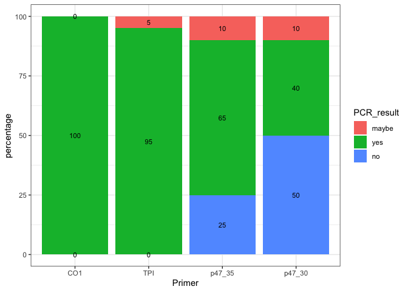
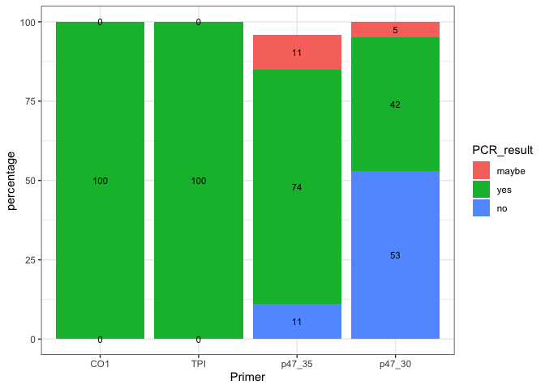
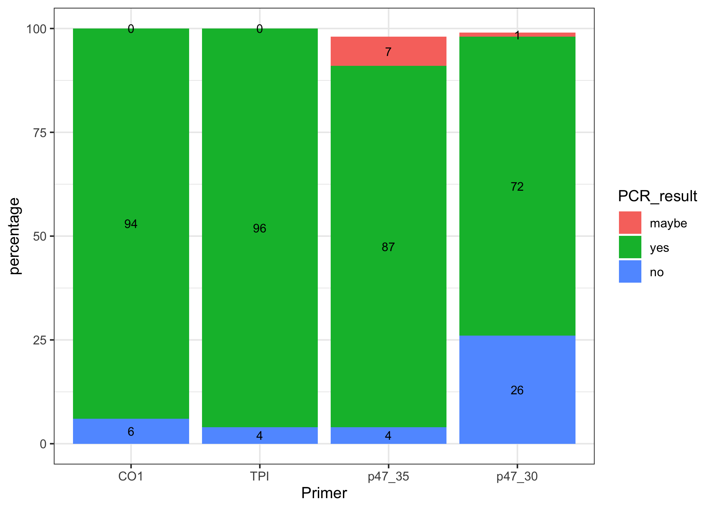
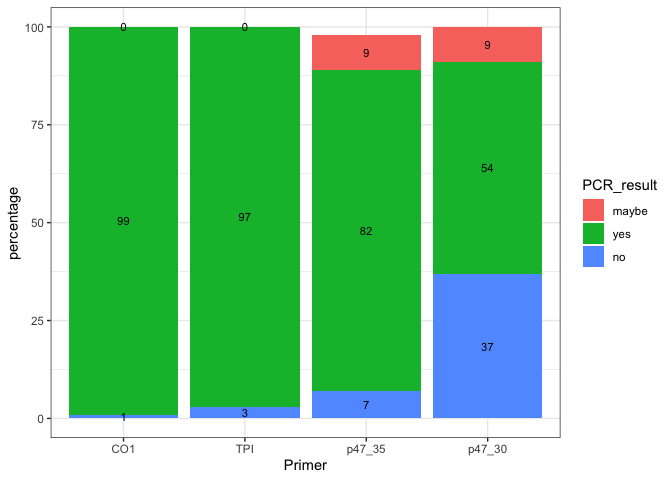

20230524-freezing-experiment-1-analysis
================
2023-07-03

Load in packages necessary

``` r
library(ggplot2)
library(dplyr)
```

    ## 
    ## Attaching package: 'dplyr'

    ## The following objects are masked from 'package:stats':
    ## 
    ##     filter, lag

    ## The following objects are masked from 'package:base':
    ## 
    ##     intersect, setdiff, setequal, union

Load in dataset from Google Drive, downloaded as CSV from organized PCR
results tab
<https://docs.google.com/spreadsheets/d/1a0DyxHrYie6XQzd8wdEeOkemMl94IrNcSeTQ3W0gr8A/edit#gid=291092166>

``` r
freezing1_PCR_results <- read.csv("~/Desktop/Github/Unckless_Lab_Resources/PCR_analysis/20230524-freezing-ecperiment-1/freezing_exp_1_PCR_results.csv")
```

Order PCR results

``` r
# make the PCR result into a certain order
results_factor_levels <- c("maybe", "yes", "no")

# apply this to CO1,TPI, p47 35, and p47 30 cycle columns
# CO1
freezing1_PCR_results$CO1_result <- factor(freezing1_PCR_results$CO1_result, levels=results_factor_levels)
# TPI
freezing1_PCR_results$tpi_result <- factor(freezing1_PCR_results$tpi_result, levels=results_factor_levels)
# p47 35 cycle
freezing1_PCR_results$p47_result <- factor(freezing1_PCR_results$p47_result, levels=results_factor_levels)
# p47 30 cycle
freezing1_PCR_results$p47_30_cycle_result <- factor(freezing1_PCR_results$p47_30_cycle_result, levels=results_factor_levels)
```

Subset to Sterile Poke Males

``` r
# sterile poke
SP_results <- subset(freezing1_PCR_results, treatment == "sterile poke")
# sterile poke males only
SP_M_results <- subset(SP_results, sex == "male")
```

Now I need to calculate the percentages for either yes, no, or maybe for
each primer. To do this I just count the number of each yes, no, or
maybe for each primer, then divide that by the total number of samples.
This is done in a separate spreadsheet and then loaded in. SP_M\_percent
has the calculations.

Read in percentage SP male dataset

``` r
SP_M_percent <- read.csv("~/Desktop/Github/Unckless_Lab_Resources/PCR_analysis/20230524-freezing-ecperiment-1/SP_male.csv")

# make the PCR result into a certain order
results_factor_levels <- c("maybe", "yes", "no")

SP_M_percent$PCR_result <- factor(SP_M_percent$PCR_result, levels=results_factor_levels)
```

Make a plot that shows the percentage of each PCR result for each primer
for sterile poked males

``` r
# want to order the x axis 
# ggbarplot with the percentage numbers on the bars 

ggplot(SP_M_percent, aes(x =factor(Primer, level=c('CO1', 'TPI', 'p47_35', 'p47_30')), y = percentage, fill = PCR_result, label = percentage)) +
    geom_bar(stat = "identity") + geom_text(size = 3, position = position_stack(vjust = 0.5)) + theme_bw() + xlab("Primer")
```

<!-- -->

Subset to Sterile Poke Females

``` r
# sterile poke females only
SP_F_results <- subset(SP_results, sex == "female")
```

Generate percentages in the manner above. Note that there is an NA for
p47_35 so that one won’t add up to 100

Read in percentage SP female dataset

``` r
SP_F_percent <- read.csv("~/Desktop/Github/Unckless_Lab_Resources/PCR_analysis/20230524-freezing-ecperiment-1/SP_female.csv")

# make the PCR result into a certain order
results_factor_levels <- c("maybe", "yes", "no")

SP_F_percent$PCR_result <- factor(SP_F_percent$PCR_result, levels=results_factor_levels)
```

Make a plot that shows the percentage of each PCR result for each primer
for sterile poked females

``` r
# want to order the x axis 
# ggbarplot with the percentage numbers on the bars 

ggplot(SP_F_percent, aes(x =factor(Primer, level=c('CO1', 'TPI', 'p47_35', 'p47_30')), y = percentage, fill = PCR_result, label = percentage)) +
    geom_bar(stat = "identity") + geom_text(size = 3, position = position_stack(vjust = 0.5)) + theme_bw() + xlab("Primer")
```

<!-- -->

Subset to 16Cq males

``` r
#subset to 16 Cq
DINV_results <- subset(freezing1_PCR_results, treatment == "16Cq DiNV")
# 16C male only
DiNV_M_results <- subset(DINV_results, sex == "male")
```

Generate percentages in the manner above. Note that there is an NA for
p47_35 again so that one won’t add up to 100

Read in percentage 16Cq DiNV male

``` r
DiNV_M_percent <- read.csv("~/Desktop/Github/Unckless_Lab_Resources/PCR_analysis/20230524-freezing-ecperiment-1/16Cq_male.csv")

# make the PCR result into a certain order
results_factor_levels <- c("maybe", "yes", "no")

DiNV_M_percent$PCR_result <- factor(DiNV_M_percent$PCR_result, levels=results_factor_levels)
```

Make a plot that shows the percentage of each PCR result for each primer
for sterile poked females

``` r
# want to order the x axis 
# ggbarplot with the percentage numbers on the bars 

ggplot(DiNV_M_percent, aes(x =factor(Primer, level=c('CO1', 'TPI', 'p47_35', 'p47_30')), y = percentage, fill = PCR_result, label = percentage)) +
    geom_bar(stat = "identity") + geom_text(size = 3, position = position_stack(vjust = 0.5)) + theme_bw() + xlab("Primer")
```

<!-- -->

Subset to 16Cq femlaes

``` r
# 16C female only
DiNV_F_results <- subset(DINV_results, sex == "female")
```

Generate percentages in the manner above. Note that there is an NA for
p47_35 again so that one won’t add up to 100

Read in percentage 16Cq DiNV female

``` r
DiNV_F_percent <- read.csv("~/Desktop/Github/Unckless_Lab_Resources/PCR_analysis/20230524-freezing-ecperiment-1/16Cq_female.csv")

# make the PCR result into a certain order
results_factor_levels <- c("maybe", "yes", "no")

DiNV_F_percent$PCR_result <- factor(DiNV_F_percent$PCR_result, levels=results_factor_levels)
```

Make a plot that shows the percentage of each PCR result for each primer
for sterile poked females

``` r
# want to order the x axis 
# ggbarplot with the percentage numbers on the bars 

ggplot(DiNV_F_percent, aes(x =factor(Primer, level=c('CO1', 'TPI', 'p47_35', 'p47_30')), y = percentage, fill = PCR_result, label = percentage)) +
    geom_bar(stat = "identity") + geom_text(size = 3, position = position_stack(vjust = 0.5)) + theme_bw() + xlab("Primer")
```

<!-- -->
