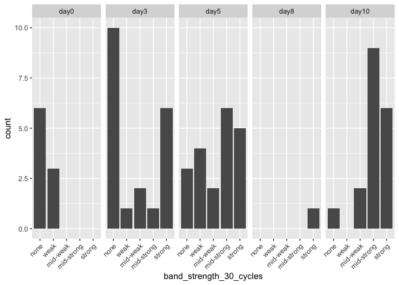

20230524-freezing-experiment-1-band-analysis
================
2023-07-20

Load in packages necessary

``` r
library(ggplot2)
library(dplyr)
```

    ## 
    ## Attaching package: 'dplyr'

    ## The following objects are masked from 'package:stats':
    ## 
    ##     filter, lag

    ## The following objects are masked from 'package:base':
    ## 
    ##     intersect, setdiff, setequal, union

Load in dataset from Google Drive, downloaded as CSV from organized PCR
results tab
<https://docs.google.com/spreadsheets/d/1a0DyxHrYie6XQzd8wdEeOkemMl94IrNcSeTQ3W0gr8A/edit#gid=291092166>

``` r
freezing1_PCR_results <- read.csv("~/Desktop/Github/Unckless_Lab_Resources/PCR_analysis/20230524-freezing-ecperiment-1/freezing_exp_1_PCR_results.csv")
```

What I want to do is look at band strength for the p47 PCRs for each day
and treatment

Do some small subsetting

``` r
# Subset male
male_results <- subset(freezing1_PCR_results, sex == "male")
# Subset female
female_results <- subset(freezing1_PCR_results, sex == "female")
# Subset male sterile poke
male_SP_results <- subset(male_results, treatment == "sterile poke")
# Subset female sterile poke
female_SP_results <- subset(female_results, treatment == "sterile poke")
# Subset male DiNV
male_DiNV_results <- subset(male_results, treatment == "16Cq DiNV")
# Subset female DiNV
female_DiNV_results <- subset(female_results, treatment == "16Cq DiNV")
```

Look at male sterile poke for the 35 cycle p47 PCR

``` r
# order the days
days_factor_levels <- c("day0", "day3", "day5", "day8", "day10")
# order band strengths 
bands_factor_levels <- c("none", "weak", "mid-weak", "mid-strong", "strong")

#apply levels to data
#  days
male_SP_results$day_frozen <- factor(male_SP_results$day_frozen, levels=days_factor_levels)
# band strength
male_SP_results$band_strength_35_cycles <- factor(male_SP_results$band_strength_35_cycles, levels=bands_factor_levels)

# plot counts of each band strength value, separate by day frozen, and angle the text 45 degrees on the x axis so it can be read 

ggplot(male_SP_results, aes(x = band_strength_35_cycles)) +
  geom_bar() + facet_grid(~day_frozen) + theme(axis.text.x = element_text(angle = 45, vjust = 1, hjust=1))
```

<!-- -->
Look at male sterile poke for the 30 cycle p47 PCR

``` r
# have to apply level to the 30 cycles

#apply levels to data
# band strength
male_SP_results$band_strength_30_cycles <- factor(male_SP_results$band_strength_30_cycles, levels=bands_factor_levels)

# plot counts of each band strength value, separate by day frozen, and angle the text 45 degrees on the x axis so it can be read 

ggplot(male_SP_results, aes(x = band_strength_30_cycles)) +
  geom_bar() + facet_grid(~day_frozen) + theme(axis.text.x = element_text(angle = 45, vjust = 1, hjust=1))
```

<!-- -->

Look at male DiNV for the 35 cycle p47 PCR

``` r
#apply levels to data because this is for DiNV now
#  days
male_DiNV_results$day_frozen <- factor(male_DiNV_results$day_frozen, levels=days_factor_levels)
# band strength
male_DiNV_results$band_strength_35_cycles <- factor(male_DiNV_results$band_strength_35_cycles, levels=bands_factor_levels)

# plot counts of each band strength value, separate by day frozen, and angle the text 45 degrees on the x axis so it can be read 

ggplot(male_DiNV_results, aes(x = band_strength_35_cycles)) +
  geom_bar() + facet_grid(~day_frozen) + theme(axis.text.x = element_text(angle = 45, vjust = 1, hjust=1))
```

<!-- -->

Look at male DiNV for the 30 cycle p47 PCR

``` r
# have to apply level to the 30 cycles

#apply levels to data
# band strength
male_DiNV_results$band_strength_30_cycles <- factor(male_DiNV_results$band_strength_30_cycles, levels=bands_factor_levels)

# plot counts of each band strength value, separate by day frozen, and angle the text 45 degrees on the x axis so it can be read 

ggplot(male_DiNV_results, aes(x = band_strength_30_cycles)) +
  geom_bar() + facet_grid(~day_frozen) + theme(axis.text.x = element_text(angle = 45, vjust = 1, hjust=1))
```

<!-- -->

Look at female sterile poke for the 35 cycle p47 PCR

``` r
#apply levels to data
#  days
female_SP_results$day_frozen <- factor(female_SP_results$day_frozen, levels=days_factor_levels)
# band strength
female_SP_results$band_strength_35_cycles <- factor(female_SP_results$band_strength_35_cycles, levels=bands_factor_levels)

# plot counts of each band strength value, separate by day frozen, and angle the text 45 degrees on the x axis so it can be read 

ggplot(female_SP_results, aes(x = band_strength_35_cycles)) +
  geom_bar() + facet_grid(~day_frozen) + theme(axis.text.x = element_text(angle = 45, vjust = 1, hjust=1))
```

<!-- -->

Look at female sterile poke for the 30 cycle p47 PCR

``` r
# have to apply level to the 30 cycles

#apply levels to data
# band strength
female_SP_results$band_strength_30_cycles <- factor(female_SP_results$band_strength_30_cycles, levels=bands_factor_levels)

# plot counts of each band strength value, separate by day frozen, and angle the text 45 degrees on the x axis so it can be read 

ggplot(female_SP_results, aes(x = band_strength_30_cycles)) +
  geom_bar() + facet_grid(~day_frozen) + theme(axis.text.x = element_text(angle = 45, vjust = 1, hjust=1))
```

<!-- -->

Look at female DiNV for the 35 cycle p47 PCR

``` r
#apply levels to data because this is for DiNV now
#  days
female_DiNV_results$day_frozen <- factor(female_DiNV_results$day_frozen, levels=days_factor_levels)
# band strength
female_DiNV_results$band_strength_35_cycles <- factor(female_DiNV_results$band_strength_35_cycles, levels=bands_factor_levels)

# plot counts of each band strength value, separate by day frozen, and angle the text 45 degrees on the x axis so it can be read 

ggplot(female_DiNV_results, aes(x = band_strength_35_cycles)) +
  geom_bar() + facet_grid(~day_frozen) + theme(axis.text.x = element_text(angle = 45, vjust = 1, hjust=1))
```

<!-- -->

Look at female DiNV for the 30 cycle p47 PCR

``` r
# have to apply level to the 30 cycles

#apply levels to data
# band strength
female_DiNV_results$band_strength_30_cycles <- factor(female_DiNV_results$band_strength_30_cycles, levels=bands_factor_levels)

# plot counts of each band strength value, separate by day frozen, and angle the text 45 degrees on the x axis so it can be read 

ggplot(female_DiNV_results, aes(x = band_strength_30_cycles)) +
  geom_bar() + facet_grid(~day_frozen) + theme(axis.text.x = element_text(angle = 45, vjust = 1, hjust=1))
```

<!-- -->
