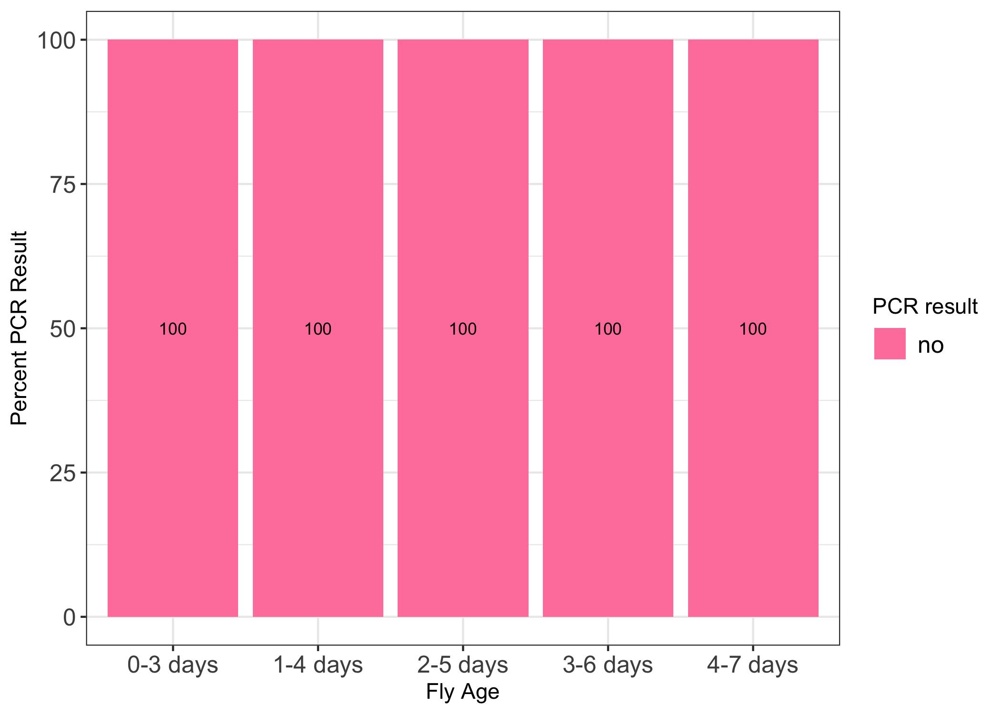

# 20230721-stock-innubila

Load packages needed

``` r
library(ggplot2)
library(dplyr)
```


    Attaching package: 'dplyr'

    The following objects are masked from 'package:stats':

        filter, lag

    The following objects are masked from 'package:base':

        intersect, setdiff, setequal, union

``` r
library(tidyr)
```

Load in dataset

``` r
PCR_results <- read.csv("/Users/maggieschedl/Desktop/Github/Unckless_Lab_Resources/PCR_analysis/20230721-stock-innubila/20230721-stock-innubila.csv")
```

Since there are no treatments here, I am going to separate the graph by
age of flies. Even though there will be few replicates in each that’s
fine. And I can do both 115 and p47. These will be silly because it’s
all 100% but thats fine.

Start with 0-3 for p47

``` r
PCR_results_0_3 <- subset(PCR_results, age == "0-3 days")

# how many rows does this DF have?
nrow(PCR_results_0_3)
```

    [1] 4

``` r
# how many yes, no, and maybe PCR results are there for the p47 PCR for the DiNV poked flies?
# make this into a table 
p47_results_0_3 <- PCR_results_0_3 %>% 
                    count(p47_30_result)

# add a column to that table that is the count (column name is n) divided by the number of rows to get a proportion

p47_results_0_3$Result_prop <- p47_results_0_3$n / nrow(PCR_results_0_3)

# add a column to that table with the percentage (proportion *100)
p47_results_0_3$Result_percent <- p47_results_0_3$Result_prop * 100

# add a column to that table with the primer name

p47_results_0_3$Primer <- "p47"

# add a column that says treatment
p47_results_0_3$Age <- "0-3 days"
```

1-4 for p47

``` r
PCR_results_1_4 <- subset(PCR_results, age == "1-4 days")

# how many rows does this DF have?
nrow(PCR_results_1_4)
```

    [1] 4

``` r
# how many yes, no, and maybe PCR results are there for the p47 PCR for the DiNV poked flies?
# make this into a table 
p47_results_1_4  <- PCR_results_1_4 %>% 
                    count(p47_30_result)

# add a column to that table that is the count (column name is n) divided by the number of rows to get a proportion

p47_results_1_4$Result_prop <- p47_results_1_4$n / nrow(PCR_results_1_4)

# add a column to that table with the percentage (proportion *100)
p47_results_1_4$Result_percent <- p47_results_1_4$Result_prop * 100

# add a column to that table with the primer name

p47_results_1_4$Primer <- "p47"

# add a column that says treatment
p47_results_1_4$Age <- "1-4 days"
```

2-5 for p47

``` r
PCR_results_2_5 <- subset(PCR_results, age == "2-5 days")

# how many rows does this DF have?
nrow(PCR_results_2_5)
```

    [1] 4

``` r
# how many yes, no, and maybe PCR results are there for the p47 PCR for the DiNV poked flies?
# make this into a table 
p47_results_2_5  <- PCR_results_2_5 %>% 
                    count(p47_30_result)

# add a column to that table that is the count (column name is n) divided by the number of rows to get a proportion

p47_results_2_5$Result_prop <- p47_results_2_5$n / nrow(PCR_results_2_5)

# add a column to that table with the percentage (proportion *100)
p47_results_2_5$Result_percent <- p47_results_2_5$Result_prop * 100

# add a column to that table with the primer name

p47_results_2_5$Primer <- "p47"

# add a column that says treatment
p47_results_2_5$Age <- "2-5 days"
```

3-6 for p47

``` r
PCR_results_3_6 <- subset(PCR_results, age == "3-6 days")

# how many rows does this DF have?
nrow(PCR_results_3_6)
```

    [1] 4

``` r
# how many yes, no, and maybe PCR results are there for the p47 PCR for the DiNV poked flies?
# make this into a table 
p47_results_3_6  <- PCR_results_3_6 %>% 
                    count(p47_30_result)

# add a column to that table that is the count (column name is n) divided by the number of rows to get a proportion

p47_results_3_6$Result_prop <- p47_results_3_6$n / nrow(PCR_results_3_6)

# add a column to that table with the percentage (proportion *100)
p47_results_3_6$Result_percent <- p47_results_3_6$Result_prop * 100

# add a column to that table with the primer name

p47_results_3_6$Primer <- "p47"

# add a column that says treatment
p47_results_3_6$Age <- "3-6 days"
```

4-7 for p47

``` r
PCR_results_4_7 <- subset(PCR_results, age == "4-7 days")

# how many rows does this DF have?
nrow(PCR_results_4_7)
```

    [1] 3

``` r
# how many yes, no, and maybe PCR results are there for the p47 PCR for the DiNV poked flies?
# make this into a table 
p47_results_4_7  <- PCR_results_4_7 %>% 
                    count(p47_30_result)

# add a column to that table that is the count (column name is n) divided by the number of rows to get a proportion

p47_results_4_7$Result_prop <- p47_results_4_7$n / nrow(PCR_results_4_7)

# add a column to that table with the percentage (proportion *100)
p47_results_4_7$Result_percent <- p47_results_4_7$Result_prop * 100

# add a column to that table with the primer name

p47_results_4_7$Primer <- "p47"

# add a column that says treatment
p47_results_4_7$Age <- "4-7 days"
```

Combine all p47 datasets and plot them

``` r
# combine dfs
percent_table_p47 <- rbind(p47_results_0_3, p47_results_1_4, p47_results_2_5, p47_results_3_6, p47_results_4_7)

# round percent column 
percent_table_p47$Round_percent <- round(percent_table_p47$Result_percent)

legend_title <- "PCR result"
ggplot(percent_table_p47, aes(x =factor(Age, level=c("0-3 days", "1-4 days", "2-5 days", "3-6 days", "4-7 days")), y = Round_percent, label=Round_percent,
                              fill =factor(p47_30_result, level=c('no', 'maybe', 'yes')))) +
    geom_bar(stat = "identity")  + theme_bw() + xlab("Fly Age") +
    theme(legend.text=element_text(size=12), axis.text=element_text(size=12)) + 
    scale_fill_manual(values = c( 'palevioletred1', "khaki1", 'darkseagreen1'), legend_title ) + 
    ylab("Percent PCR Result") +  geom_text(size = 3, position = position_stack(vjust = 0.5))
```



Do the same thing for 115 primer

0-3

``` r
# how many yes, no, and maybe PCR results are there for the p47 PCR for the DiNV poked flies?
# make this into a table 
results_0_3_115 <- PCR_results_0_3 %>% 
                    count(X115_30_result)

# add a column to that table that is the count (column name is n) divided by the number of rows to get a proportion

results_0_3_115$Result_prop <- results_0_3_115$n / nrow(PCR_results_0_3)

# add a column to that table with the percentage (proportion *100)
results_0_3_115$Result_percent <- results_0_3_115$Result_prop * 100

# add a column to that table with the primer name

results_0_3_115$Primer <- "115"

# add a column that says treatment
results_0_3_115$Age <- "0-3 days"
```

1-4

``` r
# how many yes, no, and maybe PCR results are there for the p47 PCR for the DiNV poked flies?
# make this into a table 
results_1_4_115  <- PCR_results_1_4 %>% 
                    count(X115_30_result)

# add a column to that table that is the count (column name is n) divided by the number of rows to get a proportion

results_1_4_115$Result_prop <- results_1_4_115$n / nrow(PCR_results_1_4)

# add a column to that table with the percentage (proportion *100)
results_1_4_115$Result_percent <- results_1_4_115$Result_prop * 100

# add a column to that table with the primer name

results_1_4_115$Primer <- "115"

# add a column that says treatment
results_1_4_115$Age <- "1-4 days"
```

2-5

``` r
# how many yes, no, and maybe PCR results are there for the p47 PCR for the DiNV poked flies?
# make this into a table 
results_2_5_115  <- PCR_results_2_5 %>% 
                    count(X115_30_result)

# add a column to that table that is the count (column name is n) divided by the number of rows to get a proportion

results_2_5_115$Result_prop <- results_2_5_115 $n / nrow(PCR_results_2_5)

# add a column to that table with the percentage (proportion *100)
results_2_5_115$Result_percent <- results_2_5_115 $Result_prop * 100

# add a column to that table with the primer name

results_2_5_115$Primer <- "115"

# add a column that says treatment
results_2_5_115$Age <- "2-5 days"
```

3-6

``` r
# how many yes, no, and maybe PCR results are there for the p47 PCR for the DiNV poked flies?
# make this into a table 
results_3_6_115  <- PCR_results_3_6 %>% 
                    count(X115_30_result)

# add a column to that table that is the count (column name is n) divided by the number of rows to get a proportion

results_3_6_115$Result_prop <- results_3_6_115$n / nrow(PCR_results_3_6)

# add a column to that table with the percentage (proportion *100)
results_3_6_115$Result_percent <- results_3_6_115$Result_prop * 100

# add a column to that table with the primer name

results_3_6_115$Primer <- "p47"

# add a column that says treatment
results_3_6_115$Age <- "3-6 days"
```

4-7

``` r
# how many yes, no, and maybe PCR results are there for the p47 PCR for the DiNV poked flies?
# make this into a table 
results_4_7_115  <- PCR_results_4_7 %>% 
                    count(X115_30_result)

# add a column to that table that is the count (column name is n) divided by the number of rows to get a proportion

results_4_7_115$Result_prop <- results_4_7_115$n / nrow(PCR_results_4_7)

# add a column to that table with the percentage (proportion *100)
results_4_7_115$Result_percent <- results_4_7_115$Result_prop * 100

# add a column to that table with the primer name

results_4_7_115$Primer <- "115"

# add a column that says treatment
results_4_7_115$Age <- "4-7 days"
```

Combine all 115 datasets and plot them

``` r
# combine dfs
percent_table_115 <- rbind(results_0_3_115, results_1_4_115, results_2_5_115, results_3_6_115, results_4_7_115)

# round percent column 
percent_table_115$Round_percent <- round(percent_table_115$Result_percent)

legend_title <- "PCR result"
ggplot(percent_table_115, aes(x =factor(Age, level=c("0-3 days", "1-4 days", "2-5 days", "3-6 days", "4-7 days")), y = Round_percent, label=Round_percent,
                              fill =factor(X115_30_result, level=c('no', 'maybe', 'yes')))) +
    geom_bar(stat = "identity")  + theme_bw() + xlab("Fly Age") +
    theme(legend.text=element_text(size=12), axis.text=element_text(size=12)) + 
    scale_fill_manual(values = c( 'palevioletred1', "khaki1", 'darkseagreen1'), legend_title ) + 
    ylab("Percent PCR Result") +  geom_text(size = 3, position = position_stack(vjust = 0.5))
```


