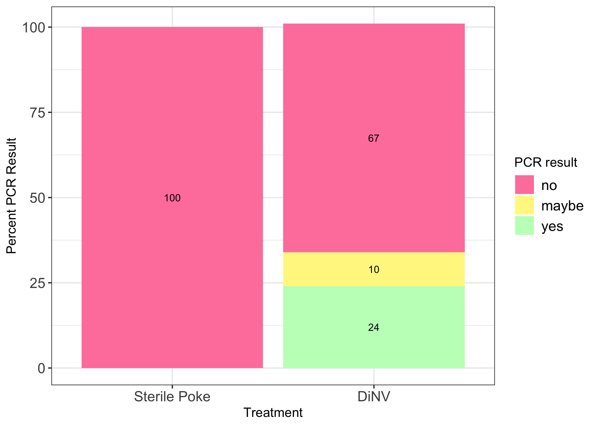

# 20230724-test-infection-analysis

Load packages needed

``` r
library(ggplot2)
library(dplyr)
```


    Attaching package: 'dplyr'

    The following objects are masked from 'package:stats':

        filter, lag

    The following objects are masked from 'package:base':

        intersect, setdiff, setequal, union

``` r
library(tidyr)
```

Load in dataset

``` r
PCR_results <- read.csv("/Users/maggieschedl/Desktop/Github/Unckless_Lab_Resources/PCR_analysis/20230724-Test-infection/20230724-PCR-results.csv")
```

Make proportions of PCR results for just DiNV poked flies

``` r
PCR_results_D <- subset(PCR_results, treatment == "DiNV")

# how many rows does this DF have?
nrow(PCR_results_D)
```

    [1] 21

``` r
# how many yes, no, and maybe PCR results are there for the p47 PCR for the DiNV poked flies?
# make this into a table 
D_p47_results <- PCR_results_D %>% 
                    count(p47.30.cycle.result)

# add a column to that table that is the count (column name is n) divided by the number of rows to get a proportion

D_p47_results$Result_prop <- D_p47_results$n / nrow(PCR_results_D)

# add a column to that table with the percentage (proportion *100)
D_p47_results$Result_percent <- D_p47_results$Result_prop * 100

# add a column to that table with the primer name

D_p47_results$Primer <- "p47"

# add a column that says treatment
D_p47_results$Treatment <- "DiNV"
```

Do the same for sterile poked flies

``` r
PCR_results_C <- subset(PCR_results, treatment == "SP")

# how many rows does this DF have?
nrow(PCR_results_C)
```

    [1] 20

``` r
# how many yes, no, and maybe PCR results are there for the p47 PCR for the DiNV poked flies?
# make this into a table 
C_p47_results <- PCR_results_C %>% 
                    count(p47.30.cycle.result)

# add a column to that table that is the count (column name is n) divided by the number of rows to get a proportion

C_p47_results$Result_prop <- C_p47_results$n / nrow(PCR_results_C)

# add a column to that table with the percentage (proportion *100)
C_p47_results$Result_percent <- C_p47_results$Result_prop * 100

# add a column to that table with the primer name

C_p47_results$Primer <- "p47"

# add a column that says treatment
C_p47_results$Treatment <- "Sterile Poke"
```

Make the plot of percentages

``` r
# combine dfs
percent_table_p47 <- rbind(D_p47_results, C_p47_results)

# round percent column 
percent_table_p47$Round_percent <- round(percent_table_p47$Result_percent)

legend_title <- "PCR result"
ggplot(percent_table_p47, aes(x =factor(Treatment, level=c("Sterile Poke", "DiNV")), y = Round_percent, label=Round_percent,
                              fill =factor(p47.30.cycle.result, level=c('no', 'maybe', 'yes')))) +
    geom_bar(stat = "identity")  + theme_bw() + xlab("Treatment") +
    theme(legend.text=element_text(size=12), axis.text=element_text(size=12)) + 
    scale_fill_manual(values = c( 'palevioletred1', "khaki1", 'darkseagreen1'), legend_title ) + 
    ylab("Percent PCR Result") +  geom_text(size = 3, position = position_stack(vjust = 0.5))
```


I think I also want to add in the 115 data because that will show that I
was testing this in multiple ways

Make proportions of PCR results for just DiNV poked flies

``` r
# how many yes, no, and maybe PCR results are there for the p47 PCR for the DiNV poked flies?
# make this into a table 
D_115_results <- PCR_results_D %>% 
                    count(X115.30.cycle.result)

# add a column to that table that is the count (column name is n) divided by the number of rows to get a proportion

D_115_results$Result_prop <- D_115_results$n / nrow(PCR_results_D)

# add a column to that table with the percentage (proportion *100)
D_115_results$Result_percent <- D_115_results$Result_prop * 100

# add a column to that table with the primer name

D_115_results$Primer <- "p47"

# add a column that says treatment
D_115_results$Treatment <- "DiNV"
```

Do the same for sterile poked flies

``` r
# how many yes, no, and maybe PCR results are there for the p47 PCR for the DiNV poked flies?
# make this into a table 
C_115_results <- PCR_results_C %>% 
                    count(X115.30.cycle.result)

# add a column to that table that is the count (column name is n) divided by the number of rows to get a proportion

C_115_results$Result_prop <- C_115_results$n / nrow(PCR_results_C)

# add a column to that table with the percentage (proportion *100)
C_115_results$Result_percent <- C_115_results$Result_prop * 100

# add a column to that table with the primer name

C_115_results$Primer <- "p47"

# add a column that says treatment
C_115_results$Treatment <- "Sterile Poke"
```

Make the plot of the percentages

``` r
# combine dfs
percent_table_115 <- rbind(D_115_results, C_115_results)

# round percent column 
percent_table_115$Round_percent <- round(percent_table_115$Result_percent)

legend_title <- "PCR result"
ggplot(percent_table_115, aes(x =factor(Treatment, level=c("Sterile Poke", "DiNV")), y = Round_percent, label=Round_percent,
                              fill =factor(X115.30.cycle.result, level=c('no', 'maybe', 'yes')))) +
    geom_bar(stat = "identity")  + theme_bw() + xlab("Treatment") +
    theme(legend.text=element_text(size=12), axis.text=element_text(size=12)) + 
    scale_fill_manual(values = c( 'palevioletred1', "khaki1", 'darkseagreen1'), legend_title ) + 
    ylab("Percent PCR Result") +  geom_text(size = 3, position = position_stack(vjust = 0.5))
```


