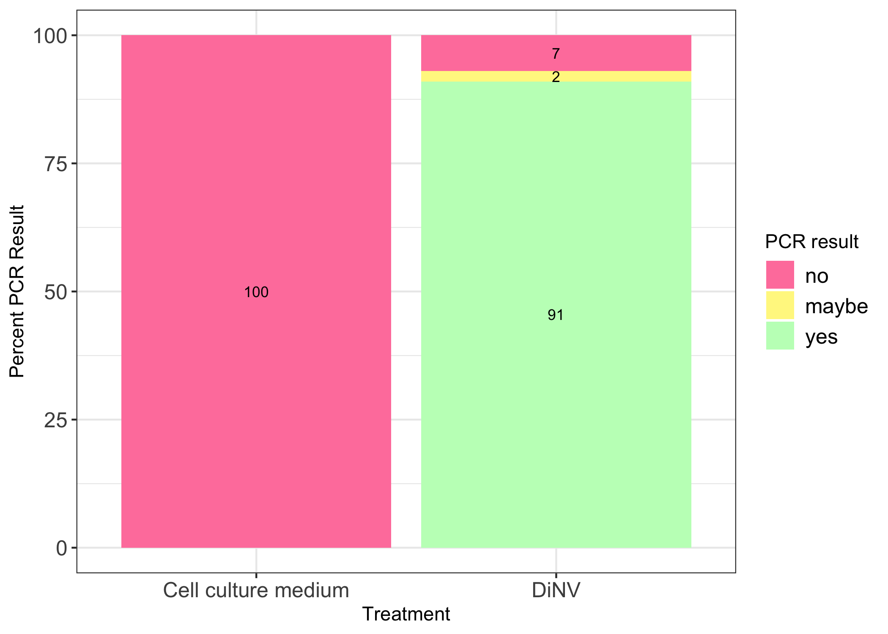
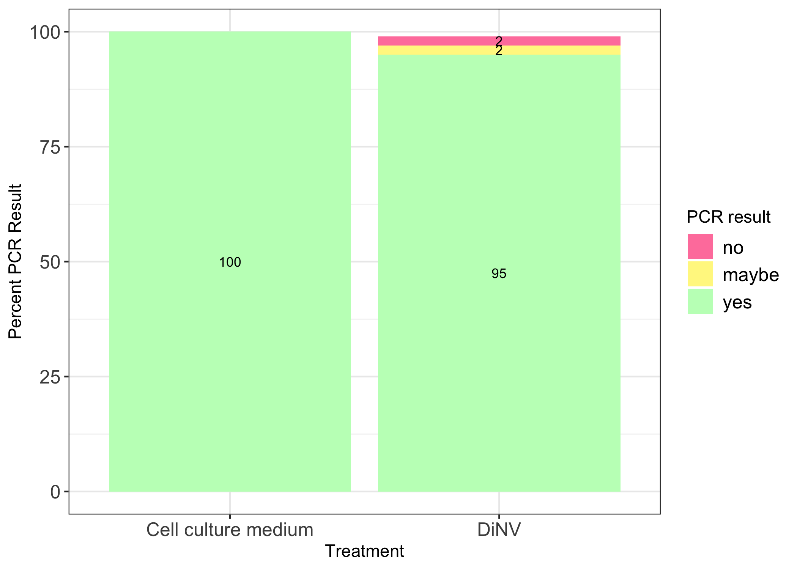
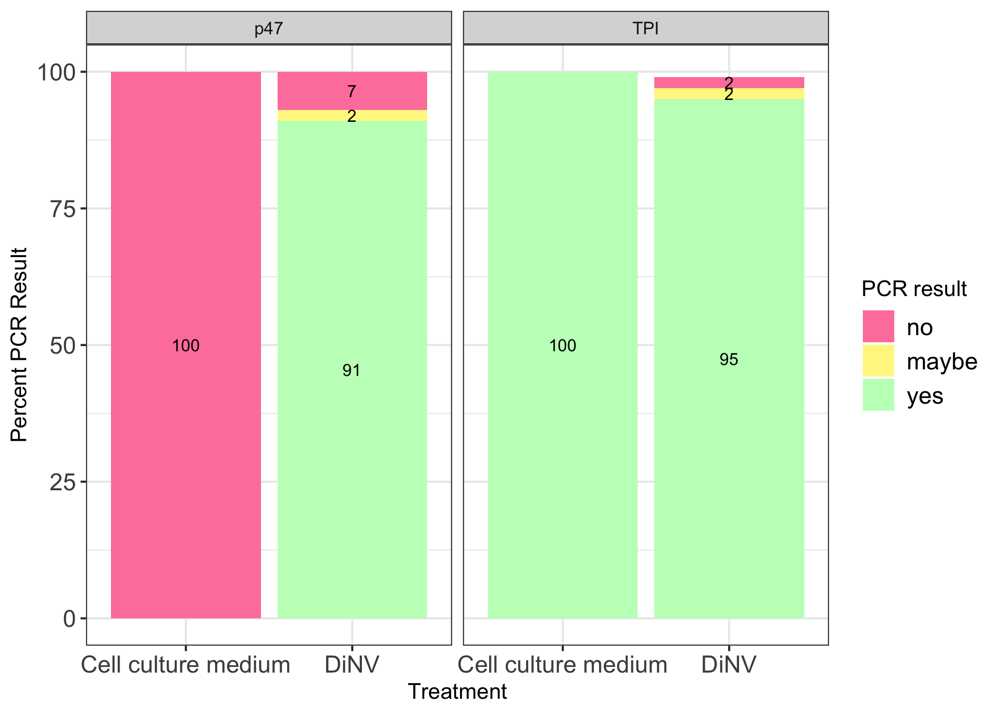

# 20230901-inject-test

Load packages needed

``` r
library(ggplot2)
library(dplyr)
```


    Attaching package: 'dplyr'

    The following objects are masked from 'package:stats':

        filter, lag

    The following objects are masked from 'package:base':

        intersect, setdiff, setequal, union

``` r
library(tidyr)
```

Load in dataset

``` r
PCR_results <- read.csv("/Users/maggieschedl/Desktop/Github/Unckless_Lab_Resources/PCR_analysis/20230901-inject-test/20230901-inject-test.csv")
```

Make proportions of p47 PCR results for just DiNV injected flies

``` r
# subset dataframe to just the DiNV treatment
PCR_results_D <- subset(PCR_results, treatment == "16Cq DiNV")

# how many rows does this DF have?
nrow(PCR_results_D)
```

    [1] 43

``` r
# how many yes, no, and maybe PCR results are there for the p47 PCR for the DiNV poked flies?
# make this into a table 
D_p47_results <- PCR_results_D %>% 
                    count(p47.result)

# add a column to that table that is the count (column name is n) divided by the number of rows to get a proportion

D_p47_results$Result_prop <- D_p47_results$n / nrow(PCR_results_D)

# add a column to that table with the percentage (proportion *100)
D_p47_results$Result_percent <- D_p47_results$Result_prop * 100

# add a column to that table with the primer name

D_p47_results$Primer <- "p47"

# add a column that says treatment
D_p47_results$Treatment <- "DiNV"
```

Do the same for CCM injected flies

``` r
# subset dataframe to just the CCM treatment
PCR_results_C <- subset(PCR_results, treatment == "cell culture medium ")

# how many rows does this DF have?
nrow(PCR_results_C)
```

    [1] 34

``` r
# how many yes, no, and maybe PCR results are there for the p47 PCR for the CCM injected flies?
# make this into a table 
C_p47_results <- PCR_results_C %>% 
                    count(p47.result)

# add a column to that table that is the count (column name is n) divided by the number of rows to get a proportion

C_p47_results$Result_prop <- C_p47_results$n / nrow(PCR_results_C)

# add a column to that table with the percentage (proportion *100)
C_p47_results$Result_percent <- C_p47_results$Result_prop * 100

# add a column to that table with the primer name

C_p47_results$Primer <- "p47"

# add a column that says treatment
C_p47_results$Treatment <- "Cell culture medium"
```

Combine the two dataframes just made, and plot them in a percentage plot

``` r
# combine dfs
percent_table_p47 <- rbind(D_p47_results, C_p47_results)

# create a new column in the df that is a round of the percent column
percent_table_p47$Round_percent <- round(percent_table_p47$Result_percent)

# make a ledgend title
legend_title <- "PCR result"

ggplot(percent_table_p47, aes(x =factor(Treatment, level=c("Cell culture medium", "DiNV")), y = Round_percent, label=Round_percent,fill =factor(p47.result, level=c('no', 'maybe', 'yes')))) +
    geom_bar(stat = "identity")  + theme_bw() + xlab("Treatment") +
    theme(legend.text=element_text(size=12), axis.text=element_text(size=12)) + 
    scale_fill_manual(values = c( 'palevioletred1', "khaki1", 'darkseagreen1'), legend_title ) + 
    ylab("Percent PCR Result") +  geom_text(size = 3, position = position_stack(vjust = 0.5))
```



Make proportions of TPI PCR results for just DiNV injected flies

``` r
# how many yes, no, and maybe PCR results are there for the TPI PCR for the DiNV poked flies?
# make this into a table 
D_TPI_results <- PCR_results_D %>% 
                    count(TPI.result)

# add a column to that table that is the count (column name is n) divided by the number of rows to get a proportion

D_TPI_results$Result_prop <- D_TPI_results$n / nrow(PCR_results_D)

# add a column to that table with the percentage (proportion *100)
D_TPI_results$Result_percent <- D_TPI_results$Result_prop * 100

# add a column to that table with the primer name

D_TPI_results$Primer <- "TPI"

# add a column that says treatment
D_TPI_results$Treatment <- "DiNV"
```

Do the same for CCM injected flies

``` r
# how many yes, no, and maybe PCR results are there for the p47 PCR for the DiNV poked flies?
# make this into a table 
C_TPI_results <- PCR_results_C %>% 
                    count(TPI.result)

# add a column to that table that is the count (column name is n) divided by the number of rows to get a proportion

C_TPI_results$Result_prop <- C_TPI_results$n / nrow(PCR_results_C)

# add a column to that table with the percentage (proportion *100)
C_TPI_results$Result_percent <- C_TPI_results$Result_prop * 100

# add a column to that table with the primer name

C_TPI_results$Primer <- "TPI"

# add a column that says treatment
C_TPI_results$Treatment <- "Cell culture medium"
```

Combine the two dataframes just made for TPI primer, and plot them in a
percentage plot

``` r
# combine dfs
percent_table_TPI <- rbind(D_TPI_results, C_TPI_results)

# create a new column in the df that is a round of the percent column
percent_table_TPI$Round_percent <- round(percent_table_TPI$Result_percent)

# make a ledgend title
legend_title <- "PCR result"

ggplot(percent_table_TPI, aes(x =factor(Treatment, level=c("Cell culture medium", "DiNV")), y = Round_percent, label=Round_percent,fill =factor(TPI.result, level=c('no', 'maybe', 'yes')))) +
    geom_bar(stat = "identity")  + theme_bw() + xlab("Treatment") +
    theme(legend.text=element_text(size=12), axis.text=element_text(size=12)) + 
    scale_fill_manual(values = c( 'palevioletred1', "khaki1", 'darkseagreen1'), legend_title ) + 
    ylab("Percent PCR Result") +  geom_text(size = 3, position = position_stack(vjust = 0.5))
```



Now combine these two plots into one to show all your data

``` r
# first, change the PCR result column name in each percent table to be non-specific 
# rename the p47 table
colnames(percent_table_p47)[which(names(percent_table_p47) == "p47.result")] <- "PCR.result"
# rename the TPI table
colnames(percent_table_TPI)[which(names(percent_table_TPI) == "TPI.result")] <- "PCR.result"

# combine the two combined dfs (they have the same column names now)
total_percent_table <- rbind(percent_table_p47, percent_table_TPI)

# plot the entire dataset, with the primer as a facet 
ggplot(total_percent_table, aes(x =factor(Treatment, level=c("Cell culture medium", "DiNV")), y = Round_percent, label=Round_percent,fill =factor(PCR.result, level=c('no', 'maybe', 'yes')))) +
    geom_bar(stat = "identity")  + theme_bw() + xlab("Treatment") +
    theme(legend.text=element_text(size=12), axis.text=element_text(size=12)) + 
    scale_fill_manual(values = c( 'palevioletred1', "khaki1", 'darkseagreen1'), legend_title ) + 
    ylab("Percent PCR Result") +  geom_text(size = 3, position = position_stack(vjust = 0.5)) + facet_grid(~Primer)
```


