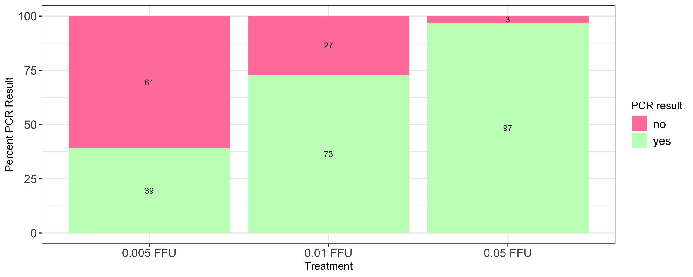
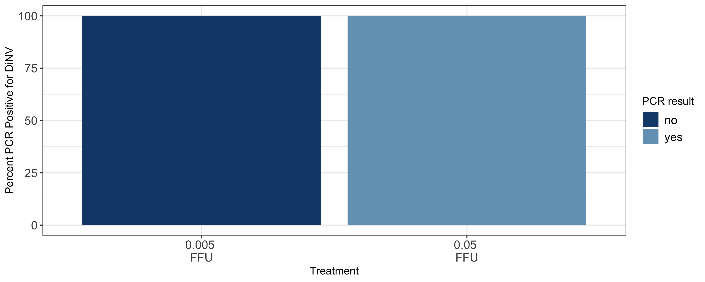
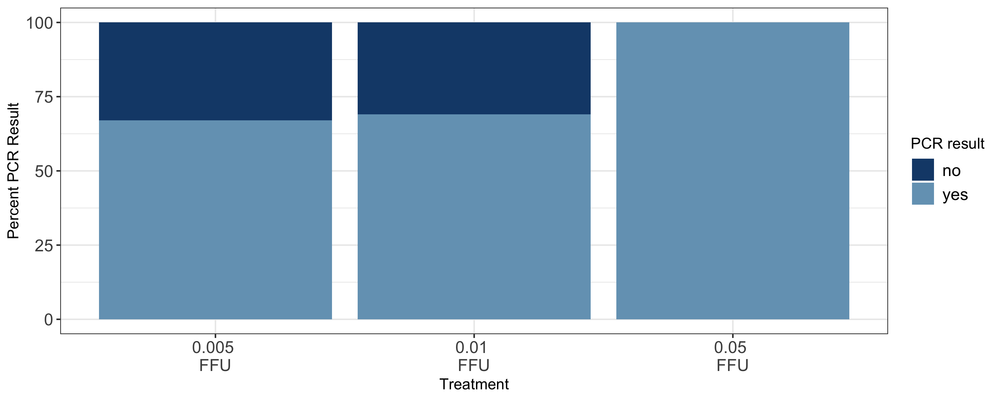
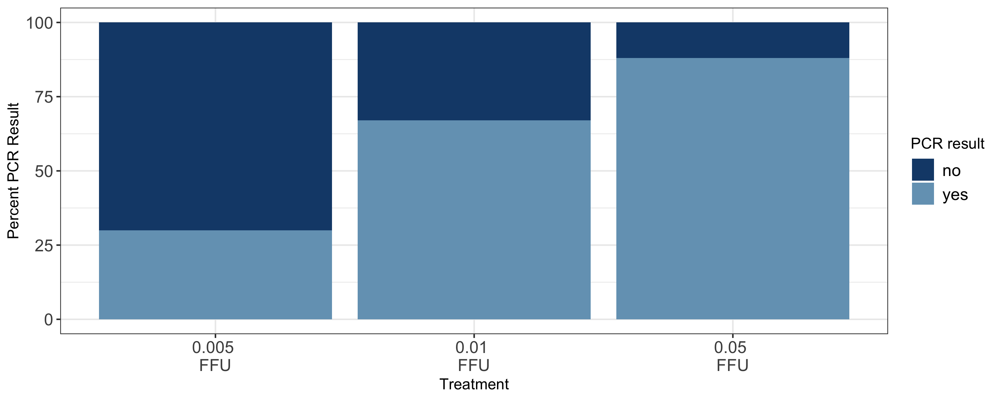
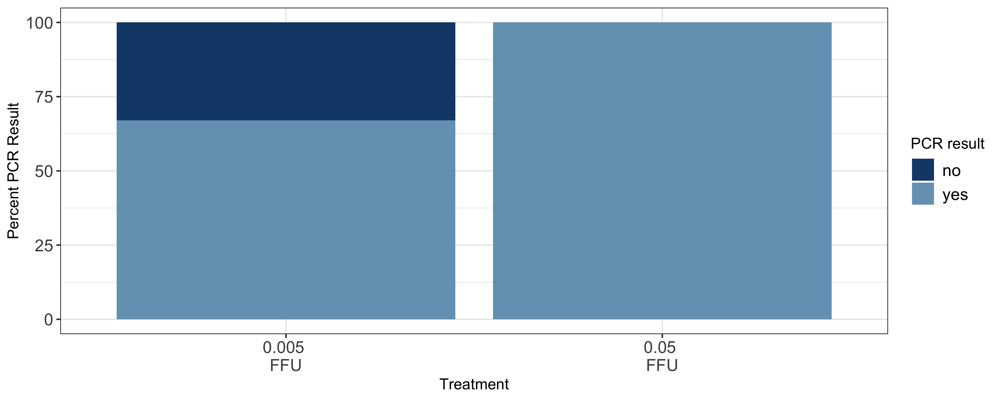

# low-dilution-PCRs

Load packages needed

``` r
library(ggplot2)
library(tidyr)
library(dplyr)
```


    Attaching package: 'dplyr'

    The following objects are masked from 'package:stats':

        filter, lag

    The following objects are masked from 'package:base':

        intersect, setdiff, setequal, union

``` r
library(plyr)
```

    ------------------------------------------------------------------------------

    You have loaded plyr after dplyr - this is likely to cause problems.
    If you need functions from both plyr and dplyr, please load plyr first, then dplyr:
    library(plyr); library(dplyr)

    ------------------------------------------------------------------------------


    Attaching package: 'plyr'

    The following objects are masked from 'package:dplyr':

        arrange, count, desc, failwith, id, mutate, rename, summarise,
        summarize

Load in dataset

\*\* note that all maybe/faint bands were called PCR positive in this
analysis (whether they were called positive or negitive did not change
the conclusions from this, this was done to simplify visualization)

``` r
PCR_results <- read.csv("/Users/maggieschedl/Desktop/Github/Unckless_Lab_Resources/PCR_analysis/20240314-low-dils/20240131-low-dil-PCRs.csv")

#remove some columns with nothing
PCR_results <- PCR_results[,c(1:8)]
# remove rows with NA 
PCR_results <- PCR_results %>% drop_na()

# there are no samples where both the TPI and CO1 say no amplification, so I am going to keep all samples 

# remove all rows of CCM for now, all are neg for p47 anyways

PCR_results <- PCR_results[which(PCR_results$treatment != "CCM"),]
```

Make proportions of p47 PCR results for just 0.01 for now, starting with
it not broken up by day

``` r
# subset dataframe to just the 0.01 treatment
PCR_results_001 <- subset(PCR_results, treatment == "0.01 FFU")

# how many rows does this DF have?
nrow(PCR_results_001)
```

    [1] 41

``` r
# 41

# how many yes, no, and maybe PCR results are there for the p47 PCR for the 0.01 poked flies?
# make this into a table 
p47_results_001 <- count(PCR_results_001$p47.result)

# add a column to that table that is the count (column name is freq) divided by the number of rows to get a proportion

p47_results_001$Result_prop <- p47_results_001$freq / nrow(PCR_results_001)

# add a column to that table with the percentage (proportion *100)
p47_results_001$Result_percent <- p47_results_001$Result_prop * 100

# add a column to that table with the primer name

p47_results_001$Primer <- "p47"

# add a column that says treatment
p47_results_001$Treatment <- "0.01 FFU"
```

Do the same for 0.05 FFU

``` r
# subset dataframe to just the 0.05 treatment
PCR_results_005 <- subset(PCR_results, treatment == "0.05 FFU")

# how many rows does this DF have?
nrow(PCR_results_005)
```

    [1] 34

``` r
# 34

# how many yes, no, and maybe PCR results are there for the p47 PCR for the 0.05 poked flies?
# make this into a table 
p47_results_005 <- count(PCR_results_005$p47.result)

# add a column to that table that is the count (column name is freq) divided by the number of rows to get a proportion

p47_results_005$Result_prop <- p47_results_005$freq / nrow(PCR_results_005)

# add a column to that table with the percentage (proportion *100)
p47_results_005$Result_percent <- p47_results_005$Result_prop * 100

# add a column to that table with the primer name

p47_results_005$Primer <- "p47"

# add a column that says treatment
p47_results_005$Treatment <- "0.05 FFU"
```

Do the same for 0.005 FFU

``` r
# subset dataframe to just the 0.005 treatment
PCR_results_0005 <- subset(PCR_results, treatment == "0.005 FFU")

# how many rows does this DF have?
nrow(PCR_results_0005)
```

    [1] 44

``` r
# 44

# how many yes, no, and maybe PCR results are there for the p47 PCR for the 0.05 poked flies?
# make this into a table 
p47_results_0005 <- count(PCR_results_0005$p47.result)

# add a column to that table that is the count (column name is freq) divided by the number of rows to get a proportion

p47_results_0005$Result_prop <- p47_results_0005$freq / nrow(PCR_results_0005)

# add a column to that table with the percentage (proportion *100)
p47_results_0005$Result_percent <- p47_results_0005$Result_prop * 100

# add a column to that table with the primer name

p47_results_0005$Primer <- "p47"

# add a column that says treatment
p47_results_0005$Treatment <- "0.005 FFU"
```

Combine the dataframes just made, and plot them in a percentage plot

``` r
# combine dfs
percent_table_p47 <- rbind(p47_results_0005, p47_results_001, p47_results_005)

# create a new column in the df that is a round of the percent column
percent_table_p47$Round_percent <- round(percent_table_p47$Result_percent)

# make a ledgend title
legend_title <- "PCR result"

ggplot(percent_table_p47, aes(x =factor(Treatment, level=c("0.005 FFU", "0.01 FFU", "0.05 FFU")), y = Round_percent, label=Round_percent,fill =factor(x, level=c('no', 'maybe', 'yes')))) +
    geom_bar(stat = "identity")  + theme_bw() + xlab("Treatment") +
    theme(legend.text=element_text(size=12), axis.text=element_text(size=12)) + 
    scale_fill_manual(values = c( 'palevioletred1', 'darkseagreen1'), legend_title ) + 
    ylab("Percent PCR Result") +  geom_text(size = 3, position = position_stack(vjust = 0.5))
```



This is interesting, but without knowing what day these flies died/were
frozen this isn’t helpful

Now to separate these out by days instead

Start with day 3

``` r
# subset dataframe to just the day 3
PCR_results_day3 <- subset(PCR_results, day.frozen == "day3")

# subset out different FFUs
# only 0.05 or 0.005 
PCR_results_day3_005 <- subset(PCR_results_day3, treatment == "0.05 FFU")

# how many rows does this DF have?
nrow(PCR_results_day3_005)
```

    [1] 3

``` r
# 3

# how many yes, no, and maybe PCR results are there for the p47 PCR for the day3 flies  0.05 
# make this into a table 
p47_results_day3_005<- count(PCR_results_day3_005$p47.result)

# add a column to that table that is the count (column name is freq) divided by the number of rows to get a proportion

p47_results_day3_005$Result_prop <- p47_results_day3_005$freq / nrow(PCR_results_day3_005)

# add a column to that table with the percentage (proportion *100)
p47_results_day3_005$Result_percent <- p47_results_day3_005$Result_prop * 100

# add a column that says treatment
p47_results_day3_005$Treatment <- "0.05 FFU"

#########
# repeat for 0.005 day 3 
PCR_results_day3_0005 <- subset(PCR_results_day3, treatment == "0.005 FFU")

# how many rows does this DF have?
nrow(PCR_results_day3_0005)
```

    [1] 3

``` r
# 3

# how many yes, no, and maybe PCR results are there for the p47 PCR for the day3 flies  0.005 
# make this into a table 
p47_results_day3_0005<- count(PCR_results_day3_0005$p47.result)

# add a column to that table that is the count (column name is freq) divided by the number of rows to get a proportion

p47_results_day3_0005$Result_prop <- p47_results_day3_0005$freq / nrow(PCR_results_day3_0005)

# add a column to that table with the percentage (proportion *100)
p47_results_day3_0005$Result_percent <- p47_results_day3_0005$Result_prop * 100

# add a column that says treatment
p47_results_day3_0005$Treatment <- "0.005 FFU"

# combine dfs
percent_table_day3 <- rbind(p47_results_day3_0005, p47_results_day3_005)

# create a new column in the df that is a round of the percent column
percent_table_day3$Round_percent <- round(percent_table_day3$Result_percent)

# make a ledgend title
legend_title <- "PCR result"

ggplot(percent_table_day3, aes(x =factor(Treatment, level=c("0.005 FFU", "0.05 FFU")), y = Round_percent,fill =factor(x, level=c('no', 'maybe', 'yes')))) +
    geom_bar(stat = "identity")  + theme_bw() + xlab("Treatment") +
    theme(legend.text=element_text(size=12), axis.text=element_text(size=12)) + 
    scale_fill_manual(values = c( "#174978", "#75A2BF"), legend_title ) + 
    ylab("Percent PCR Positive for DiNV") + scale_x_discrete(labels=c("0.005 FFU" = "0.005 \nFFU", "0.05 FFU" = "0.05 \nFFU"))
```



day 6

``` r
# subset dataframe to just the day 3
PCR_results_day6 <- subset(PCR_results, day.frozen == "day6")

# subset out different FFUs

# start with 0.05
PCR_results_day6_005 <- subset(PCR_results_day6, treatment == "0.05 FFU")

# how many rows does this DF have?
nrow(PCR_results_day6_005)
```

    [1] 4

``` r
# 4

# how many yes, no, and maybe PCR results are there for the p47 PCR for the day6 flies  0.05 
# make this into a table 
p47_results_day6_005<- count(PCR_results_day6_005$p47.result)

# add a column to that table that is the count (column name is freq) divided by the number of rows to get a proportion

p47_results_day6_005$Result_prop <- p47_results_day6_005$freq / nrow(PCR_results_day6_005)

# add a column to that table with the percentage (proportion *100)
p47_results_day6_005$Result_percent <- p47_results_day6_005$Result_prop * 100

# add a column that says treatment
p47_results_day6_005$Treatment <- "0.05 FFU"

#########
# repeat for 0.005 day 6 
PCR_results_day6_0005 <- subset(PCR_results_day6, treatment == "0.005 FFU")

# how many rows does this DF have?
nrow(PCR_results_day6_0005)
```

    [1] 3

``` r
# 3

# how many yes, no, and maybe PCR results are there for the p47 PCR for the day6 flies  0.005 
# make this into a table 
p47_results_day6_0005<- count(PCR_results_day6_0005$p47.result)

# add a column to that table that is the count (column name is freq) divided by the number of rows to get a proportion

p47_results_day6_0005$Result_prop <- p47_results_day6_0005$freq / nrow(PCR_results_day6_0005)

# add a column to that table with the percentage (proportion *100)
p47_results_day6_0005$Result_percent <- p47_results_day6_0005$Result_prop * 100

# add a column that says treatment
p47_results_day6_0005$Treatment <- "0.005 FFU"

########
# repeat for 0.01 day 6 
PCR_results_day6_001 <- subset(PCR_results_day6, treatment == "0.01 FFU")

# how many rows does this DF have?
nrow(PCR_results_day6_001)
```

    [1] 4

``` r
# 4

# how many yes, no, and maybe PCR results are there for the p47 PCR for the day6 flies  0.005 
# make this into a table 
p47_results_day6_001<- count(PCR_results_day6_001$p47.result)

# add a column to that table that is the count (column name is freq) divided by the number of rows to get a proportion

p47_results_day6_001$Result_prop <- p47_results_day6_001$freq / nrow(PCR_results_day6_001)

# add a column to that table with the percentage (proportion *100)
p47_results_day6_001$Result_percent <- p47_results_day6_001$Result_prop * 100

# add a column that says treatment
p47_results_day6_001$Treatment <- "0.01 FFU"

########
# combine and plot 

# combine dfs
percent_table_day6 <- rbind(p47_results_day6_0005, p47_results_day6_001, p47_results_day6_005)

# create a new column in the df that is a round of the percent column
percent_table_day6$Round_percent <- round(percent_table_day6$Result_percent)

# make a ledgend title
legend_title <- "PCR result"

ggplot(percent_table_day6, aes(x =factor(Treatment, level=c("0.005 FFU", "0.01 FFU" ,"0.05 FFU")), y = Round_percent,fill =factor(x, level=c('no', 'maybe', 'yes')))) +
    geom_bar(stat = "identity")  + theme_bw() + xlab("Treatment") +
    theme(legend.text=element_text(size=12), axis.text=element_text(size=12)) + 
    scale_fill_manual(values = c( "#174978", "#75A2BF"), legend_title ) + 
    ylab("Percent PCR Result") + scale_x_discrete(labels=c("0.005 FFU" = "0.005 \nFFU", "0.01 FFU" = "0.01 \nFFU", "0.05 FFU" = "0.05 \nFFU"))
```


day 9

``` r
# subset dataframe to just the day 9
PCR_results_day9 <- subset(PCR_results, day.frozen == "day9")

# subset out different FFUs

# start with 0.05
PCR_results_day9_005 <- subset(PCR_results_day9, treatment == "0.05 FFU")

# how many rows does this DF have?
nrow(PCR_results_day9_005)
```

    [1] 11

``` r
# 11

# how many yes, no, and maybe PCR results are there for the p47 PCR for the day9 flies  0.05 
# make this into a table 
p47_results_day9_005<- count(PCR_results_day9_005$p47.result)

# add a column to that table that is the count (column name is freq) divided by the number of rows to get a proportion

p47_results_day9_005$Result_prop <- p47_results_day9_005$freq / nrow(PCR_results_day9_005)

# add a column to that table with the percentage (proportion *100)
p47_results_day9_005$Result_percent <- p47_results_day9_005$Result_prop * 100

# add a column that says treatment
p47_results_day9_005$Treatment <- "0.05 FFU"

#########
# repeat for 0.005 day 9
PCR_results_day9_0005 <- subset(PCR_results_day9, treatment == "0.005 FFU")

# how many rows does this DF have?
nrow(PCR_results_day9_0005)
```

    [1] 5

``` r
# 5

# how many yes, no, and maybe PCR results are there for the p47 PCR for the day9 flies  0.005 
# make this into a table 
p47_results_day9_0005<- count(PCR_results_day9_0005$p47.result)

# add a column to that table that is the count (column name is freq) divided by the number of rows to get a proportion

p47_results_day9_0005$Result_prop <- p47_results_day9_0005$freq / nrow(PCR_results_day9_0005)

# add a column to that table with the percentage (proportion *100)
p47_results_day9_0005$Result_percent <- p47_results_day9_0005$Result_prop * 100

# add a column that says treatment
p47_results_day9_0005$Treatment <- "0.005 FFU"

########
# repeat for 0.01 day 9
PCR_results_day9_001 <- subset(PCR_results_day9, treatment == "0.01 FFU")

# how many rows does this DF have?
nrow(PCR_results_day9_001)
```

    [1] 6

``` r
# 6

# how many yes, no, and maybe PCR results are there for the p47 PCR for the day9 flies  0.01
# make this into a table 
p47_results_day9_001<- count(PCR_results_day9_001$p47.result)

# add a column to that table that is the count (column name is freq) divided by the number of rows to get a proportion

p47_results_day9_001$Result_prop <- p47_results_day9_001$freq / nrow(PCR_results_day9_001)

# add a column to that table with the percentage (proportion *100)
p47_results_day9_001$Result_percent <- p47_results_day9_001$Result_prop * 100

# add a column that says treatment
p47_results_day9_001$Treatment <- "0.01 FFU"

########
# combine and plot 

# combine dfs
percent_table_day9 <- rbind(p47_results_day9_0005, p47_results_day9_001, p47_results_day9_005)

# create a new column in the df that is a round of the percent column
percent_table_day9$Round_percent <- round(percent_table_day9$Result_percent)

# make a ledgend title
legend_title <- "PCR result"

ggplot(percent_table_day9, aes(x =factor(Treatment, level=c("0.005 FFU", "0.01 FFU" ,"0.05 FFU")), y = Round_percent,fill =factor(x, level=c('no', 'maybe', 'yes')))) +
    geom_bar(stat = "identity")  + theme_bw() + xlab("Treatment") +
    theme(legend.text=element_text(size=12), axis.text=element_text(size=12)) + 
    scale_fill_manual(values = c( "#174978", "#75A2BF"), legend_title ) + 
    ylab("Percent PCR Result") + scale_x_discrete(labels=c("0.005 FFU" = "0.005 \nFFU", "0.01 FFU" = "0.01 \nFFU", "0.05 FFU" = "0.05 \nFFU"))
```


day 12

``` r
# subset dataframe to just the day 12
PCR_results_day12 <- subset(PCR_results, day.frozen == "day12")

# subset out different FFUs

# start with 0.05
PCR_results_day12_005 <- subset(PCR_results_day12, treatment == "0.05 FFU")

# how many rows does this DF have?
nrow(PCR_results_day12_005)
```

    [1] 7

``` r
# 7

# how many yes, no, and maybe PCR results are there for the p47 PCR for the day12 flies  0.05 
# make this into a table 
p47_results_day12_005<- count(PCR_results_day12_005$p47.result)

# add a column to that table that is the count (column name is freq) divided by the number of rows to get a proportion

p47_results_day12_005$Result_prop <- p47_results_day12_005$freq / nrow(PCR_results_day12_005)

# add a column to that table with the percentage (proportion *100)
p47_results_day12_005$Result_percent <- p47_results_day12_005$Result_prop * 100

# add a column that says treatment
p47_results_day12_005$Treatment <- "0.05 FFU"

#########
# repeat for 0.005 day 12
PCR_results_day12_0005 <- subset(PCR_results_day12, treatment == "0.005 FFU")

# how many rows does this DF have?
nrow(PCR_results_day12_0005)
```

    [1] 3

``` r
# 3

# how many yes, no, and maybe PCR results are there for the p47 PCR for the day12 flies  0.005 
# make this into a table 
p47_results_day12_0005<- count(PCR_results_day12_0005$p47.result)

# add a column to that table that is the count (column name is freq) divided by the number of rows to get a proportion

p47_results_day12_0005$Result_prop <- p47_results_day12_0005$freq / nrow(PCR_results_day12_0005)

# add a column to that table with the percentage (proportion *100)
p47_results_day12_0005$Result_percent <- p47_results_day12_0005$Result_prop * 100

# add a column that says treatment
p47_results_day12_0005$Treatment <- "0.005 FFU"

########
# repeat for 0.01 day 12
PCR_results_day12_001 <- subset(PCR_results_day12, treatment == "0.01 FFU")

# how many rows does this DF have?
nrow(PCR_results_day12_001)
```

    [1] 13

``` r
#13

# how many yes, no, and maybe PCR results are there for the p47 PCR for the day12 flies  0.005 
# make this into a table 
p47_results_day12_001<- count(PCR_results_day12_001$p47.result)

# add a column to that table that is the count (column name is freq) divided by the number of rows to get a proportion

p47_results_day12_001$Result_prop <- p47_results_day12_001$freq / nrow(PCR_results_day12_001)

# add a column to that table with the percentage (proportion *100)
p47_results_day12_001$Result_percent <- p47_results_day12_001$Result_prop * 100

# add a column that says treatment
p47_results_day12_001$Treatment <- "0.01 FFU"

########
# combine and plot 

# combine dfs
percent_table_day12 <- rbind(p47_results_day12_0005, p47_results_day12_001, p47_results_day12_005)

# create a new column in the df that is a round of the percent column
percent_table_day12$Round_percent <- round(percent_table_day12$Result_percent)

# make a ledgend title
legend_title <- "PCR result"

ggplot(percent_table_day12, aes(x =factor(Treatment, level=c("0.005 FFU", "0.01 FFU" ,"0.05 FFU")), y = Round_percent,fill =factor(x, level=c('no', 'maybe', 'yes')))) +
    geom_bar(stat = "identity")  + theme_bw() + xlab("Treatment") +
    theme(legend.text=element_text(size=12), axis.text=element_text(size=12)) + 
    scale_fill_manual(values = c( "#174978", "#75A2BF"), legend_title ) + 
    ylab("Percent PCR Result") + scale_x_discrete(labels=c("0.005 FFU" = "0.005 \nFFU", "0.01 FFU" = "0.01 \nFFU", "0.05 FFU" = "0.05 \nFFU"))
```



day 14

Might also need to subset this by alive and dead There are 4 who were
dead on day 14

``` r
# subset dataframe to just the day 14
PCR_results_day14 <- subset(PCR_results, day.frozen == "day14")

# first subset out alive 
PCR_results_day14_a <- subset(PCR_results, dead. == "no")

# subset out different FFUs

# start with 0.05
PCR_results_day14a_005 <- subset(PCR_results_day14_a, treatment == "0.05 FFU")

# how many rows does this DF have?
nrow(PCR_results_day14a_005)
```

    [1] 8

``` r
# 8

# how many yes, no, and maybe PCR results are there for the p47 PCR for the day14 alive flies  0.05 
# make this into a table 
p47_results_day14a_005<- count(PCR_results_day14a_005$p47.result)

# add a column to that table that is the count (column name is freq) divided by the number of rows to get a proportion

p47_results_day14a_005$Result_prop <- p47_results_day14a_005$freq / nrow(PCR_results_day14a_005)

# add a column to that table with the percentage (proportion *100)
p47_results_day14a_005$Result_percent <- p47_results_day14a_005$Result_prop * 100

# add a column that says treatment
p47_results_day14a_005$Treatment <- "0.05 FFU"

#########
# repeat for 0.005 day 6 
PCR_results_day14a_0005 <- subset(PCR_results_day14_a, treatment == "0.005 FFU")

# how many rows does this DF have?
nrow(PCR_results_day14a_0005)
```

    [1] 27

``` r
# 27

# how many yes, no, and maybe PCR results are there for the p47 PCR for the day14 alive flies  0.005 
# make this into a table 
p47_results_day14a_0005<- count(PCR_results_day14a_0005$p47.result)

# add a column to that table that is the count (column name is freq) divided by the number of rows to get a proportion

p47_results_day14a_0005$Result_prop <- p47_results_day14a_0005$freq / nrow(PCR_results_day14a_0005)

# add a column to that table with the percentage (proportion *100)
p47_results_day14a_0005$Result_percent <- p47_results_day14a_0005$Result_prop * 100

# add a column that says treatment
p47_results_day14a_0005$Treatment <- "0.005 FFU"

########
# repeat for 0.01 day 14 alive
PCR_results_day14a_001 <- subset(PCR_results_day14_a, treatment == "0.01 FFU")

# how many rows does this DF have?
nrow(PCR_results_day14a_001)
```

    [1] 18

``` r
# 18

# how many yes, no, and maybe PCR results are there for the p47 PCR for the day14 alive flies  0.005 
# make this into a table 
p47_results_day14a_001<- count(PCR_results_day14a_001$p47.result)

# add a column to that table that is the count (column name is freq) divided by the number of rows to get a proportion

p47_results_day14a_001$Result_prop <- p47_results_day14a_001$freq / nrow(PCR_results_day14a_001)

# add a column to that table with the percentage (proportion *100)
p47_results_day14a_001$Result_percent <- p47_results_day14a_001$Result_prop * 100

# add a column that says treatment
p47_results_day14a_001$Treatment <- "0.01 FFU"

########
# combine and plot 

# combine dfs
percent_table_day14a <- rbind(p47_results_day14a_0005, p47_results_day14a_001, p47_results_day14a_005)

# create a new column in the df that is a round of the percent column
percent_table_day14a$Round_percent <- round(percent_table_day14a$Result_percent)

# make a ledgend title
legend_title <- "PCR result"

ggplot(percent_table_day14a, aes(x =factor(Treatment, level=c("0.005 FFU", "0.01 FFU" ,"0.05 FFU")), y = Round_percent,fill =factor(x, level=c('no', 'maybe', 'yes')))) +
    geom_bar(stat = "identity")  + theme_bw() + xlab("Treatment") +
    theme(legend.text=element_text(size=12), axis.text=element_text(size=12)) + 
    scale_fill_manual(values = c( "#174978", "#75A2BF"), legend_title ) + 
    ylab("Percent PCR Result") + scale_x_discrete(labels=c("0.005 FFU" = "0.005 \nFFU", "0.01 FFU" = "0.01 \nFFU", "0.05 FFU" = "0.05 \nFFU"))
```



Dead on day 14

``` r
# first subset out dead
PCR_results_day14_d <- subset(PCR_results_day14, dead. == "yes")

# subset out different FFUs, there are only 0.005 and 0.05 

# start with 0.05
PCR_results_day14d_005 <- subset(PCR_results_day14_d, treatment == "0.05 FFU")

# how many rows does this DF have?
nrow(PCR_results_day14d_005)
```

    [1] 1

``` r
# 1

# how many yes, no, and maybe PCR results are there for the p47 PCR for the day14 dead flies  0.05 
# make this into a table 
p47_results_day14d_005<- count(PCR_results_day14d_005$p47.result)

# add a column to that table that is the count (column name is freq) divided by the number of rows to get a proportion

p47_results_day14d_005$Result_prop <- p47_results_day14d_005$freq / nrow(PCR_results_day14d_005)

# add a column to that table with the percentage (proportion *100)
p47_results_day14d_005$Result_percent <- p47_results_day14d_005$Result_prop * 100

# add a column that says treatment
p47_results_day14d_005$Treatment <- "0.05 FFU"

#########
# repeat for 0.005 day 14 dead
PCR_results_day14d_0005 <- subset(PCR_results_day14_d, treatment == "0.005 FFU")

# how many rows does this DF have?
nrow(PCR_results_day14d_0005)
```

    [1] 3

``` r
# 3

# how many yes, no, and maybe PCR results are there for the p47 PCR for the day14 alive flies  0.005 
# make this into a table 
p47_results_day14d_0005<- count(PCR_results_day14d_0005$p47.result)

# add a column to that table that is the count (column name is freq) divided by the number of rows to get a proportion

p47_results_day14d_0005$Result_prop <- p47_results_day14d_0005$freq / nrow(PCR_results_day14d_0005)

# add a column to that table with the percentage (proportion *100)
p47_results_day14d_0005$Result_percent <- p47_results_day14d_0005$Result_prop * 100

# add a column that says treatment
p47_results_day14d_0005$Treatment <- "0.005 FFU"


########
# combine and plot 

# combine dfs
percent_table_day14d <- rbind(p47_results_day14d_0005, p47_results_day14d_005)

# create a new column in the df that is a round of the percent column
percent_table_day14d$Round_percent <- round(percent_table_day14d$Result_percent)

# make a ledgend title
legend_title <- "PCR result"

ggplot(percent_table_day14d, aes(x =factor(Treatment, level=c("0.005 FFU" ,"0.05 FFU")), y = Round_percent,fill =factor(x, level=c('no', 'maybe', 'yes')))) +
    geom_bar(stat = "identity")  + theme_bw() + xlab("Treatment") +
    theme(legend.text=element_text(size=12), axis.text=element_text(size=12)) + 
    scale_fill_manual(values = c( "#174978", "#75A2BF"), legend_title ) + 
    ylab("Percent PCR Result") + scale_x_discrete(labels=c("0.005 FFU" = "0.005 \nFFU", "0.01 FFU" = "0.01 \nFFU", "0.05 FFU" = "0.05 \nFFU"))
```



Try combining all these plots into 1

``` r
# first need to add the day to each of the datasets 

percent_table_day14d$day <- "day 14 dead"
percent_table_day14a$day <- "day 14 alive"
percent_table_day12$day <- "day 12"
percent_table_day9$day <- "day 9"
percent_table_day6$day <- "day 6"
percent_table_day3$day <- "day 3"

# combine tables 
percent_tables <- rbind(percent_table_day3, percent_table_day6, percent_table_day9, percent_table_day12, percent_table_day14a, percent_table_day14d)

# order the days 
percent_tables$day= factor(percent_tables$day, levels=c('day 3','day 6','day 9','day 12', "day 14 dead", "day 14 alive"))


ggplot(percent_tables, aes(x =factor(Treatment, level=c("0.005 FFU" ,"0.01 FFU", "0.05 FFU")), y = Round_percent,fill =factor(x, level=c('no', 'maybe', 'yes')))) +
    geom_bar(stat = "identity")  + theme_light() + xlab("Injection Treatment (FFU)") +
    theme(legend.text=element_text(size=12), axis.text=element_text(size=12), legend.position = "bottom", axis.title=element_text(size=14), strip.background=element_rect(colour="black",fill="#E7E1EF"), strip.text = element_text(colour = 'black')) + 
    scale_fill_manual(values = c( "#2C67F2", "#55d0ff"), legend_title ) + 
    ylab("Percent PCR Positive for DiNV") + scale_x_discrete(labels=c("0.005 FFU" = "0.005", "0.01 FFU" = "0.01 ", "0.05 FFU" = "0.05 ")) + facet_grid(~day)
```


