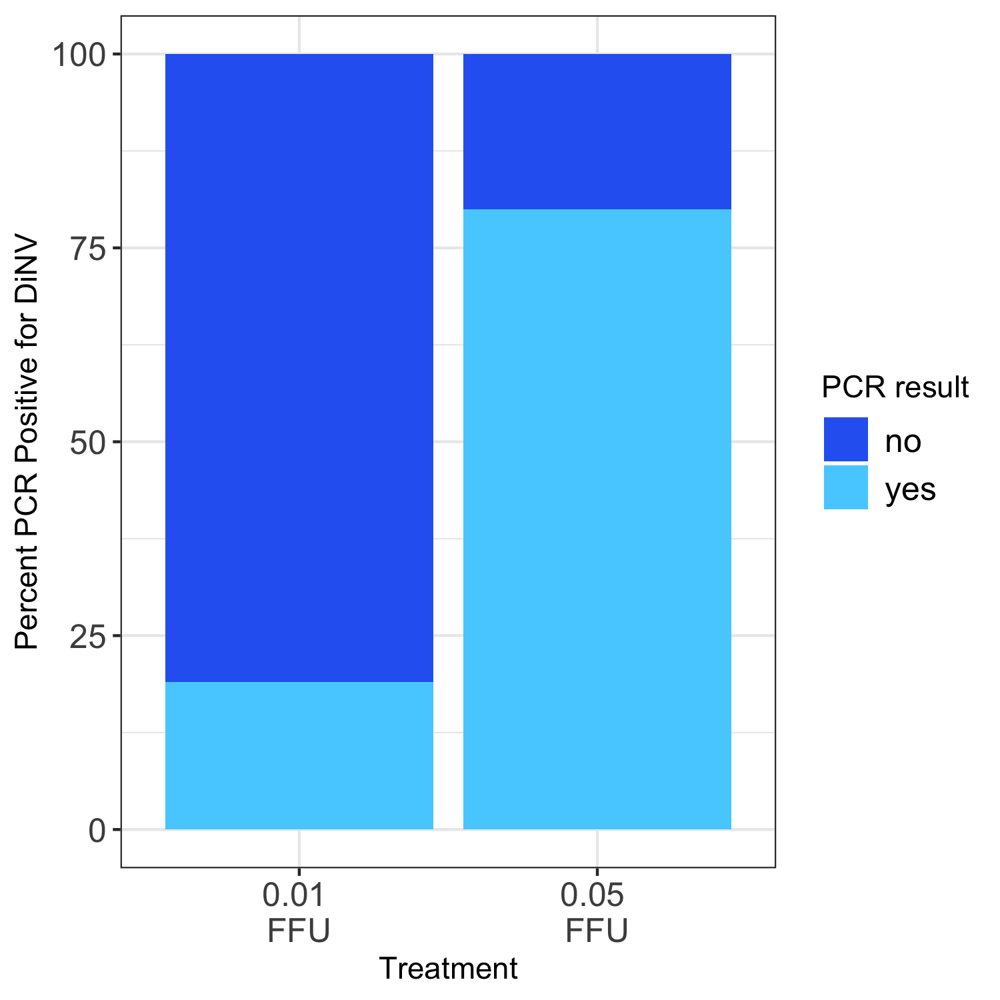

# 20240330-middle-band-day-14-PCR

Load packages needed

``` r
library(ggplot2)
library(tidyr)
library(dplyr)
```


    Attaching package: 'dplyr'

    The following objects are masked from 'package:stats':

        filter, lag

    The following objects are masked from 'package:base':

        intersect, setdiff, setequal, union

``` r
library(plyr)
```

    ------------------------------------------------------------------------------

    You have loaded plyr after dplyr - this is likely to cause problems.
    If you need functions from both plyr and dplyr, please load plyr first, then dplyr:
    library(plyr); library(dplyr)

    ------------------------------------------------------------------------------


    Attaching package: 'plyr'

    The following objects are masked from 'package:dplyr':

        arrange, count, desc, failwith, id, mutate, rename, summarise,
        summarize

Load in dataset

\*\* note that all maybe/faint bands were called PCR positive in this
analysis (whether they were called positive or negitive did not change
the conclusions from this, this was done to simplify visualization)

These samples are only the flies who were still alive on the day 14 mark
in both replicates of the middle band male dilution infections

``` r
PCR_results <- read.csv("/Users/maggieschedl/Desktop/Github/Unckless_Lab_Resources/PCR_analysis/20240330-middle-band-day-14/20240330-middle-band-day-14.csv")
# no extra rows or anything
```

Calculating proportions by FFU treatment

``` r
# subset out different FFUs
# there is only 0.01 and 0.05 left alive in this dataset 
PCR_results_005 <- subset(PCR_results, treatment == "0.05 FFU")

# how many rows does this DF have?
nrow(PCR_results_005)
```

    [1] 5

``` r
# 5 

# how many yes, no, and maybe PCR results are there for the p47 PCR for the day3 flies  0.05 
# make this into a table 
p47_results_005<- count(PCR_results_005$p47)

# add a column to that table that is the count (column name is freq) divided by the number of rows to get a proportion

p47_results_005$Result_prop <- p47_results_005$freq / nrow(PCR_results_005)

# add a column to that table with the percentage (proportion *100)
p47_results_005$Result_percent <- p47_results_005$Result_prop * 100

# add a column that says treatment
p47_results_005$Treatment <- "0.05 FFU"

#####
# repeat for 0.01 

PCR_results_001 <- subset(PCR_results, treatment == "0.01 FFU")

# how many rows does this DF have?
nrow(PCR_results_001)
```

    [1] 26

``` r
# 26

# how many yes, no, and maybe PCR results are there for the p47 PCR for the day3 flies  0.05 
# make this into a table 
p47_results_001<- count(PCR_results_001$p47)

# add a column to that table that is the count (column name is freq) divided by the number of rows to get a proportion

p47_results_001$Result_prop <- p47_results_001$freq / nrow(PCR_results_001)

# add a column to that table with the percentage (proportion *100)
p47_results_001$Result_percent <- p47_results_001$Result_prop * 100

# add a column that says treatment
p47_results_001$Treatment <- "0.01 FFU"


# combine dfs
percent_table <- rbind(p47_results_001, p47_results_005)

# create a new column in the df that is a round of the percent column
percent_table$Round_percent <- round(percent_table$Result_percent)

# make a ledgend title
legend_title <- "PCR result"

ggplot(percent_table, aes(x =factor(Treatment, level=c("0.01 FFU", "0.05 FFU")), y = Round_percent,fill =factor(x, level=c('no', 'yes')))) +
    geom_bar(stat = "identity")  + theme_bw() + xlab("Treatment") +
    theme(legend.text=element_text(size=12), axis.text=element_text(size=12)) + 
    scale_fill_manual(values = c( "#2C67F2", "#55d0ff"), legend_title ) + 
    ylab("Percent PCR Positive for DiNV") + scale_x_discrete(labels=c("0.01 FFU" = "0.01 \nFFU", "0.05 FFU" = "0.05 \nFFU"))
```


