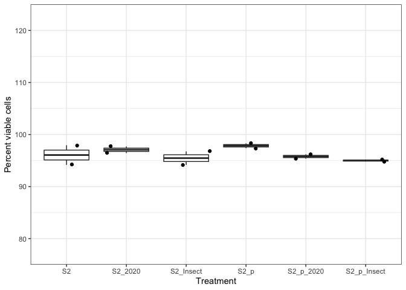

20221012-S2-transfection-cell-vialbility
================
2022-11-11

``` r
library(ggplot2)
library(dplyr)
```

    ## 
    ## Attaching package: 'dplyr'

    ## The following objects are masked from 'package:stats':
    ## 
    ##     filter, lag

    ## The following objects are masked from 'package:base':
    ## 
    ##     intersect, setdiff, setequal, union

## Read in csv

``` r
# input csv
cell_counts <- read.csv("~/Desktop/Github/Unckless_Lab_Resources/cell_viability_analysis/20221012/20221012_s2_transfection_cell_counts.csv")
```

## Make a simple boxplot of the viabilities

``` r
# make the limits to the y-axis make sense and show the points 
p <- ggplot(cell_counts, aes(x=treatment_short, y=p_viable_cells)) + 
  geom_boxplot() + scale_y_continuous(expand = c(0, 0), limits = c(75, 125)) + theme_bw() + geom_jitter() + ylab("Percent viable cells") + xlab("Treatment")
p
```

<!-- -->
