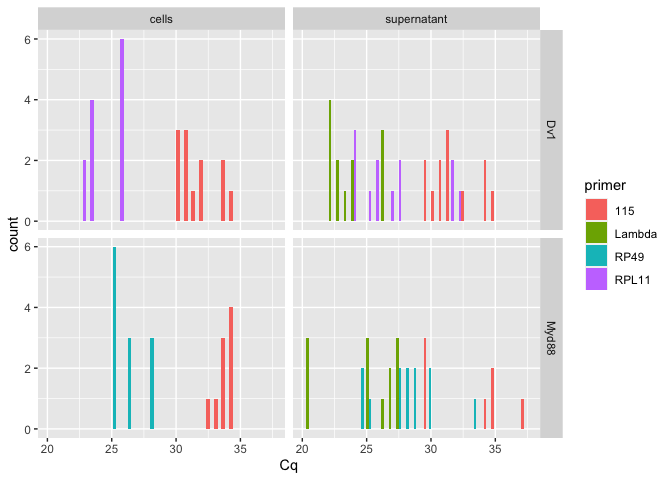
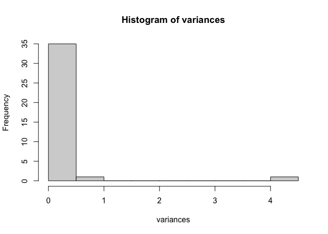
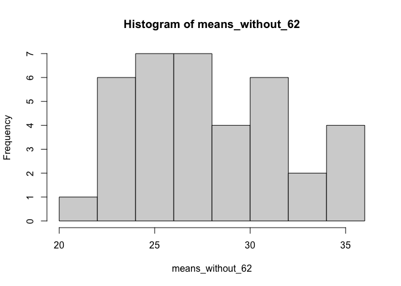
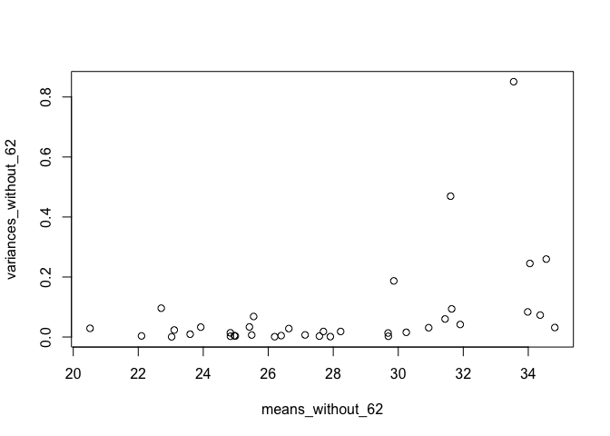
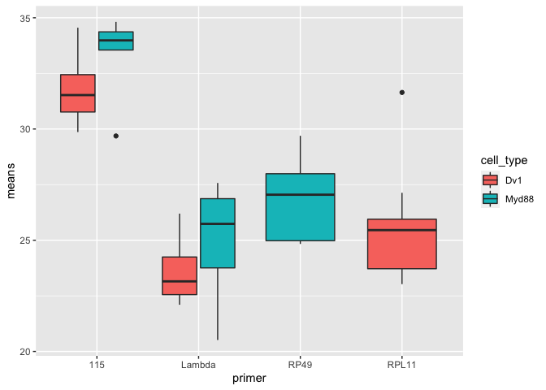
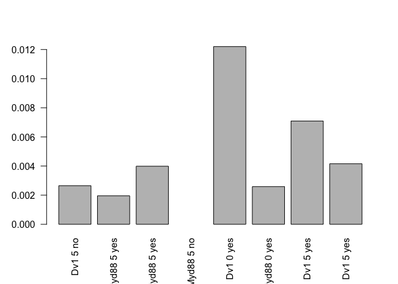
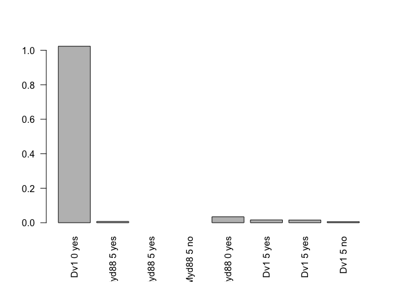
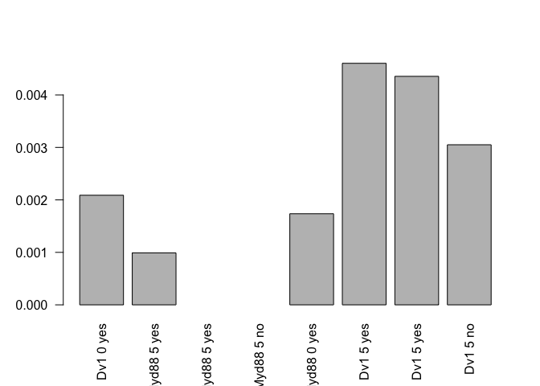
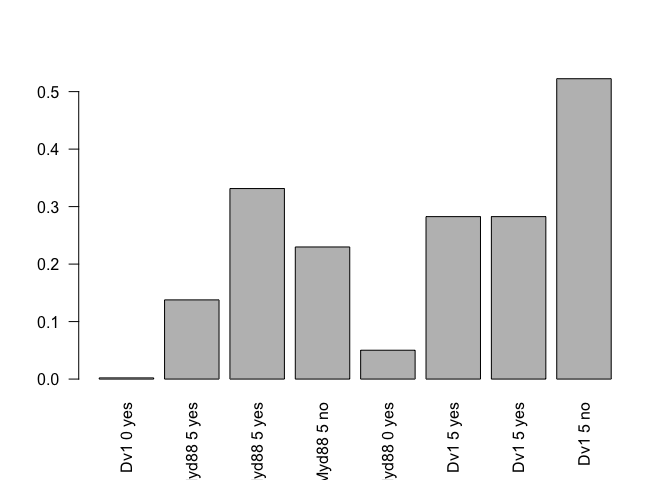

Myd88-Dv-1-Cell-DiNV-Infection-qPCR-Analysis
================
2023-01-30

Load packages needed

``` r
library(ggplot2)
library(dplyr)
```

    ## 
    ## Attaching package: 'dplyr'

    ## The following objects are masked from 'package:stats':
    ## 
    ##     filter, lag

    ## The following objects are masked from 'package:base':
    ## 
    ##     intersect, setdiff, setequal, union

``` r
library(tidyr)
```

Read in dataset

``` r
Cq_data <- read.csv("qPCR_plan_Myd88_Dv-1_combined_plates.csv")
```

Histogram of all Cq values

``` r
ggplot(Cq_data, aes(x= Cq, fill = primer)) + geom_histogram(position = "dodge") + facet_grid(cell_type~sample_type) 
```

    ## `stat_bin()` using `bins = 30`. Pick better value with `binwidth`.

    ## Warning: Removed 8 rows containing non-finite values (stat_bin).

<!-- -->

``` r
# fill for which primer 
# facet breaks up the graph into different components 
# dodge makes each primer have it's own column per value 
```

Calculate the variances between the qPCR replicates

``` r
# make a dummy variable that is just the columns we want, columns 4 through 9
x <- paste(Cq_data$sample_ID, Cq_data$primer, Cq_data$cell_type, Cq_data$sample_type, Cq_data$day, Cq_data$infected.)

# calculate the variances 
# tapply breaks the dataset up into groups and apply a function to each group
# we want each sample_ID/primer/day/sample_type group to have the variance calculated for the Cq value 
# and save this information as a variable 
variances <- tapply(Cq_data$Cq, x, var)

# look at a histogram of the variances 
hist(variances)
```

<!-- -->

``` r
# one has really high variance which is not good 

# which variances are above 0.2, which is higher than we want 
variances[which(variances > 0.2)]
```

    ##    1 115 Dv1 supernatant 0 yes          10 115 Dv1 cells 5 no 
    ##                      0.4693000                      0.2451000 
    ## 15 RP49 Myd88 supernatant 5 no        4 115 Myd88 cells 0 yes 
    ##                      4.1902333                      0.8509000 
    ##     9 115 Dv1 supernatant 5 no 
    ##                      0.2597333

Looks like for sample 15 Myd88 RP49 supernatant, the variance is super
high. We looked and it seemed like just one replicate PCR was wrong, the
other two are very close to each other. This sample is row 62, so we
decided to remove row 62 from further analyses.

Check variances and means without row 62

``` r
#subset dataframe without row 62
Cq_data_without_62 <- Cq_data[c(1:61, 63:120),]

# make same dummy variable with new dataframe
x <- paste(Cq_data_without_62$sample_ID, Cq_data_without_62$primer, Cq_data_without_62$cell_type, Cq_data_without_62$sample_type, Cq_data_without_62$day, Cq_data_without_62$infected.)

# calculate variances in new dataframe 
variances_without_62 <- tapply(Cq_data_without_62$Cq, x, var)

# How does sample 15 Myd88 RP49 supernatant look now?
variances_without_62[which(variances_without_62 > 0.2)]
```

    ## 1 115 Dv1 supernatant 0 yes       10 115 Dv1 cells 5 no 
    ##                   0.4693000                   0.2451000 
    ##     4 115 Myd88 cells 0 yes  9 115 Dv1 supernatant 5 no 
    ##                   0.8509000                   0.2597333

``` r
# that sample no longer has a worrying variance, good. 

# what are the Cq means for each sample_ID/primer/day/sample_type group?
means_without_62 <- tapply(Cq_data_without_62$Cq, x, mean)

# look at the means with a histogram
hist(means_without_62)
```

<!-- -->

``` r
# want to plot the variances versus the means 
plot(variances_without_62~means_without_62)
```

<!-- -->

``` r
# looks like the variances only increase to worrying levels with high means. Rob and I talked about this and for all of them except one (which has the lowest worrying variance), there either shouldn't be any detectable virus(not infected) or vely little (day 0). All of these are for the 115 primer. We are thinking that this level of variance is just what "no virus" looks like. So we will keep these for analysis. 
```

Now I need to reduce my dataframe to only include the means and
variances, which means every thrid line basically. Can I convert the
means and variances lists into their own dataframes?

``` r
# what is the variances thing?
class(variances_without_62)
```

    ## [1] "array"

``` r
# array

# transform array into df
variances_df <- as.data.frame.table(variances_without_62)
# this gives me a dataframe but the entire first column is all the variables 
# and the second column is the variances which it calls freq (not sure why)
# use dplyr to separate them out into separate columns 

# name all the columns I want 
variances_df_sep <- variances_df %>% separate(Var1, c('sample_ID', 'primer', 'cell_type', 'sample_type', 'day', 'infected'))
# check dataframe 
head(variances_df_sep)
```

    ##   sample_ID primer cell_type sample_type day infected       Freq
    ## 1         1    115       Dv1 supernatant   0      yes 0.46930000
    ## 2         1 Lambda       Dv1 supernatant   0      yes 0.09603333
    ## 3         1  RPL11       Dv1 supernatant   0      yes 0.09373333
    ## 4        10    115       Dv1       cells   5       no 0.24510000
    ## 5        10  RPL11       Dv1       cells   5       no 0.00670000
    ## 6        11    115     Myd88 supernatant   5      yes 0.03163333

``` r
# rename the Freq column to var for variance
names(variances_df_sep)[7] <- "var"
# check dataframe again
head(variances_df_sep)
```

    ##   sample_ID primer cell_type sample_type day infected        var
    ## 1         1    115       Dv1 supernatant   0      yes 0.46930000
    ## 2         1 Lambda       Dv1 supernatant   0      yes 0.09603333
    ## 3         1  RPL11       Dv1 supernatant   0      yes 0.09373333
    ## 4        10    115       Dv1       cells   5       no 0.24510000
    ## 5        10  RPL11       Dv1       cells   5       no 0.00670000
    ## 6        11    115     Myd88 supernatant   5      yes 0.03163333

So I have a df with the variances, now I want the means in it as well

``` r
# going to transform the means array into a df
means_df <- as.data.frame.table(means_without_62)
# reaname the Freq column to mean
names(means_df)[2] <- "mean"
head(means_df)
```

    ##                             Var1     mean
    ## 1    1 115 Dv1 supernatant 0 yes 31.61000
    ## 2 1 Lambda Dv1 supernatant 0 yes 22.70667
    ## 3  1 RPL11 Dv1 supernatant 0 yes 31.64333
    ## 4          10 115 Dv1 cells 5 no 34.05000
    ## 5        10 RPL11 Dv1 cells 5 no 25.49000
    ## 6 11 115 Myd88 supernatant 5 yes 34.81667

``` r
# the means and the variances dfs are in the same order which is nice
# now I want to add the mean column to the variances df
means_variances_of_Cq_df <- cbind(variances_df_sep, means = means_df$mean)
# check how it looks
head(means_variances_of_Cq_df)
```

    ##   sample_ID primer cell_type sample_type day infected        var    means
    ## 1         1    115       Dv1 supernatant   0      yes 0.46930000 31.61000
    ## 2         1 Lambda       Dv1 supernatant   0      yes 0.09603333 22.70667
    ## 3         1  RPL11       Dv1 supernatant   0      yes 0.09373333 31.64333
    ## 4        10    115       Dv1       cells   5       no 0.24510000 34.05000
    ## 5        10  RPL11       Dv1       cells   5       no 0.00670000 25.49000
    ## 6        11    115     Myd88 supernatant   5      yes 0.03163333 34.81667

Plot the raw means of Cqs by primer and cell type

``` r
ggplot(means_variances_of_Cq_df, aes(y= means, x=primer, fill=cell_type)) + geom_boxplot()
```

    ## Warning: Removed 3 rows containing non-finite values (stat_boxplot).

<!-- -->

Starting with just cells, create an only cell dataframe and calculate
the delta Cq, then visualize

``` r
cell_means <- means_variances_of_Cq_df[which(means_variances_of_Cq_df$sample_type == "cells"),]
# Note that 115 Cqs are first in pairs of samples, the second is the cell control primer  

# Separate that dataframe, incriminating by 2, every number between 1-16 
cell_means$means[seq(1,16,2)] # these are the 115 Cq means 
```

    ## [1] 34.05000 33.98333 34.36667       NA 31.90667 33.55000 30.24667 30.93667

``` r
cell_means$means[seq(2,16,2)] # these are the cell control primer Cq means 
```

    ## [1] 25.49000 24.98667 26.39667 27.91000 25.55000 24.95667 23.10667 23.02667

``` r
# make delta Cq, subtract the 115 value from the control primer value 
delta_Cqs_cells <- cell_means$means[seq(2,16,2)] - cell_means$means[seq(1,16,2)]

# use barplot to look at the delta Cq for each sample
# use paste to put in the row information, and the seq section to just separate out the rows I want, the 2^ to the delta_Cqs_cells takes it from a negative to a better ratio, and the las=2 makes the labels for the box plots go vertical and readable 
barplot(2^delta_Cqs_cells, names= paste(cell_means$cell_type, cell_means$day, cell_means$infected)[seq(1,16,2)], las=2)
```

<!-- -->

This does not look good for my experiment. The highest amount of virus
is in the cells on day 0 of Dv-1. This shows basically no replication in
the Dv-1 cells, which should show some. This might mean the whole
experiment is just bad quality and I can’t make any conclusions from it.

I still need to look at this information for supernatant though.

First look at supernatant and delta Cq for cell marker minus virus
marker - this is a virus per cell measure

``` r
supernatant_means <- means_variances_of_Cq_df[which(means_variances_of_Cq_df$sample_type == "supernatant"),]
# note here that the first row per sample is 115, the second is Lambda, and the third is the cell primer

# Separate that dataframe, incriminating by 3, every number between 1-24 
supernatant_means$means[seq(1,24,3)] # these are the 115 Cq means 
```

    ## [1] 31.61000 34.81667       NA       NA 29.68667 29.86333 31.44000 34.55333

``` r
supernatant_means$means[seq(2,24,3)] # these are the lambda primer Cq means
```

    ## [1] 22.70667 24.83667 26.63333 27.57333 20.51667 22.10000 23.59667 26.19667

``` r
supernatant_means$means[seq(3,24,3)] # these are the cell primer Cq means
```

    ## [1] 31.64333 27.69667 28.22667 29.69500 24.83333 23.92333 25.42000 27.13333

``` r
# make delta Cq for cell marker minus virus marker: subtract the 115 value from the control primer value 
delta_Cqs_sup_vir <- supernatant_means$means[seq(3,24,3)] - supernatant_means$means[seq(1,24,3)]

# use barplot to look at the delta Cq for each sample
barplot(2^delta_Cqs_sup_vir, names= paste(supernatant_means$cell_type, supernatant_means$day, supernatant_means$infected)[seq(1,24,3)], las=2)
```

<!-- -->

This basically says that there is only DiNV DNA present in the day 0
supernatant for Dv-1 cells. This might make sense if no infectious virus
is produced. There should be a similar amount in the day 0 supernatant
for Myd88 cells, but there isn’t in this plot. This indicates some
badness with my data.

Then look at supernatant and delta Cq for lambda primer minus virus
marker - this gives a measure of extraction control (because supernatant
may not have much cells/DNA)

``` r
# Separate that dataframe, incriminating by 3, every number between 1-24 
supernatant_means$means[seq(1,24,3)] # these are the 115 Cq means 
```

    ## [1] 31.61000 34.81667       NA       NA 29.68667 29.86333 31.44000 34.55333

``` r
supernatant_means$means[seq(2,24,3)] # these are the lambda primer Cq means
```

    ## [1] 22.70667 24.83667 26.63333 27.57333 20.51667 22.10000 23.59667 26.19667

``` r
supernatant_means$means[seq(3,24,3)] # these are the cell primer Cq means
```

    ## [1] 31.64333 27.69667 28.22667 29.69500 24.83333 23.92333 25.42000 27.13333

``` r
# make delta Cq for lambda minus virus marker: subtract the 115 value from the lambda value 
delta_Cqs_sup_ex <- supernatant_means$means[seq(2,24,3)] - supernatant_means$means[seq(1,24,3)]

# use barplot to look at the delta Cq for each sample
barplot(2^delta_Cqs_sup_ex, names= paste(supernatant_means$cell_type, supernatant_means$day, supernatant_means$infected)[seq(1,24,3)], las=2)
```

<!-- -->

This seems to show there is some variablitly of how my extractions went,
because the Lambda amount fluctuates, however if you look at the y axis
it’s a pretty low scale.

Then look at supernatant and delta Cq for lambda primer minus cell
marker - this gives a measure of how many cells are in the supernatant

``` r
# Separate that dataframe, incriminating by 3, every number between 1-24 
supernatant_means$means[seq(1,24,3)] # these are the 115 Cq means 
```

    ## [1] 31.61000 34.81667       NA       NA 29.68667 29.86333 31.44000 34.55333

``` r
supernatant_means$means[seq(2,24,3)] # these are the lambda primer Cq means
```

    ## [1] 22.70667 24.83667 26.63333 27.57333 20.51667 22.10000 23.59667 26.19667

``` r
supernatant_means$means[seq(3,24,3)] # these are the cell primer Cq means
```

    ## [1] 31.64333 27.69667 28.22667 29.69500 24.83333 23.92333 25.42000 27.13333

``` r
# make delta Cq for lambda minus cell marker: subtract the cell primer value from the lambda value 
delta_Cqs_sup_cell <- supernatant_means$means[seq(2,24,3)] - supernatant_means$means[seq(3,24,3)]

# use barplot to look at the delta Cq for each sample
barplot(2^delta_Cqs_sup_cell, names= paste(supernatant_means$cell_type, supernatant_means$day, supernatant_means$infected)[seq(1,24,3)], las=2)
```

<!-- -->

This makes sense that on day 5 there would be more cells in the
supernatant than on day 0 of the experiment. Actually the two infected
Dv-1s on day 5 are very consistant. The Myd88s are not. And the
non-infected is different as well. So there is considerable variability
here too.
