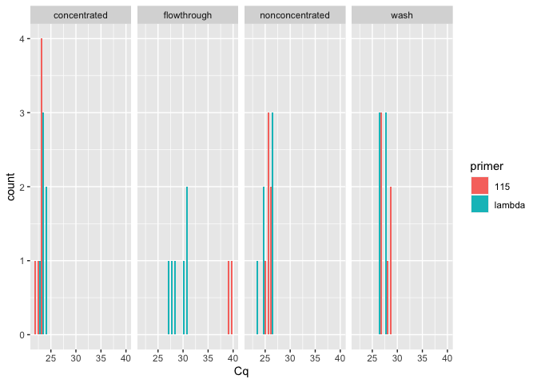
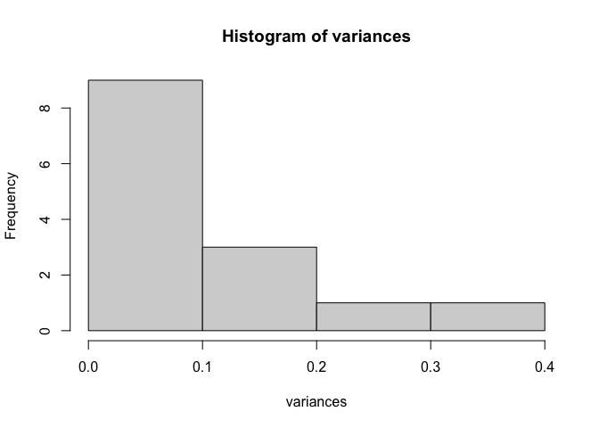
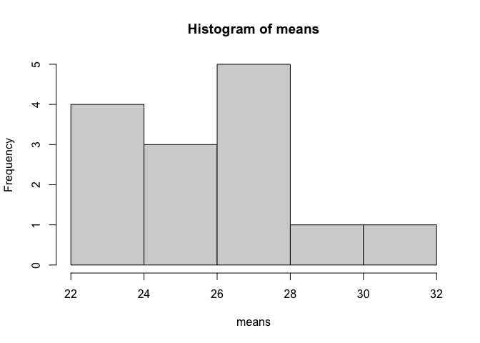
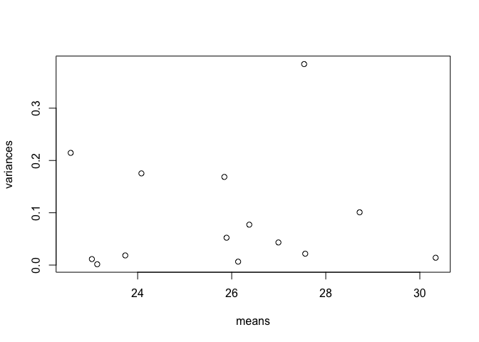
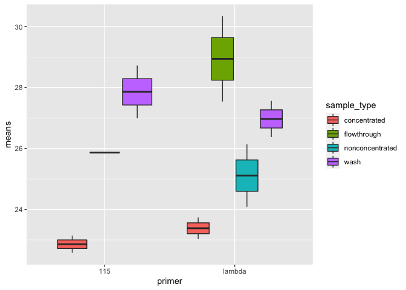
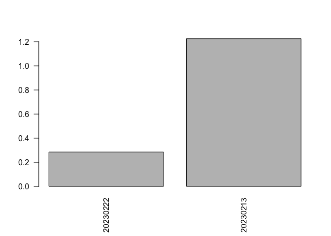
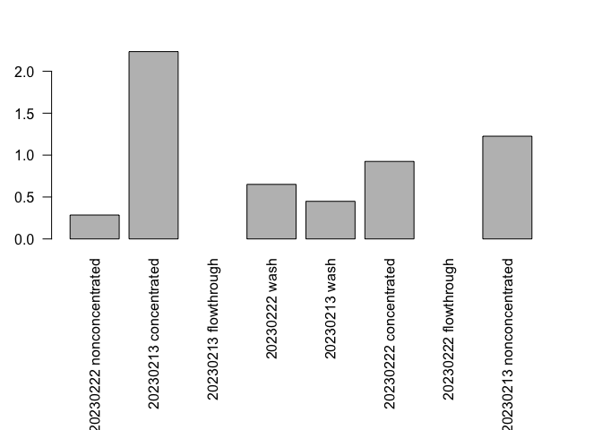

20230302-fluid-concentration-qPCR-analysis
================
2023-03-03

Load packages

``` r
library(ggplot2)
library(dplyr)
```

    ## 
    ## Attaching package: 'dplyr'

    ## The following objects are masked from 'package:stats':
    ## 
    ##     filter, lag

    ## The following objects are masked from 'package:base':
    ## 
    ##     intersect, setdiff, setequal, union

``` r
library(tidyr)
```

Read in the data

``` r
Cq_data <- read.csv("/Users/maggieschedl/Desktop/Github/Unckless_Lab_Resources/qPCR_analysis/20230302-fluid-concentration/20230302-fluid-concentration.csv")
```

Histogram of all Cq values

``` r
ggplot(Cq_data, aes(x= Cq, fill = primer)) + geom_histogram(position = "dodge") + facet_grid(~sample_type) 
```

    ## `stat_bin()` using `bins = 30`. Pick better value with `binwidth`.

    ## Warning: Removed 4 rows containing non-finite values (stat_bin).

<!-- -->

``` r
# fill for which primer 
# facet breaks up the graph into different components by sample type
# dodge makes each primer have it's own column per value 
```

Can see obvious differences between the ones that should have virus and
the ones that don’t. Not as much difference between the non-concentrated
and the concentrated but that might be ok. Lambda values are also
different, but I wasn’t able to add the same amount of DNA to each
reaction so it wasn’t normalized.

Calculate variances for the qPCR replicates. We are hoping that the
variances are small between the replicates. The bars in the graph above
are tightly clustered, and usually have a count of 3 which is a good
sign. But we need to check mathamatically

``` r
# make a dummy variable that is just the columns we want
x <- paste(Cq_data$sample_ID, Cq_data$primer, Cq_data$sample_type, Cq_data$date)

# calculate the variances 
# tapply breaks the dataset up into groups and apply a function to each group
# we want each sample_ID/primer/day/sample_type group to have the variance calculated for the Cq value 
# and save this information as a variable 
variances <- tapply(Cq_data$Cq, x, var)

# look at a histogram of the variances 
hist(variances)
```

<!-- -->

``` r
# one has really high variance which is not good 

# which variances are above 0.2, which is higher than we want 
variances[which(variances > 0.2)]
```

    ##  11 115 concentrated 20230213 6 lambda flowthrough 20230222 
    ##                     0.2145333                     0.3843000

Most variances are very low. There are only two variances that are above
0.2, and not by much. For both of these if I look at the Cq numbers, it
doesn’t seem like one Cq is the value making the variance high, they are
all a bit different. So I will keep these for now but it’s something to
know about.

Now I need to calculate the mean Cq for the replicates

``` r
# what are the Cq means for each sample_ID/primer/day/sample_type group?
means<- tapply(Cq_data$Cq, x, mean)

# look at the means with a histogram
hist(means)
```

<!-- -->

``` r
# want to plot the variances versus the means 
plot(variances~means)
```

<!-- -->

There is no real relationship here between what the Cq is and what the
variance is. However I noticed here that at least one set of Cqs is not
on here

Where is the sample 13 values?

``` r
# is it in the variable?
print(x)
```

    ##  [1] "1 115 nonconcentrated 20230222"    "1 115 nonconcentrated 20230222"   
    ##  [3] "1 115 nonconcentrated 20230222"    "1 lambda nonconcentrated 20230222"
    ##  [5] "1 lambda nonconcentrated 20230222" "1 lambda nonconcentrated 20230222"
    ##  [7] "4 115 concentrated 20230222"       "4 115 concentrated 20230222"      
    ##  [9] "4 115 concentrated 20230222"       "4 lambda concentrated 20230222"   
    ## [11] "4 lambda concentrated 20230222"    "4 lambda concentrated 20230222"   
    ## [13] "6 115 flowthrough 20230222"        "6 115 flowthrough 20230222"       
    ## [15] "6 115 flowthrough 20230222"        "6 lambda flowthrough 20230222"    
    ## [17] "6 lambda flowthrough 20230222"     "6 lambda flowthrough 20230222"    
    ## [19] "8 115 nonconcentrated 20230213"    "8 115 nonconcentrated 20230213"   
    ## [21] "8 115 nonconcentrated 20230213"    "8 lambda nonconcentrated 20230213"
    ## [23] "8 lambda nonconcentrated 20230213" "8 lambda nonconcentrated 20230213"
    ## [25] "11 115 concentrated 20230213"      "11 115 concentrated 20230213"     
    ## [27] "11 115 concentrated 20230213"      "11 lambda concentrated 20230213"  
    ## [29] "11 lambda concentrated 20230213"   "11 lambda concentrated 20230213"  
    ## [31] "13 115 flowthrough 20230213"       "13 115 flowthrough 20230213"      
    ## [33] "13 115 flowthrough 20230213"       "13 lambda flowthrough 20230213"   
    ## [35] "13 lambda flowthrough 20230213"    "13 lambda flowthrough 20230213"   
    ## [37] "17 115 wash 20230222"              "17 115 wash 20230222"             
    ## [39] "17 115 wash 20230222"              "17 lambda wash 20230222"          
    ## [41] "17 lambda wash 20230222"           "17 lambda wash 20230222"          
    ## [43] "18 115 wash 20230213"              "18 115 wash 20230213"             
    ## [45] "18 115 wash 20230213"              "18 lambda wash 20230213"          
    ## [47] "18 lambda wash 20230213"           "18 lambda wash 20230213"

``` r
#yes 

# is it in the means?
print(means)
```

    ##    1 115 nonconcentrated 20230222 1 lambda nonconcentrated 20230222 
    ##                          25.89000                          24.08000 
    ##      11 115 concentrated 20230213   11 lambda concentrated 20230213 
    ##                          22.57667                          23.73667 
    ##       13 115 flowthrough 20230213    13 lambda flowthrough 20230213 
    ##                                NA                          30.33667 
    ##              17 115 wash 20230222           17 lambda wash 20230222 
    ##                          26.99333                          26.37333 
    ##              18 115 wash 20230213           18 lambda wash 20230213 
    ##                          28.72000                          27.56333 
    ##       4 115 concentrated 20230222    4 lambda concentrated 20230222 
    ##                          23.14000                          23.02667 
    ##        6 115 flowthrough 20230222     6 lambda flowthrough 20230222 
    ##                                NA                          27.54000 
    ##    8 115 nonconcentrated 20230213 8 lambda nonconcentrated 20230213 
    ##                          25.84333                          26.13667

``` r
# no, because there is 1 NA it seems like it didn't do a mean. Should I remove that one line that has the NA? 
# the other NA is sample 6 where all the Cqs were NA so nothing should come out of that 
```

Going to change my data frame so that it has only one row per
sample/primer and has the mean and the variance of the Cq as well

``` r
# I know that the variances is an array 
# transform array into df
variances_df <- as.data.frame.table(variances)
# this gives me a dataframe but the entire first column is all the variables 
# and the second column is the variances which it calls freq (not sure why)
# use dplyr to separate them out into separate columns 

# name all the columns I want 
variances_df_sep <- variances_df %>% separate(Var1, c('sample_ID', 'primer', 'sample_type', "date"))
# check dataframe 
head(variances_df_sep)
```

    ##   sample_ID primer     sample_type     date       Freq
    ## 1         1    115 nonconcentrated 20230222 0.05230000
    ## 2         1 lambda nonconcentrated 20230222 0.17530000
    ## 3        11    115    concentrated 20230213 0.21453333
    ## 4        11 lambda    concentrated 20230213 0.01843333
    ## 5        13    115     flowthrough 20230213         NA
    ## 6        13 lambda     flowthrough 20230213 0.01403333

``` r
# rename the Freq column to var for variance
names(variances_df_sep)[5] <- "var"
# check dataframe again
head(variances_df_sep)
```

    ##   sample_ID primer     sample_type     date        var
    ## 1         1    115 nonconcentrated 20230222 0.05230000
    ## 2         1 lambda nonconcentrated 20230222 0.17530000
    ## 3        11    115    concentrated 20230213 0.21453333
    ## 4        11 lambda    concentrated 20230213 0.01843333
    ## 5        13    115     flowthrough 20230213         NA
    ## 6        13 lambda     flowthrough 20230213 0.01403333

Basically do the same thing for the means information and add it in

``` r
# going to transform the means array into a df
means_df <- as.data.frame.table(means)
# reaname the Freq column to mean
names(means_df)[2] <- "mean"
head(means_df)
```

    ##                                Var1     mean
    ## 1    1 115 nonconcentrated 20230222 25.89000
    ## 2 1 lambda nonconcentrated 20230222 24.08000
    ## 3      11 115 concentrated 20230213 22.57667
    ## 4   11 lambda concentrated 20230213 23.73667
    ## 5       13 115 flowthrough 20230213       NA
    ## 6    13 lambda flowthrough 20230213 30.33667

``` r
# the means and the variances dfs are in the same order which is nice
# now I want to add the mean column to the variances df
means_variances_of_Cq_df <- cbind(variances_df_sep, means = means_df$mean)
# check how it looks
head(means_variances_of_Cq_df)
```

    ##   sample_ID primer     sample_type     date        var    means
    ## 1         1    115 nonconcentrated 20230222 0.05230000 25.89000
    ## 2         1 lambda nonconcentrated 20230222 0.17530000 24.08000
    ## 3        11    115    concentrated 20230213 0.21453333 22.57667
    ## 4        11 lambda    concentrated 20230213 0.01843333 23.73667
    ## 5        13    115     flowthrough 20230213         NA       NA
    ## 6        13 lambda     flowthrough 20230213 0.01403333 30.33667

Plot the raw means of Cqs by primer and sample type

``` r
ggplot(means_variances_of_Cq_df, aes(y= means, x=primer, fill=sample_type)) + geom_boxplot()
```

    ## Warning: Removed 2 rows containing non-finite values (stat_boxplot).

<!-- -->

Flowthrough 115 is not in here because it is NAs in my data.

Separate out the dataframe to just non-concentrated samples, then
calculate the delta Cq between lambda and 115

``` r
# separate out sample type to non-concentrate
NC_means <- means_variances_of_Cq_df[which(means_variances_of_Cq_df$sample_type == "nonconcentrated"),]

# Separate that dataframe, incriminating by 2, every number between 1-4 
NC_means$means[seq(1,4,2)] # these are the 115 Cq means 
```

    ## [1] 25.89000 25.84333

``` r
NC_means$means[seq(2,4,2)] # these are lambda primer Cq mean
```

    ## [1] 24.08000 26.13667

``` r
# make delta Cq, subtract the 115 value from the lambda primer value 
delta_Cqs_NC <- NC_means$means[seq(2,4,2)] - NC_means$means[seq(1,4,2)]

# use barplot to look at the delta Cq for each sample
# use paste to put in the row information, and the seq section to just separate out the rows I want, the 2^ to the delta_Cqs_cells takes it from a negative to a better ratio, and the las=2 makes the labels for the box plots go vertical and readable 
barplot(2^delta_Cqs_NC, names= paste(NC_means$date)[seq(1,4,2)], las=2)
```

<!-- -->

I am not sure what this means yet. Should I have not separated out the
groups? Maybe I should try to do this looking at all of them at once?

Calculating Delta Cq for all data

``` r
# Separate the means and variances dataframe, incriminating by 2, every number between 1-16 
means_variances_of_Cq_df$means[seq(1,16,2)] # these are the 115 Cq means 
```

    ## [1] 25.89000 22.57667       NA 26.99333 28.72000 23.14000       NA 25.84333

``` r
means_variances_of_Cq_df$means[seq(2,16,2)] # these are lambda primer Cq mean
```

    ## [1] 24.08000 23.73667 30.33667 26.37333 27.56333 23.02667 27.54000 26.13667

``` r
# make delta Cq, subtract the 115 value from the lambda primer value 
delta_Cqs <- means_variances_of_Cq_df$means[seq(2,16,2)] - means_variances_of_Cq_df$means[seq(1,16,2)]

# use barplot to look at the delta Cq for each sample
# use paste to put in the row information, and the seq section to just separate out the rows I want, the 2^ to the delta_Cqs_cells takes it from a negative to a better ratio, and the las=2 makes the labels for the box plots go vertical and readable 
# increase margin size
par(mar = c(11, 3, 3, 3))
barplot(2^delta_Cqs, names= paste(means_variances_of_Cq_df$date, means_variances_of_Cq_df$sample_type)[seq(1,16,2)], las=2,)
```

<!-- -->
