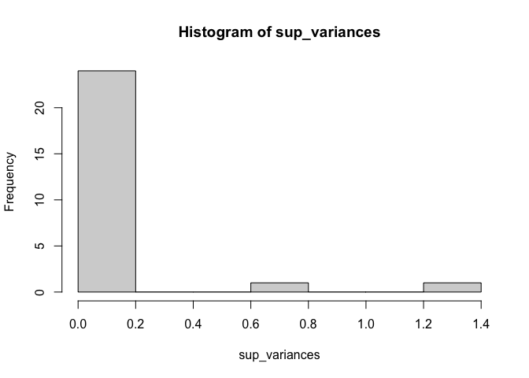
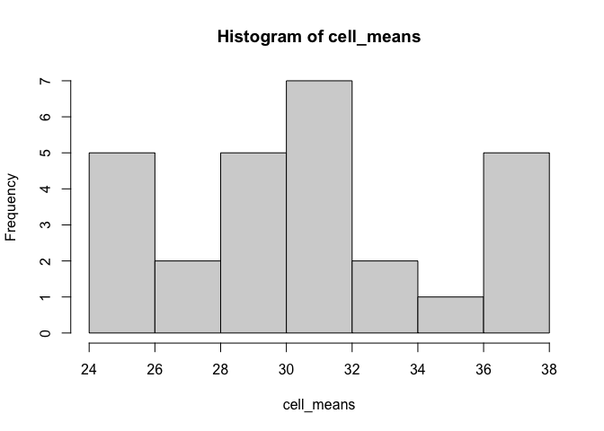
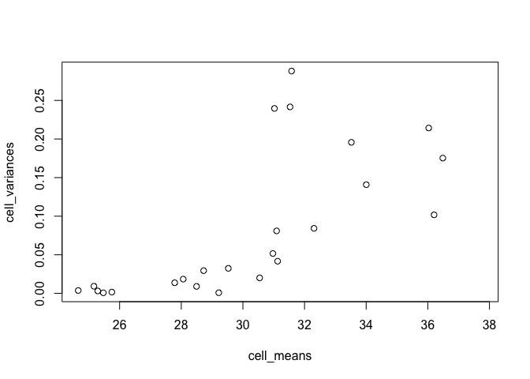
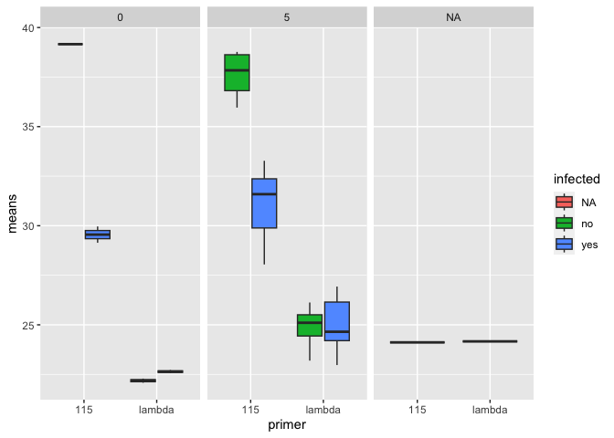
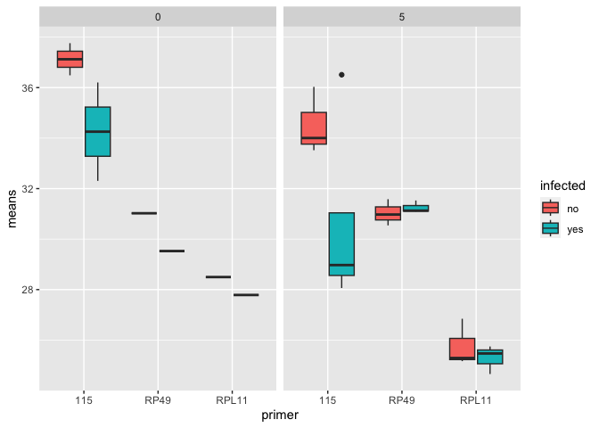
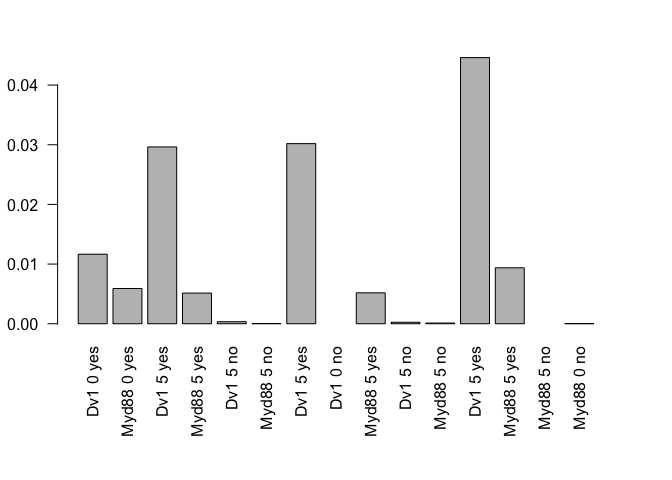

20230307-Myd88-Dv-1-qPCR-DiNV-Analysis
================
2023-03-07

Load packages needed

``` r
library(ggplot2)
library(dplyr)
```

    ## 
    ## Attaching package: 'dplyr'

    ## The following objects are masked from 'package:stats':
    ## 
    ##     filter, lag

    ## The following objects are masked from 'package:base':
    ## 
    ##     intersect, setdiff, setequal, union

``` r
library(tidyr)
```

Load in the two datasets, supernatant and cells:

``` r
supernatant_Cqs <- read.csv("/Users/maggieschedl/Desktop/Github/Unckless_Lab_Resources/qPCR_analysis/20230307-Myd88-Dv-1/20230307-supernatants-Cqs.csv")

cells_Cqs <- read.csv("/Users/maggieschedl/Desktop/Github/Unckless_Lab_Resources/qPCR_analysis/20230307-Myd88-Dv-1/20230307-cells-Cqs.csv")
```

Histogram of all Cq values for Supernatant

``` r
# supernatant
ggplot(supernatant_Cqs, aes(x= Cq, fill = primer)) + geom_histogram(position = "dodge") + facet_grid(cell_type~day) 
```

    ## `stat_bin()` using `bins = 30`. Pick better value with `binwidth`.

    ## Warning: Removed 12 rows containing non-finite values (`stat_bin()`).

<!-- -->

``` r
# fill for which primer 
# facet breaks up the graph into different components 
# dodge makes each primer have it's own column per value 
```

The NA for day is the 40ul original aliquot/innoculum sample.

Histogram of all Cq values for Cells

``` r
# cells
ggplot(cells_Cqs, aes(x= Cq, fill = primer)) + geom_histogram(position = "dodge") + facet_grid(cell_type~day) 
```

    ## `stat_bin()` using `bins = 30`. Pick better value with `binwidth`.

    ## Warning: Removed 20 rows containing non-finite values (`stat_bin()`).

<!-- -->

``` r
# fill for which primer 
# facet breaks up the graph into different components 
# dodge makes each primer have it's own column per value 
```

You can already tell that it seems like nothing is going on with DiNV
for the Myd88 cells in terms of replication.

Calculate the variances between the qPCR replicates for supernatant
samples

``` r
# make a dummy variable that is just the columns we want
s <- paste(supernatant_Cqs$sample_ID, supernatant_Cqs$primer, supernatant_Cqs$cell_type, supernatant_Cqs$day, supernatant_Cqs$infection)

# calculate the variances 
# tapply breaks the dataset up into groups and apply a function to each group
# we want each sample_ID/primer/day/cell_type group to have the variance calculated for the Cq value 
# and save this information as a variable 
sup_variances <- tapply(supernatant_Cqs$Cq, s, var)

# look at a histogram of the variances 
hist(sup_variances)
```

<!-- -->

``` r
# one has really high variance which is not good 

# which variances are above 0.2, which is higher than we want 
sup_variances[which(sup_variances > 0.2)]
```

    ## 27 115 Dv1 5 no 31 115 Dv1 5 no 
    ##          1.2081          0.7651

Ok looks like there are 2 variances that are too high, both for
non-infected 115 reactions. That could make sense because there is
nothing to amplify so it is getting not good signal. I am not sure if
there is a replicate to remove in these that would make the variances go
down meaningfully. Right now I will leave them.

Calculate the variances between the qPCR replicates for cell samples

``` r
# make a dummy variable that is just the columns we want
c <- paste(cells_Cqs$sample_ID, cells_Cqs$primer, cells_Cqs$cell_type, cells_Cqs$day, cells_Cqs$infected.)

# calculate the variances 
# tapply breaks the dataset up into groups and apply a function to each group
# we want each sample_ID/primer/day/cell_type group to have the variance calculated for the Cq value 
# and save this information as a variable 
cell_variances <- tapply(cells_Cqs$Cq, c, var)

# look at a histogram of the variances 
hist(cell_variances)
```

<!-- -->

``` r
# one has really high variance which is not good 

# which variances are above 0.2, which is higher than we want 
cell_variances[which(cell_variances > 0.2)]
```

    ##  16 RP49 Myd88 0 no  40 RP49 Myd88 5 no 46 RP49 Myd88 5 yes     47 115 Dv1 5 no 
    ##           0.2396333           0.2881000           0.2416000           0.2143000

Again, I am not sure if I should remove any of the replicates. For
these, there does seem to be one replicate that is somewhat off. But,
the overall variances are not too worrying. For now I will leave them?

Calculate the mean Cq values for supernatants

``` r
# what are the Cq means for each sample_ID/primer/day/sample_type group?
sup_means <- tapply(supernatant_Cqs$Cq, s, mean, na.rm=T)

# look at the means with a histogram
hist(sup_means)
```

<!-- -->

``` r
# want to plot the variances versus the means 
plot(sup_variances~sup_means)
```

<!-- -->

This shows that as the Cq goes up/approaches the limit, the variance
increases. This sort of makes sense, that the values get more erratic at
the edge of detection.

Calculate the mean Cq values for Cells

``` r
# what are the Cq means for each sample_ID/primer/day/sample_type group?
cell_means <- tapply(cells_Cqs$Cq, c, mean, na.rm=T)

# look at the means with a histogram
hist(cell_means)
```

<!-- -->

``` r
# want to plot the variances versus the means 
plot(cell_variances~cell_means)
```

<!-- -->

Again, there is the same pattern here of increasing variance with
increased Cq mean. However it is not just the close to 40 Cqs, but the
“higher” variances are much smaller than those for the supernatant. An
interesting pattern. I’m not sure what to make of it.

Now I need to add the mean and variance values to my main dataframes.
First I will do this for the supernatant

``` r
# transform array into df
sup_variances_df <- as.data.frame.table(sup_variances)
# this gives me a dataframe but the entire first column is all the variables 
# and the second column is the variances which it calls freq (not sure why)
# use dplyr to separate them out into separate columns 

# name all the columns I want 
sup_variances_df_sep <- sup_variances_df %>% separate(Var1, c('sample_ID', 'primer', 'cell_type', 'day', 'infected'))
# check dataframe 
head(sup_variances_df_sep)
```

    ##   sample_ID primer cell_type day infected         Freq
    ## 1         1    115       Dv1   0      yes 0.0513000000
    ## 2         1 lambda       Dv1   0      yes 0.0009333333
    ## 3         2    115     Myd88   0      yes 0.0310333333
    ## 4         2 lambda     Myd88   0      yes 0.0021000000
    ## 5        25    115       Dv1   5      yes 0.0086333333
    ## 6        25 lambda       Dv1   5      yes 0.0057000000

``` r
# rename the Freq column to var for variance
names(sup_variances_df_sep)[6] <- "var"
# check dataframe again
head(sup_variances_df_sep)
```

    ##   sample_ID primer cell_type day infected          var
    ## 1         1    115       Dv1   0      yes 0.0513000000
    ## 2         1 lambda       Dv1   0      yes 0.0009333333
    ## 3         2    115     Myd88   0      yes 0.0310333333
    ## 4         2 lambda     Myd88   0      yes 0.0021000000
    ## 5        25    115       Dv1   5      yes 0.0086333333
    ## 6        25 lambda       Dv1   5      yes 0.0057000000

So I have a df with the variances, now I want the means in it as well

``` r
# going to transform the means array into a df
sup_means_df <- as.data.frame.table(sup_means)
# reaname the Freq column to mean
names(sup_means_df)[2] <- "mean"
head(sup_means_df)
```

    ##                   Var1     mean
    ## 1      1 115 Dv1 0 yes 29.14000
    ## 2   1 lambda Dv1 0 yes 22.71667
    ## 3    2 115 Myd88 0 yes 29.96333
    ## 4 2 lambda Myd88 0 yes 22.56000
    ## 5     25 115 Dv1 5 yes 28.04667
    ## 6  25 lambda Dv1 5 yes 22.97000

``` r
# the means and the variances dfs are in the same order which is nice
# now I want to add the mean column to the variances df
sup_means_variances_of_Cq_df <- cbind(sup_variances_df_sep, means = sup_means_df$mean)
# check how it looks
head(sup_means_variances_of_Cq_df)
```

    ##   sample_ID primer cell_type day infected          var    means
    ## 1         1    115       Dv1   0      yes 0.0513000000 29.14000
    ## 2         1 lambda       Dv1   0      yes 0.0009333333 22.71667
    ## 3         2    115     Myd88   0      yes 0.0310333333 29.96333
    ## 4         2 lambda     Myd88   0      yes 0.0021000000 22.56000
    ## 5        25    115       Dv1   5      yes 0.0086333333 28.04667
    ## 6        25 lambda       Dv1   5      yes 0.0057000000 22.97000

Do this same process for the cells data

``` r
# transform array into df
cells_variances_df <- as.data.frame.table(cell_variances)
# this gives me a dataframe but the entire first column is all the variables 
# and the second column is the variances which it calls freq (not sure why)
# use dplyr to separate them out into separate columns 

# name all the columns I want 
cells_variances_df_sep <- cells_variances_df %>% separate(Var1, c('sample_ID', 'primer', 'cell_type', 'day', 'infected'))
# check dataframe 
head(cells_variances_df_sep)
```

    ##   sample_ID primer cell_type day infected        Freq
    ## 1        13    115       Dv1   0      yes 0.084233333
    ## 2        13  RPL11       Dv1   0      yes 0.013733333
    ## 3        14    115     Myd88   0      yes 0.101733333
    ## 4        14   RP49     Myd88   0      yes 0.032433333
    ## 5        15    115       Dv1   0       no 0.175233333
    ## 6        15  RPL11       Dv1   0       no 0.009033333

``` r
# rename the Freq column to var for variance
names(cells_variances_df_sep)[6] <- "var"
# check dataframe again
head(cells_variances_df_sep)
```

    ##   sample_ID primer cell_type day infected         var
    ## 1        13    115       Dv1   0      yes 0.084233333
    ## 2        13  RPL11       Dv1   0      yes 0.013733333
    ## 3        14    115     Myd88   0      yes 0.101733333
    ## 4        14   RP49     Myd88   0      yes 0.032433333
    ## 5        15    115       Dv1   0       no 0.175233333
    ## 6        15  RPL11       Dv1   0       no 0.009033333

So I have a df with the variances, now I want the means in it as well

``` r
# going to transform the means array into a df
cell_means_df <- as.data.frame.table(cell_means)
# reaname the Freq column to mean
names(cell_means_df)[2] <- "mean"
head(cell_means_df)
```

    ##                  Var1     mean
    ## 1    13 115 Dv1 0 yes 32.30667
    ## 2  13 RPL11 Dv1 0 yes 27.78667
    ## 3  14 115 Myd88 0 yes 36.20333
    ## 4 14 RP49 Myd88 0 yes 29.52667
    ## 5     15 115 Dv1 0 no 36.48667
    ## 6   15 RPL11 Dv1 0 no 28.49667

``` r
# the means and the variances dfs are in the same order which is nice
# now I want to add the mean column to the variances df
cell_means_variances_of_Cq_df <- cbind(cells_variances_df_sep, means = cell_means_df$mean)
# check how it looks
head(cell_means_variances_of_Cq_df)
```

    ##   sample_ID primer cell_type day infected         var    means
    ## 1        13    115       Dv1   0      yes 0.084233333 32.30667
    ## 2        13  RPL11       Dv1   0      yes 0.013733333 27.78667
    ## 3        14    115     Myd88   0      yes 0.101733333 36.20333
    ## 4        14   RP49     Myd88   0      yes 0.032433333 29.52667
    ## 5        15    115       Dv1   0       no 0.175233333 36.48667
    ## 6        15  RPL11       Dv1   0       no 0.009033333 28.49667

Plot the raw means of Cqs by primer for supernatant by day

``` r
ggplot(sup_means_variances_of_Cq_df, aes(y= means, x=primer, fill=infected)) + geom_boxplot() + facet_grid(~day) 
```

    ## Warning: Removed 2 rows containing non-finite values (`stat_boxplot()`).

<!-- -->

Plot the raw means of Cqs by primer for cells by day

``` r
ggplot(cell_means_variances_of_Cq_df, aes(y= means, x=primer, fill=infected)) + geom_boxplot() + facet_grid(~day) 
```

    ## Warning: Removed 5 rows containing non-finite values (`stat_boxplot()`).

<!-- -->

Starting with just supernatant, calculate the delta Cq, then visualize

``` r
# separate out the 40ul sample because that one won't fit in 
sup_means_var <- sup_means_variances_of_Cq_df[which(sup_means_variances_of_Cq_df$cell_type != "innubila"),]

# Separate that dataframe, incriminating by 2, every number between 1-30 (number of rows in dataframe)
sup_means_var$means[seq(1,30,2)] # these are the 115 Cq means 
```

    ##  [1] 29.14000 29.96333 28.04667 31.76500 35.96000 38.77000 29.37667      NaN
    ##  [9] 32.56667 37.10000 38.58000 31.41667 33.27667      NaN 39.16000

``` r
sup_means_var$means[seq(2,30,2)] # these are the lambda primer Cq means 
```

    ##  [1] 22.71667 22.56000 22.97000 24.16000 24.43667 23.19333 24.32667 22.07667
    ##  [9] 24.97333 25.10333 25.50667 26.93000 26.54000 26.12667 22.28667

``` r
# make delta Cq, subtract the 115 value from the lambda primer value 
delta_Cqs_supernatants <- sup_means_var$means[seq(2,30,2)] - sup_means_var$means[seq(1,30,2)]

# use barplot to look at the delta Cq for each sample
# use paste to put in the row information, and the seq section to just separate out the rows I want, the 2^ to the delta_Cqs_cells takes it from a negative to a better ratio, and the las=2 makes the labels for the box plots go vertical and readable 
par(mar = c(8, 3, 3, 3))
barplot(2^delta_Cqs_supernatants, names= paste(sup_means_var$cell_type, sup_means_var$day, sup_means_var$infected)[seq(1,30,2)], las=2)
```

<!-- -->

I wish I knew a way to change the order of these bar plots.

Doing cells, calculate the delta Cq, then visualize

``` r
# Separate that dataframe, incriminating by 2, every number between 1-32 (number of rows in dataframe)
cell_means_variances_of_Cq_df$means[seq(1,32,2)] # these are the 115 Cq means 
```

    ##  [1] 32.30667 36.20333 36.48667 37.76000 28.72667 36.51000 33.52000      NaN
    ##  [9] 28.06333      NaN 34.00333      NaN 29.21667      NaN 36.03000      NaN

``` r
cell_means_variances_of_Cq_df$means[seq(2,32,2)] # these are the RPL11 or RP49 primer Cq means 
```

    ##  [1] 27.78667 29.52667 28.49667 31.02333 25.74667 31.12667 25.16667 31.58000
    ##  [9] 24.65667 31.09333 25.29000 30.54333 25.47000 31.53000 26.84500 30.97333

``` r
# make delta Cq, subtract the 115 value from the control primer value 
delta_Cqs_cells <- cell_means_variances_of_Cq_df$means[seq(2,32,2)] - cell_means_variances_of_Cq_df$means[seq(1,32,2)]

# use barplot to look at the delta Cq for each sample
# use paste to put in the row information, and the seq section to just separate out the rows I want, the 2^ to the delta_Cqs_cells takes it from a negative to a better ratio, and the las=2 makes the labels for the box plots go vertical and readable 
par(mar = c(8, 3, 3, 3))
barplot(2^delta_Cqs_cells, names= paste(cell_means_variances_of_Cq_df$cell_type, cell_means_variances_of_Cq_df$day, cell_means_variances_of_Cq_df$infected)[seq(1,32,2)], las=2)
```

<!-- -->

Ok this kind of makes sense, it basically seems to show nothing for
Myd88, but stuff for Dv-1. This is interesting when you compare it to
the regular PCR data..

Should I be making delta Cq calculations with this?

What is the delta Cq for the day 26 innubila primary fluid sample?

``` r
mean115 <- 24.11333
meanlambda <- 24.16333
deltaCq <- meanlambda - mean115
print(deltaCq)
```

    ## [1] 0.05

``` r
deltaCq2 <- 2^deltaCq
print(deltaCq2)
```

    ## [1] 1.035265

Can I remake the delta Cq plots in a better format? Start with cells

``` r
# what format is this 
delta_Cqs_cells
```

    ##  [1] -4.520000 -6.676667 -7.990000 -6.736667 -2.980000 -5.383333 -8.353333
    ##  [8]       NaN -3.406667       NaN -8.713333       NaN -3.746667       NaN
    ## [15] -9.185000       NaN

``` r
# ok it is just a list of values of the delta Cq 
# I put this into a csv file 

D_Cq_cells <- read.csv("delta_cq_cells.csv")

#reorder days 
results_factor_levels <- c("5", "0")
# then apply this to the CCM data
D_Cq_cells$day <- factor(D_Cq_cells$day, levels=results_factor_levels)

ggplot(D_Cq_cells, aes(y= Delta_Cq_2, x=cell, fill=infection_status)) + geom_boxplot() + facet_grid(~day) + theme_linedraw() 
```

    ## Warning: Removed 5 rows containing non-finite values (`stat_boxplot()`).

<!-- -->

``` r
ggsave("delta_Cq_cells.png")
```

    ## Saving 7 x 5 in image

    ## Warning: Removed 5 rows containing non-finite values (`stat_boxplot()`).

Now do supernatant

``` r
# what format is this 
delta_Cqs_supernatants
```

    ##  [1]  -6.423333  -7.403333  -5.076667  -7.605000 -11.523333 -15.576667
    ##  [7]  -5.050000        NaN  -7.593333 -11.996667 -13.073333  -4.486667
    ## [13]  -6.736667        NaN -16.873333

``` r
# ok it is just a list of values of the delta Cq 
# I put this into a csv file 

D_Cq_sup <- read.csv("delta_cq_sup.csv")

#reorder days 
results_factor_levels <- c("5", "0")
# then apply this to the CCM data
D_Cq_sup$day <- factor(D_Cq_sup$day, levels=results_factor_levels)

ggplot(D_Cq_sup, aes(y= Delta_Cq_2, x=cell, fill=infection_status)) + geom_boxplot() + facet_grid(~day) + theme_linedraw()
```

    ## Warning: Removed 2 rows containing non-finite values (`stat_boxplot()`).

<!-- -->

``` r
ggsave("delta_Cq_sup.png")
```

    ## Saving 7 x 5 in image

    ## Warning: Removed 2 rows containing non-finite values (`stat_boxplot()`).

How might I do delta delta Cq?

Cells

``` r
# I calculated the delta delta Cq by hand 


delta_delta <- read.csv("delta_delta_Cq_hand.csv")

# make all NAs equal to 1 because the relative increase in virus in just 1, no increase 

delta_delta <- replace(delta_delta, is.na(delta_delta), 1)

# want to force axis to top out at 5 
ggplot(delta_delta, aes(y= X2_to_the_delta_delta, x=cell_type, color=infected)) + geom_point(position="jitter", size=3) + facet_grid(~sample_type) + theme_linedraw() + ylim(0, 5)
```

    ## Warning: Removed 1 rows containing missing values (`geom_point()`).

<!-- -->

``` r
ggsave("delta_delta_cq.png")
```

    ## Saving 7 x 5 in image

    ## Warning: Removed 1 rows containing missing values (`geom_point()`).

Come back to this analysis for supernatant and try to plot just raw Cqs
for 115

Lets look at just cell Cqs - but using the means of the replicates

``` r
# separate out just 115 
cell_means_variances_of_Cq_df
```

    ##    sample_ID primer cell_type day infected          var    means
    ## 1         13    115       Dv1   0      yes 0.0842333333 32.30667
    ## 2         13  RPL11       Dv1   0      yes 0.0137333333 27.78667
    ## 3         14    115     Myd88   0      yes 0.1017333333 36.20333
    ## 4         14   RP49     Myd88   0      yes 0.0324333333 29.52667
    ## 5         15    115       Dv1   0       no 0.1752333333 36.48667
    ## 6         15  RPL11       Dv1   0       no 0.0090333333 28.49667
    ## 7         16    115     Myd88   0       no           NA 37.76000
    ## 8         16   RP49     Myd88   0       no 0.2396333333 31.02333
    ## 9         37    115       Dv1   5      yes 0.0294333333 28.72667
    ## 10        37  RPL11       Dv1   5      yes 0.0016333333 25.74667
    ## 11        38    115     Myd88   5      yes           NA 36.51000
    ## 12        38   RP49     Myd88   5      yes 0.0416333333 31.12667
    ## 13        39    115       Dv1   5       no 0.1957000000 33.52000
    ## 14        39  RPL11       Dv1   5       no 0.0092333333 25.16667
    ## 15        40    115     Myd88   5       no           NA      NaN
    ## 16        40   RP49     Myd88   5       no 0.2881000000 31.58000
    ## 17        41    115       Dv1   5      yes 0.0184333333 28.06333
    ## 18        41  RPL11       Dv1   5      yes 0.0037333333 24.65667
    ## 19        42    115     Myd88   5      yes           NA      NaN
    ## 20        42   RP49     Myd88   5      yes 0.0809333333 31.09333
    ## 21        43    115       Dv1   5       no 0.1408333333 34.00333
    ## 22        43  RPL11       Dv1   5       no 0.0031000000 25.29000
    ## 23        44    115     Myd88   5       no           NA      NaN
    ## 24        44   RP49     Myd88   5       no 0.0200333333 30.54333
    ## 25        45    115       Dv1   5      yes 0.0008333333 29.21667
    ## 26        45  RPL11       Dv1   5      yes 0.0007000000 25.47000
    ## 27        46    115     Myd88   5      yes           NA      NaN
    ## 28        46   RP49     Myd88   5      yes 0.2416000000 31.53000
    ## 29        47    115       Dv1   5       no 0.2143000000 36.03000
    ## 30        47  RPL11       Dv1   5       no           NA 26.84500
    ## 31        48    115     Myd88   5       no           NA      NaN
    ## 32        48   RP49     Myd88   5       no 0.0516333333 30.97333

``` r
raw_115_cells <- cell_means_variances_of_Cq_df[which(cell_means_variances_of_Cq_df$primer == "115"),]

# make NaN as 40 
raw_115_cells <- replace(raw_115_cells, is.na(raw_115_cells), 40)

ggplot(raw_115_cells, aes(y= means, x=day, color=infected)) + geom_point(position="jitter", size=4) + facet_grid(~cell_type) + theme_linedraw()
```

<!-- -->

``` r
ggsave("raw_cell_cq.png")
```

    ## Saving 7 x 5 in image

Supernatant Cqs - but using the means of the replicates

``` r
# separate out just 115 
sup_means_variances_of_Cq_df
```

    ##    sample_ID primer cell_type day infected          var    means
    ## 1          1    115       Dv1   0      yes 0.0513000000 29.14000
    ## 2          1 lambda       Dv1   0      yes 0.0009333333 22.71667
    ## 3          2    115     Myd88   0      yes 0.0310333333 29.96333
    ## 4          2 lambda     Myd88   0      yes 0.0021000000 22.56000
    ## 5         25    115       Dv1   5      yes 0.0086333333 28.04667
    ## 6         25 lambda       Dv1   5      yes 0.0057000000 22.97000
    ## 7         26    115     Myd88   5      yes           NA 31.76500
    ## 8         26 lambda     Myd88   5      yes 0.0012000000 24.16000
    ## 9         27    115       Dv1   5       no 1.2081000000 35.96000
    ## 10        27 lambda       Dv1   5       no 0.0012333333 24.43667
    ## 11        28    115     Myd88   5       no           NA 38.77000
    ## 12        28 lambda     Myd88   5       no 0.0021333333 23.19333
    ## 13        29    115       Dv1   5      yes 0.0186333333 29.37667
    ## 14        29 lambda       Dv1   5      yes 0.0100333333 24.32667
    ## 15         3    115       Dv1   0       no           NA      NaN
    ## 16         3 lambda       Dv1   0       no 0.0066333333 22.07667
    ## 17        30    115     Myd88   5      yes 0.1056333333 32.56667
    ## 18        30 lambda     Myd88   5      yes 0.0280333333 24.97333
    ## 19        31    115       Dv1   5       no 0.7651000000 37.10000
    ## 20        31 lambda       Dv1   5       no 0.0020333333 25.10333
    ## 21        32    115     Myd88   5       no           NA 38.58000
    ## 22        32 lambda     Myd88   5       no 0.0874333333 25.50667
    ## 23        33    115       Dv1   5      yes 0.0004333333 31.41667
    ## 24        33 lambda       Dv1   5      yes 0.0247000000 26.93000
    ## 25        34    115     Myd88   5      yes 0.0342333333 33.27667
    ## 26        34 lambda     Myd88   5      yes 0.0037000000 26.54000
    ## 27        36    115     Myd88   5       no           NA      NaN
    ## 28        36 lambda     Myd88   5       no 0.0090333333 26.12667
    ## 29         4    115     Myd88   0       no           NA 39.16000
    ## 30         4 lambda     Myd88   0       no 0.0041333333 22.28667
    ## 31      40ul    115  innubila  NA       NA 0.0146333333 24.11333
    ## 32      40ul lambda  innubila  NA       NA 0.0082333333 24.16333

``` r
# remove the innubila line 
raw_115_sup <- sup_means_variances_of_Cq_df[which(sup_means_variances_of_Cq_df$cell_type != "innubila"),]
# make it just 115
raw_115_sup <- raw_115_sup[which(raw_115_sup$primer == "115"),]

# make NaN as 0 
raw_115_sup <- replace(raw_115_sup, is.na(raw_115_sup), 40)

ggplot(raw_115_sup, aes(y= means, x=day, color=infected)) + geom_point(position="jitter", size =4) + facet_grid(~cell_type) + theme_linedraw()
```

<!-- -->

``` r
ggsave("raw_sup_cq.png")
```

    ## Saving 7 x 5 in image
