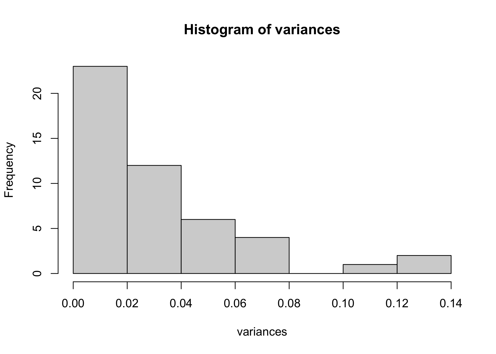
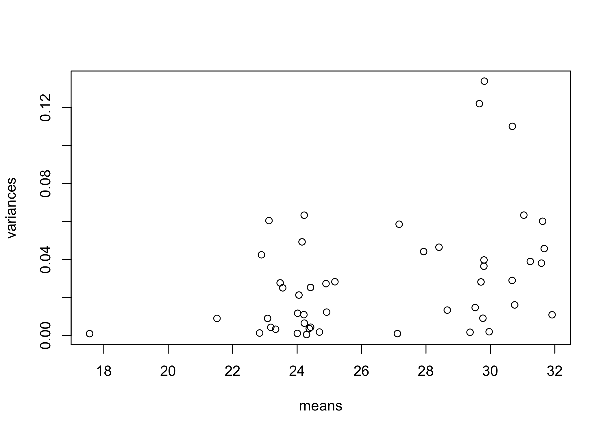

20230725-freezing-exp-1-qPCR-analysis
================
2023-07-26

Load packages

``` r
library(ggplot2)
library(dplyr)
```

    ## 
    ## Attaching package: 'dplyr'

    ## The following objects are masked from 'package:stats':
    ## 
    ##     filter, lag

    ## The following objects are masked from 'package:base':
    ## 
    ##     intersect, setdiff, setequal, union

``` r
library(tidyr)
```

Read in the data

``` r
Cq_data <- read.csv("/Users/maggieschedl/Desktop/Github/Unckless_Lab_Resources/qPCR_analysis/20230725-freezing-exp-1/20230725-qPCR-info.csv")
```

Let’s look at how the Cq data looks raw

Histogram of all Cq values

``` r
ggplot(Cq_data, aes(x= Cq, fill = primer)) + geom_histogram(position = "dodge") + facet_grid(~treatment) 
```

    ## `stat_bin()` using `bins = 30`. Pick better value with `binwidth`.

<!-- -->

``` r
# fill for which primer 
# facet breaks up the graph into different components by sample type
# dodge makes each primer have it's own column per value 
```

This is interesting. TPI looks relatively stable, but 115 is sort of all
over the place, maybe to be expeted. And the lowest 115 are in the
infected samples. But there aren’t any really high 115 Cqs which doesn’t
seem good. Even samples where I had no PCR band for p47 I have something
coming up for 115. I have went back and did 115 PCRs for all the samples
with 30 cycles.

Calculate variances for the qPCR replicates. We are hoping that the
variances are small between the replicates

``` r
# make a dummy variable that is just the columns we want
# right now I don't want to include any of the other columns because they will mess up the varience calculations I think 
x <- paste(Cq_data$sample_ID, Cq_data$primer, Cq_data$day_frozen, Cq_data$treatment)

# calculate the variances 
# tapply breaks the dataset up into groups and apply a function to each group
# we want each sample_ID/primer/day frozen/treatment group to have the variance calculated for the Cq value 
# and save this information as a variable 
variances <- tapply(Cq_data$Cq, x, var)

# look at a histogram of the variances 
hist(variances)
```

<!-- -->

``` r
# one has really high variance which is not good 

# which variances are above 0.2, which is higher than we want 
variances[which(variances > 0.2)]
```

    ## named numeric(0)

There are no variences over 0.2, so I think this is good to move
forward. This means the technical replicates were done well.

Now I need to calculate the mean Cq for the replicates

``` r
# what are the Cq means for each sample_ID/primer/day/sample_type group?
means<- tapply(Cq_data$Cq, x, mean)

# look at the means with a histogram
hist(means)
```

<!-- -->

``` r
# want to plot the variances versus the means 
plot(variances~means)
```

<!-- -->

I want to make the variences and means arrays back into dataframes Start
with variences

``` r
# I know that the variances is an array 
# transform array into df
variances_df <- as.data.frame.table(variances)
# this gives me a dataframe but the entire first column is all the variables 
# and the second column is the variances which it calls freq (not sure why)
# use dplyr to separate them out into separate columns 

# name all the columns I want 
variances_df_sep <- variances_df %>% separate(Var1, c('sample_ID', 'primer', 'day_frozen', "treatment"))
```

    ## Warning: Expected 4 pieces. Additional pieces discarded in 24 rows [5, 6, 13,
    ## 14, 15, 16, 17, 18, 19, 20, 21, 22, 23, 24, 31, 32, 33, 34, 35, 36, ...].

``` r
# check dataframe 
head(variances_df_sep)
```

    ##   sample_ID primer day_frozen treatment         Freq
    ## 1         1    115       day0        SP 0.0016333333
    ## 2         1    TPI       day0        SP 0.0604333333
    ## 3        10    115       day0        SP 0.0009333333
    ## 4        10    TPI       day0        SP 0.0012333333
    ## 5       117    115       day5      16Cq 0.0457000000
    ## 6       117    TPI       day5      16Cq 0.0010333333

``` r
# rename the Freq column to var for variance
names(variances_df_sep)[5] <- "var"
# check dataframe again
head(variances_df_sep)
```

    ##   sample_ID primer day_frozen treatment          var
    ## 1         1    115       day0        SP 0.0016333333
    ## 2         1    TPI       day0        SP 0.0604333333
    ## 3        10    115       day0        SP 0.0009333333
    ## 4        10    TPI       day0        SP 0.0012333333
    ## 5       117    115       day5      16Cq 0.0457000000
    ## 6       117    TPI       day5      16Cq 0.0010333333

Basically do the same thing for the means information and add it in

``` r
# going to transform the means array into a df
means_df <- as.data.frame.table(means)
# reaname the Freq column to mean
names(means_df)[2] <- "mean"
head(means_df)
```

    ##                     Var1     mean
    ## 1          1 115 day0 SP 29.36667
    ## 2          1 TPI day0 SP 23.12667
    ## 3         10 115 day0 SP 27.11333
    ## 4         10 TPI day0 SP 22.83667
    ## 5 117 115 day5 16Cq DiNV 31.67000
    ## 6 117 TPI day5 16Cq DiNV 24.00667

``` r
# the means and the variances dfs are in the same order which is nice
# now I want to add the mean column to the variances df
means_variances_of_Cq_df <- cbind(variances_df_sep, means = means_df$mean)
# check how it looks
head(means_variances_of_Cq_df)
```

    ##   sample_ID primer day_frozen treatment          var    means
    ## 1         1    115       day0        SP 0.0016333333 29.36667
    ## 2         1    TPI       day0        SP 0.0604333333 23.12667
    ## 3        10    115       day0        SP 0.0009333333 27.11333
    ## 4        10    TPI       day0        SP 0.0012333333 22.83667
    ## 5       117    115       day5      16Cq 0.0457000000 31.67000
    ## 6       117    TPI       day5      16Cq 0.0010333333 24.00667

Now I can add back in the the information from the PCRS. I have a df
that I will bring in with that information

``` r
PCR_info <- read.csv("/Users/maggieschedl/Desktop/Github/Unckless_Lab_Resources/qPCR_analysis/20230725-freezing-exp-1/PCR-info.csv")
# this is good, but the two dfs I have aren't in the same order

# first make sure the sample ID colum is considered a character
PCR_info$sample_ID <- as.character(PCR_info$sample_ID)
means_variances_of_Cq_df$sample_ID <- as.character(means_variances_of_Cq_df$sample_ID)


#Then oder the sample_ID column the same way in each df
PCR_info <- arrange(PCR_info, sample_ID)
Cq_means <- arrange(means_variances_of_Cq_df, sample_ID)

#add columns to the means df
Cq_means <- cbind(Cq_means, p47_35_cycle_result = PCR_info$p47_35_cycle_result)
Cq_means <- cbind(Cq_means, p47_30_cycle_result = PCR_info$p47_30_cycle_result)
Cq_means <- cbind(Cq_means, p47_band_35_cycles = PCR_info$band_strength_35_cycles)
Cq_means <- cbind(Cq_means, p47_band_30_cycles = PCR_info$band_strength_30_cycles)
Cq_means <- cbind(Cq_means, p115_1ng_30_cycle_result = PCR_info$X115_1ng_30_PCR_result)
Cq_means <- cbind(Cq_means, p115_30_cycle_result = PCR_info$X115_30_cycle_PCR_result)
Cq_means <- cbind(Cq_means, p115_1ng_band_30_PCR = PCR_info$X115_1ng_30_PCR_band)
Cq_means <- cbind(Cq_means, p115_band_30_PCR = PCR_info$X115_30_cycle_PCR_band)
```

Start by analyzing by day frozen

Day 0 samples

``` r
# subset
day0_means <- Cq_means[which(Cq_means$day_frozen == "day0"),]

# Separate that dataframe, incriminating by 2, every number between 1-12 (there are 12 rows) 
day0_means$means[seq(1,12,2)] # these are the 115 Cq means 
```

    ## [1] 29.36667 27.11333 28.66000 31.23667 29.52667 27.92667

``` r
day0_means$means[seq(2,12,2)] # these are TPI primer Cq mean
```

    ## [1] 23.12667 22.83667 23.18333 23.08333 22.89333 24.05667

``` r
# make delta Cq, subtract the 115 value from the TPI primer value 
delta_Cqs_day0 <- day0_means$means[seq(2,12,2)] - day0_means$means[seq(1,12,2)]

# use barplot to look at the delta Cq for each sample
# use paste to put in the row information, and the seq section to just separate out the rows I want, the 2^ to the delta_Cqs_cells takes it from a negative to a better ratio, and the las=2 makes the labels for the box plots go vertical and readable 
barplot(2^delta_Cqs_day0, names= paste(day0_means$treatment)[seq(1,12,2)])
```

<!-- -->

Ok so this isn’t looking good because the SPs are much higher than the
DiNV poked flies. But this sort of tracks with what I saw, which is
contamination…

Day 3 samples

``` r
# subset
day3_means <- Cq_means[which(Cq_means$day_frozen == "day3"),]

# Separate that dataframe, incriminating by 2, every number between 1-12 (there are 12 rows) 
day3_means$means[seq(1,12,2)] # these are the 115 Cq means 
```

    ## [1] 29.65667 29.79667 29.96000 21.51333 29.70667 29.80000

``` r
day3_means$means[seq(2,12,2)] # these are TPI primer Cq mean
```

    ## [1] 23.47333 24.01667 23.33333 24.91667 24.15333 23.55333

``` r
# make delta Cq, subtract the 115 value from the TPI primer value 
delta_Cqs_day3 <- day3_means$means[seq(2,12,2)] - day3_means$means[seq(1,12,2)]

# use barplot to look at the delta Cq for each sample
# use paste to put in the row information, and the seq section to just separate out the rows I want, the 2^ to the delta_Cqs_cells takes it from a negative to a better ratio, and the las=2 makes the labels for the box plots go vertical and readable 
barplot(2^delta_Cqs_day3, names= paste(day3_means$treatment)[seq(1,12,2)])
```

<!-- -->

Day 5 samples

``` r
# subset
day5_means <- Cq_means[which(Cq_means$day_frozen == "day5"),]

# Separate that dataframe, incriminating by 2, every number between 1-12 (there are 12 rows) 
day5_means$means[seq(1,12,2)] # these are the 115 Cq means 
```

    ## [1] 31.67000 30.67333 30.75333 29.76667 31.91333 27.16667

``` r
day5_means$means[seq(2,12,2)] # these are TPI primer Cq mean
```

    ## [1] 24.00667 24.42000 25.17333 24.89667 24.41667 24.21000

``` r
# make delta Cq, subtract the 115 value from the TPI primer value 
delta_Cqs_day5 <- day5_means$means[seq(2,12,2)] - day5_means$means[seq(1,12,2)]

# use barplot to look at the delta Cq for each sample
# use paste to put in the row information, and the seq section to just separate out the rows I want, the 2^ to the delta_Cqs_cells takes it from a negative to a better ratio, and the las=2 makes the labels for the box plots go vertical and readable 
barplot(2^delta_Cqs_day5, names= paste(day5_means$treatment)[seq(1,12,2)])
```

<!-- -->

Day 10 samples

``` r
# subset
day10_means <- Cq_means[which(Cq_means$day_frozen == "day10"),]

# Separate that dataframe, incriminating by 2, every number between 1-12 (there are 12 rows) 
day10_means$means[seq(1,12,2)] # these are the 115 Cq means 
```

    ## [1] 31.03667 30.68000 31.58333 17.56000 29.81000 31.62000

``` r
day10_means$means[seq(2,12,2)] # these are TPI primer Cq mean
```

    ## [1] 24.29333 24.37667 24.22000 28.40333 24.69333 24.22333

``` r
# make delta Cq, subtract the 115 value from the TPI primer value 
delta_Cqs_day10 <- day10_means$means[seq(2,12,2)] - day10_means$means[seq(1,12,2)]

# use barplot to look at the delta Cq for each sample
# use paste to put in the row information, and the seq section to just separate out the rows I want, the 2^ to the delta_Cqs_cells takes it from a negative to a better ratio, and the las=2 makes the labels for the box plots go vertical and readable 
barplot(2^delta_Cqs_day10, names= paste(day10_means$treatment)[seq(1,12,2)])
```

<!-- -->

These are interesting results… some of these show a lot of virus growth
and the rest have super low delta Cqs. I wonder if what I am seeing is a
lot of not really strong infections??

I want to plot all of these together

``` r
# gather all delta Cq info 

#day 0
delta_Cqs_day0
```

    ## [1] -6.240000 -4.276667 -5.476667 -8.153333 -6.633333 -3.870000

``` r
#day 3
delta_Cqs_day3
```

    ## [1] -6.183333 -5.780000 -6.626667  3.403333 -5.553333 -6.246667

``` r
#day 5
delta_Cqs_day5
```

    ## [1] -7.663333 -6.253333 -5.580000 -4.870000 -7.496667 -2.956667

``` r
#day 10
delta_Cqs_day10
```

    ## [1] -6.743333 -6.303333 -7.363333 10.843333 -5.116667 -7.396667

``` r
# added all of these to a Google Sheet with all the other information 
# bring in that Google Sheet 
delta_cqs_all <- read.csv("/Users/maggieschedl/Desktop/Github/Unckless_Lab_Resources/qPCR_analysis/20230725-freezing-exp-1/delta_cqs_all.csv")

#reorder days 
results_factor_levels <- c("day0", "day3", "day5", "day10")
# then apply this to the CCM data
delta_cqs_all$day_frozen <- factor(delta_cqs_all$day_frozen, levels=results_factor_levels)


#
ggplot(delta_cqs_all, aes(y= two_to_the_delta_Cq, x=treatment, fill=treatment)) + geom_boxplot() + facet_grid(~day_frozen) + theme_linedraw() +geom_point(position="jitter", size=1)
```

<!-- -->

``` r
# try plotting by day and treatment, using one way to make a log scale y axis
ggplot(delta_cqs_all, aes(y= two_to_the_delta_Cq, x=treatment, fill=treatment)) + geom_boxplot() + facet_grid(~day_frozen) + theme_linedraw() +
coord_trans(y='log10') +geom_point(position="jitter", size=1)
```

<!-- -->

``` r
# trying another way to make a log scale y axis 
ggplot(delta_cqs_all, aes(y= two_to_the_delta_Cq, x=treatment, fill=treatment)) + geom_boxplot() + facet_grid(~day_frozen) + theme_linedraw() + scale_y_continuous(trans='log10') +geom_point(position="jitter", size=1)
```

<!-- -->
