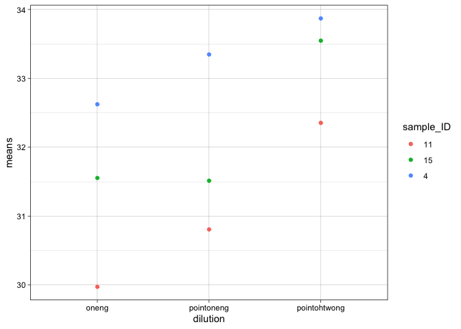
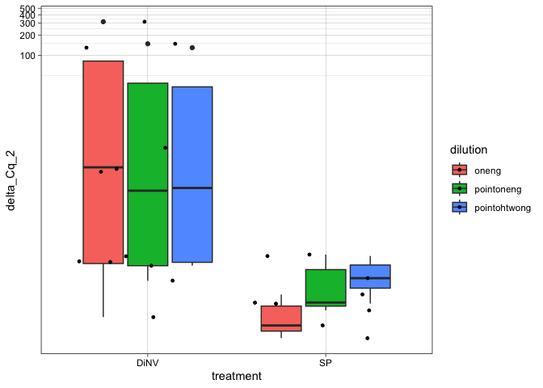

# 20230805-dilution-test-qPCR-analysis

Load packages needed

``` r
library(ggplot2)
library(dplyr)
```


    Attaching package: 'dplyr'

    The following objects are masked from 'package:stats':

        filter, lag

    The following objects are masked from 'package:base':

        intersect, setdiff, setequal, union

``` r
library(tidyr)
```

Load in dataset

``` r
Cq_values <- read.csv("/Users/maggieschedl/Desktop/Github/Unckless_Lab_Resources/qPCR_analysis/20230805-dilution-test/dilution_qPCR_info.csv")
```

Histogram of all Cq vaules

``` r
# order the dilution
results_factor_levels <- c("oneng", "pointoneng", "pointohtwong")
# then apply this to the CCM data
Cq_values$dilution <- factor(Cq_values$dilution, levels=results_factor_levels)


ggplot(Cq_values, aes(x= Cq, fill = primer)) + geom_histogram(position = "dodge") + facet_grid(~dilution) 
```

    `stat_bin()` using `bins = 30`. Pick better value with `binwidth`.


``` r
# fill for which primer 
# facet breaks up the graph into different components by sample type
# dodge makes each primer have it's own column per value 
```

Interesting, I did think the Cq values would change more with this level
of dilution.

Calculate the variances between the qPCR replicates for supernatant
samples

``` r
# make a dummy variable that is just the columns we want
s <- paste(Cq_values$sample_ID, Cq_values$primer, Cq_values$p47_35_cycle_result, Cq_values$project, Cq_values$treatment, Cq_values$dilution, Cq_values$sample_number, Cq_values$day_frozen)

# calculate the variances 
# tapply breaks the dataset up into groups and apply a function to each group
# we want each sample_number group to have the variance calculated for the Cq value 
# and save this information as a variable 
variances <- tapply(Cq_values$Cq, s, var)

# look at a histogram of the variances 
hist(variances)
```


``` r
# one has really high variance which is not good 

# which variances are above 0.4, which is higher than we want 
variances[which(variances > 0.4)]
```

    4 115 none stock NA pointoneng 41 NA 
                                1.064633 

``` r
# this is just this one sample
# there isn't an obvious outlier in this one, the Cqs are 33, 32, and 34. So I can't drop one value. So I will leave these in. This is just a test anyways
```

Calculate the mean Cq values

``` r
# what are the Cq means for each sample_ID/primer/day/sample_type group?
means <- tapply(Cq_values$Cq, s, mean, na.rm=T)

# look at the means with a histogram
hist(means)
```


``` r
# want to plot the variances versus the means 
plot(variances~means)
```


This is the usual pattern, where the higher the mean, the higher the
varience. That one sample stands out a lot, the others look good.

Now I need to add the mean and variance values to my main dataframes.

``` r
# transform array into df
variances_df <- as.data.frame.table(variances)
# this gives me a dataframe but the entire first column is all the variables 
# and the second column is the variances which it calls freq (not sure why)
# use dplyr to separate them out into separate columns 

# name all the columns I want 
variances_df_sep <- variances_df %>% separate(Var1, c('sample_ID', 'primer', 'p47_35_cycle_result', 'project', 'treatment', 'dilution', 'sample_number', 'day_frozen'))
# check dataframe 
head(variances_df_sep)
```

      sample_ID primer p47_35_cycle_result   project treatment     dilution
    1        10    115              strong infection        SP        oneng
    2        10    115              strong infection        SP pointohtwong
    3        10    115              strong infection        SP   pointoneng
    4        10    TPI              strong infection        SP        oneng
    5        10    TPI              strong infection        SP pointohtwong
    6        10    TPI              strong infection        SP   pointoneng
      sample_number day_frozen        Freq
    1            10       day0 0.044800000
    2          1002       day0 0.034900000
    3           101       day0 0.003733333
    4            10       day0 0.055900000
    5          1002       day0 0.112133333
    6           101       day0 0.044933333

``` r
# rename the Freq column to var for variance
names(variances_df_sep)[9] <- "var"
# check dataframe again
head(variances_df_sep)
```

      sample_ID primer p47_35_cycle_result   project treatment     dilution
    1        10    115              strong infection        SP        oneng
    2        10    115              strong infection        SP pointohtwong
    3        10    115              strong infection        SP   pointoneng
    4        10    TPI              strong infection        SP        oneng
    5        10    TPI              strong infection        SP pointohtwong
    6        10    TPI              strong infection        SP   pointoneng
      sample_number day_frozen         var
    1            10       day0 0.044800000
    2          1002       day0 0.034900000
    3           101       day0 0.003733333
    4            10       day0 0.055900000
    5          1002       day0 0.112133333
    6           101       day0 0.044933333

So I have a df with the variances, now I want the means in it as well

``` r
# going to transform the means array into a df
means_df <- as.data.frame.table(means)
# reaname the Freq column to mean
names(means_df)[2] <- "mean"
head(means_df)
```

                                                   Var1     mean
    1          10 115 strong infection SP oneng 10 day0 27.97000
    2 10 115 strong infection SP pointohtwong 1002 day0 30.91000
    3    10 115 strong infection SP pointoneng 101 day0 28.87667
    4          10 TPI strong infection SP oneng 10 day0 22.79000
    5 10 TPI strong infection SP pointohtwong 1002 day0 27.63333
    6    10 TPI strong infection SP pointoneng 101 day0 25.67333

``` r
# the means and the variances dfs are in the same order which is nice
# now I want to add the mean column to the variances df
means_variances_of_Cq_df <- cbind(variances_df_sep, means = means_df$mean)
# check how it looks
head(means_variances_of_Cq_df)
```

      sample_ID primer p47_35_cycle_result   project treatment     dilution
    1        10    115              strong infection        SP        oneng
    2        10    115              strong infection        SP pointohtwong
    3        10    115              strong infection        SP   pointoneng
    4        10    TPI              strong infection        SP        oneng
    5        10    TPI              strong infection        SP pointohtwong
    6        10    TPI              strong infection        SP   pointoneng
      sample_number day_frozen         var    means
    1            10       day0 0.044800000 27.97000
    2          1002       day0 0.034900000 30.91000
    3           101       day0 0.003733333 28.87667
    4            10       day0 0.055900000 22.79000
    5          1002       day0 0.112133333 27.63333
    6           101       day0 0.044933333 25.67333

Plot the raw means of Cqs by primer by dilution for the two projects

``` r
# order the dilution
results_factor_levels <- c("oneng", "pointoneng", "pointohtwong")
# then apply this to the CCM data
means_variances_of_Cq_df$dilution <- factor(means_variances_of_Cq_df$dilution, levels=results_factor_levels)

ggplot(means_variances_of_Cq_df, aes(y= means, x=primer, fill=dilution)) + geom_boxplot() + facet_grid(~project) 
```


Ok so this looks good, clear differences between the dilutions here in
the exact pattern we expect. However the 115 is still not very high even
for the stock flies at 0.02ng/ul DNA…

At this point, I am going to separate out the stock flies and the
infection flies because those were two different experiments

Calculating delta Cq values for the stock flies

``` r
stock_Cq_df <- means_variances_of_Cq_df[which(means_variances_of_Cq_df$project == "stock"),]

# order df by sample_number
stock_Cq_df <- stock_Cq_df[order(stock_Cq_df$sample_number),]

# Separate that dataframe, incriminating by 2, every number between 1-18 (number of rows in dataframe)
stock_Cq_df$means[seq(1,18,2)] # these are the 115 Cq means 
```

    [1] 29.97333 32.35333 30.80667 31.55333 33.54667 31.51333 32.62333 33.87000
    [9] 33.34667

``` r
stock_Cq_df$means[seq(2,18,2)] # these are the TPI primer Cq means 
```

    [1] 24.20333 29.12667 26.88333 23.36333 28.38667 26.65000 23.10000 28.32667
    [9] 26.01000

``` r
# make delta Cq, subtract the 115 value from the TPI primer value 
delta_Cqs_stock <- stock_Cq_df$means[seq(2,18,2)] - stock_Cq_df$means[seq(1,18,2)]

delta_Cqs_stock
```

    [1] -5.770000 -3.226667 -3.923333 -8.190000 -5.160000 -4.863333 -9.523333
    [8] -5.543333 -7.336667

``` r
# want to add this as a column to our df, but first need to remove the TPI rows 

stock_delta_Cq_df <- stock_Cq_df[which(stock_Cq_df$primer == "115"),]
# and this should be in the order of delta_Cqs_Stock
stock_delta_Cq_df$delta_Cq <- delta_Cqs_stock
```

``` r
# add another column that is 2^deltaCq

stock_delta_Cq_df$delta_Cq_2 <- 2^(delta_Cqs_stock)


#Plot by dilution

ggplot(stock_delta_Cq_df, aes(y= delta_Cq_2, x=dilution)) + geom_boxplot()  + theme_linedraw() + geom_point(position="jitter", size=3)
```


I’m not sure the delta Cq is the most informative here

Plot the raw Cqs (for 115) in the same way

``` r
ggplot(stock_delta_Cq_df, aes(y= means, x=dilution)) + geom_boxplot()  + theme_linedraw() + geom_point(position="jitter", size=3)
```


Plot mean Cq value for 115 by sample by dilution

``` r
ggplot(stock_delta_Cq_df, aes(y= means, x=dilution, color = sample_ID))  + theme_linedraw() + geom_point() 
```



Calculating delta Cq values for the infection experiment flies

``` r
infection_Cq_df <- means_variances_of_Cq_df[which(means_variances_of_Cq_df$project == "infection"),]

# order df by sample_number
infection_Cq_df <- infection_Cq_df[order(infection_Cq_df$sample_number),]

# Separate that dataframe, incriminating by 2, every number between 1-42 (number of rows in dataframe)
infection_Cq_df$means[seq(1,42,2)] # these are the 115 Cq means 
```

     [1] 27.97000 30.91000 28.87667 31.02333 34.66333 32.76333 17.18333 22.52000
     [9] 20.32333 29.54333 32.46667 30.74000 30.13333 32.61000 31.31667 21.87333
    [17] 27.37000 24.96333 26.69667 31.78000 29.56667

``` r
infection_Cq_df$means[seq(2,42,2)] # these are the TPI primer Cq means 
```

     [1] 22.79000 27.63333 25.67333 23.68667 29.03667 26.80000 25.48333 29.53667
     [9] 27.53333 23.24667 28.71000 26.23667 23.42333 28.23667 25.74000 23.94333
    [17] 28.39333 25.85000 23.40333 28.24000 25.99000

``` r
# make delta Cq, subtract the 115 value from the TPI primer value 
delta_Cqs_infection <- infection_Cq_df$means[seq(2,42,2)] - infection_Cq_df$means[seq(1,42,2)]

delta_Cqs_infection
```

     [1] -5.1800000 -3.2766667 -3.2033333 -7.3366667 -5.6266667 -5.9633333
     [7]  8.3000000  7.0166667  7.2100000 -6.2966667 -3.7566667 -4.5033333
    [13] -6.7100000 -4.3733333 -5.5766667  2.0700000  1.0233333  0.8866667
    [19] -3.2933333 -3.5400000 -3.5766667

``` r
# want to add this as a column to our df, but first need to remove the TPI rows 

infection_delta_Cq_df <- infection_Cq_df[which(infection_Cq_df$primer == "115"),]
# and this should be in the order of delta_Cqs_Stock
infection_delta_Cq_df$delta_Cq <- delta_Cqs_infection
```

``` r
# add another column that is 2^deltaCq

infection_delta_Cq_df$delta_Cq_2 <- 2^(delta_Cqs_infection)


#Plot by dilution

ggplot(infection_delta_Cq_df, aes(y= delta_Cq_2, x=treatment, fill=dilution)) + geom_boxplot()  + theme_linedraw() + geom_point(position="jitter", size=1) + coord_trans(y='log10')
```



``` r
# I am not sure why the points are not separated out by dilution... and I don't know how to fix it 
```

For the delta Cqs there doesn’t seem to be that much of a pattern with
the diultion, except that the delta gets higher for the SPs with more
dilution.

I think again, the raw Cqs might be better to look at

``` r
ggplot(infection_delta_Cq_df, aes(y= means, x=treatment, fill = dilution)) + geom_boxplot()  + theme_linedraw() + geom_point(position="jitter", size=1)
```


Plot mean Cq value for 115 by sample by dilution and separate by
treatment

``` r
ggplot(infection_delta_Cq_df, aes(y= means, x=dilution, color = sample_ID))  + theme_linedraw() + geom_point() + facet_grid(~treatment)
```


Plot the 2^delta Cq by sample by dilution and separate by treatment

``` r
ggplot(infection_delta_Cq_df, aes(y= delta_Cq_2, x=dilution, color = sample_ID))  + theme_linedraw() + geom_point() + facet_grid(~treatment) + coord_trans(y='log10')
```


Plot the delta Cq by sample by dilution and separate by treatment

``` r
ggplot(infection_delta_Cq_df, aes(y= delta_Cq, x=dilution, color = sample_ID))  + theme_linedraw() + geom_point() + facet_grid(~treatment)
```


