# 20230928-qPCR-analysis

Load packages needed

``` r
library(ggplot2)
library(dplyr)
```


    Attaching package: 'dplyr'

    The following objects are masked from 'package:stats':

        filter, lag

    The following objects are masked from 'package:base':

        intersect, setdiff, setequal, union

``` r
library(tidyr)
library(Rmisc)
```

    Loading required package: lattice

    Loading required package: plyr

    ------------------------------------------------------------------------------

    You have loaded plyr after dplyr - this is likely to cause problems.
    If you need functions from both plyr and dplyr, please load plyr first, then dplyr:
    library(plyr); library(dplyr)

    ------------------------------------------------------------------------------


    Attaching package: 'plyr'

    The following objects are masked from 'package:dplyr':

        arrange, count, desc, failwith, id, mutate, rename, summarise,
        summarize

``` r
library(scales)
```

Load in dataset

``` r
Cq_values <- read.csv("/Users/maggieschedl/Desktop/Github/Unckless_Lab_Resources/qPCR_analysis/20230928-poke-vs-inject-16Cq-dilutions/poke-inject-dil-sheet.csv")
```

Histogram of all Cq vaules

``` r
# order the dilution
results_factor_levels <- c("1nanogram", "point1nanogram", "pointzero1nanogram", "1to10", "1to100")
# then apply this to the CCM data
Cq_values$dilution.long <- factor(Cq_values$dilution.long, levels=results_factor_levels)

# plot raw Cqs by dilution
ggplot(Cq_values, aes(x= Cq, fill = primer)) + geom_histogram(position = "dodge") + facet_grid(~dilution.long) 
```

    `stat_bin()` using `bins = 30`. Pick better value with `binwidth`.

    Warning: Removed 26 rows containing non-finite values (`stat_bin()`).

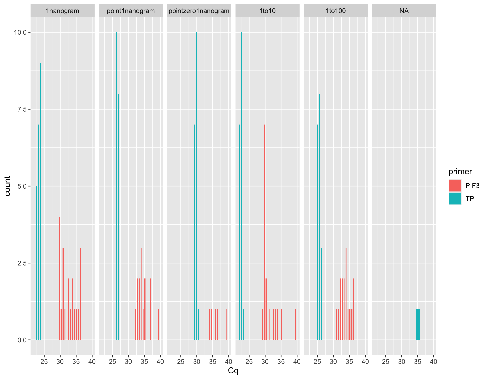

``` r
# fill for which primer 
# facet breaks up the graph into different components by sample type
# dodge makes each primer have it's own column per value 

# plot raw Cqs by infection type
ggplot(Cq_values, aes(x= Cq, fill = primer)) + geom_histogram(position = "dodge") + facet_grid(~treatment)  
```

    `stat_bin()` using `bins = 30`. Pick better value with `binwidth`.

    Warning: Removed 26 rows containing non-finite values (`stat_bin()`).

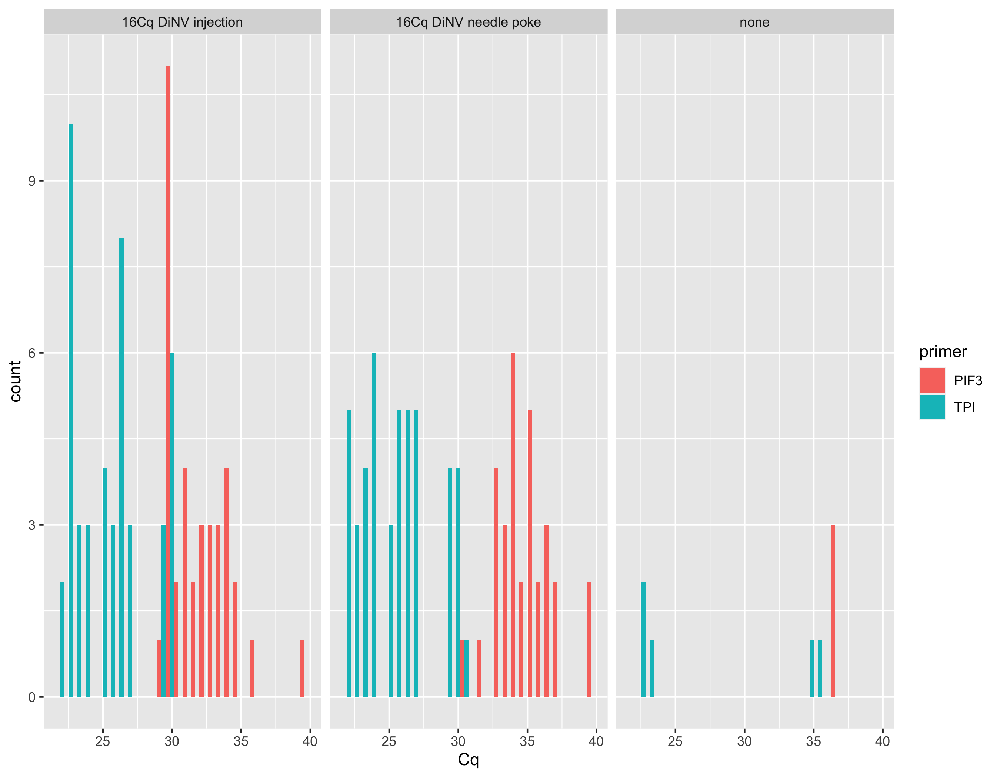

Hisogram of Cq values for dilutions with the treatments split up

``` r
# separate out the poked flies
Cq_values_poke <- Cq_values[which(Cq_values$treatment == "16Cq DiNV needle poke"),]
# histogram of just poked flies Cqs separated out by dilution
ggplot(Cq_values_poke, aes(x= Cq, fill = primer)) + geom_histogram(position = "dodge") + facet_grid(~dilution.long)
```

    `stat_bin()` using `bins = 30`. Pick better value with `binwidth`.

    Warning: Removed 14 rows containing non-finite values (`stat_bin()`).

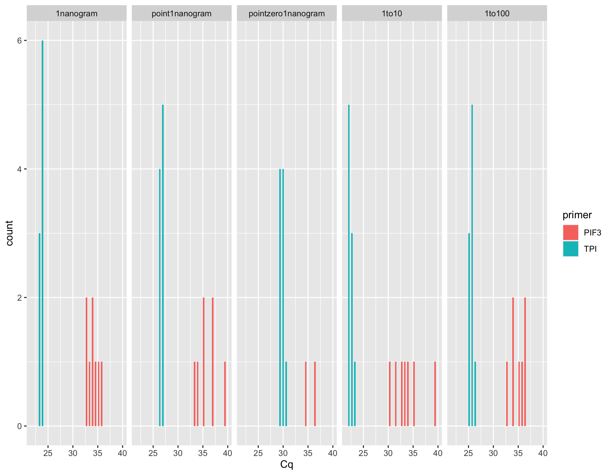

``` r
# separate out the injected flies
Cq_values_inject <- Cq_values[which(Cq_values$treatment == "16Cq DiNV injection"),]
# histogram of just injected flies Cqs separated out by dilution
ggplot(Cq_values_inject, aes(x= Cq, fill = primer)) + geom_histogram(position = "dodge") + facet_grid(~dilution.long)
```

    `stat_bin()` using `bins = 30`. Pick better value with `binwidth`.

    Warning: Removed 8 rows containing non-finite values (`stat_bin()`).


This looks to me as somewhat what we would expect. The poked flies have
higher Cq values for virus than the injected flies, and they seem to
have more variability. The very dilute condition is probably too dilute
for either type of injection, but that is good to know.

Calculate the variances in Cq and the mean Cq between the qPCR
replicates

``` r
# calculate variences in Cq value
Cq_values$Cq_var <- ave(Cq_values$Cq, Cq_values$unique.name, FUN=var)
# this adds a column with the variances, however because there are 3 replicates for each sample/dilution, 
# there are all three columns retained. We want to keep those right now for calculating the mean Cq

# calculate mean in Cq value
Cq_values$Cq_mean <- ave(Cq_values$Cq, Cq_values$unique.name, FUN=mean)

# now want to keep all rows where the replicate is 1
# make into new Df so we keep the original with all the info
Cq_values_1rep <- Cq_values[which(Cq_values$replicate == "1"),]

# histogram of all variances
hist(Cq_values_1rep$Cq_var)
```

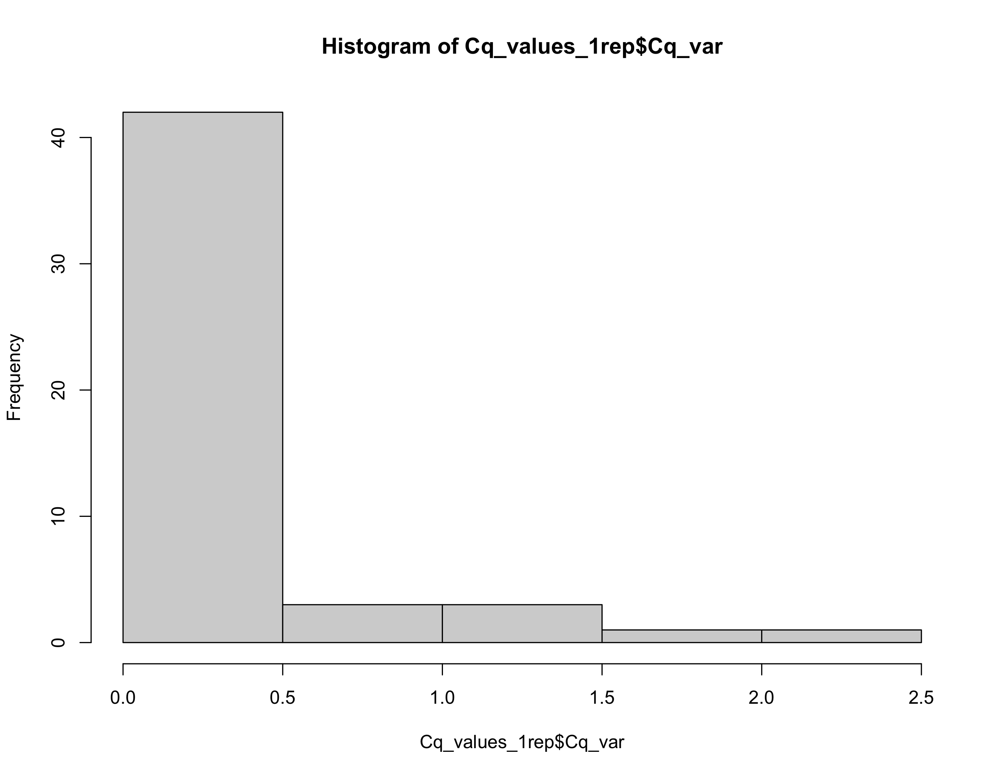

``` r
# most are very low, but some are worryingly high
# also a lot are missing here because the function wouldn't calculate variences for replicates that had an NA
# I am not sure what to do about those 

# is there a difference in variance between the two treatments?
# just poke
Cq_values_1rep_poke <- Cq_values_1rep[which(Cq_values_1rep$treatment == "16Cq DiNV needle poke"),]
# just inject
Cq_values_1rep_inject <- Cq_values_1rep[which(Cq_values_1rep$treatment == "16Cq DiNV injection"),]

# histogram of poke variances
hist(Cq_values_1rep_poke$Cq_var)
```


``` r
# histogram of inject variances
hist(Cq_values_1rep_inject$Cq_var)
```


Check variance by dilution

``` r
# slightly more variance in the poke, but not really, what about the different dilutions?

# 1ng
Cq_values_1rep_1ng <- Cq_values_1rep[which(Cq_values_1rep$dilution.long == "1nanogram"),]
# 0.1ng
Cq_values_1rep_.1ng <- Cq_values_1rep[which(Cq_values_1rep$dilution.long == "point1nanogram"),]
# 0.01ng
Cq_values_1rep_.01ng <- Cq_values_1rep[which(Cq_values_1rep$dilution.long == "pointzero1nanogram"),]
# 1:10
Cq_values_1rep_1_10 <- Cq_values_1rep[which(Cq_values_1rep$dilution.long == "1to10"),]
# 1:100
Cq_values_1rep_1_100 <- Cq_values_1rep[which(Cq_values_1rep$dilution.long == "1to100"),]

# 1ng
hist(Cq_values_1rep_1ng$Cq_var)
```

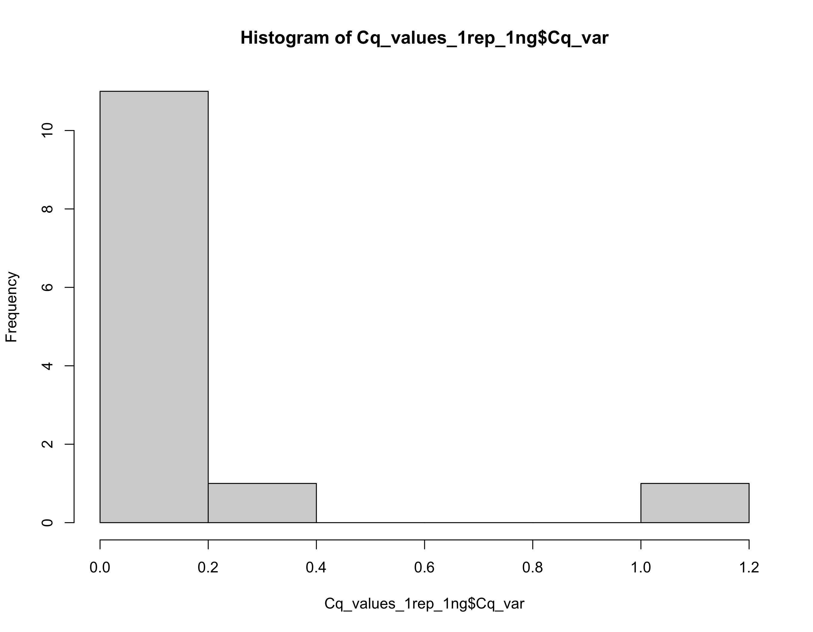

``` r
# 0.1ng
hist(Cq_values_1rep_.1ng$Cq_var)
```

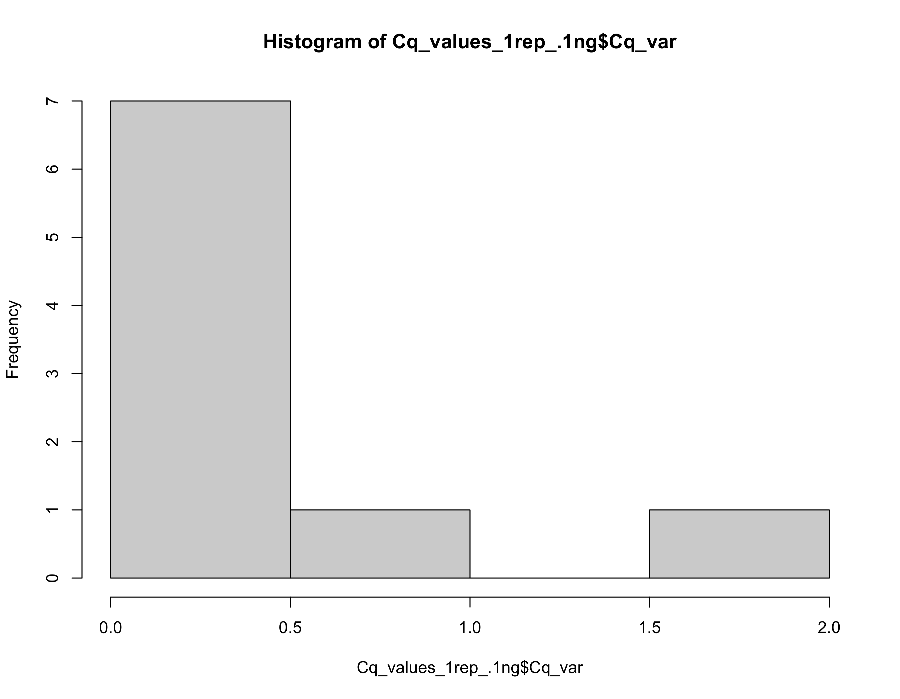

``` r
# 0.01ng
hist(Cq_values_1rep_.01ng$Cq_var)
```


``` r
# 1:10
hist(Cq_values_1rep_1_10$Cq_var)
```

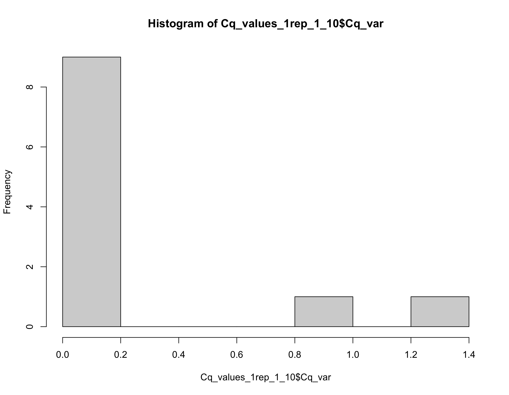

``` r
# 1:100
hist(Cq_values_1rep_1_100$Cq_var)
```

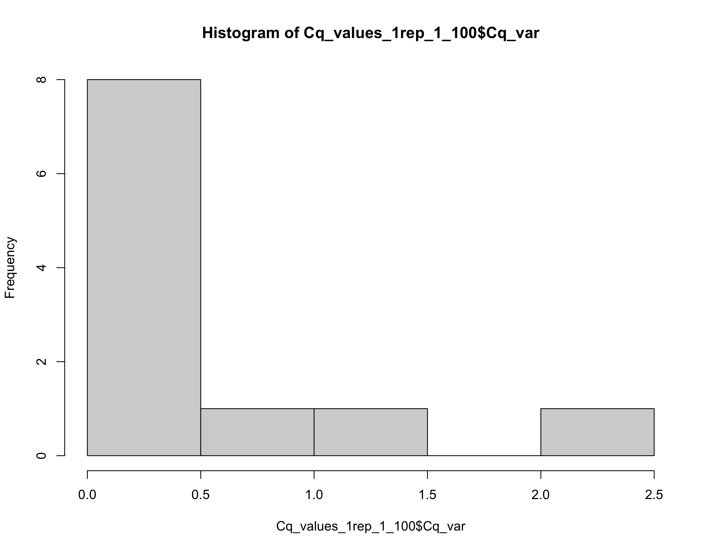

``` r
# nope, all over the place really 
```

Which variances seem like they are too high? (over 1) I am not sure if
that cutoff is too lenient

``` r
high_var <- subset(Cq_values, Cq_var > 1)
high_var
```

        well plate well.code tube.number             treatment dilution
    112  B04     2     8 1ng           8 16Cq DiNV needle poke      1ng
    113  B05     2     8 1ng           8 16Cq DiNV needle poke      1ng
    114  B06     2     8 1ng           8 16Cq DiNV needle poke      1ng
    115  B07     2   8 0.1ng           8 16Cq DiNV needle poke    0.1ng
    116  B08     2   8 0.1ng           8 16Cq DiNV needle poke    0.1ng
    117  B09     2   8 0.1ng           8 16Cq DiNV needle poke    0.1ng
    136  D04     2   14 1:10          14 16Cq DiNV needle poke     1:10
    137  D05     2   14 1:10          14 16Cq DiNV needle poke     1:10
    138  D06     2   14 1:10          14 16Cq DiNV needle poke     1:10
    154  E10     2  17 1:100          17   16Cq DiNV injection    1:100
    155  E11     2  17 1:100          17   16Cq DiNV injection    1:100
    156  E12     2  17 1:100          17   16Cq DiNV injection    1:100
    184  H04     2  24 1:100          24   16Cq DiNV injection    1:100
    185  H05     2  24 1:100          24   16Cq DiNV injection    1:100
    186  H06     2  24 1:100          24   16Cq DiNV injection    1:100
         dilution.long  unique.name replicate primer    Cq   Cq_var  Cq_mean
    112      1nanogram    8-1ng-pif         1   PIF3 35.76 1.014433 34.60333
    113      1nanogram    8-1ng-pif         2   PIF3 33.92 1.014433 34.60333
    114      1nanogram    8-1ng-pif         3   PIF3 34.13 1.014433 34.60333
    115 point1nanogram  8-0.1ng-pif         1   PIF3 37.22 1.591433 36.48667
    116 point1nanogram  8-0.1ng-pif         2   PIF3 35.03 1.591433 36.48667
    117 point1nanogram  8-0.1ng-pif         3   PIF3 37.21 1.591433 36.48667
    136          1to10  14-1:10-pif         1   PIF3 30.43 1.275300 31.66000
    137          1to10  14-1:10-pif         2   PIF3 31.90 1.275300 31.66000
    138          1to10  14-1:10-pif         3   PIF3 32.65 1.275300 31.66000
    154         1to100 17-1:100-pif         1   PIF3 31.54 2.135433 33.07333
    155         1to100 17-1:100-pif         2   PIF3 34.45 2.135433 33.07333
    156         1to100 17-1:100-pif         3   PIF3 33.23 2.135433 33.07333
    184         1to100 24-1:100-pif         1   PIF3 32.10 1.030033 32.26333
    185         1to100 24-1:100-pif         2   PIF3 33.35 1.030033 32.26333
    186         1to100 24-1:100-pif         3   PIF3 31.34 1.030033 32.26333

``` r
# go through each one individually 
# 8 1ng for Pif 3 is all over the place for each tech rep, so there is not an easy one to remove
# 8 0.1ng for pif 3 has replicate 2 being a lot different than the others, so we could remove that one
# 14 1:10 for pif 3 is all over the place for each tech rep, so ther eis not an easy one to remove 
# same with 17 1:100 and 24 1:100, not one to remove 

# it is interesting that these are all the pif3 primers only, no TPI 
# and it is not a certain dilution 
# so the only thing I feel comfortable doing is removing the 1 replicate from 8 0.1ng 
# that is row 113
Cq_values_rm <- Cq_values[c(1:112, 114:192),]
```

How would things look if I changed all the NA Cq values to 40?

``` r
Cq_values_40 <- read.csv("/Users/maggieschedl/Desktop/Github/Unckless_Lab_Resources/qPCR_analysis/20230928-poke-vs-inject-16Cq-dilutions/poke-inject-dil-sheet_40s.csv")

# histogram 

# order the dilution
results_factor_levels <- c("1nanogram", "point1nanogram", "pointzero1nanogram", "1to10", "1to100")
# then apply this to the CCM data
Cq_values_40$dilution.long <- factor(Cq_values_40$dilution.long, levels=results_factor_levels)

# plot raw Cqs by dilution
ggplot(Cq_values_40, aes(x= Cq, fill = primer)) + geom_histogram(position = "dodge") + facet_grid(~dilution.long) 
```

    `stat_bin()` using `bins = 30`. Pick better value with `binwidth`.


``` r
# fill for which primer 
# facet breaks up the graph into different components by sample type
# dodge makes each primer have it's own column per value 

# plot raw Cqs by infection type
ggplot(Cq_values_40, aes(x= Cq, fill = primer)) + geom_histogram(position = "dodge") + facet_grid(~treatment)
```

    `stat_bin()` using `bins = 30`. Pick better value with `binwidth`.


Hisogram of Cq values for dilutions with the treatments split up

``` r
# separate out the poked flies
Cq_values_40_poke <- Cq_values_40[which(Cq_values_40$treatment == "16Cq DiNV needle poke"),]
# histogram of just poked flies Cqs separated out by dilution
ggplot(Cq_values_40_poke, aes(x= Cq, fill = primer)) + geom_histogram(position = "dodge") + facet_grid(~dilution.long)
```

    `stat_bin()` using `bins = 30`. Pick better value with `binwidth`.

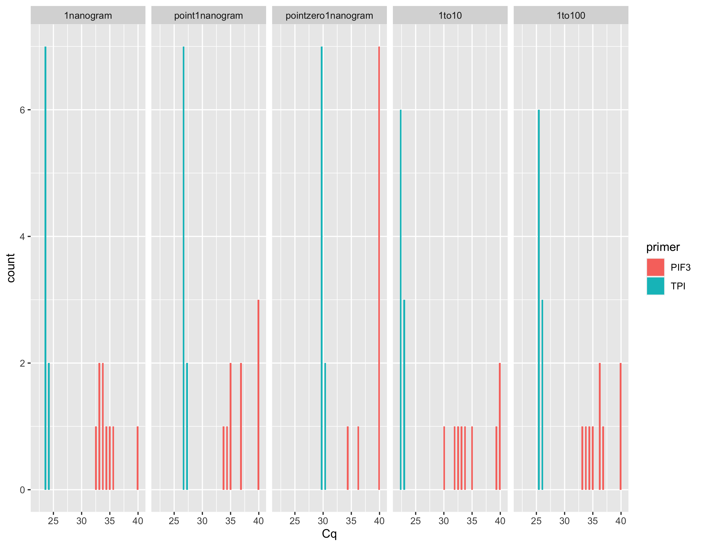

``` r
# separate out the injected flies
Cq_values_40_inject <- Cq_values_40[which(Cq_values_40$treatment == "16Cq DiNV injection"),]
# histogram of just injected flies Cqs separated out by dilution
ggplot(Cq_values_40_inject, aes(x= Cq, fill = primer)) + geom_histogram(position = "dodge") + facet_grid(~dilution.long)
```

    `stat_bin()` using `bins = 30`. Pick better value with `binwidth`.


You can see the differences between the types of pokes a little stronger
here

Calculate the variances in Cq and the mean Cq between the qPCR
replicates

``` r
# calculate variences in Cq value
Cq_values_40$Cq_var <- ave(Cq_values_40$Cq, Cq_values_40$unique.name, FUN=var)
# this adds a column with the variances, however because there are 3 replicates for each sample/dilution, 
# there are all three columns retained. We want to keep those right now for calculating the mean Cq

# calculate mean in Cq value
Cq_values_40$Cq_mean <- ave(Cq_values_40$Cq, Cq_values_40$unique.name, FUN=mean)

# now want to keep all rows where the replicate is 1
# make into new Df so we keep the original with all the info
Cq_values_40_1rep <- Cq_values_40[which(Cq_values_40$replicate == "1"),]

# histogram of all variances
hist(Cq_values_40_1rep$Cq_var)
```

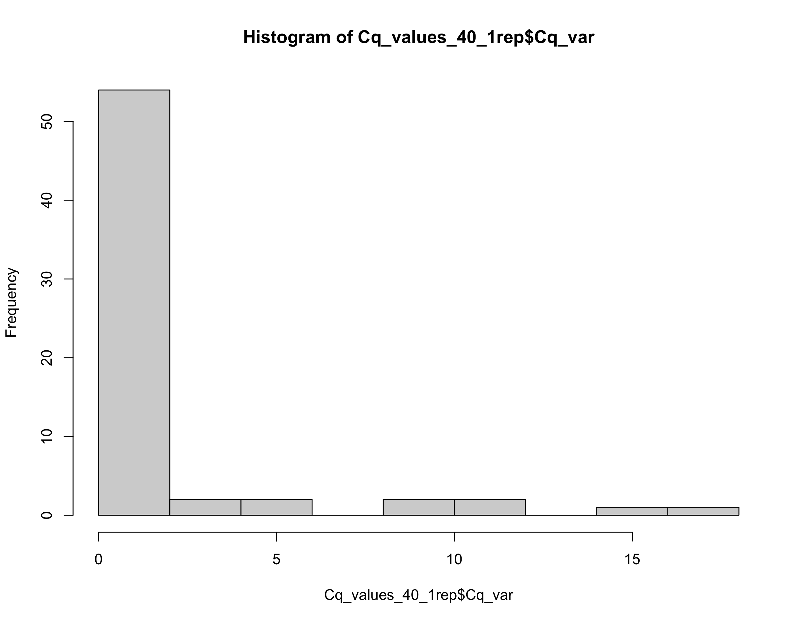

``` r
# most are very low, but some are worryingly high
# also a lot are missing here because the function wouldn't calculate variences for replicates that had an NA
# I am not sure what to do about those 

# is there a difference in variance between the two treatments?
# just poke
Cq_values_40_1rep_poke <- Cq_values_40_1rep[which(Cq_values_40_1rep$treatment == "16Cq DiNV needle poke"),]
# just inject
Cq_values_40_1rep_inject <- Cq_values_40_1rep[which(Cq_values_40_1rep$treatment == "16Cq DiNV injection"),]

# histogram of poke variances
hist(Cq_values_40_1rep_poke$Cq_var)
```

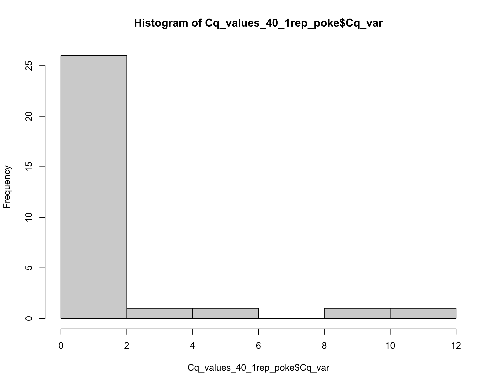

``` r
# histogram of inject variances
hist(Cq_values_40_1rep_inject$Cq_var)
```

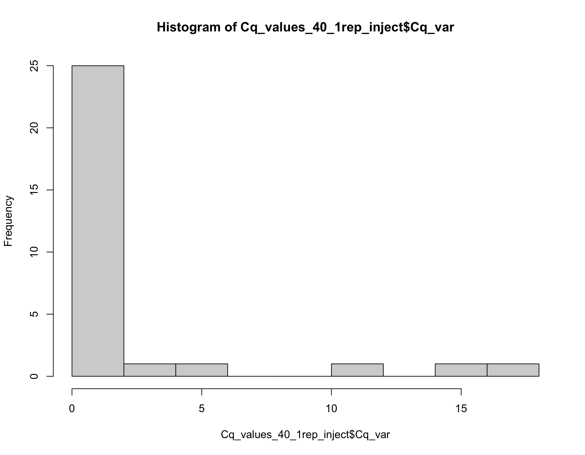

Ok, understandably there is a lot more variance here now that I added in
the 40s. I am not sure what to do with this. My hope is that there is
not much variance in the 1ng samples because that is what I am thinking
of moving forward with because the Cqs are pretty high across the board.
These were probably the wrong samples to do a dilution series on because
the amount of virus they have is so small compared to a fly who has a
raging infection. What are the variances for just 1ng samples?

``` r
Cq_values_40_1rep_1ng <- Cq_values_40_1rep[which(Cq_values_40_1rep$dilution == "1ng"),]

hist(Cq_values_40_1rep_1ng$Cq_var)
```


Ok, this is good, there is one that is super big, but the others are ok.
The super high variance sample is 6 1ng for pif 3. For that one, there
is 1 Cq at 34, one at 35, and the other is 40. I think I will remove the
row that has the 40 Cq and do this again.

``` r
# remove row 97

Cq_values_40 <- Cq_values_40[c(1:96, 98:192),]

# recalculate variances
Cq_values_40$Cq_var <- ave(Cq_values_40$Cq, Cq_values_40$unique.name, FUN=var)
# this adds a column with the variances, however because there are 3 replicates for each sample/dilution, 
# there are all three columns retained. We want to keep those right now for calculating the mean Cq

# calculate mean in Cq value
Cq_values_40$Cq_mean <- ave(Cq_values_40$Cq, Cq_values_40$unique.name, FUN=mean)

# now want to keep all rows where the replicate is 2 ( because I removed a replicate 1)
# make into new Df so we keep the original with all the info
Cq_values_40_1rep <- Cq_values_40[which(Cq_values_40$replicate == "2"),]

# just look at variances for the 1ng samples 

Cq_values_40_1rep_1ng <- Cq_values_40_1rep[which(Cq_values_40_1rep$dilution == "1ng"),]

hist(Cq_values_40_1rep_1ng$Cq_var)
```


Ok this is better, it’s still not great but I think I will move forward
with this

Plot the means vs the variances

``` r
ggplot(Cq_values_40_1rep_1ng, aes(x=Cq_mean, y=Cq_var)) +
  geom_point(size=2, shape=23)
```

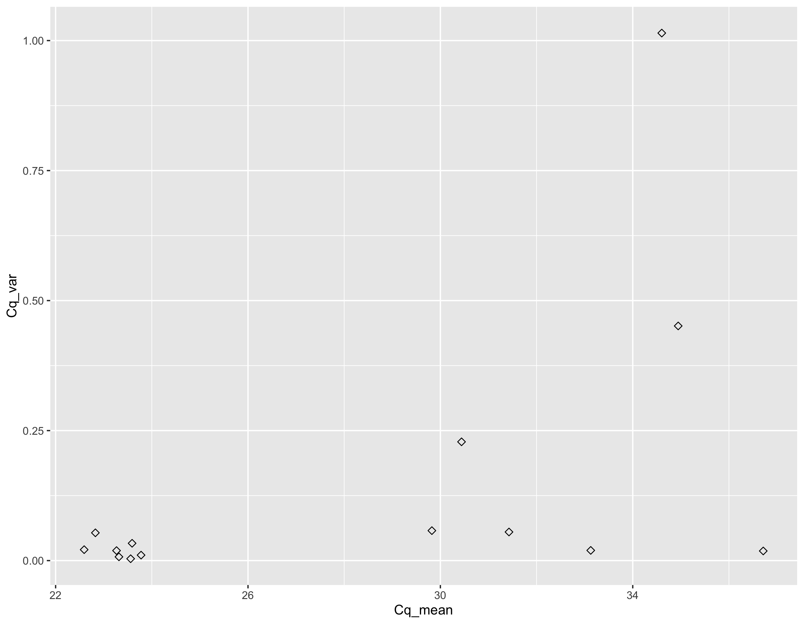

Sort of a trend to see higher Cq and higher variance, which we’ve seen
before. I do think the machine is not as good at picking up the higher
Cqs.

Plot Cqs as box plots for just 1ng

``` r
ggplot(Cq_values_40_1rep_1ng, aes(y= Cq_mean, x=primer, fill=treatment)) + geom_boxplot() 
```

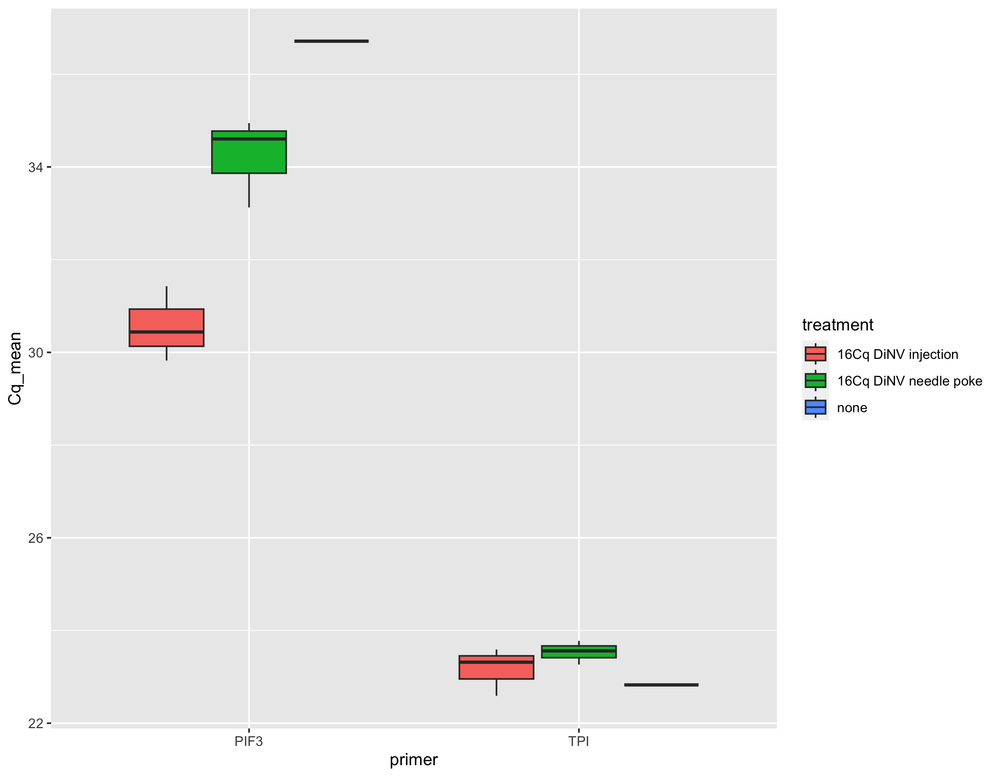

Ok this cool, the TPIs are all very similar, as they should be. And the
PIF 3s are pretty different, but maybe by not that much. And the None is
the stock sample, which still had amplification for PIF 3 which is
interesting. I do not know what to make of it. The water sample did not
have amplification for PIF3. My guess is that there is a small amount of
contamination (although I don’t know how it’s not in the water then), or
that there is something in the fly DNA that does amplify a tiny bit
after so many rounds of amplification.

Calculating delta Cqs from the TPI to the PIF 3 for the 1ng dilution

``` r
# currently the samples are not ordered by the sample, but by the plate, so I need each sample one right after the other 
# can I order them by well code?
Cq_values_40_1rep_1ng <- Cq_values_40_1rep_1ng[order(Cq_values_40_1rep_1ng$well.code),]

# remove the control sample
Cq_values_40_1rep_1ng <- Cq_values_40_1rep_1ng[which(Cq_values_40_1rep_1ng$treatment != "none"),]
# yes this worked great, I have the TPI first, then the PIF 3 

# Separate that dataframe, incriminating by 2, every number between 1-12 (number of rows in dataframe)
Cq_values_40_1rep_1ng$Cq_mean[seq(1,12,2)] # these are the TPI Cq means 
```

    [1] 23.56000 22.59333 23.31667 23.59000 23.26667 23.77667

``` r
Cq_values_40_1rep_1ng$Cq_mean[seq(2,12,2)] # these are the PIF 3 primer Cq means 
```

    [1] 33.12667 29.82333 30.44000 31.42667 34.94500 34.60333

``` r
# make delta Cq, subtract the PIF 3 value from the TPI primer value 
delta_Cqs_1ng <- Cq_values_40_1rep_1ng$Cq_mean[seq(1,12,2)] - Cq_values_40_1rep_1ng$Cq_mean[seq(2,12,2)]

delta_Cqs_1ng
```

    [1]  -9.566667  -7.230000  -7.123333  -7.836667 -11.678333 -10.826667

``` r
# want to add this as a column to our df, but first need to remove one of the primer rows, so let's remove the PIF3 

Cq_values_40_1rep_1ng_Delta <- Cq_values_40_1rep_1ng[which(Cq_values_40_1rep_1ng$primer == "PIF3"),]
# and this should be in the order of delta_Cqs_Stock
Cq_values_40_1rep_1ng_Delta$delta_Cq <- delta_Cqs_1ng

# add another column that is 2^deltaCq

Cq_values_40_1rep_1ng_Delta$delta_Cq_2 <- 2^(delta_Cqs_1ng)

#Plot by treatment

ggplot(Cq_values_40_1rep_1ng_Delta, aes(y= delta_Cq_2, x=treatment, fill=treatment)) + geom_boxplot()  + theme_linedraw() + geom_point(position="jitter", size=3) + scale_fill_manual(values = c('violet', 'cadetblue')) + theme(legend.position = "none")
```

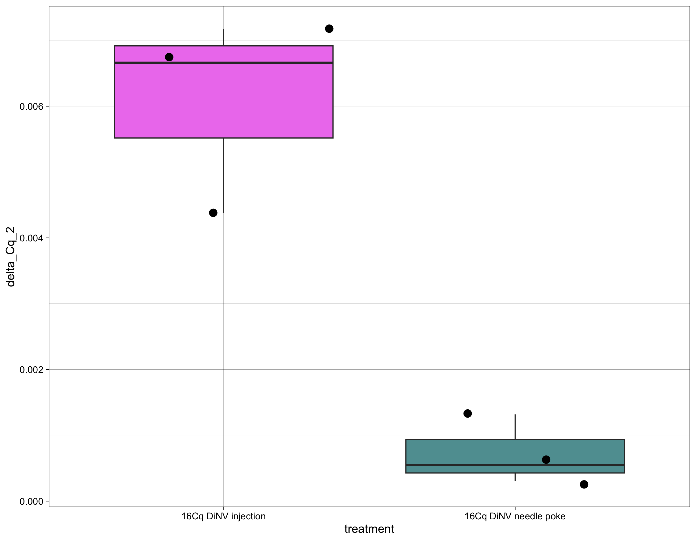

I am not sure exactly what delta Cq means in this context, I think it is
relative amount of virus genome to host genome?

How to compare the delta 2^Cqs?

Calculate mean of the delta ^2Cqs, the variance, and then the
coefficient of variation

``` r
# calculate the mean of delta_Cq_2 for each treatment 
tapply(Cq_values_40_1rep_1ng_Delta$delta_Cq_2, Cq_values_40_1rep_1ng_Delta$treatment, mean)
```

      16Cq DiNV injection 16Cq DiNV needle poke 
             0.0060693612          0.0007248124 

``` r
# calculate the variance of delta_Cq_2 for each treatment
sqrt(tapply(Cq_values_40_1rep_1ng_Delta$delta_Cq_2, Cq_values_40_1rep_1ng_Delta$treatment, var))
```

      16Cq DiNV injection 16Cq DiNV needle poke 
             0.0014898800          0.0005287672 

``` r
# mean for inject is 0.00607
# mean for needle is 0.000728

# this means that the injection gives about 10X as much viral genomes as the needle

# coefficient of variation 
# injection 
0.0014898800/0.006069361
```

    [1] 0.2454756

``` r
#0.2454756 as the amount of variation

# needle 
0.0005287672/0.0007248124
```

    [1] 0.7295228

``` r
# 0.7295228 as the amount of variation 

# how do these compare
0.7295228/0.2454756
```

    [1] 2.971875

``` r
# 2.971875 so the needle is about 3 times more variable? 
```

How does the 1:10 dilution look?

``` r
Cq_values_40_1rep_1_10 <- Cq_values_40_1rep[which(Cq_values_40_1rep$dilution == "1:10"),]

hist(Cq_values_40_1rep_1_10$Cq_var)
```

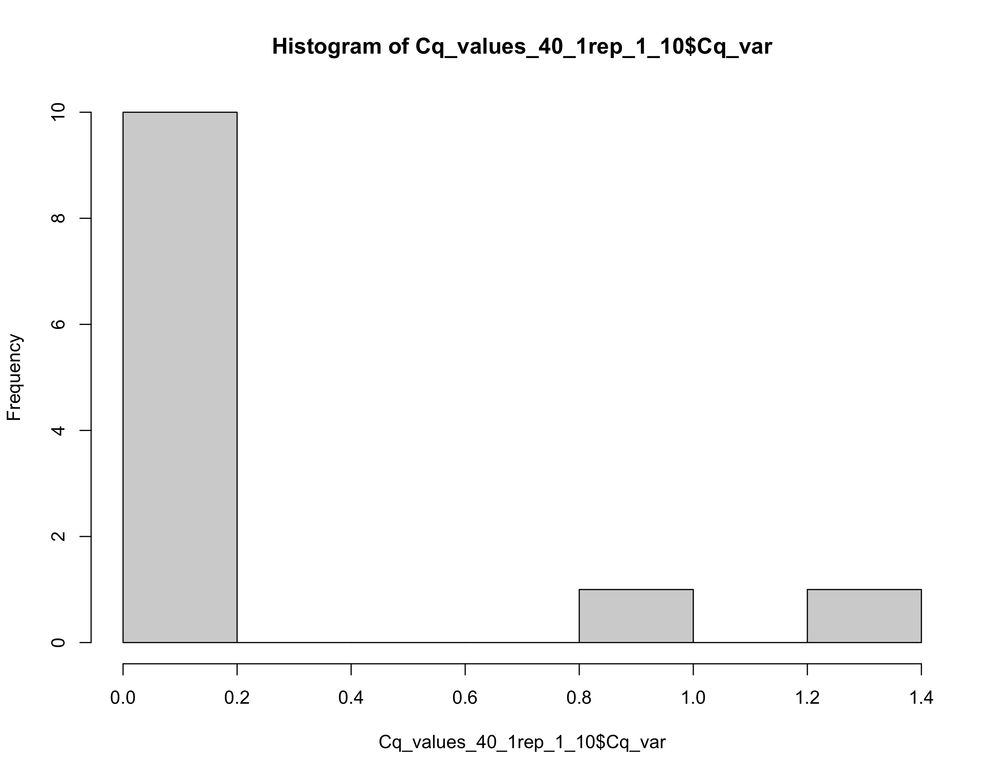

Ok these are basically variances I deemed were ok for the one above, so
I should be ok with these as well?

Plot the means vs the variances

``` r
ggplot(Cq_values_40_1rep_1_10, aes(x=Cq_mean, y=Cq_var)) +
  geom_point(size=2, shape=23)
```


This doesn’t exactly follow that there are higher variances with higher
Cq means, so there isn’t really a trend here.

Plot Cqs as box plots for just 1:10 dilution

``` r
ggplot(Cq_values_40_1rep_1_10, aes(y= Cq_mean, x=primer, fill=treatment)) + geom_boxplot() 
```

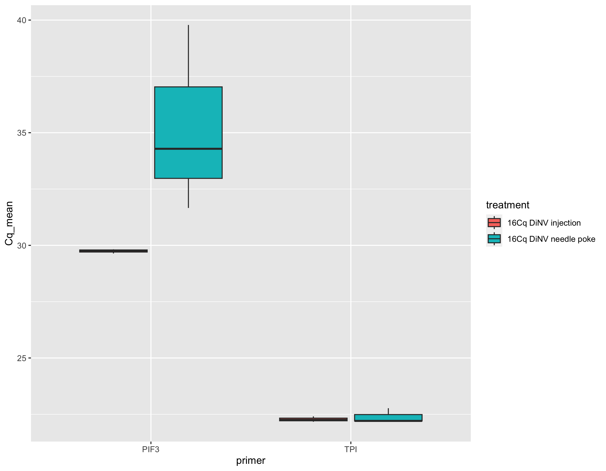

This looks pretty similar to the one above, even cleaner/tighter
actually which is pretty interesting, and promising for just using the
1:10 dilution. At least for the injection. It is more variable for the
poke.

Calculating delta Cqs from the TPI to the PIF 3 for 1:10 dilution

``` r
# currently the samples are not ordered by the sample, but by the plate, so I need each sample one right after the other 
# can I order them by well code?
Cq_values_40_1rep_1_10 <- Cq_values_40_1rep_1_10[order(Cq_values_40_1rep_1_10$well.code),]

# yes this worked great, I have the TPI first, then the PIF 3 

# Separate that dataframe, incriminating by 2, every number between 1-12 (number of rows in dataframe)
Cq_values_40_1rep_1_10$Cq_mean[seq(1,12,2)] # these are the TPI Cq means 
```

    [1] 22.20333 22.40667 22.25333 22.17000 22.77000 22.20667

``` r
Cq_values_40_1rep_1_10$Cq_mean[seq(2,12,2)] # these are the PIF 3 primer Cq means 
```

    [1] 31.66000 29.82333 29.64000 29.76667 39.78333 34.28667

``` r
# make delta Cq, subtract the PIF 3 value from the TPI primer value 
delta_Cqs_1_10 <- Cq_values_40_1rep_1_10$Cq_mean[seq(1,12,2)] - Cq_values_40_1rep_1_10$Cq_mean[seq(2,12,2)]

delta_Cqs_1_10
```

    [1]  -9.456667  -7.416667  -7.386667  -7.596667 -17.013333 -12.080000

``` r
# want to add this as a column to our df, but first need to remove one of the primer rows, so let's remove the PIF3 

Cq_values_40_1rep_1_10_Delta <- Cq_values_40_1rep_1_10[which(Cq_values_40_1rep_1_10$primer == "PIF3"),]
# and this should be in the order of delta_Cqs_Stock
Cq_values_40_1rep_1_10_Delta$delta_Cq <- delta_Cqs_1_10

# add another column that is 2^deltaCq

Cq_values_40_1rep_1_10_Delta$delta_Cq_2 <- 2^(delta_Cqs_1_10)

#Plot by treatment

ggplot(Cq_values_40_1rep_1_10_Delta, aes(y= delta_Cq_2, x=treatment, fill=treatment)) + geom_boxplot()  + theme_linedraw() + geom_point(position="jitter", size=3) + scale_fill_manual(values = c('violet', 'cadetblue')) + theme(legend.position = "none")
```

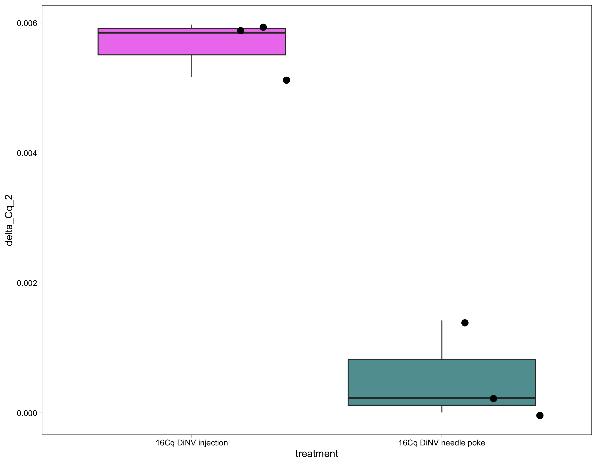

How to compare the delta Cqs ^2?

Calculate mean of the delta Cqs ^2, the variance, and then the
coeddicient of variation

``` r
# calculate the mean of delta_Cq_2 for each treatment 
tapply(Cq_values_40_1rep_1_10_Delta$delta_Cq_2, Cq_values_40_1rep_1_10_Delta$treatment, mean)
```

      16Cq DiNV injection 16Cq DiNV needle poke 
             0.0056649179          0.0005539033 

``` r
# calculate the variance of delta_Cq_2 for each treatment
sqrt(tapply(Cq_values_40_1rep_1_10_Delta$delta_Cq_2, Cq_values_40_1rep_1_10_Delta$treatment, var))
```

      16Cq DiNV injection 16Cq DiNV needle poke 
             0.0004362141          0.0007610579 

``` r
# mean for inject is 0.0057
# mean for needle is 0.0055

# this means that the injection gives about 10X as much viral genomes as the needle

# coefficient of variation 
# injection 
0.0004362141/0.0056649179
```

    [1] 0.07700272

``` r
# 0.07700272 as the amount of variation

# needle 
0.0007610579/0.0005539033
```

    [1] 1.373991

``` r
# 1.373991 as the amount of variation 

# how do these compare
1.373991/0.07700272
```

    [1] 17.84341

``` r
# 17.84341 so the needle is about 18 times more variable? 
```

Combine the 1:10 and 1ng into one plot and color by the dilution?

``` r
# add datasets with the 2^detla Cq together
Combo_delta <- rbind(Cq_values_40_1rep_1_10_Delta, Cq_values_40_1rep_1ng_Delta)

# want to do some stats/error bars to this plot 
# I think this will do it by both treatment and dilution 
stats <- summarySE(Combo_delta, measurevar="delta_Cq_2", groupvars=c("treatment", "dilution"))
stats
```

                  treatment dilution N   delta_Cq_2           sd           se
    1   16Cq DiNV injection     1:10 3 0.0056649179 0.0004362141 0.0002518483
    2   16Cq DiNV injection      1ng 3 0.0060693612 0.0014898800 0.0008601826
    3 16Cq DiNV needle poke     1:10 3 0.0005539033 0.0007610579 0.0004393970
    4 16Cq DiNV needle poke      1ng 3 0.0007248124 0.0005287672 0.0003052839
               ci
    1 0.001083616
    2 0.003701067
    3 0.001890573
    4 0.001313531

``` r
# ggplot(Combo_delta, aes(y= delta_Cq_2, x=treatment))  + theme_linedraw() + geom_point(position = position_dodge(width = .9), stat = "identity", size=3, aes(color=dilution)) + ylab("2^delta Cq") + xlab("Injection Treatment") + geom_errorbar( aes(ymin = delta_Cq_2-se, ymax = delta_Cq_2+se), data = stats, position = position_dodge(width = .9), width = 0.3)

# used https://www.datanovia.com/en/lessons/ggplot-error-bars/

legend_title <- "DNA Dilution"

ggplot(Combo_delta, aes(y= delta_Cq_2, x=treatment)) +
  geom_errorbar(aes(ymin = delta_Cq_2-se, ymax = delta_Cq_2+se, color = dilution),data = stats, position = position_dodge(0.3), width = 0.2)+
  geom_point(aes(color = dilution), position = position_dodge(0.3), size = 3) +
  scale_color_manual(legend_title,values = c("#44AA99",  "#332288")) + theme_light() + 
  theme(axis.text=element_text(size=12),axis.title=element_text(size=14), legend.text=element_text(size=12), legend.title=element_text(size=14)) + labs(title = "Comparing Ammount and Variation of \nDiNV Dose Between Poke and Injection",y = "2^delta Cq", x = "Injection Treatment")
```


