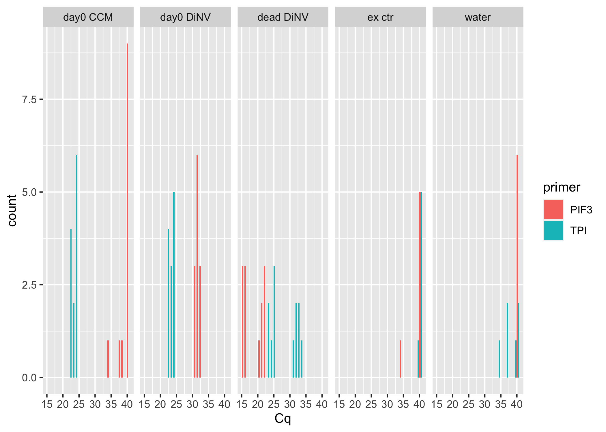
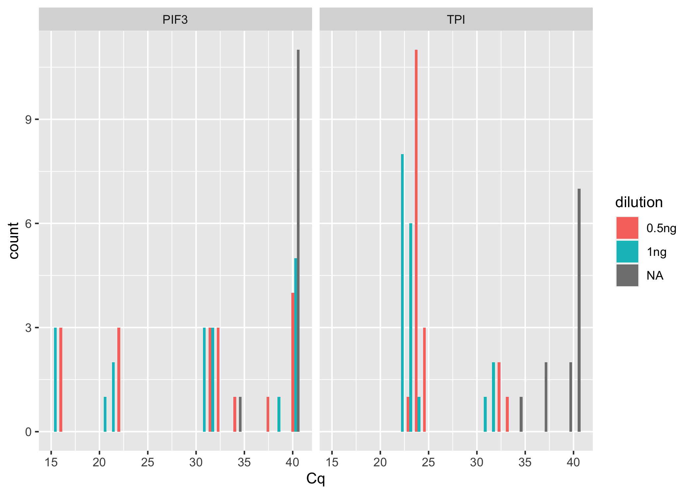
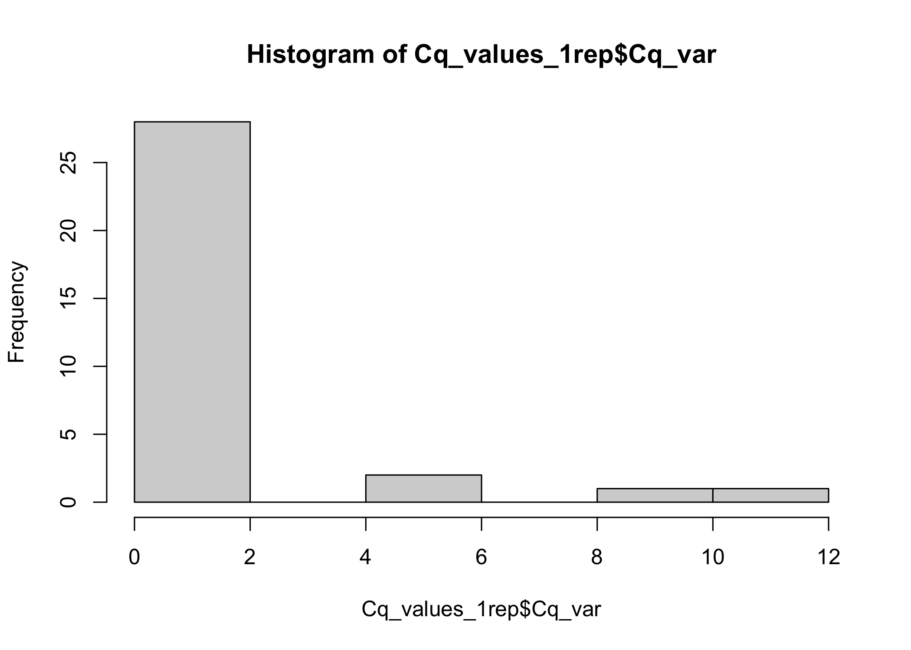
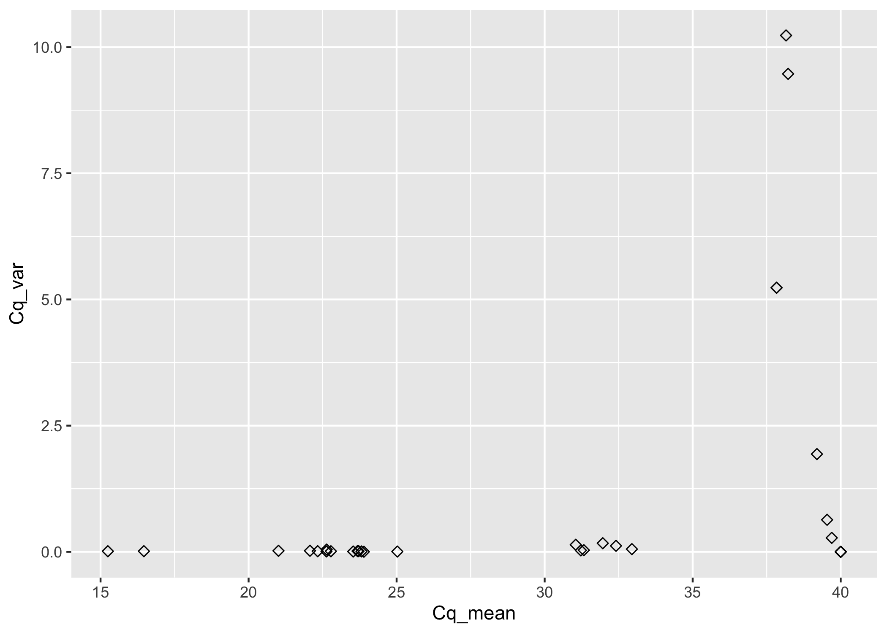
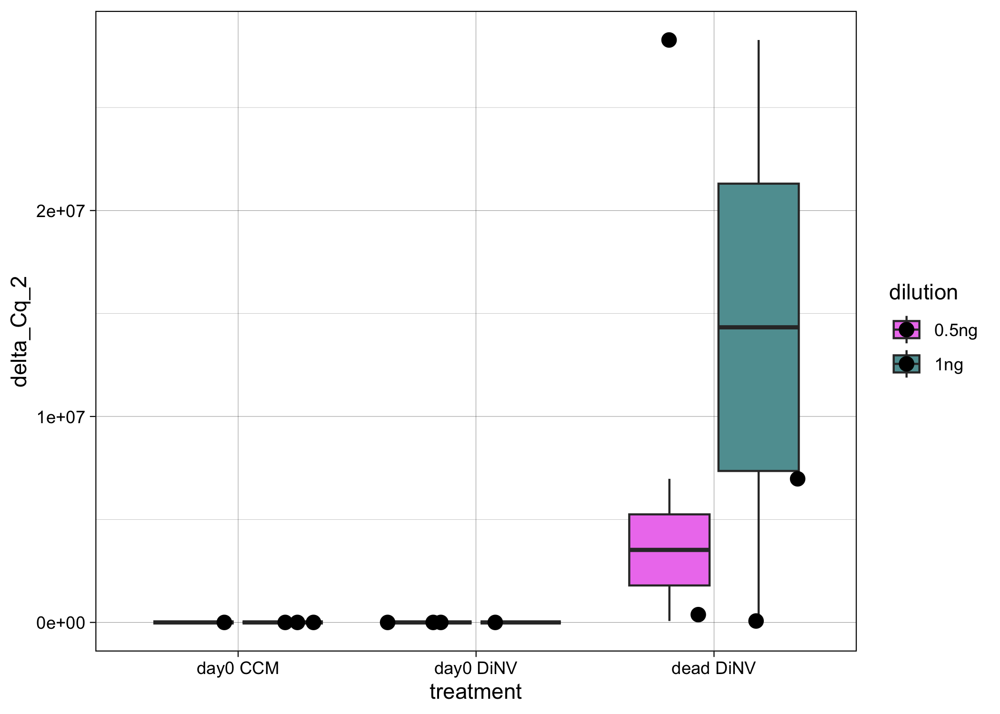
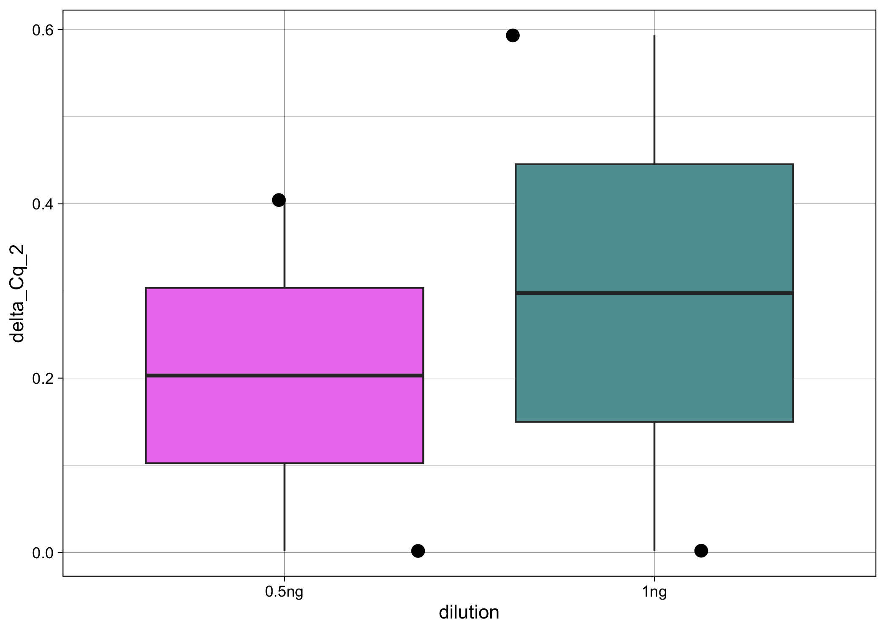
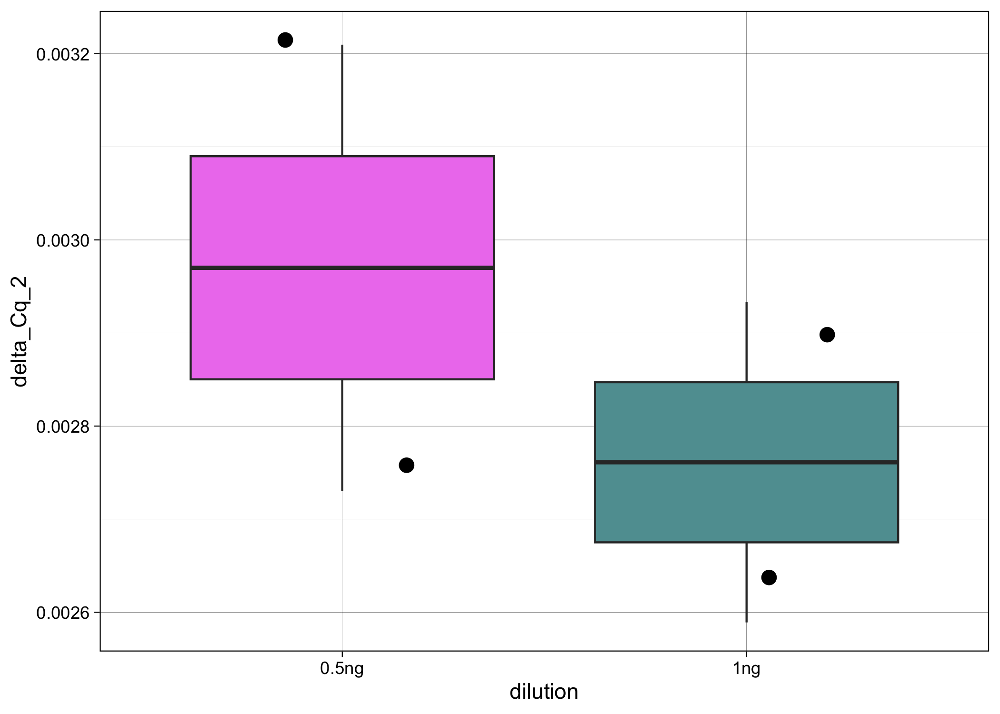
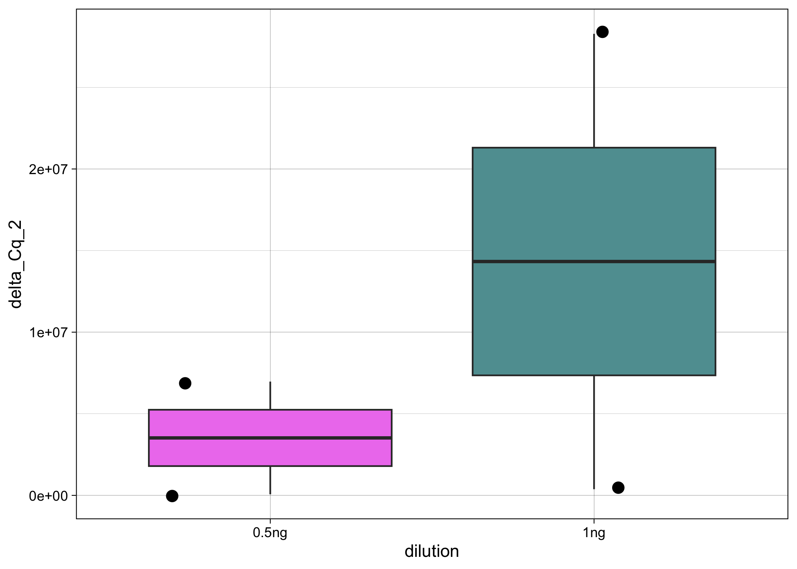
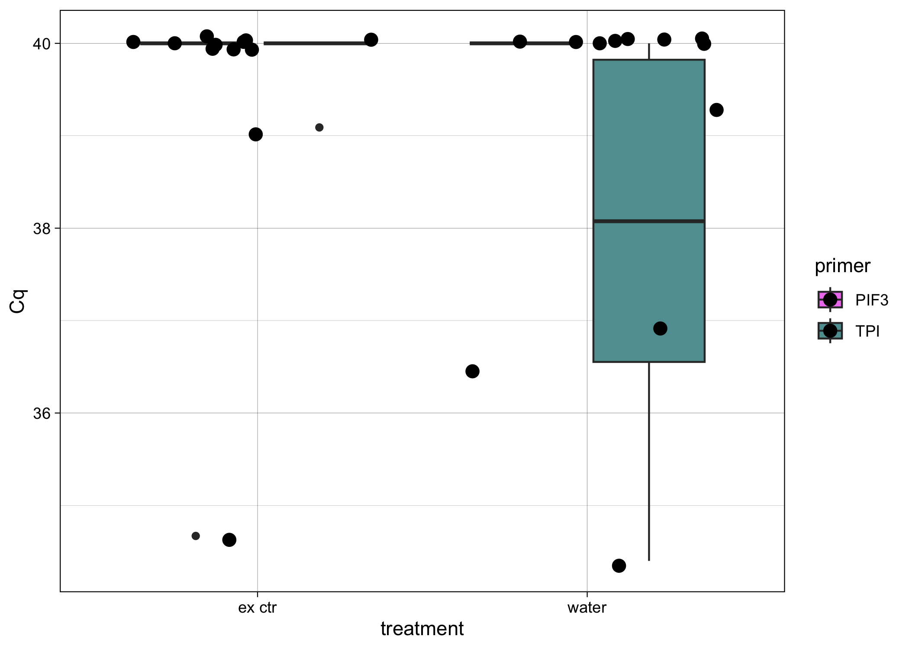

# 20231017 qPCR analysis fly DNA dilutions

Load packages needed

``` r
library(ggplot2)
library(dplyr)
```


    Attaching package: 'dplyr'

    The following objects are masked from 'package:stats':

        filter, lag

    The following objects are masked from 'package:base':

        intersect, setdiff, setequal, union

``` r
library(tidyr)
```

``` r
Cq_values <- read.csv("/Users/maggieschedl/Desktop/Github/Unckless_Lab_Resources/qPCR_analysis/20231017-test-dilutions-fly-DNA/20231017-qPCR-sheet.csv")
```

Look at raw Cq values by treatment and primer

``` r
# if you want to also include another varaible to separate out the histogram by, you can include a facet 
ggplot(Cq_values, aes(x= Cq, fill = primer)) + geom_histogram(position = "dodge") + facet_grid(~treatment) 
```

    `stat_bin()` using `bins = 30`. Pick better value with `binwidth`.



Look at raw Cq values by dilution and primer

``` r
# if you want to also include another varaible to separate out the histogram by, you can include a facet 
ggplot(Cq_values, aes(x= Cq, fill = dilution)) + geom_histogram(position = "dodge") + facet_grid(~primer) 
```

    `stat_bin()` using `bins = 30`. Pick better value with `binwidth`.



``` r
# this isn't very informative 
```

Calculate variances in Cq between tech replicates, as well as the means

``` r
# use the variance function, and calculates the variance in Cq by the unique.name (each sample/primer has 3 Cq values to 
# calculate the variance by)
Cq_values$Cq_var <- ave(Cq_values$Cq, Cq_values$unique.name, FUN=var)

# use the mean function, and calculates the mean of Cq values by the unique.name (each sample/primer has 3 Cq values to 
# calculate the mean by)
Cq_values$Cq_mean <- ave(Cq_values$Cq, Cq_values$unique.name, FUN=mean)

# Keep all rows where the replicate is 1 (or you could do 2 or 3)
# make into new Df so we keep the original with all the Cq values
Cq_values_1rep <- Cq_values[which(Cq_values$replicate == "1"),]

# histogram of all variances
hist(Cq_values_1rep$Cq_var)
```



``` r
# some of these are super high that we don't want 

# which are above 2?
Cq_values[which(Cq_values$Cq_var >2),]
```

       well plate well.code tube.number treatment dilution replicate primer
    13  B01     1     water       water     water     <NA>         1    TPI
    14  B02     1     water       water     water     <NA>         2    TPI
    15  B03     1     water       water     water     <NA>         3    TPI
    43  D07     1   7 0.5ng           7  day0 CCM    0.5ng         1   PIF3
    44  D08     1   7 0.5ng           7  day0 CCM    0.5ng         2   PIF3
    45  D09     1   7 0.5ng           7  day0 CCM    0.5ng         3   PIF3
    82  G10     1  ex ctr 2    ex ctr 2    ex ctr     <NA>         1   PIF3
    83  G11     1  ex ctr 2    ex ctr 2    ex ctr     <NA>         2   PIF3
    84  G12     1  ex ctr 2    ex ctr 2    ex ctr     <NA>         3   PIF3
    88  H04     1     water       water     water     <NA>         1    TPI
    89  H05     1     water       water     water     <NA>         2    TPI
    90  H06     1     water       water     water     <NA>         3    TPI
       unique.name    Cq    Cq_var  Cq_mean
    13   water-TPI 40.00  5.231907 37.83333
    14   water-TPI 36.45  5.231907 37.83333
    15   water-TPI 39.29  5.231907 37.83333
    43    7-5-PIF3 34.46 10.230533 38.15333
    44    7-5-PIF3 40.00 10.230533 38.15333
    45    7-5-PIF3 40.00 10.230533 38.15333
    82   ex-2-PIF3 34.67  9.469633 38.22333
    83   ex-2-PIF3 40.00  9.469633 38.22333
    84   ex-2-PIF3 40.00  9.469633 38.22333
    88   water-TPI 36.86  5.231907 37.83333
    89   water-TPI 40.00  5.231907 37.83333
    90   water-TPI 34.40  5.231907 37.83333

``` r
# Ok so, for all of these are samples that should have no amplifcation for this primer, either water with TPI
# or extraction controls or CCM treatment for PIF 3
# and all of these seem to have 1 replicate out of the 3 that doesn't fit with the others in terms of the Cq value
# the best thing to do is remove them?
```

Plot variance and means as a scatterplot

``` r
ggplot(Cq_values_1rep, aes(x=Cq_mean, y=Cq_var)) +
  geom_point(size=2, shape=23)
```



For now I am going to look at all the samples that aren’t water or
extraction controls

``` r
# separate out samples that aren't a control 
# so anything that doesn't have an NA for dilution 
Cq_values_1rep_samp <- Cq_values_1rep[which(Cq_values_1rep$dilution != "NA"),]

# now with this, the samples are ordered with the TPI primer for every sample above the PIF3 primer for each sample
# no need to reorder
nrow(Cq_values_1rep_samp)
```

    [1] 24

``` r
# Separate that dataframe, incriminating by 2, every number between 1-12 (number of rows in dataframe)
Cq_values_1rep_samp$Cq_mean[seq(1,24,2)] # these are the TPI Cq means 
```

     [1] 22.63667 23.68000 22.33333 39.54000 23.81333 38.15333 22.78000 40.00000
     [9] 23.71667 39.19667 22.63000 23.89333

``` r
Cq_values_1rep_samp$Cq_mean[seq(2,24,2)] # these are the PIF 3 primer Cq means 
```

     [1] 31.05000 31.96333 31.32333 21.01000 32.94667 22.07333 23.53333 15.24667
     [9] 25.02333 16.46333 31.22333 32.41000

``` r
# make the delta Cq by subtracting the PIF 3 values from the TPI primer values
# and this is saved as a vector in R 
delta_Cqs <- Cq_values_1rep_samp$Cq_mean[seq(1,24,2)] - Cq_values_1rep_samp$Cq_mean[seq(2,24,2)]
#vector
delta_Cqs
```

     [1] -8.4133333 -8.2833333 -8.9900000 18.5300000 -9.1333333 16.0800000
     [7] -0.7533333 24.7533333 -1.3066667 22.7333333 -8.5933333 -8.5166667

``` r
# Keep only rows that are PIF3
Cq_values1rep_Delta <- Cq_values_1rep_samp[which(Cq_values_1rep_samp$primer == "PIF3"),]
# And then add in the delta Cqs as a new column
Cq_values1rep_Delta$delta_Cq <- delta_Cqs

# do 2^ delta Cq
Cq_values1rep_Delta$delta_Cq_2 <- 2^(delta_Cqs)

#Plot by treatment or whatever conditions you are comparing 

ggplot(Cq_values1rep_Delta, aes(y= delta_Cq_2, x=treatment, fill=dilution)) + geom_boxplot()  + theme_linedraw() + geom_point(position="jitter", size=3) + scale_fill_manual(values = c('violet', 'cadetblue')) 
```



Lets look at the treatments separately

``` r
# just day 0 CCM
Cq_values1rep_Delta_CCM <- Cq_values1rep_Delta[which(Cq_values1rep_Delta$treatment == "day0 CCM"),]

ggplot(Cq_values1rep_Delta_CCM, aes(y= delta_Cq_2, x=dilution, fill=dilution)) + geom_boxplot()  + theme_linedraw() + geom_point(position="jitter", size=3) + scale_fill_manual(values = c('violet', 'cadetblue')) + theme(legend.position = "none")
```



I’m not super sure what to make of this, the hope would be that the
numbers would be the same between the two dilutions for the delta?

``` r
# just day 0 DiNV
Cq_values1rep_Delta_CCM <- Cq_values1rep_Delta[which(Cq_values1rep_Delta$treatment == "day0 DiNV"),]

ggplot(Cq_values1rep_Delta_CCM, aes(y= delta_Cq_2, x=dilution, fill=dilution)) + geom_boxplot()  + theme_linedraw() + geom_point(position="jitter", size=3) + scale_fill_manual(values = c('violet', 'cadetblue')) + theme(legend.position = "none")
```



``` r
# just day dead DiNV
Cq_values1rep_Delta_CCM <- Cq_values1rep_Delta[which(Cq_values1rep_Delta$treatment == "dead DiNV"),]

ggplot(Cq_values1rep_Delta_CCM, aes(y= delta_Cq_2, x=dilution, fill=dilution)) + geom_boxplot()  + theme_linedraw() + geom_point(position="jitter", size=3) + scale_fill_manual(values = c('violet', 'cadetblue')) + theme(legend.position = "none")
```



What are the Cq values for my control samples?

``` r
Cq_values_ctr <- Cq_values[is.na(Cq_values$dilution),]

ggplot(Cq_values_ctr, aes(y= Cq, x=treatment, fill=primer)) + geom_boxplot()  + theme_linedraw() + geom_point(position="jitter", size=3) + scale_fill_manual(values = c('violet', 'cadetblue')) 
```


