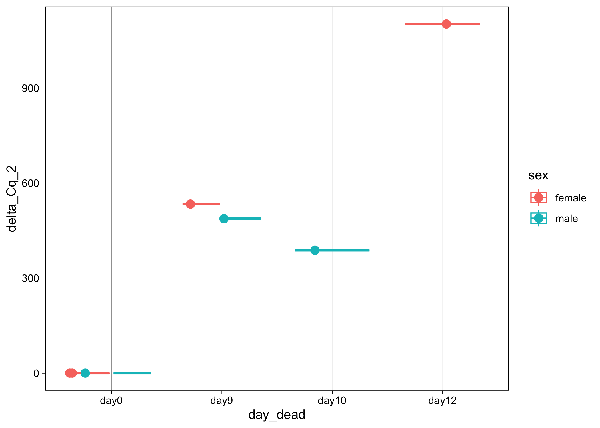

# 20231117-fly-death-Cq-analysis

``` r
library(ggplot2)
library(dplyr)
```


    Attaching package: 'dplyr'

    The following objects are masked from 'package:stats':

        filter, lag

    The following objects are masked from 'package:base':

        intersect, setdiff, setequal, union

``` r
library(tidyr)
```

``` r
Cq_values <- read.csv("/Users/maggieschedl/Desktop/Github/Unckless_Lab_Resources/qPCR_analysis/20231117-fly-extract-analysis/20231117-qPCR-sheet.csv")

# remove the rows that have samples for a different project 
Cq_values_sub <- Cq_values[c(25:48, 73:96),]

# also removing the water from this
# I know that the variance is high for the water with TPI, see https://github.com/meschedl/Unckless_Lab_Resources/blob/main/qPCR_analysis/20231117-hirt-extract-analysis/20231117-qPCR-hirt-extract-analysis.md

Cq_values_sub <- Cq_values_sub[which(Cq_values_sub$volume != "water"),]
```

Look at raw Cq values by day dead and primer

``` r
# if you want to also include another varaible to separate out the histogram by, you can include a facet 
ggplot(Cq_values_sub, aes(x= Cq, fill = primer)) + geom_histogram(position = "dodge") + facet_grid(~day_dead) 
```

    `stat_bin()` using `bins = 30`. Pick better value with `binwidth`.


Seems like a vary large increase in amount of virus

Calculate variance and mean of Cq value between the technical replicates

``` r
# use the variance function, and calculates the variance in Cq by the unique.name (each sample/primer has 3 Cq values to 
# calculate the variance by)
Cq_values_sub$Cq_var <- ave(Cq_values_sub$Cq, Cq_values_sub$unique_name, FUN=var)

# use the mean function, and calculates the mean of Cq values by the unique.name (each sample/primer has 3 Cq values to 
# calculate the mean by)
Cq_values_sub$Cq_mean <- ave(Cq_values_sub$Cq, Cq_values_sub$unique_name, FUN=mean)

# Keep all rows where the replicate is 1 (or you could do 2 or 3)
# make into new Df so we keep the original with all the Cq values
Cq_values_1rep <- Cq_values_sub[which(Cq_values_sub$qPCR_replicate == "1"),]

# histogram of all variances
ggplot(Cq_values_1rep, aes(x=Cq_var)) + geom_histogram(bins = 50)
```


``` r
# there are 3 samples with kind of high variance, but they all are below 1 which is good 

# what are those 3 samples 

high_var <- Cq_values_sub[which(Cq_values_sub$Cq_var >.1),]
high_var
```

       Well qPCR_replicate sample_ID primer sample_type sample_specific
    73  G01              1    14 fly   PIF3         fly            day0
    74  G02              2    14 fly   PIF3         fly            day0
    75  G03              3    14 fly   PIF3         fly            day0
    76  G04              1    15 fly   PIF3         fly            day0
    77  G05              2    15 fly   PIF3         fly            day0
    78  G06              3    15 fly   PIF3         fly            day0
    79  G07              1    17 fly   PIF3         fly            day0
    80  G08              2    17 fly   PIF3         fly            day0
    81  G09              3    17 fly   PIF3         fly            day0
       extraction_sample volume unique_name    sex day_dead    Cq    Cq_var
    73               fly    fly 14 fly PIF3 female     day0 31.29 0.1566333
    74               fly    fly 14 fly PIF3 female     day0 31.39 0.1566333
    75               fly    fly 14 fly PIF3 female     day0 32.02 0.1566333
    76               fly    fly 15 fly PIF3 female     day0 31.01 0.1825333
    77               fly    fly 15 fly PIF3 female     day0 31.75 0.1825333
    78               fly    fly 15 fly PIF3 female     day0 31.75 0.1825333
    79               fly    fly 17 fly PIF3   male     day0 30.81 0.1308333
    80               fly    fly 17 fly PIF3   male     day0 31.41 0.1308333
    81               fly    fly 17 fly PIF3   male     day0 30.76 0.1308333
        Cq_mean
    73 31.56667
    74 31.56667
    75 31.56667
    76 31.50333
    77 31.50333
    78 31.50333
    79 30.99333
    80 30.99333
    81 30.99333

``` r
# all PIF3 day0 flies, which would have a low amount of virus 
# the Cqs are all pretty similar 
# I am going to leave them how they are 

# plot variances and means as a scatterplot 
ggplot(Cq_values_1rep, aes(x=Cq_mean, y=Cq_var)) +
  geom_point(size=2, shape=23)
```


No pattern except for those few samples where the higher PIF3 has the
higher variance

Calculating Delta Cqs

``` r
# first the samples need to be ordered where each samples with both primers is one after the other 
# ordering by sample ID 
Cq_values_1rep <- Cq_values_1rep[order(Cq_values_1rep$sample_ID),]
# great this orders all the samples, with TPI first and PIF3 second 
nrow(Cq_values_1rep)
```

    [1] 14

``` r
# Separate that dataframe, incriminating by 2, every number between 1-14 (number of rows in dataframe)
Cq_values_1rep$Cq_mean[seq(1,14,2)] # these are the TPI Cq means 
```

    [1] 23.33667 23.40333 23.69333 25.65333 23.85667 24.22333 26.05667

``` r
Cq_values_1rep$Cq_mean[seq(2,14,2)] # these are the PIF 3 primer Cq means 
```

    [1] 31.56667 31.50333 30.99333 16.59333 14.92667 15.62333 15.95000

``` r
# make the delta Cq by subtracting the PIF 3 values from the TPI primer values
# and this is saved as a vector in R 
delta_Cqs <- Cq_values_1rep$Cq_mean[seq(1,14,2)] - Cq_values_1rep$Cq_mean[seq(2,14,2)]
#vector
delta_Cqs
```

    [1] -8.23000 -8.10000 -7.30000  9.06000  8.93000  8.60000 10.10667

``` r
# Keep only rows that are PIF3
Cq_values1rep_Delta <- Cq_values_1rep[which(Cq_values_1rep$primer == "PIF3"),]
# And then add in the delta Cqs as a new column
Cq_values1rep_Delta$delta_Cq <- delta_Cqs

# do 2^ delta Cq
Cq_values1rep_Delta$delta_Cq_2 <- 2^(delta_Cqs)

# order the days 
Cq_values1rep_Delta$day_dead <- factor(Cq_values1rep_Delta$day_dead, levels=c("day0", "day9", "day10", "day12"))
# plot 
ggplot(Cq_values1rep_Delta, aes(y= delta_Cq_2, x=day_dead, color=sex)) + geom_boxplot()  + theme_linedraw() + geom_point(position="jitter", size=3) 
```



Delta Delta Cq analysis, comparing the day0 to day dead flies
