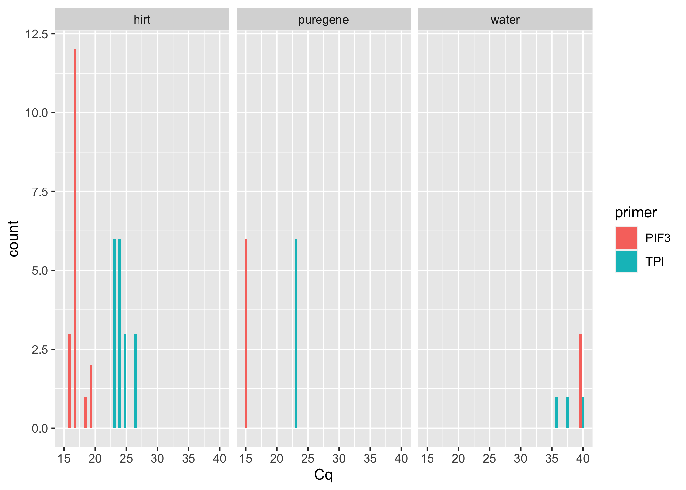
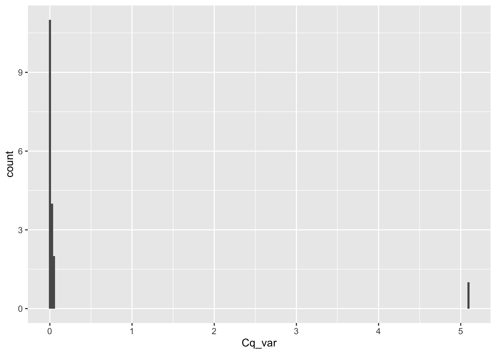
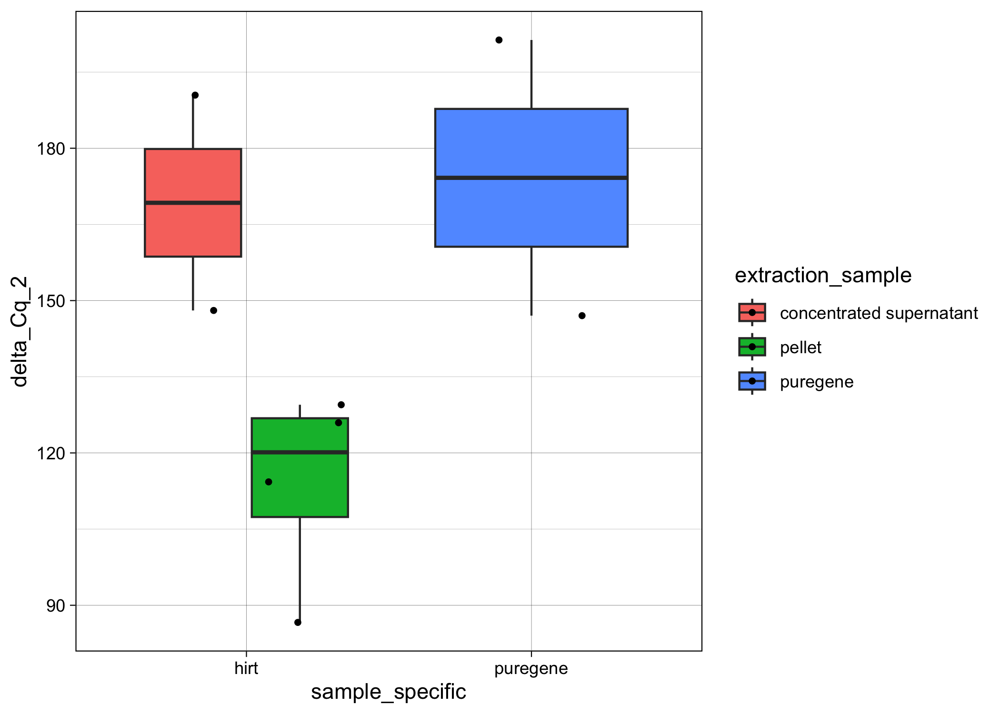

# 20231117-qPCR-hirt-Extract-Analysis

Load packages needed

``` r
library(ggplot2)
library(dplyr)
```


    Attaching package: 'dplyr'

    The following objects are masked from 'package:stats':

        filter, lag

    The following objects are masked from 'package:base':

        intersect, setdiff, setequal, union

``` r
library(tidyr)
```

Load in data

``` r
Cq_values <- read.csv("/Users/maggieschedl/Desktop/Github/Unckless_Lab_Resources/qPCR_analysis/20231117-hirt-extract-analysis/20231117-qPCR-sheet.csv")

# remove the rows that have the fly data that was run at the same time, those don't matter to this analysis 


Cq_values_sub <- Cq_values[c(1:24, 46:72, 85:87),]
```

Look at raw Cq values by sample type and primer

``` r
# if you want to also include another varaible to separate out the histogram by, you can include a facet 
ggplot(Cq_values_sub, aes(x= Cq, fill = primer)) + geom_histogram(position = "dodge") + facet_grid(~sample_specific) 
```

    `stat_bin()` using `bins = 30`. Pick better value with `binwidth`.



Ok looking at this there doesn’t seem to be much of a difference between
the extraction methods, but it is hard to tell without generating the
delta Cq yet.

Calculate the variance and the mean between the 3 technical replicates
for each samples for each primer

``` r
# use the variance function, and calculates the variance in Cq by the unique.name (each sample/primer has 3 Cq values to 
# calculate the variance by)
Cq_values_sub$Cq_var <- ave(Cq_values_sub$Cq, Cq_values_sub$unique_name, FUN=var)

# use the mean function, and calculates the mean of Cq values by the unique.name (each sample/primer has 3 Cq values to 
# calculate the mean by)
Cq_values_sub$Cq_mean <- ave(Cq_values_sub$Cq, Cq_values_sub$unique_name, FUN=mean)

# Keep all rows where the replicate is 1 (or you could do 2 or 3)
# make into new Df so we keep the original with all the Cq values
Cq_values_1rep <- Cq_values_sub[which(Cq_values_sub$qPCR_replicate == "1"),]

# histogram of all variances
ggplot(Cq_values_1rep, aes(x=Cq_var)) + geom_histogram(bins = 200)
```



``` r
# I know that the only sample with high variance is the water for the TPI primer
# all of the other ones are below 1 and very close to 1 which is how we like it
# Because I won't analyze the water anyways, I think these are fine 
```

Remove water samples from dataset

``` r
Cq_values_1rep_samp <- Cq_values_1rep[which(Cq_values_1rep$volume != "water"),]

# plot variances and means as a scatterplot 
ggplot(Cq_values_1rep_samp, aes(x=Cq_mean, y=Cq_var)) +
  geom_point(size=2, shape=23)
```


No relationship between Cq value and variance it looks like

Generate Delta Cq values for all the samples

``` r
# first the samples need to be ordered where each samples with both primers is one after the other 
# try ordering by sample ID 
Cq_values_1rep_samp <- Cq_values_1rep_samp[order(Cq_values_1rep_samp$sample_ID),]
# great this orders all the samples, with TPI first and PIF3 second 

# how many rows
nrow(Cq_values_1rep_samp)
```

    [1] 16

``` r
# Separate that dataframe, incriminating by 2, every number between 1-16 (number of rows in dataframe)
Cq_values_1rep_samp$Cq_mean[seq(1,16,2)] # these are the TPI Cq means 
```

    [1] 23.68667 23.72667 23.08333 23.09000 26.31000 24.45333 22.78000 23.15667

``` r
Cq_values_1rep_samp$Cq_mean[seq(2,16,2)] # these are the PIF 3 primer Cq means 
```

    [1] 16.71000 16.89000 16.64667 16.07333 19.10000 16.88000 15.58000 15.50333

``` r
# make the delta Cq by subtracting the PIF 3 values from the TPI primer values
# and this is saved as a vector in R 
delta_Cqs <- Cq_values_1rep_samp$Cq_mean[seq(1,16,2)] - Cq_values_1rep_samp$Cq_mean[seq(2,16,2)]
#vector
delta_Cqs
```

    [1] 6.976667 6.836667 6.436667 7.016667 7.210000 7.573333 7.200000 7.653333

``` r
# Keep only rows that are PIF3
# because we only need to keep one row per sample, so just get rid of one of the primer rows 
Cq_values1rep_Delta <- Cq_values_1rep_samp[which(Cq_values_1rep_samp$primer == "PIF3"),]
# And then add in the delta Cqs as a new column
Cq_values1rep_Delta$delta_Cq <- delta_Cqs

# do 2^ delta Cq
Cq_values1rep_Delta$delta_Cq_2 <- 2^(delta_Cqs)


ggplot(Cq_values1rep_Delta, aes(y= delta_Cq_2, x=sample_specific, fill=extraction_sample)) + geom_boxplot()  + theme_linedraw() + geom_point(position="jitter", size=1) 
```


