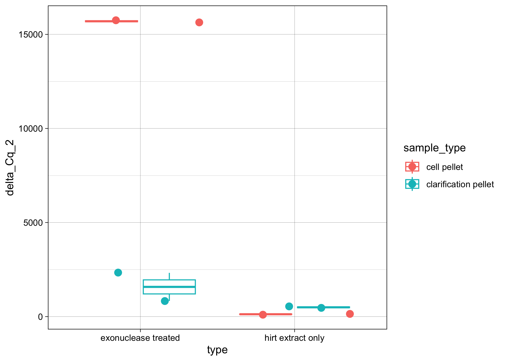

# 20240112-exo-treatment-test

``` r
library(ggplot2)
library(dplyr)
```


    Attaching package: 'dplyr'

    The following objects are masked from 'package:stats':

        filter, lag

    The following objects are masked from 'package:base':

        intersect, setdiff, setequal, union

``` r
library(tidyr)
```

Load in dataset

``` r
Cq_values <- read.csv("/Users/maggieschedl/Desktop/Github/Unckless_Lab_Resources/qPCR_analysis/20240112-exo-treatment-test/20240112-exo-qPCR.csv")
# I only need rows 1 - 48 
Cq_values <- Cq_values[c(1:48),]
```

Look at raw Cq values by primer and sample type

``` r
# if you want to also include another varaible to separate out the histogram by, you can include a facet 
ggplot(Cq_values, aes(x= Cq, fill = primer)) + geom_histogram(position = "dodge") + facet_grid(~type) 
```

    `stat_bin()` using `bins = 30`. Pick better value with `binwidth`.


Based off of this, it looks like the exonuclease treatment may have done
something, the TPI Cqs are higher… but also the PIF3

Calculate variance and mean of Cq value between the technical replicates

``` r
# use the variance function, and calculates the variance in Cq by the unique.name (each sample/primer has 3 Cq values to 
# calculate the variance by)
Cq_values$Cq_var <- ave(Cq_values$Cq, Cq_values$unique_name, FUN=var)

# use the mean function, and calculates the mean of Cq values by the unique.name (each sample/primer has 3 Cq values to 
# calculate the mean by)
Cq_values$Cq_mean <- ave(Cq_values$Cq, Cq_values$unique_name, FUN=mean)

# Keep all rows where the replicate is 1 (or you could do 2 or 3)
# make into new Df so we keep the original with all the Cq values
Cq_values_1rep <- Cq_values[which(Cq_values$replicate == "1"),]

# histogram of all variances
ggplot(Cq_values_1rep, aes(x=Cq_var)) + geom_histogram(bins = 50)
```


``` r
# all of these seem pretty low, there is maybe two that are a little high, but not much 
# right now I am going to leave them

# plot variances and means as a scatterplot 
ggplot(Cq_values_1rep, aes(x=Cq_mean, y=Cq_var)) +
  geom_point(size=2, shape=23)
```


The only slightly higher variance samples have the highest Cq, which is
what we have seen before.

Calculating Delta Cqs between TPI and PIF3

``` r
# samples are not ordered properly
# they need to be ordered with the two primer samples next to each other for each sample 
# order them by the sample
Cq_values_1rep <- Cq_values_1rep[order(Cq_values_1rep$sample),]
Cq_values_1rep
```

       well sample replicate primer                type          sample_type
    1   A01     16         1    TPI   hirt extract only          cell pellet
    25  C01     16         1   PIF3   hirt extract only          cell pellet
    22  B10 16-exo         1    TPI exonuclease treated          cell pellet
    46  D10 16-exo         1   PIF3 exonuclease treated          cell pellet
    4   A04     17         1    TPI   hirt extract only          cell pellet
    28  C04     17         1   PIF3   hirt extract only          cell pellet
    19  B07 17-exo         1    TPI exonuclease treated          cell pellet
    43  D07 17-exo         1   PIF3 exonuclease treated          cell pellet
    7   A07     18         1    TPI   hirt extract only clarification pellet
    31  C07     18         1   PIF3   hirt extract only clarification pellet
    16  B04 18-exo         1    TPI exonuclease treated clarification pellet
    40  D04 18-exo         1   PIF3 exonuclease treated clarification pellet
    10  A10     19         1    TPI   hirt extract only clarification pellet
    34  C10     19         1   PIF3   hirt extract only clarification pellet
    13  B01 19-exo         1    TPI exonuclease treated clarification pellet
    37  D01 19-exo         1   PIF3 exonuclease treated clarification pellet
            cleanup_type               unique_name    Cq      Cq_var  Cq_mean
    1               <NA>               16 cell TPI 21.46 0.007233333 21.42667
    25              <NA>              16 cell PIF3 14.24 0.018900000 14.27000
    22           monarch           16 cell exo TPI 28.71 0.130000000 29.01000
    46           monarch          16 cell exo PIF3 15.11 0.004433333 15.07667
    4               <NA>               17 cell TPI 21.25 0.010300000 21.34000
    28              <NA>              17 cell PIF3 14.55 0.003700000 14.59000
    19 phenol-chloroform           17 cell exo TPI 30.55 0.132233333 30.80333
    43 phenol-chloroform          17 cell exo PIF3 16.69 0.025900000 16.86000
    7               <NA>      18 clarification TPI 21.98 0.042433333 22.00333
    31              <NA>     18 clarification PIF3 13.10 0.044800000 12.94000
    16           monarch  18 clarification exo TPI 26.24 0.004900000 26.24000
    40           monarch 18 clarification exo PIF3 15.12 0.003633333 15.05667
    10              <NA>      19 clarification TPI 21.75 0.014800000 21.83000
    34              <NA>     19 clarification PIF3 12.67 0.087033333 13.00667
    13 phenol-chloroform  19 clarification exo TPI 27.02 0.002100000 27.01000
    37 phenol-chloroform 19 clarification exo PIF3 17.07 0.044800000 17.31000

``` r
nrow(Cq_values_1rep)
```

    [1] 16

``` r
# Separate that dataframe, incriminating by 2, every number between 1-16 (number of rows in dataframe)
Cq_values_1rep$Cq_mean[seq(1,16,2)] # these are the TPI Cq means 
```

    [1] 21.42667 29.01000 21.34000 30.80333 22.00333 26.24000 21.83000 27.01000

``` r
Cq_values_1rep$Cq_mean[seq(2,16,2)] # these are the PIF 3 primer Cq means 
```

    [1] 14.27000 15.07667 14.59000 16.86000 12.94000 15.05667 13.00667 17.31000

``` r
# make the delta Cq by subtracting the PIF 3 values from the TPI primer values
# and this is saved as a vector in R 
delta_Cqs <- Cq_values_1rep$Cq_mean[seq(1,16,2)] - Cq_values_1rep$Cq_mean[seq(2,16,2)]
#vector
delta_Cqs
```

    [1]  7.156667 13.933333  6.750000 13.943333  9.063333 11.183333  8.823333
    [8]  9.700000

``` r
# Keep only rows that are PIF3 because now we have two rows per sample
Cq_values1rep_Delta <- Cq_values_1rep[which(Cq_values_1rep$primer == "PIF3"),]
# And then add in the delta Cqs as a new column
Cq_values1rep_Delta$delta_Cq <- delta_Cqs

# do 2^ delta Cq
Cq_values1rep_Delta$delta_Cq_2 <- 2^(delta_Cqs)

# plot 
ggplot(Cq_values1rep_Delta, aes(y= delta_Cq_2, x=type, color=sample_type)) + geom_boxplot()  + theme_linedraw() + geom_point(position="jitter", size=3) 
```



It looks from this that the exonuclease treatment does make a
difference, and the largest difference is with the cell pellet samples.
Although the clarification pellet ones still have a better ratio of
virus to cell than the non-treated ones.
