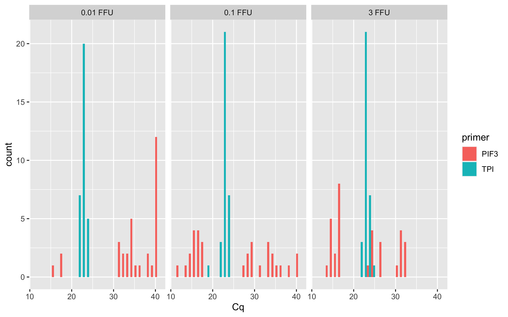
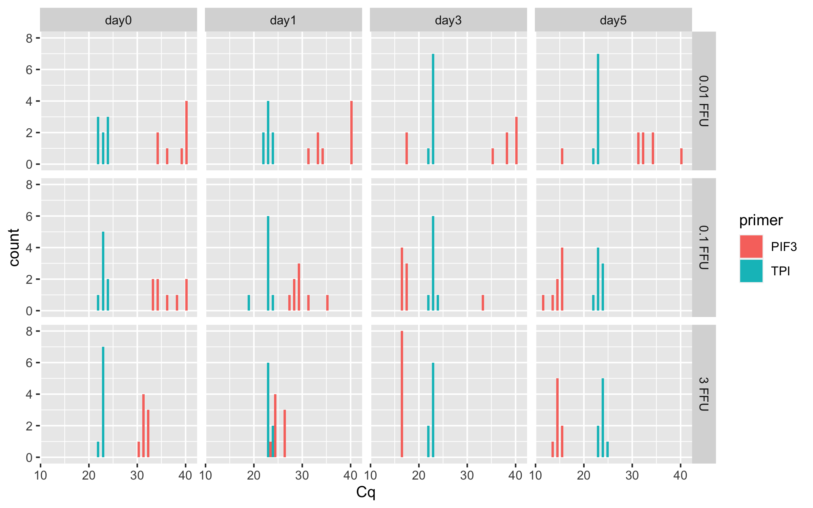
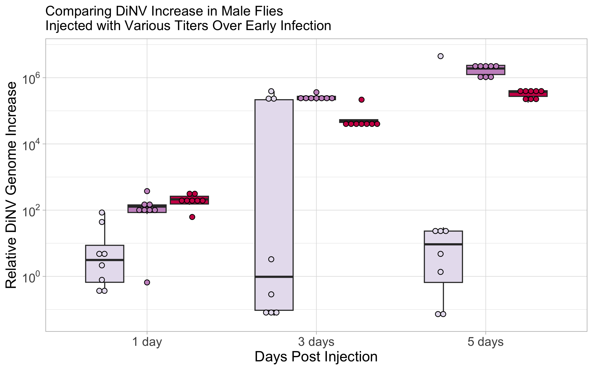
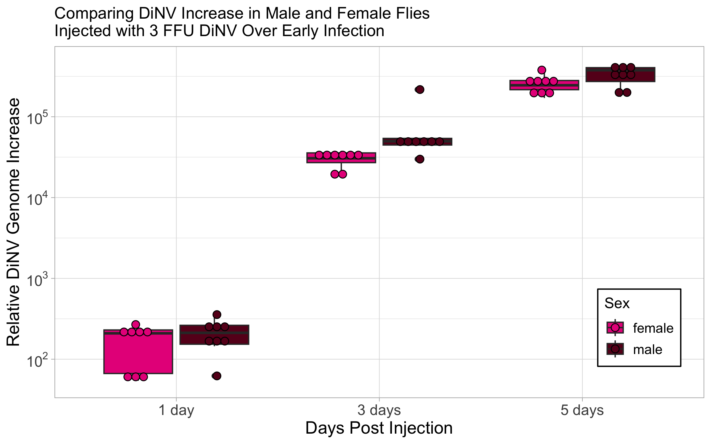

# p4-dilutions-time

``` r
library(ggplot2)
library(dplyr)
```


    Attaching package: 'dplyr'

    The following objects are masked from 'package:stats':

        filter, lag

    The following objects are masked from 'package:base':

        intersect, setdiff, setequal, union

``` r
library(tidyr)
library(scales)
library(Rmisc)
```

    Loading required package: lattice

    Loading required package: plyr

    ------------------------------------------------------------------------------

    You have loaded plyr after dplyr - this is likely to cause problems.
    If you need functions from both plyr and dplyr, please load plyr first, then dplyr:
    library(plyr); library(dplyr)

    ------------------------------------------------------------------------------


    Attaching package: 'plyr'

    The following objects are masked from 'package:dplyr':

        arrange, count, desc, failwith, id, mutate, rename, summarise,
        summarize

Load in dataset

``` r
Cq_values <- read.csv("/Users/maggieschedl/Desktop/Github/Unckless_Lab_Resources/qPCR_analysis/20240228-viral-load-dilutions/viral-dil-time-sheet.csv")
```

Separate male and female for now

``` r
# males
Cq_values_M <- Cq_values[which(Cq_values$sex == "male"),]
# females
Cq_values_F <- Cq_values[which(Cq_values$sex == "female"),]
```

**Female Analysis First**

Look at raw Cq values

``` r
ggplot(Cq_values_F, aes(x= Cq, fill = primer)) + geom_histogram(position = "dodge") + facet_grid(~dilution) 
```

    `stat_bin()` using `bins = 30`. Pick better value with `binwidth`.



TPI looks remarkably consistant, PIF3 is all over the place but this
isn’t separated out by day which would make differences.

Look at raw Cq values and also separate by day

``` r
ggplot(Cq_values_F, aes(x= Cq, fill = primer)) + geom_histogram(position = "dodge") + facet_grid(dilution ~ day) 
```

    `stat_bin()` using `bins = 30`. Pick better value with `binwidth`.



This is showing more patterns that we sort of expect, but we have to do
the delta Cq comparison to the TPI primer to be sure

Calculating female delta Cq and Plotting

``` r
# need to organize by name of the sample I think
Cq_values_F <- Cq_values_F[order(Cq_values_F$sample_ID),]
# this worked to order by the sample number 
# and the PIF3 value is first in the order and TPI second

# Separate that dataframe, incriminating by 2, every number between 1-192 (number of rows in dataframe)
Cq_values_F$Cq[seq(1,192,2)] # these are the PIF 3 Cq #s
```

     [1] 33.59 40.00 38.10 36.14 40.00 34.42 33.56 34.52 40.00 36.20 39.46 40.00
    [13] 40.00 40.00 34.57 34.96 32.03 32.65 31.64 32.01 30.90 32.08 32.00 31.57
    [25] 40.00 40.00 40.00 33.89 34.98 40.00 33.19 31.65 29.66 35.08 28.85 30.04
    [37] 29.02 31.12 29.99 27.43 24.44 25.01 24.42 26.80 23.84 26.54 26.27 24.20
    [49] 38.80 40.00 18.21 17.55 38.61 40.00 40.00 35.00 17.14 17.30 17.16 17.37
    [61] 17.01 17.44 17.20 33.49 16.49 17.15 16.77 16.93 16.93 17.10 16.58 17.02
    [73] 16.04 32.46 31.36 31.55 34.14 32.49 34.70 40.00 16.17 15.59 13.96 15.19
    [85] 11.42 15.47 15.21 15.93 14.74 15.25 14.71 13.93 15.95 14.81 15.77 14.36

``` r
Cq_values_F$Cq[seq(2,192,2)] # these are the TPI primer Cq #s 
```

     [1] 22.86 23.12 23.74 23.17 23.09 22.81 22.67 21.78 23.26 22.09 23.69 23.18
    [13] 21.89 22.69 22.76 22.01 22.84 23.02 22.97 23.01 22.23 22.26 22.63 21.85
    [25] 23.28 23.80 22.68 23.15 22.52 21.30 22.34 22.15 23.18 23.14 22.76 18.41
    [37] 22.52 22.61 22.90 22.43 22.81 23.82 22.99 23.53 22.37 23.04 23.09 22.84
    [49] 22.68 22.67 23.06 22.83 22.11 22.20 23.14 23.10 23.24 22.75 22.55 22.73
    [61] 22.20 22.24 22.07 23.00 22.35 22.80 22.72 22.57 22.53 22.02 22.46 22.08
    [73] 22.90 23.10 22.73 22.39 22.31 21.98 22.41 22.20 22.08 22.31 23.34 22.63
    [85] 22.18 23.93 23.27 23.15 24.01 23.48 23.73 22.62 24.49 23.41 23.89 23.14

``` r
# make the delta Cq by subtracting the PIF 3 values from the TPI primer values
# and this is saved as a vector in R 
delta_Cqs_F <- Cq_values_F$Cq[seq(2,192,2)] - Cq_values_F$Cq[seq(1,192,2)]
#vector
delta_Cqs_F
```

     [1] -10.73 -16.88 -14.36 -12.97 -16.91 -11.61 -10.89 -12.74 -16.74 -14.11
    [11] -15.77 -16.82 -18.11 -17.31 -11.81 -12.95  -9.19  -9.63  -8.67  -9.00
    [21]  -8.67  -9.82  -9.37  -9.72 -16.72 -16.20 -17.32 -10.74 -12.46 -18.70
    [31] -10.85  -9.50  -6.48 -11.94  -6.09 -11.63  -6.50  -8.51  -7.09  -5.00
    [41]  -1.63  -1.19  -1.43  -3.27  -1.47  -3.50  -3.18  -1.36 -16.12 -17.33
    [51]   4.85   5.28 -16.50 -17.80 -16.86 -11.90   6.10   5.45   5.39   5.36
    [61]   5.19   4.80   4.87 -10.49   5.86   5.65   5.95   5.64   5.60   4.92
    [71]   5.88   5.06   6.86  -9.36  -8.63  -9.16 -11.83 -10.51 -12.29 -17.80
    [81]   5.91   6.72   9.38   7.44  10.76   8.46   8.06   7.22   9.27   8.23
    [91]   9.02   8.69   8.54   8.60   8.12   8.78

``` r
# Make a new dataframe that only has one row per sample by getting rid of the rows with the TPI primer
Cq_values_F_Delta <- Cq_values_F[which(Cq_values_F$primer == "PIF3"),]

# And then add in the delta Cqs as a new column
Cq_values_F_Delta$delta_Cq <- delta_Cqs_F

# add a column with 2^ delta Cq
Cq_values_F_Delta$delta_Cq_2 <- 2^(delta_Cqs_F)

ledgend_title <- "Virus Delivery"

# plot and use a log 10 scale for the y axis 
ggplot(Cq_values_F_Delta, aes(y= delta_Cq_2, x=day, fill=dilution)) + geom_boxplot(outlier.shape=NA)  + theme_light() + scale_fill_manual(ledgend_title, values=c("#E7E1EF", "#C994C7", "#CE1256")) + 
  geom_dotplot(binaxis='y', stackdir='center', dotsize=0.75, position=position_dodge(0.8)) + 
  scale_y_continuous(trans='log10', breaks=trans_breaks('log10', function(x) 10^x), labels=trans_format('log10', math_format(10^.x))) + 
  scale_x_discrete(labels=c("day0" = "0 days", "day1" = "1 day", "day3" = "3 days", "day5" = "5 days")) + 
  labs(title = "Comparing Viral Load in Female D. innubila Across Early Infection",y = "Relative amount of DiNV genome to host genome", x = "Days Post Injection") + 
  theme(legend.position = c(0.15, 0.8), legend.background = element_rect(linetype="solid", colour ="black"))
```

    Bin width defaults to 1/30 of the range of the data. Pick better value with
    `binwidth`.


**Male Analysis Second**

Look at raw Cq values and also separate by day

``` r
ggplot(Cq_values_M, aes(x= Cq, fill = primer)) + geom_histogram(position = "dodge") + facet_grid(dilution ~ day) 
```

    `stat_bin()` using `bins = 30`. Pick better value with `binwidth`.

    Warning: Removed 1 rows containing non-finite values (`stat_bin()`).


Looks pretty similar to the female results

Calculating male delta Cq and Plotting

``` r
# need to organize by name of the sample I think
Cq_values_M <- Cq_values_M[order(Cq_values_M$sample_ID),]
# this worked to order by the sample number 
# and the PIF3 value is first in the order and TPI second

# notice that there is one NA in the data that I forgot to set as 40 for the Cq 

Cq_values_M[is.na(Cq_values_M)] <- 40

# Separate that dataframe, incriminating by 2, every number between 1-192 (number of rows in dataframe)
Cq_values_M$Cq[seq(1,192,2)] # these are the PIF 3 Cq #s
```

     [1] 34.14 34.15 40.00 40.00 29.40 34.72 33.92 40.00 35.93 35.11 37.72 34.82
    [13] 40.00 38.02 40.00 34.85 32.04 34.93 31.41 32.21 32.02 32.54 32.56 32.56
    [25] 31.76 35.16 34.20 38.38 29.97 37.50 35.51 36.84 28.89 29.57 27.49 28.79
    [37] 36.25 29.44 29.15 28.12 26.26 24.84 24.82 25.54 25.16 25.04 25.66 26.10
    [49] 38.36 40.00 40.00 18.41 18.85 40.00 18.26 35.08 18.06 18.06 18.29 17.39
    [61] 17.40 17.04 17.97 17.14 17.40 17.85 17.35 16.56 17.24 16.66 14.25 16.71
    [73] 32.73 36.16 32.04 32.10 13.48 40.00 40.00 34.78 16.24 17.15 15.26 15.58
    [85] 15.12 14.31 14.33 16.16 15.29 15.41 14.09 14.06 15.29 14.57 13.87 14.53

``` r
Cq_values_M$Cq[seq(2,192,2)] # these are the TPI primer Cq #s 
```

     [1] 23.41 23.09 23.44 22.81 22.14 24.06 22.91 23.42 25.03 23.87 23.40 23.56
    [13] 23.25 23.01 24.08 23.00 23.10 23.15 23.10 23.35 22.68 22.72 23.03 23.24
    [25] 23.81 23.93 23.13 23.39 22.97 22.78 23.21 23.08 23.39 23.89 23.41 23.21
    [37] 23.01 23.06 22.98 22.77 24.06 23.37 23.81 24.15 23.27 23.41 23.35 22.57
    [49] 23.15 23.29 22.89 23.05 23.06 22.64 23.43 23.39 23.17 23.11 23.19 22.77
    [61] 22.71 22.63 23.26 22.98 23.47 23.81 22.73 22.80 23.47 22.62 22.49 22.87
    [73] 23.74 23.20 23.56 22.87 22.17 22.80 22.82 23.63 23.29 24.53 22.96 23.84
    [85] 23.75 23.04 22.84 24.35 23.95 23.71 23.26 23.09 24.33 22.51 23.04 23.66

``` r
# make the delta Cq by subtracting the PIF 3 values from the TPI primer values
# and this is saved as a vector in R 
delta_Cqs_M <- Cq_values_M$Cq[seq(2,192,2)] - Cq_values_M$Cq[seq(1,192,2)]
#vector
delta_Cqs_M
```

     [1] -10.73 -11.06 -16.56 -17.19  -7.26 -10.66 -11.01 -16.58 -10.90 -11.24
    [11] -14.32 -11.26 -16.75 -15.01 -15.92 -11.85  -8.94 -11.78  -8.31  -8.86
    [21]  -9.34  -9.82  -9.53  -9.32  -7.95 -11.23 -11.07 -14.99  -7.00 -14.72
    [31] -12.30 -13.76  -5.50  -5.68  -4.08  -5.58 -13.24  -6.38  -6.17  -5.35
    [41]  -2.20  -1.47  -1.01  -1.39  -1.89  -1.63  -2.31  -3.53 -15.21 -16.71
    [51] -17.11   4.64   4.21 -17.36   5.17 -11.69   5.11   5.05   4.90   5.38
    [61]   5.31   5.59   5.29   5.84   6.07   5.96   5.38   6.24   6.23   5.96
    [71]   8.24   6.16  -8.99 -12.96  -8.48  -9.23   8.69 -17.20 -17.18 -11.15
    [81]   7.05   7.38   7.70   8.26   8.63   8.73   8.51   8.19   8.66   8.30
    [91]   9.17   9.03   9.04   7.94   9.17   9.13

``` r
# Make a new dataframe that only has one row per sample by getting rid of the rows with the TPI primer
Cq_values_M_Delta <- Cq_values_M[which(Cq_values_M$primer == "PIF3"),]

# And then add in the delta Cqs as a new column
Cq_values_M_Delta$delta_Cq <- delta_Cqs_M

# add a column with 2^ delta Cq
Cq_values_M_Delta$delta_Cq_2 <- 2^(delta_Cqs_M)

ledgend_title <- "Virus Delivery"

# plot and use a log 10 scale for the y axis 
ggplot(Cq_values_M_Delta, aes(y= delta_Cq_2, x=day, fill=dilution)) +
  geom_boxplot(outlier.shape=NA)  + theme_light() + scale_fill_manual(ledgend_title, values=c("#E7E1EF", "#C994C7", "#CE1256")) + 
  geom_dotplot(binaxis='y', stackdir='center', dotsize=0.75, position=position_dodge(0.8)) + 
  scale_y_continuous(trans='log10', breaks=trans_breaks('log10', function(x) 10^x), labels=trans_format('log10', math_format(10^.x))) + 
  scale_x_discrete(labels=c("day0" = "0 days", "day1" = "1 day", "day3" = "3 days", "day5" = "5 days")) + 
  labs(title = "Comparing Viral Load in Male D. innubila Across Early Infection",y = "Relative amount of DiNV genome to host genome", x = "Days Post Injection") +
  theme(legend.position = c(0.15, 0.8), legend.background = element_rect(linetype="solid", colour ="black"))
```

    Bin width defaults to 1/30 of the range of the data. Pick better value with
    `binwidth`.


**Delta Delta Analysis**

Females

``` r
# this might be a little mess to do 
# separate out the day 0 samples to start with 
F_0 <- Cq_values_F_Delta[which(Cq_values_F_Delta$day == "day0"),]
# separate out dilutions?
F_0_3 <- F_0[which(F_0$dilution == "3 FFU"),]
# find mean of Delta Cq (not 2^delta)
mean(F_0_3$delta_Cq)
```

    [1] -9.25875

``` r
# -9.25875
F_0_01 <- F_0[which(F_0$dilution == "0.1 FFU"),]
# find mean of Delta Cq (not 2^delta)
mean(F_0_01$delta_Cq)
```

    [1] -13.38625

``` r
# -13.38625
F_0_001 <- F_0[which(F_0$dilution == "0.01 FFU"),]
# find mean of Delta Cq (not 2^delta)
mean(F_0_001$delta_Cq)
```

    [1] -15.4525

``` r
# -15.4525

# main data sheet without day 0 
F <- Cq_values_F_Delta[which(Cq_values_F_Delta$day != "day0"),]
# separate out just dilution 3 
F_3 <- F[which(F$dilution == "3 FFU"),]

# subtract average day 0 delta Cq for 3 FFU from the delta Cq of all others 
delta_delta_3 <- F_3$delta_Cq - -9.25875
delta_delta_3
```

     [1]  7.62875  8.06875  7.82875  5.98875  7.78875  5.75875  6.07875  7.89875
     [9] 15.11875 14.90875 15.20875 14.89875 14.85875 14.17875 15.13875 14.31875
    [17] 18.52875 17.48875 18.27875 17.94875 17.79875 17.85875 17.37875 18.03875

``` r
# add as column 
F_3$delta_delta_Cq <- delta_delta_3

# do 2^ delta delta 
F_3$delta_delta_Cq_2 <- 2^(delta_delta_3)

# separate out just dilution 0.1 
F_01 <- F[which(F$dilution == "0.1 FFU"),]

# subtract average day 0 delta Cq for 3 FFU from the delta Cq of all others 
delta_delta_01 <- F_01$delta_Cq - -13.38625
delta_delta_01
```

     [1]  6.90625  1.44625  7.29625  1.75625  6.88625  4.87625  6.29625  8.38625
     [9] 19.48625 18.83625 18.77625 18.74625 18.57625 18.18625 18.25625  2.89625
    [17] 19.29625 20.10625 22.76625 20.82625 24.14625 21.84625 21.44625 20.60625

``` r
# add as column 
F_01$delta_delta_Cq <- delta_delta_01

# do 2^ delta delta 
F_01$delta_delta_Cq_2 <- 2^(delta_delta_01)

# separate out just dilution 0.01 
F_001 <- F[which(F$dilution == "0.01 FFU"),]

# subtract average day 0 delta Cq for 3 FFU from the delta Cq of all others 
delta_delta_001 <- F_001$delta_Cq - -15.4525
delta_delta_001
```

     [1] -1.2675 -0.7475 -1.8675  4.7125  2.9925 -3.2475  4.6025  5.9525 -0.6675
    [10] -1.8775 20.3025 20.7325 -1.0475 -2.3475 -1.4075  3.5525 22.3125  6.0925
    [19]  6.8225  6.2925  3.6225  4.9425  3.1625 -2.3475

``` r
# add as column 
F_001$delta_delta_Cq <- delta_delta_001

# do 2^ delta delta 
F_001$delta_delta_Cq_2 <- 2^(delta_delta_001)

# add all of the days back together 
Female_delta_delta <- rbind(F_001, F_01, F_3)

#Plot 
legend_title <- "Virus Delivery"

ggplot(Female_delta_delta, aes(y= delta_delta_Cq_2, x=day, fill=dilution)) + geom_boxplot(outlier.shape=NA) +  
  scale_fill_manual(legend_title, values=c("#E7E1EF", "#C994C7", "#CE1256")) + 
  theme_light() + 
  geom_dotplot(binaxis='y', stackdir='center', dotsize=0.75, position=position_dodge(0.8)) + 
  scale_y_continuous(trans='log10', breaks=trans_breaks('log10', function(x) 10^x), labels=trans_format('log10', math_format(10^.x))) + 
  theme(axis.text=element_text(size=12),axis.title=element_text(size=14), legend.text=element_text(size=10), legend.title=element_text(size=11)) +
  scale_x_discrete(labels=c("day1" = "1 day", "day3" = "3 days", "day5" = "5 days")) +
  labs(title = "Comparing DiNV Increase in Female Flies \nInjected with Various Titers Over Early Infection",y = "Relative DiNV Genome Increase", x = "Days Post Injection") +
  theme(legend.position = c(0.15, 0.75), legend.background = element_rect(linetype="solid", colour ="black"))
```

    Bin width defaults to 1/30 of the range of the data. Pick better value with
    `binwidth`.


``` r
# error bars?
# stats_fem <- summarySE(Female_delta_delta, measurevar="delta_delta_Cq_2", groupvars=c("dilution", "day"))
# stats_fem

# Plot without box plots and with error bars 
#ggplot(Female_delta_delta, aes(y= delta_delta_Cq_2, x=day, fill=dilution)) +  scale_fill_manual(values=c("#E7E1EF", "#C994C7", "#CE1256")) + theme_light() +geom_dotplot(binaxis='y', stackdir='center', dotsize=0.75, position=position_dodge(0.8)) + scale_y_continuous(trans='log10', breaks=trans_breaks('log10', function(x) 10^x), labels=trans_format('log10', math_format(10^.x))) + geom_errorbar( aes(ymin = delta_delta_Cq_2-se, ymax = delta_delta_Cq_2+se), data = stats_fem, position = position_dodge(0.8), width = 0.2) 
```

Males

``` r
# this might be a little mess to do 
# separate out the day 0 samples to start with 
M_0 <- Cq_values_M_Delta[which(Cq_values_M_Delta$day == "day0"),]
# separate out dilutions?
M_0_3 <- M_0[which(M_0$dilution == "3 FFU"),]
# find mean of Delta Cq (not 2^delta)
mean(M_0_3$delta_Cq)
```

    [1] -9.4875

``` r
# -9.4875
M_0_01 <- M_0[which(M_0$dilution == "0.1 FFU"),]
# find mean of Delta Cq (not 2^delta)
mean(M_0_01$delta_Cq)
```

    [1] -12.63125

``` r
# -12.63125
M_0_001 <- M_0[which(M_0$dilution == "0.01 FFU"),]
# find mean of Delta Cq (not 2^delta)
mean(M_0_001$delta_Cq)
```

    [1] -13.40625

``` r
# -13.40625

# main data sheet without day 0 
M <- Cq_values_M_Delta[which(Cq_values_M_Delta$day != "day0"),]
# separate out just dilution 3 
M_3 <- M[which(M$dilution == "3 FFU"),]

# subtract average day 0 delta Cq for 3 FFU from the delta Cq of all others 
delta_delta_3_M <- M_3$delta_Cq - -9.4875
delta_delta_3_M
```

     [1]  7.2875  8.0175  8.4775  8.0975  7.5975  7.8575  7.1775  5.9575 15.5575
    [10] 15.4475 14.8675 15.7275 15.7175 15.4475 17.7275 15.6475 18.1475 17.7875
    [19] 18.6575 18.5175 18.5275 17.4275 18.6575 18.6175

``` r
# add as column 
M_3$delta_delta_Cq <- delta_delta_3_M

# do 2^ delta delta 
M_3$delta_delta_Cq_2 <- 2^(delta_delta_3_M)

# separate out just dilution 0.1 
M_01 <- M[which(M$dilution == "0.1 FFU"),]

# subtract average day 0 delta Cq for 3 FFU from the delta Cq of all others 
delta_delta_01_M <- M_01$delta_Cq - -12.63125
delta_delta_01_M
```

     [1]  7.13125  6.95125  8.55125  7.05125 -0.60875  6.25125  6.46125  7.28125
     [9] 17.74125 17.68125 17.53125 18.01125 17.94125 18.22125 17.92125 18.47125
    [17] 19.68125 20.01125 20.33125 20.89125 21.26125 21.36125 21.14125 20.82125

``` r
# add as column 
M_01$delta_delta_Cq <- delta_delta_01_M

# do 2^ delta delta 
M_01$delta_delta_Cq_2 <- 2^(delta_delta_01_M)

# separate out just dilution 0.01 
M_001 <- M[which(M$dilution == "0.01 FFU"),]

# subtract average day 0 delta Cq for 3 FFU from the delta Cq of all others 
delta_delta_001_M <- M_001$delta_Cq - -13.40625
delta_delta_001_M
```

     [1]  5.45625  2.17625  2.33625 -1.58375  6.40625 -1.31375  1.10625 -0.35375
     [9] -1.80375 -3.30375 -3.70375 18.04625 17.61625 -3.95375 18.57625  1.71625
    [17]  4.41625  0.44625  4.92625  4.17625 22.09625 -3.79375 -3.77375  2.25625

``` r
# add as column 
M_001$delta_delta_Cq <- delta_delta_001_M

# do 2^ delta delta 
M_001$delta_delta_Cq_2 <- 2^(delta_delta_001_M)

# add all of the days back together 
Male_delta_delta <- rbind(M_001, M_01, M_3)

# plot
legend_title <- "Virus Delivery"

ggplot(Male_delta_delta, aes(y= delta_delta_Cq_2, x=day, fill=dilution)) + geom_boxplot(outlier.shape=NA) +  
  scale_fill_manual(legend_title, values=c("#E7E1EF", "#C994C7", "#CE1256")) + 
  theme_light() + 
  geom_dotplot(binaxis='y', stackdir='center', dotsize=0.75, position=position_dodge(0.8)) + 
  scale_y_continuous(trans='log10', breaks=trans_breaks('log10', function(x) 10^x), labels=trans_format('log10', math_format(10^.x))) + 
  theme(axis.text=element_text(size=12),axis.title=element_text(size=14), legend.text=element_text(size=10), legend.title=element_text(size=11)) +
  scale_x_discrete(labels=c("day1" = "1 day", "day3" = "3 days", "day5" = "5 days")) +
  labs(title = "Comparing DiNV Increase in Male Flies \nInjected with Various Titers Over Early Infection",y = "Relative DiNV Genome Increase", x = "Days Post Injection") +
  theme(legend.position = c(0.15, 0.75), legend.background = element_rect(linetype="solid", colour ="black"))
```

    Bin width defaults to 1/30 of the range of the data. Pick better value with
    `binwidth`.


Look at male and female for each dilution by day

3 FFU dilution

``` r
# male
M_3_dil <- Male_delta_delta[which(Male_delta_delta$dilution == "3 FFU"),]
# female
F_3_dil <- Female_delta_delta[which(Female_delta_delta$dilution == "3 FFU"),]

FFU_3_dil <- rbind(M_3_dil, F_3_dil)

legend_title = "Sex"
#Plot 
ggplot(FFU_3_dil, aes(y= delta_delta_Cq_2, x=day, fill=sex)) + 
  geom_boxplot()  + 
  scale_fill_manual(legend_title, values=c("#E7298A" ,  "#67001F")) +
  theme_light() + 
  geom_dotplot(binaxis='y', stackdir='center', dotsize=0.75, position=position_dodge(0.8)) + 
  scale_y_continuous(trans='log10', breaks=trans_breaks('log10', function(x) 10^x), labels=trans_format('log10', math_format(10^.x))) +
  scale_x_discrete(labels=c("day1" = "1 day", "day3" = "3 days", "day5" = "5 days")) +
  labs(title = "Comparing Viral Titer in Male and Female Flies \nInjected with 3 FFU DiNV Over Early Infection",y = "2^delta delta Cq", x = "Days Since Injection")
```

    Bin width defaults to 1/30 of the range of the data. Pick better value with
    `binwidth`.


0.1 FFU dilution

``` r
# male
M_01_dil <- Male_delta_delta[which(Male_delta_delta$dilution == "0.1 FFU"),]
# female
F_01_dil <- Female_delta_delta[which(Female_delta_delta$dilution == "0.1 FFU"),]

FFU_01_dil <- rbind(M_01_dil, F_01_dil)

legend_title = "Sex"
#Plot 
ggplot(FFU_01_dil, aes(y= delta_delta_Cq_2, x=day, fill=sex)) + 
  geom_boxplot()  + 
  scale_fill_manual(legend_title, values=c("#E7298A" ,  "#67001F")) +
  theme_light() + 
  geom_dotplot(binaxis='y', stackdir='center', dotsize=0.75, position=position_dodge(0.8)) + 
  scale_y_continuous(trans='log10', breaks=trans_breaks('log10', function(x) 10^x), labels=trans_format('log10', math_format(10^.x))) +
  scale_x_discrete(labels=c("day1" = "1 day", "day3" = "3 days", "day5" = "5 days")) +
  labs(title = "Comparing Viral Titer in Male and Female Flies \nInjected with 0.1 FFU DiNV Over Early Infection",y = "2^delta delta Cq", x = "Days Since Injection")
```

    Bin width defaults to 1/30 of the range of the data. Pick better value with
    `binwidth`.


0.01 FFU dilution

``` r
# male
M_001_dil <- Male_delta_delta[which(Male_delta_delta$dilution == "0.01 FFU"),]
# female
F_001_dil <- Female_delta_delta[which(Female_delta_delta$dilution == "0.01 FFU"),]

FFU_001_dil <- rbind(M_001_dil, F_001_dil)

legend_title = "Sex"
#Plot 
ggplot(FFU_001_dil, aes(y= delta_delta_Cq_2, x=day, fill=sex)) + 
  geom_boxplot()  + 
  scale_fill_manual(legend_title, values=c("#E7298A" ,  "#67001F")) +
  theme_light() + 
  geom_dotplot(binaxis='y', stackdir='center', dotsize=0.75, position=position_dodge(0.8)) + 
  scale_y_continuous(trans='log10', breaks=trans_breaks('log10', function(x) 10^x), labels=trans_format('log10', math_format(10^.x))) +
  scale_x_discrete(labels=c("day1" = "1 day", "day3" = "3 days", "day5" = "5 days")) +
  labs(title = "Comparing Viral Titer in Male and Female Flies \nInjected with 0.01 FFU DiNV Over Early Infection",y = "2^delta delta Cq", x = "Days Since Injection")
```

    Bin width defaults to 1/30 of the range of the data. Pick better value with
    `binwidth`.


**Adding in days 6, 7, and 9 for males**

Load in dataset

``` r
Cq_values_extra <- read.csv("/Users/maggieschedl/Desktop/Github/Unckless_Lab_Resources/qPCR_analysis/20240228-viral-load-dilutions/20240313-extra-0.01.csv")
```

Look at raw Cq values

``` r
ggplot(Cq_values_extra, aes(x= Cq, fill = primer)) + geom_histogram(position = "dodge") + facet_grid(~day) 
```

    `stat_bin()` using `bins = 30`. Pick better value with `binwidth`.


These look pretty similar to above, I wonder if all the flies aren’t
getting infected…

Calculating extra delta Cq and Plotting

``` r
# need to organize by name of the sample I think
Cq_values_extra <- Cq_values_extra[order(Cq_values_extra$sample_ID),]
# this worked to order by the sample number 
# and the TPI value is first in the order and PIF 3 second

# Separate that dataframe, incriminating by 2, every number between 1-48 (number of rows in dataframe)
Cq_values_extra$Cq[seq(1,48,2)] # these are the TPI Cq #s
```

     [1] 22.10 22.02 23.62 22.13 22.04 24.20 22.07 24.21 22.14 22.21 22.47 23.17
    [13] 21.71 22.29 22.22 22.23 22.58 22.03 22.18 22.27 23.79 22.15 22.10 23.50

``` r
Cq_values_extra$Cq[seq(2,48,2)] # these are the PIF 3 primer Cq #s 
```

     [1] 32.69 31.79 33.40 32.07 33.33 15.48 26.23 14.82 24.12 12.44 21.48 26.14
    [13] 27.00 29.15 23.20 22.89 12.24 25.87 25.61 25.62 25.44 28.13 24.47 14.96

``` r
# make the delta Cq by subtracting the PIF 3 values from the TPI primer values
# and this is saved as a vector in R 
delta_Cqs_extra <- Cq_values_extra$Cq[seq(1,48,2)] - Cq_values_extra$Cq[seq(2,48,2)]
#vector
delta_Cqs_extra
```

     [1] -10.59  -9.77  -9.78  -9.94 -11.29   8.72  -4.16   9.39  -1.98   9.77
    [11]   0.99  -2.97  -5.29  -6.86  -0.98  -0.66  10.34  -3.84  -3.43  -3.35
    [21]  -1.65  -5.98  -2.37   8.54

``` r
# Make a new dataframe that only has one row per sample by getting rid of the rows with the TPI primer
Cq_values_extra_Delta <- Cq_values_extra[which(Cq_values_extra$primer == "PIF 3"),]

# And then add in the delta Cqs as a new column
Cq_values_extra_Delta$delta_Cq <- delta_Cqs_extra

# add a column with 2^ delta Cq
Cq_values_extra_Delta$delta_Cq_2 <- 2^(delta_Cqs_extra)


# plot and use a log 10 scale for the y axis 
ggplot(Cq_values_extra_Delta, aes(y= delta_Cq_2, x=day)) + geom_boxplot()  + theme_linedraw() + geom_point() + scale_y_continuous(trans='log10', breaks=trans_breaks('log10', function(x) 10^x), labels=trans_format('log10', math_format(10^.x)))
```



Delta delta analysis

``` r
# this might be a little mess to do 
# separate out the day 0 samples to start with 
E_0 <- Cq_values_extra_Delta[which(Cq_values_extra_Delta$day == "day0"),]

# mean of day 0 delta Cq
mean(E_0$delta_Cq)
```

    [1] -10.274

``` r
# -10.274

# main data sheet without day 0 
E <- Cq_values_extra_Delta[which(Cq_values_extra_Delta$day != "day0"),]

# subtract average day 0 delta Cq from the delta Cq of all others 
delta_delta_extra <- E$delta_Cq - -10.274
delta_delta_extra
```

     [1] 18.994  6.114 19.664  8.294 20.044 11.264  7.304  4.984  3.414  9.294
    [11]  9.614 20.614  6.434  6.844  6.924  8.624  4.294  7.904 18.814

``` r
# add as column 
E$delta_delta_Cq <- delta_delta_extra

# do 2^ delta delta 
E$delta_delta_Cq_2 <- 2^(delta_delta_extra)


# plot
legend_title <- "Virus Delivery"

ggplot(E, aes(y= delta_delta_Cq_2, x=day)) + geom_boxplot() +  
  theme_light() + geom_point() +
  scale_y_continuous(trans='log10', breaks=trans_breaks('log10', function(x) 10^x), labels=trans_format('log10', math_format(10^.x))) + 
  theme(axis.text=element_text(size=12),axis.title=element_text(size=14), legend.text=element_text(size=12), legend.title=element_text(size=14)) +
  scale_x_discrete(labels=c("day6" = "6 days", "day7" = "7 days", "day9" = "9 days")) +
  labs(title = "Comparing Viral Titer in Male Flies \nInjected with Various Titers Over Early Infection",y = "2^delta delta Cq", x = "Days Since Injection")
```


Combine this data with the male data from the other experiment

``` r
# male data
head(M_001_dil)
```

        Well         Plate sample_ID primer  sex dilution  day unique_name    Cq
    8    A08  plate 1 PIF3        53   PIF3 male 0.01 FFU day1     53_PIF3 31.76
    200  A08 plate 2 PIF 3        54   PIF3 male 0.01 FFU day1     54_PIF3 35.16
    32   C08  plate 1 PIF3        55   PIF3 male 0.01 FFU day1     55_PIF3 34.20
    224  C08 plate 2 PIF 3        56   PIF3 male 0.01 FFU day1     56_PIF3 38.38
    56   E08  plate 1 PIF3        57   PIF3 male 0.01 FFU day1     57_PIF3 29.97
    248  E08 plate 2 PIF 3        58   PIF3 male 0.01 FFU day1     58_PIF3 37.50
        delta_Cq   delta_Cq_2 delta_delta_Cq delta_delta_Cq_2
    8      -7.95 4.044004e-03        5.45625       43.9030724
    200   -11.23 4.163256e-04        2.17625        4.5197720
    32    -11.07 4.651553e-04        2.33625        5.0498831
    224   -14.99 3.072984e-05       -1.58375        0.3336136
    56     -7.00 7.812500e-03        6.40625       84.8151452
    248   -14.72 3.705429e-05       -1.31375        0.4022739

``` r
# to combine datasets I'll need all the same columns 
# don't need plate column, sex column 
M_001_dil_s <- M_001_dil[,c(1,3:4,6:13)]

# combine extra and original data 
# add all of the days back together 
All_Male_delta_delta <- rbind(M_001_dil_s, E)

# plot
legend_title <- "Virus Delivery"

ggplot(All_Male_delta_delta, aes(y= delta_delta_Cq_2, x=day, fill=dilution)) + geom_boxplot() +  
  scale_fill_manual(legend_title, values=c( "#67001F")) + 
  theme_light() + 
  geom_dotplot(binaxis='y', stackdir='center', dotsize=0.75, position=position_dodge(0.8)) + 
  scale_y_continuous(trans='log10', breaks=trans_breaks('log10', function(x) 10^x), labels=trans_format('log10', math_format(10^.x))) + 
  theme(axis.text=element_text(size=12),axis.title=element_text(size=14), legend.text=element_text(size=12), legend.title=element_text(size=14)) +
  scale_x_discrete(labels=c("day1" = "1 day", "day3" = "3 days", "day5" = "5 days", "day6" = "6 days", "day7" = "7 days", "day9" = "9 days")) +
  labs(title = "Comparing Viral Titer in Male Flies \nInjected with Various Titers Over Infection",y = "2^delta delta Cq", x = "Days Since Injection")
```

    Bin width defaults to 1/30 of the range of the data. Pick better value with
    `binwidth`.


