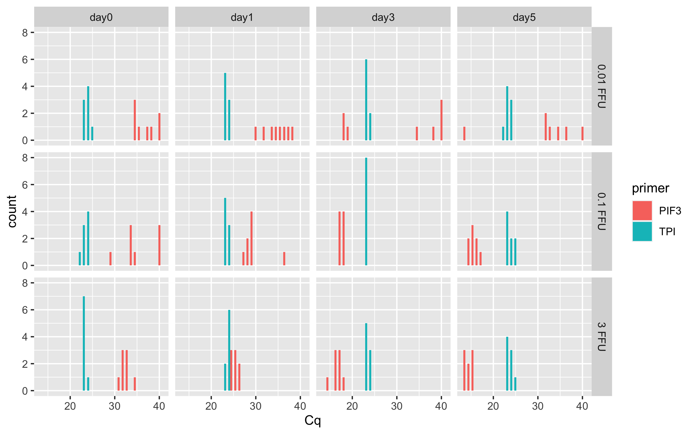

# p4-dilutions-time

``` r
library(ggplot2)
library(dplyr)
```


    Attaching package: 'dplyr'

    The following objects are masked from 'package:stats':

        filter, lag

    The following objects are masked from 'package:base':

        intersect, setdiff, setequal, union

``` r
library(tidyr)
```

Load in dataset

``` r
Cq_values <- read.csv("/Users/maggieschedl/Desktop/Github/Unckless_Lab_Resources/qPCR_analysis/20240228-viral-load-dilutions/viral-dil-time-sheet.csv")
```

Separate male and female for now

``` r
# males
Cq_values_M <- Cq_values[which(Cq_values$sex == "male"),]
# females
Cq_values_F <- Cq_values[which(Cq_values$sex == "female"),]
```

**Female Analysis First**

Look at raw Cq values

``` r
ggplot(Cq_values_F, aes(x= Cq, fill = primer)) + geom_histogram(position = "dodge") + facet_grid(~dilution) 
```

    `stat_bin()` using `bins = 30`. Pick better value with `binwidth`.


TPI looks remarkably consistant, PIF3 is all over the place but this
isn’t separated out by day which would make differences.

Look at raw Cq values and also separate by day

``` r
ggplot(Cq_values_F, aes(x= Cq, fill = primer)) + geom_histogram(position = "dodge") + facet_grid(dilution ~ day) 
```

    `stat_bin()` using `bins = 30`. Pick better value with `binwidth`.


This is showing more patterns that we sort of expect, but we have to do
the delta Cq comparison to the TPI primer to be sure

Calculating female delta Cq and Plotting

``` r
# need to organize by name of the sample I think
Cq_values_F <- Cq_values_F[order(Cq_values_F$sample_ID),]
# this worked to order by the sample number 
# and the PIF3 value is first in the order and TPI second

# Separate that dataframe, incriminating by 2, every number between 1-192 (number of rows in dataframe)
Cq_values_F$Cq[seq(1,192,2)] # these are the PIF 3 Cq #s
```

     [1] 33.59 40.00 38.10 36.14 40.00 34.42 33.56 34.52 40.00 36.20 39.46 40.00
    [13] 40.00 40.00 34.57 34.96 32.03 32.65 31.64 32.01 30.90 32.08 32.00 31.57
    [25] 40.00 40.00 40.00 33.89 34.98 40.00 33.19 31.65 29.66 35.08 28.85 30.04
    [37] 29.02 31.12 29.99 27.43 24.44 25.01 24.42 26.80 23.84 26.54 26.27 24.20
    [49] 38.80 40.00 18.21 17.55 38.61 40.00 40.00 35.00 17.14 17.30 17.16 17.37
    [61] 17.01 17.44 17.20 33.49 16.49 17.15 16.77 16.93 16.93 17.10 16.58 17.02
    [73] 16.04 32.46 31.36 31.55 34.14 32.49 34.70 40.00 16.17 15.59 13.96 15.19
    [85] 11.42 15.47 15.21 15.93 14.74 15.25 14.71 13.93 15.95 14.81 15.77 14.36

``` r
Cq_values_F$Cq[seq(2,192,2)] # these are the TPI primer Cq #s 
```

     [1] 22.86 23.12 23.74 23.17 23.09 22.81 22.67 21.78 23.26 22.09 23.69 23.18
    [13] 21.89 22.69 22.76 22.01 22.84 23.02 22.97 23.01 22.23 22.26 22.63 21.85
    [25] 23.28 23.80 22.68 23.15 22.52 21.30 22.34 22.15 23.18 23.14 22.76 18.41
    [37] 22.52 22.61 22.90 22.43 22.81 23.82 22.99 23.53 22.37 23.04 23.09 22.84
    [49] 22.68 22.67 23.06 22.83 22.11 22.20 23.14 23.10 23.24 22.75 22.55 22.73
    [61] 22.20 22.24 22.07 23.00 22.35 22.80 22.72 22.57 22.53 22.02 22.46 22.08
    [73] 22.90 23.10 22.73 22.39 22.31 21.98 22.41 22.20 22.08 22.31 23.34 22.63
    [85] 22.18 23.93 23.27 23.15 24.01 23.48 23.73 22.62 24.49 23.41 23.89 23.14

``` r
# make the delta Cq by subtracting the PIF 3 values from the TPI primer values
# and this is saved as a vector in R 
delta_Cqs_F <- Cq_values_F$Cq[seq(2,192,2)] - Cq_values_F$Cq[seq(1,192,2)]
#vector
delta_Cqs_F
```

     [1] -10.73 -16.88 -14.36 -12.97 -16.91 -11.61 -10.89 -12.74 -16.74 -14.11
    [11] -15.77 -16.82 -18.11 -17.31 -11.81 -12.95  -9.19  -9.63  -8.67  -9.00
    [21]  -8.67  -9.82  -9.37  -9.72 -16.72 -16.20 -17.32 -10.74 -12.46 -18.70
    [31] -10.85  -9.50  -6.48 -11.94  -6.09 -11.63  -6.50  -8.51  -7.09  -5.00
    [41]  -1.63  -1.19  -1.43  -3.27  -1.47  -3.50  -3.18  -1.36 -16.12 -17.33
    [51]   4.85   5.28 -16.50 -17.80 -16.86 -11.90   6.10   5.45   5.39   5.36
    [61]   5.19   4.80   4.87 -10.49   5.86   5.65   5.95   5.64   5.60   4.92
    [71]   5.88   5.06   6.86  -9.36  -8.63  -9.16 -11.83 -10.51 -12.29 -17.80
    [81]   5.91   6.72   9.38   7.44  10.76   8.46   8.06   7.22   9.27   8.23
    [91]   9.02   8.69   8.54   8.60   8.12   8.78

``` r
# Make a new dataframe that only has one row per sample by getting rid of the rows with the TPI primer
Cq_values_F_Delta <- Cq_values_F[which(Cq_values_F$primer == "PIF3"),]

# And then add in the delta Cqs as a new column
Cq_values_F_Delta$delta_Cq <- delta_Cqs_F

# add a column with 2^ delta Cq
Cq_values_F_Delta$delta_Cq_2 <- 2^(delta_Cqs_F)


# plot and use a log 10 scale for the y axis 
ggplot(Cq_values_F_Delta, aes(y= delta_Cq_2, x=day, color=dilution)) + geom_boxplot()  + theme_linedraw() + geom_point(position=position_jitterdodge(dodge.width=0.9), size=2) + coord_trans(y = "log10")
```


**Male Analysis Second**

Look at raw Cq values and also separate by day

``` r
ggplot(Cq_values_M, aes(x= Cq, fill = primer)) + geom_histogram(position = "dodge") + facet_grid(dilution ~ day) 
```

    `stat_bin()` using `bins = 30`. Pick better value with `binwidth`.

    Warning: Removed 1 rows containing non-finite values (`stat_bin()`).


Looks pretty similar to the female results

Calculating male delta Cq and Plotting

``` r
# need to organize by name of the sample I think
Cq_values_M <- Cq_values_M[order(Cq_values_M$sample_ID),]
# this worked to order by the sample number 
# and the PIF3 value is first in the order and TPI second

# notice that there is one NA in the data that I forgot to set as 40 for the Cq 

Cq_values_M[is.na(Cq_values_M)] <- 40

# Separate that dataframe, incriminating by 2, every number between 1-192 (number of rows in dataframe)
Cq_values_M$Cq[seq(1,192,2)] # these are the PIF 3 Cq #s
```

     [1] 34.14 34.15 40.00 40.00 29.40 34.72 33.92 40.00 35.93 35.11 37.72 34.82
    [13] 40.00 38.02 40.00 34.85 32.04 34.93 31.41 32.21 32.02 32.54 32.56 32.56
    [25] 31.76 35.16 34.20 38.38 29.97 37.50 35.51 36.84 28.89 29.57 27.49 28.79
    [37] 36.25 29.44 29.15 28.12 26.26 24.84 24.82 25.54 25.16 25.04 25.66 26.10
    [49] 38.36 40.00 40.00 18.41 18.85 40.00 18.26 35.08 18.06 18.06 18.29 17.39
    [61] 17.40 17.04 17.97 17.14 17.40 17.85 17.35 16.56 17.24 16.66 14.25 16.71
    [73] 32.73 36.16 32.04 32.10 13.48 40.00 40.00 34.78 16.24 17.15 15.26 15.58
    [85] 15.12 14.31 14.33 16.16 15.29 15.41 14.09 14.06 15.29 14.57 13.87 14.53

``` r
Cq_values_M$Cq[seq(2,192,2)] # these are the TPI primer Cq #s 
```

     [1] 23.41 23.09 23.44 22.81 22.14 24.06 22.91 23.42 25.03 23.87 23.40 23.56
    [13] 23.25 23.01 24.08 23.00 23.10 23.15 23.10 23.35 22.68 22.72 23.03 23.24
    [25] 23.81 23.93 23.13 23.39 22.97 22.78 23.21 23.08 23.39 23.89 23.41 23.21
    [37] 23.01 23.06 22.98 22.77 24.06 23.37 23.81 24.15 23.27 23.41 23.35 22.57
    [49] 23.15 23.29 22.89 23.05 23.06 22.64 23.43 23.39 23.17 23.11 23.19 22.77
    [61] 22.71 22.63 23.26 22.98 23.47 23.81 22.73 22.80 23.47 22.62 22.49 22.87
    [73] 23.74 23.20 23.56 22.87 22.17 22.80 22.82 23.63 23.29 24.53 22.96 23.84
    [85] 23.75 23.04 22.84 24.35 23.95 23.71 23.26 23.09 24.33 22.51 23.04 23.66

``` r
# make the delta Cq by subtracting the PIF 3 values from the TPI primer values
# and this is saved as a vector in R 
delta_Cqs_M <- Cq_values_M$Cq[seq(2,192,2)] - Cq_values_M$Cq[seq(1,192,2)]
#vector
delta_Cqs_M
```

     [1] -10.73 -11.06 -16.56 -17.19  -7.26 -10.66 -11.01 -16.58 -10.90 -11.24
    [11] -14.32 -11.26 -16.75 -15.01 -15.92 -11.85  -8.94 -11.78  -8.31  -8.86
    [21]  -9.34  -9.82  -9.53  -9.32  -7.95 -11.23 -11.07 -14.99  -7.00 -14.72
    [31] -12.30 -13.76  -5.50  -5.68  -4.08  -5.58 -13.24  -6.38  -6.17  -5.35
    [41]  -2.20  -1.47  -1.01  -1.39  -1.89  -1.63  -2.31  -3.53 -15.21 -16.71
    [51] -17.11   4.64   4.21 -17.36   5.17 -11.69   5.11   5.05   4.90   5.38
    [61]   5.31   5.59   5.29   5.84   6.07   5.96   5.38   6.24   6.23   5.96
    [71]   8.24   6.16  -8.99 -12.96  -8.48  -9.23   8.69 -17.20 -17.18 -11.15
    [81]   7.05   7.38   7.70   8.26   8.63   8.73   8.51   8.19   8.66   8.30
    [91]   9.17   9.03   9.04   7.94   9.17   9.13

``` r
# Make a new dataframe that only has one row per sample by getting rid of the rows with the TPI primer
Cq_values_M_Delta <- Cq_values_M[which(Cq_values_F$primer == "PIF3"),]

# And then add in the delta Cqs as a new column
Cq_values_M_Delta$delta_Cq <- delta_Cqs_M

# add a column with 2^ delta Cq
Cq_values_M_Delta$delta_Cq_2 <- 2^(delta_Cqs_M)


# plot and use a log 10 scale for the y axis 
ggplot(Cq_values_M_Delta, aes(y= delta_Cq_2, x=day, color=dilution)) + geom_boxplot()  + theme_linedraw() + geom_point(position=position_jitterdodge(dodge.width=0.9), size=2) + coord_trans(y = "log10")
```


