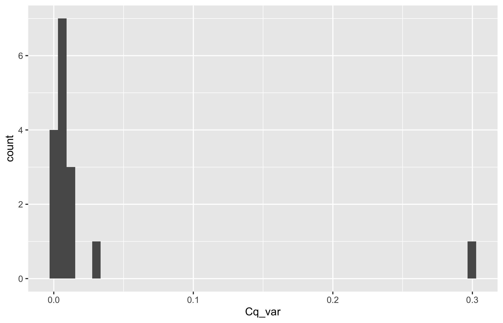
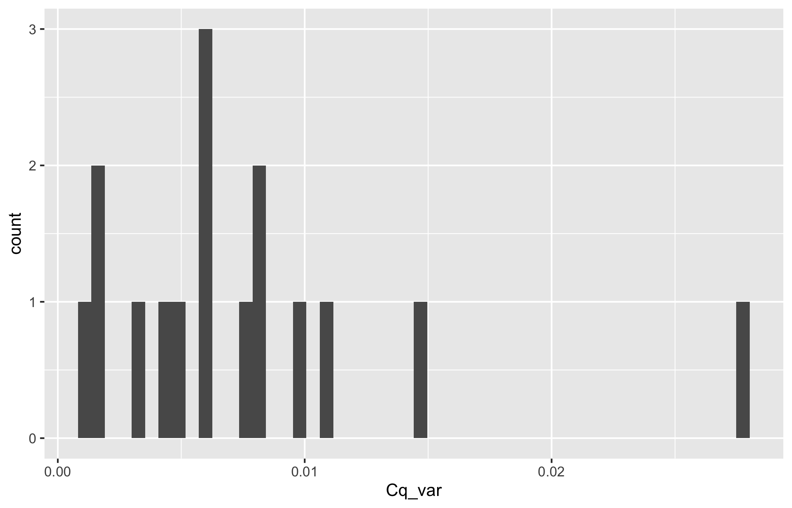
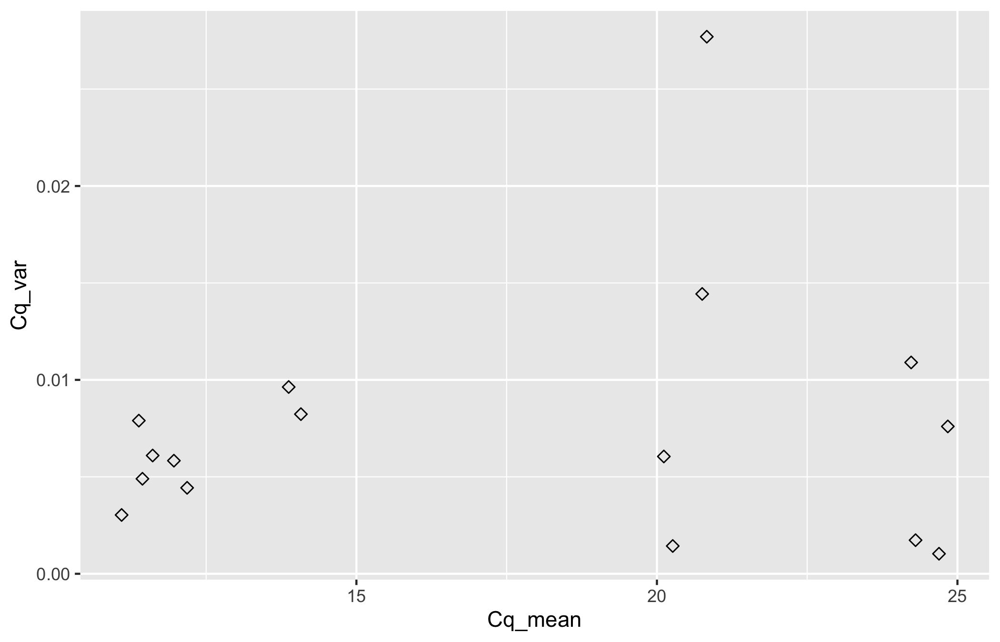
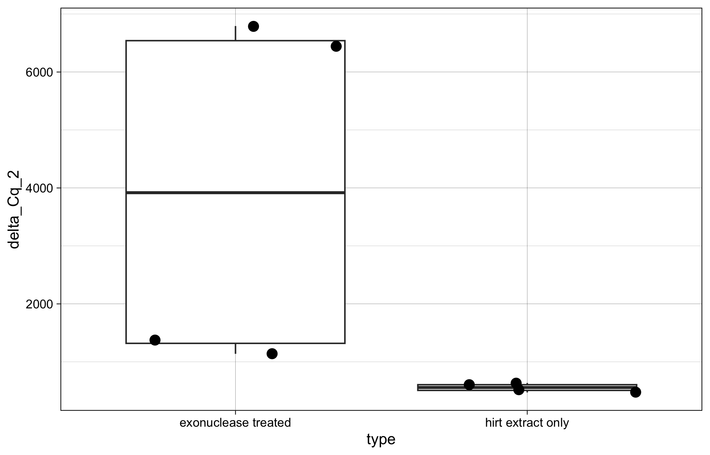

# 20240316-exo-2

``` r
library(ggplot2)
library(dplyr)
```


    Attaching package: 'dplyr'

    The following objects are masked from 'package:stats':

        filter, lag

    The following objects are masked from 'package:base':

        intersect, setdiff, setequal, union

``` r
library(tidyr)
library(Rmisc)
```

    Loading required package: lattice

    Loading required package: plyr

    ------------------------------------------------------------------------------

    You have loaded plyr after dplyr - this is likely to cause problems.
    If you need functions from both plyr and dplyr, please load plyr first, then dplyr:
    library(plyr); library(dplyr)

    ------------------------------------------------------------------------------


    Attaching package: 'plyr'

    The following objects are masked from 'package:dplyr':

        arrange, count, desc, failwith, id, mutate, rename, summarise,
        summarize

Load in dataset

``` r
Cq_values <- read.csv("/Users/maggieschedl/Desktop/Github/Unckless_Lab_Resources/qPCR_analysis/20240316-exo-2/20240316-exo-2-qPCR.csv")
```

Look at raw Cq values by primer and sample type

``` r
# if you want to also include another varaible to separate out the histogram by, you can include a facet 
ggplot(Cq_values, aes(x= Cq, fill = primer)) + geom_histogram(position = "dodge") + facet_grid(~type) 
```

    `stat_bin()` using `bins = 30`. Pick better value with `binwidth`.


Looks like the TPI Cq does change with the treatment

Calculate variance and mean of Cq value between the technical replicates

``` r
# use the variance function, and calculates the variance in Cq by the unique.name (each sample/primer has 3 Cq values to 
# calculate the variance by)
Cq_values$Cq_var <- ave(Cq_values$Cq, Cq_values$unique_name, FUN=var)

# use the mean function, and calculates the mean of Cq values by the unique.name (each sample/primer has 3 Cq values to 
# calculate the mean by)
Cq_values$Cq_mean <- ave(Cq_values$Cq, Cq_values$unique_name, FUN=mean)

# Keep all rows where the replicate is 1 (or you could do 2 or 3)
# make into new Df so we keep the original with all the Cq values
Cq_values_1rep <- Cq_values[which(Cq_values$replicate == "1"),]

# histogram of all variances
ggplot(Cq_values_1rep, aes(x=Cq_var)) + geom_histogram(bins = 50)
```



``` r
# There is one that is really large, which is that one?
# it is the first sample, which is 19 and the others are 20, I will just remove that one sample 
# remove just first row 
Cq_values <- Cq_values[c(2:48),]

# redo the varience and means 
Cq_values$Cq_var <- ave(Cq_values$Cq, Cq_values$unique_name, FUN=var)
Cq_values$Cq_mean <- ave(Cq_values$Cq, Cq_values$unique_name, FUN=mean)
# keep only 1 replicate, but use 2 becuase I removed a 1 
Cq_values_1rep <- Cq_values[which(Cq_values$replicate == "2"),]
# histogram of all variances
ggplot(Cq_values_1rep, aes(x=Cq_var)) + geom_histogram(bins = 50)
```



``` r
# much better

# plot variances and means as a scatterplot 
ggplot(Cq_values_1rep, aes(x=Cq_mean, y=Cq_var)) +
  geom_point(size=2, shape=23)
```



``` r
# no real relationship, looks good 
```

Calculating Delta Cqs between TPI and PIF3

``` r
# samples are not ordered properly
# they need to be ordered with the two primer samples next to each other for each sample 
# order them by the sample
Cq_values_1rep <- Cq_values_1rep[order(Cq_values_1rep$sample),]
Cq_values_1rep
```

       well sample replicate primer                type  unique_name    Cq
    14  B02 20-exo         2    TPI exonuclease treated   20-exo TPI 24.67
    38  D02 20-exo         2  PIF 3 exonuclease treated 20-exo PIF 3 11.98
    17  B05 22-exo         2    TPI exonuclease treated   22-exo TPI 24.78
    41  D05 22-exo         2  PIF 3 exonuclease treated 22-exo PIF 3 12.14
    20  B08 26-exo         2    TPI exonuclease treated   26-exo TPI 24.35
    44  D08 26-exo         2  PIF 3 exonuclease treated 26-exo PIF 3 13.93
    23  B11 30-exo         2    TPI exonuclease treated   30-exo TPI 24.28
    47  D11 30-exo         2  PIF 3 exonuclease treated 30-exo PIF 3 14.01
    2   A02 pool 1         2    TPI   hirt extract only   pool 1 TPI 20.17
    26  C02 pool 1         2  PIF 3   hirt extract only pool 1 PIF 3 11.03
    5   A05 pool 2         2    TPI   hirt extract only   pool 2 TPI 20.22
    29  C05 pool 2         2  PIF 3   hirt extract only pool 2 PIF 3 11.48
    8   A08 pool 3         2    TPI   hirt extract only   pool 3 TPI 21.02
    32  C08 pool 3         2  PIF 3   hirt extract only pool 3 PIF 3 11.70
    11  A11 pool 4         2    TPI   hirt extract only   pool 4 TPI 20.76
    35  C11 pool 4         2  PIF 3   hirt extract only pool 4 PIF 3 11.44
            Cq_var  Cq_mean
    14 0.001033333 24.69333
    38 0.005833333 11.96333
    17 0.007600000 24.84000
    41 0.004433333 12.18333
    20 0.001733333 24.30333
    44 0.009633333 13.87333
    23 0.010900000 24.23000
    47 0.008233333 14.07667
    2  0.006050000 20.11500
    26 0.003033333 11.09333
    5  0.001433333 20.26333
    29 0.007900000 11.38000
    8  0.027700000 20.83000
    32 0.006100000 11.61000
    11 0.014433333 20.75333
    35 0.004900000 11.44000

``` r
nrow(Cq_values_1rep)
```

    [1] 16

``` r
# Separate that dataframe, incriminating by 2, every number between 1-16 (number of rows in dataframe)
Cq_values_1rep$Cq_mean[seq(1,16,2)] # these are the TPI Cq means 
```

    [1] 24.69333 24.84000 24.30333 24.23000 20.11500 20.26333 20.83000 20.75333

``` r
Cq_values_1rep$Cq_mean[seq(2,16,2)] # these are the PIF 3 primer Cq means 
```

    [1] 11.96333 12.18333 13.87333 14.07667 11.09333 11.38000 11.61000 11.44000

``` r
# make the delta Cq by subtracting the PIF 3 values from the TPI primer values
# and this is saved as a vector in R 
delta_Cqs <- Cq_values_1rep$Cq_mean[seq(1,16,2)] - Cq_values_1rep$Cq_mean[seq(2,16,2)]
#vector
delta_Cqs
```

    [1] 12.730000 12.656667 10.430000 10.153333  9.021667  8.883333  9.220000
    [8]  9.313333

``` r
# Keep only rows that are PIF3 because now we have two rows per sample
Cq_values1rep_Delta <- Cq_values_1rep[which(Cq_values_1rep$primer == "PIF 3"),]
# And then add in the delta Cqs as a new column
Cq_values1rep_Delta$delta_Cq <- delta_Cqs

# do 2^ delta Cq
Cq_values1rep_Delta$delta_Cq_2 <- 2^(delta_Cqs)

# plot 
ggplot(Cq_values1rep_Delta, aes(y= delta_Cq_2, x=type)) + geom_boxplot()  + theme_linedraw() + geom_point(position="jitter", size=3) 
```



Combine this data with the other 3 samples I have from this

``` r
# read in delta cqs 
First_delta <- read.csv("/Users/maggieschedl/Desktop/Github/Unckless_Lab_Resources/qPCR_analysis/20240316-exo-2/20240112-exo-qPCR-delta.csv")
#reset rownames 
rownames(First_delta) <- NULL
# remove rows with the clarification pellet 
First_delta <- First_delta[c(1:4),]
First_delta <- First_delta[,c(2:6,9:14)]
# combine datasets 
complete_sample_delta <- rbind(First_delta, Cq_values1rep_Delta)

complete_sample_delta <- complete_sample_delta %>% 
  mutate(type = factor(type, levels = c("hirt extract only", "exonuclease treated")))

# statistics on variance 
stats <- summarySE(complete_sample_delta, measurevar="delta_Cq_2", groupvars=c("type"))
stats
```

                     type N delta_Cq_2        sd         se        ci
    1   hirt extract only 6   412.4721  230.0665   93.92424  241.4399
    2 exonuclease treated 6  7861.0543 6529.4139 2665.62207 6852.1997

``` r
# plot 
legend_title <- "DNA type"

ggplot(complete_sample_delta, aes(y= delta_Cq_2, x=type)) +
  geom_errorbar(aes(ymin = delta_Cq_2-se, ymax = delta_Cq_2+se, color = type),data = stats, position = position_dodge(0.3), width = 0.2)+
  geom_point(aes(color = type), position = position_dodge(0.3), size = 3) +
  scale_color_manual(legend_title,values = c( "#62CFF4", "#2C67F2" )) + theme_light() + 
  theme(axis.text=element_text(size=14),axis.title=element_text(size=16), legend.position = "none") +
  labs(title = "Comparing Ammount of DiNV DNA in Extractions \nwith and without Exonuclase V Treatment",y = "2^delta Cq", x = "DNA Sample Type")
```


