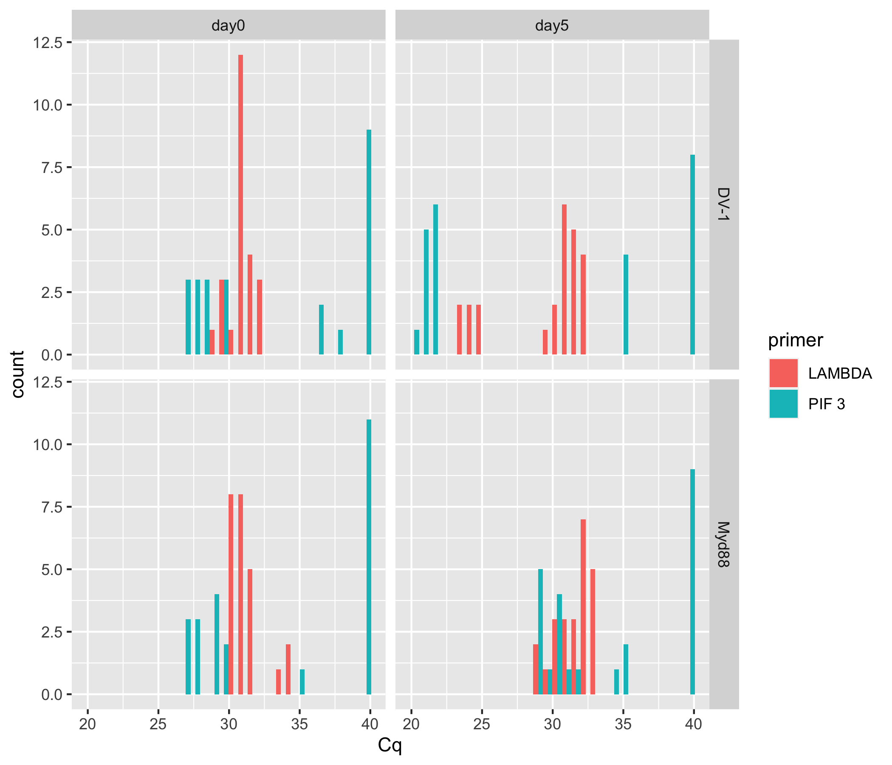
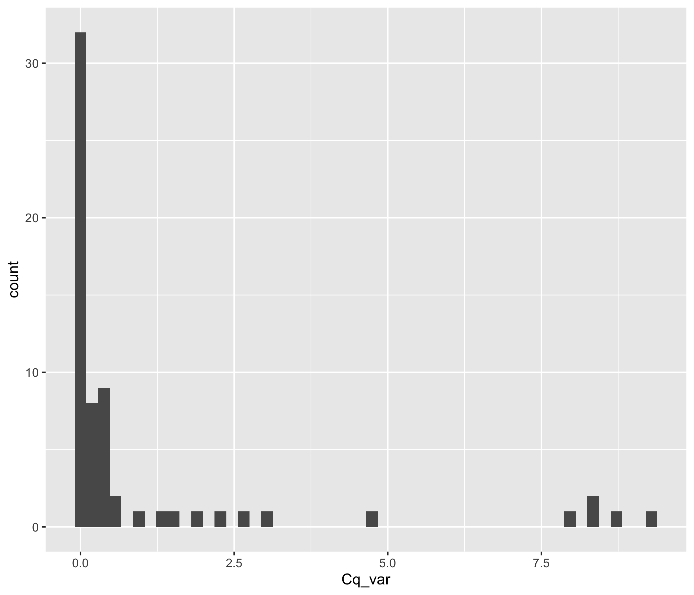
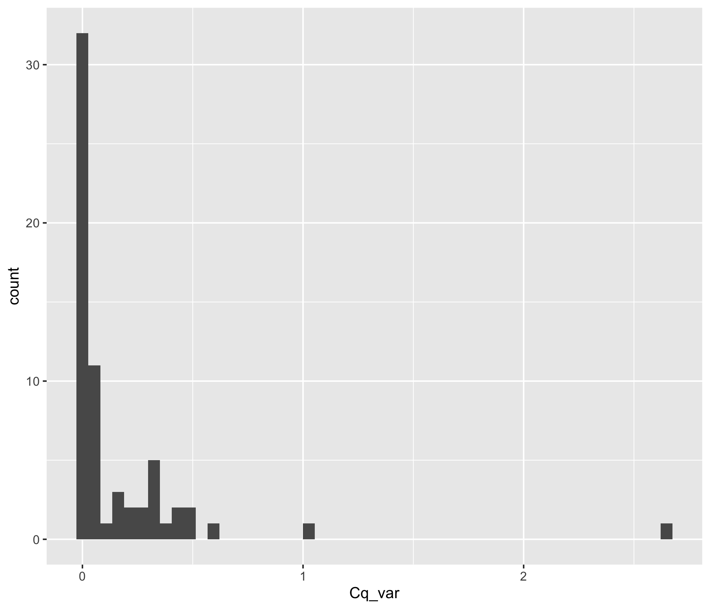
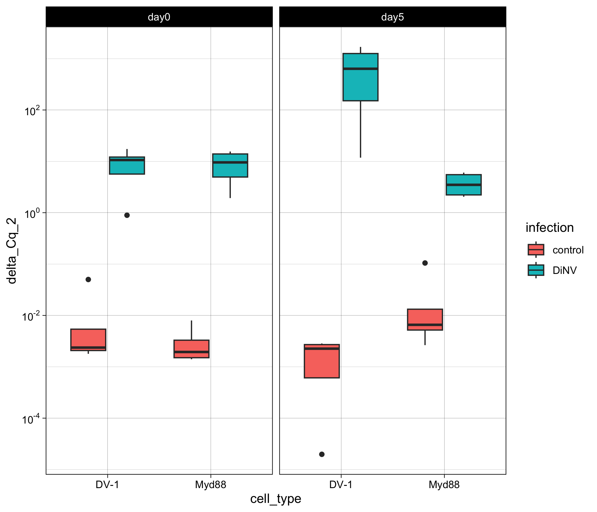
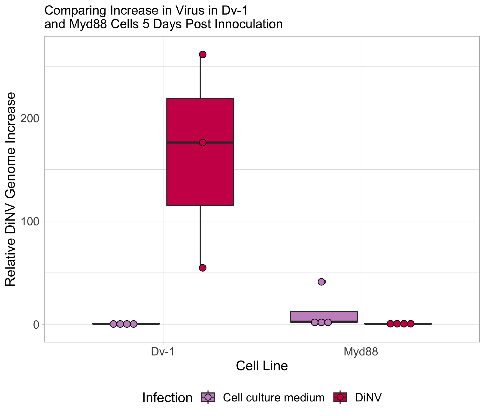

# 20240324-Dv1-Mdy88-qPCR

``` r
library(ggplot2)
library(dplyr)
```


    Attaching package: 'dplyr'

    The following objects are masked from 'package:stats':

        filter, lag

    The following objects are masked from 'package:base':

        intersect, setdiff, setequal, union

``` r
library(tidyr)
library(scales)
library(Rmisc)
```

    Loading required package: lattice

    Loading required package: plyr

    ------------------------------------------------------------------------------

    You have loaded plyr after dplyr - this is likely to cause problems.
    If you need functions from both plyr and dplyr, please load plyr first, then dplyr:
    library(plyr); library(dplyr)

    ------------------------------------------------------------------------------


    Attaching package: 'plyr'

    The following objects are masked from 'package:dplyr':

        arrange, count, desc, failwith, id, mutate, rename, summarise,
        summarize

Load in dataset

``` r
Cq_values <- read.csv("/Users/maggieschedl/Desktop/Github/Unckless_Lab_Resources/qPCR_analysis/20240324-Dv1-Myd88-qPCR/20240324-myd88-Dv1-qPCR.csv")
```

Look at raw Cq values

``` r
ggplot(Cq_values, aes(x= Cq, fill = primer)) + geom_histogram(position = "dodge") + facet_grid(~cell_type ~day) 
```

    `stat_bin()` using `bins = 30`. Pick better value with `binwidth`.



Calculate variance and mean of Cq value between the technical replicates

``` r
# use the variance function, and calculates the variance in Cq by the unique.name (each sample/primer has 3 Cq values to 
# calculate the variance by)
Cq_values$Cq_var <- ave(Cq_values$Cq, Cq_values$unique_name, FUN=var)

# use the mean function, and calculates the mean of Cq values by the unique.name (each sample/primer has 3 Cq values to 
# calculate the mean by)
Cq_values$Cq_mean <- ave(Cq_values$Cq, Cq_values$unique_name, FUN=mean)

# Keep all rows where the replicate is 1 (or you could do 2 or 3)
# make into new Df so we keep the original with all the Cq values
Cq_values_1rep <- Cq_values[which(Cq_values$replicate == "1"),]

# histogram of all variances
ggplot(Cq_values_1rep, aes(x=Cq_var)) + geom_histogram(bins = 50)
```



``` r
# I think some of these are really high because for the  cell control PIF3 some are 40 and some are 35, which will really mess this up 

# what if I looked at these without cell control pif3 
rownames(Cq_values_1rep) <- NULL
Cq_values_1rep_no_cc0 <- Cq_values_1rep[c(16:64),]

# histogram of variances now 
ggplot(Cq_values_1rep_no_cc0, aes(x=Cq_var)) + geom_histogram(bins = 50)
```



``` r
# ok so this removes a lot of the bad variances 
# I am ok with these for now, all the high ones are for lambda and are almost all 2 consistant Cqs and one that is a little off
```

Calculating Delta Cqs between Lambda and PIF3

``` r
# samples are not ordered properly
# they need to be ordered with the two primer samples next to each other for each sample 
# order them by the sample
Cq_values_1rep <- Cq_values_1rep[order(Cq_values_1rep$sample),]
Cq_values_1rep
```

       well sample replicate primer cell_type infection  day    unique_name    Cq
    1   A01      1         1  PIF 3      DV-1   control day0  Dv-pif-cc-0-1 40.00
    33  A01      1         1 LAMBDA      DV-1   control day0  Dv-lam-cc-0-1 31.44
    2   A04      2         1  PIF 3      DV-1   control day0  Dv-pif-cc-0-2 40.00
    34  A04      2         1 LAMBDA      DV-1   control day0  Dv-lam-cc-0-2 31.00
    3   A07      3         1  PIF 3      DV-1   control day0  Dv-pif-cc-0-3 40.00
    35  A07      3         1 LAMBDA      DV-1   control day0  Dv-lam-cc-0-3 31.29
    4   A10      4         1  PIF 3      DV-1   control day0  Dv-pif-cc-0-4 36.28
    36  A10      4         1 LAMBDA      DV-1   control day0  Dv-lam-cc-0-4 31.31
    5   B01      5         1  PIF 3     Myd88   control day0 Myd-pif-cc-0-1 40.00
    37  B01      5         1 LAMBDA     Myd88   control day0 Myd-lam-cc-0-1 30.48
    6   B04      6         1  PIF 3     Myd88   control day0 Myd-pif-cc-0-2 35.02
    38  B04      6         1 LAMBDA     Myd88   control day0 Myd-lam-cc-0-2 31.75
    7   B07      7         1  PIF 3     Myd88   control day0 Myd-pif-cc-0-3 40.00
    39  B07      7         1 LAMBDA     Myd88   control day0 Myd-lam-cc-0-3 30.82
    8   B10      8         1  PIF 3     Myd88   control day0 Myd-pif-cc-0-4 40.00
    40  B10      8         1 LAMBDA     Myd88   control day0 Myd-lam-cc-0-4 33.73
    9   C01      9         1  PIF 3      DV-1   control day5  Dv-pif-cc-5-1 40.00
    41  C01      9         1 LAMBDA      DV-1   control day5  Dv-lam-cc-5-1 23.74
    10  C04     10         1  PIF 3      DV-1   control day5  Dv-pif-cc-5-2 40.00
    42  C04     10         1 LAMBDA      DV-1   control day5  Dv-lam-cc-5-2 31.00
    11  C07     11         1  PIF 3      DV-1   control day5  Dv-pif-cc-5-3 40.00
    43  C07     11         1 LAMBDA      DV-1   control day5  Dv-lam-cc-5-3 31.11
    12  C10     12         1  PIF 3      DV-1   control day5  Dv-pif-cc-5-4 40.00
    44  C10     12         1 LAMBDA      DV-1   control day5  Dv-lam-cc-5-4 30.27
    13  D01     13         1  PIF 3     Myd88   control day5 Myd-pif-cc-5-1 40.00
    45  D01     13         1 LAMBDA     Myd88   control day5 Myd-lam-cc-5-1 32.87
    14  D04     14         1  PIF 3     Myd88   control day5 Myd-pif-cc-5-2 40.00
    46  D04     14         1 LAMBDA     Myd88   control day5 Myd-lam-cc-5-2 29.29
    15  D07     15         1  PIF 3     Myd88   control day5 Myd-pif-cc-5-3 34.04
    47  D07     15         1 LAMBDA     Myd88   control day5 Myd-lam-cc-5-3 31.48
    16  D10     16         1  PIF 3     Myd88   control day5 Myd-pif-cc-5-4 40.00
    48  D10     16         1 LAMBDA     Myd88   control day5 Myd-lam-cc-5-4 32.61
    17  E01     17         1  PIF 3      DV-1      DiNV day0   Dv-pif-D-0-1 28.07
    49  E01     17         1 LAMBDA      DV-1      DiNV day0   Dv-lam-D-0-1 31.35
    18  E04     18         1  PIF 3      DV-1      DiNV day0   Dv-pif-D-0-2 29.50
    50  E04     18         1 LAMBDA      DV-1      DiNV day0   Dv-lam-D-0-2 29.43
    19  E07     19         1  PIF 3      DV-1      DiNV day0   Dv-pif-D-0-3 26.81
    51  E07     19         1 LAMBDA      DV-1      DiNV day0   Dv-lam-D-0-3 31.28
    20  E10     20         1  PIF 3      DV-1      DiNV day0   Dv-pif-D-0-4 27.65
    52  E10     20         1 LAMBDA      DV-1      DiNV day0   Dv-lam-D-0-4 31.26
    21  F01     21         1  PIF 3     Myd88      DiNV day0  Myd-pif-D-0-1 26.83
    53  F01     21         1 LAMBDA     Myd88      DiNV day0  Myd-lam-D-0-1 30.96
    22  F04     22         1  PIF 3     Myd88      DiNV day0  Myd-pif-D-0-2 27.52
    54  F04     22         1 LAMBDA     Myd88      DiNV day0  Myd-lam-D-0-2 31.81
    23  F07     23         1  PIF 3     Myd88      DiNV day0  Myd-pif-D-0-3 28.70
    55  F07     23         1 LAMBDA     Myd88      DiNV day0  Myd-lam-D-0-3 34.32
    24  F10     24         1  PIF 3     Myd88      DiNV day0  Myd-pif-D-0-4 29.18
    56  F10     24         1 LAMBDA     Myd88      DiNV day0  Myd-lam-D-0-4 30.21
    25  G01     25         1  PIF 3      DV-1      DiNV day5   Dv-pif-D-5-1 21.11
    57  G01     25         1 LAMBDA      DV-1      DiNV day5   Dv-lam-D-5-1 30.71
    26  G04     26         1  PIF 3      DV-1      DiNV day5   Dv-pif-D-5-2 21.57
    58  G04     26         1 LAMBDA      DV-1      DiNV day5   Dv-lam-D-5-2 30.30
    27  G07     27         1  PIF 3      DV-1      DiNV day5   Dv-pif-D-5-3 21.55
    59  G07     27         1 LAMBDA      DV-1      DiNV day5   Dv-lam-D-5-3 32.58
    28  G10     28         1  PIF 3      DV-1      DiNV day5   Dv-pif-D-5-4 20.47
    60  G10     28         1 LAMBDA      DV-1      DiNV day5   Dv-lam-D-5-4 24.30
    29  H01     29         1  PIF 3     Myd88      DiNV day5  Myd-pif-D-5-1 29.33
    61  H01     29         1 LAMBDA     Myd88      DiNV day5  Myd-lam-D-5-1 31.85
    30  H04     30         1  PIF 3     Myd88      DiNV day5  Myd-pif-D-5-2 30.48
    62  H04     30         1 LAMBDA     Myd88      DiNV day5  Myd-lam-D-5-2 32.60
    31  H07     31         1  PIF 3     Myd88      DiNV day5  Myd-pif-D-5-3 31.63
    63  H07     31         1 LAMBDA     Myd88      DiNV day5  Myd-lam-D-5-3 32.15
    32  H10     32         1  PIF 3     Myd88      DiNV day5  Myd-pif-D-5-4 28.81
    64  H10     32         1 LAMBDA     Myd88      DiNV day5  Myd-lam-D-5-4 30.28
            Cq_var  Cq_mean
    1  0.000000000 40.00000
    33 0.043433333 31.39667
    2  0.000000000 40.00000
    34 0.020433333 31.15667
    3  1.373633333 39.32333
    35 1.004433333 30.87333
    4  4.688400000 37.50000
    36 0.298300000 31.93000
    5  0.000000000 40.00000
    37 0.062533333 30.65333
    6  8.266800000 38.34000
    38 0.138700000 31.33000
    7  0.000000000 40.00000
    39 0.073233333 30.52333
    8  0.000000000 40.00000
    40 2.647600000 33.03000
    9  9.292800000 38.24000
    41 0.300833333 24.37333
    10 8.738133333 38.29333
    42 0.463233333 31.44667
    11 8.366700000 38.33000
    43 0.140933333 31.54333
    12 7.905633333 38.37667
    44 0.364633333 30.96667
    13 0.000000000 40.00000
    45 1.851233333 31.95333
    14 0.000000000 40.00000
    46 1.549300000 30.72000
    15 0.455700000 34.80000
    47 0.284233333 31.54667
    16 0.000000000 40.00000
    48 0.027633333 32.76333
    17 0.022933333 28.17667
    49 0.611733333 31.56333
    18 0.049600000 29.54000
    50 0.024633333 29.37667
    19 0.002800000 26.85000
    51 0.205300000 30.97000
    20 0.006033333 27.73667
    52 0.041233333 31.16333
    21 0.008133333 26.83667
    53 0.323333333 30.79333
    22 0.003733333 27.58667
    54 0.303633333 31.33333
    23 0.068133333 28.97333
    55 2.230433333 32.59667
    24 0.012400000 29.30000
    56 0.003033333 30.24667
    25 0.005733333 21.05667
    57 0.207100000 31.21000
    26 0.013300000 21.68000
    58 0.414533333 30.14667
    27 0.016533333 21.69667
    59 0.022800000 32.42000
    28 0.004300000 20.54000
    60 0.174400000 24.10000
    29 0.012900000 29.20000
    61 0.332433333 31.61667
    30 0.053200000 30.26000
    62 0.110633333 32.85333
    31 0.477300000 30.96000
    63 3.121200000 31.13000
    32 0.056433333 28.96667
    64 0.270400000 30.00000

``` r
nrow(Cq_values_1rep)
```

    [1] 64

``` r
# Separate that dataframe, incriminating by 2, every number between 1-64 (number of rows in dataframe)
Cq_values_1rep$Cq_mean[seq(1,64,2)] # these are the PIF 3 Cq means 
```

     [1] 40.00000 40.00000 39.32333 37.50000 40.00000 38.34000 40.00000 40.00000
     [9] 38.24000 38.29333 38.33000 38.37667 40.00000 40.00000 34.80000 40.00000
    [17] 28.17667 29.54000 26.85000 27.73667 26.83667 27.58667 28.97333 29.30000
    [25] 21.05667 21.68000 21.69667 20.54000 29.20000 30.26000 30.96000 28.96667

``` r
Cq_values_1rep$Cq_mean[seq(2,64,2)] # these are the lambda primer Cq means 
```

     [1] 31.39667 31.15667 30.87333 31.93000 30.65333 31.33000 30.52333 33.03000
     [9] 24.37333 31.44667 31.54333 30.96667 31.95333 30.72000 31.54667 32.76333
    [17] 31.56333 29.37667 30.97000 31.16333 30.79333 31.33333 32.59667 30.24667
    [25] 31.21000 30.14667 32.42000 24.10000 31.61667 32.85333 31.13000 30.00000

``` r
# make the delta Cq by subtracting the PIF 3 values from the Lmbda primer values
# and this is saved as a vector in R 
delta_Cqs <- Cq_values_1rep$Cq_mean[seq(2,64,2)] - Cq_values_1rep$Cq_mean[seq(1,64,2)]
#vector
delta_Cqs
```

     [1]  -8.6033333  -8.8433333  -8.4500000  -5.5700000  -9.3466667  -7.0100000
     [7]  -9.4766667  -6.9700000 -13.8666667  -6.8466667  -6.7866667  -7.4100000
    [13]  -8.0466667  -9.2800000  -3.2533333  -7.2366667   3.3866667  -0.1633333
    [19]   4.1200000   3.4266667   3.9566667   3.7466667   3.6233333   0.9466667
    [25]  10.1533333   8.4666667  10.7233333   3.5600000   2.4166667   2.5933333
    [31]   0.1700000   1.0333333

``` r
# Keep only rows that are PIF3 because now we have two rows per sample
Cq_values1rep_Delta <- Cq_values_1rep[which(Cq_values_1rep$primer == "PIF 3"),]
# And then add in the delta Cqs as a new column
Cq_values1rep_Delta$delta_Cq <- delta_Cqs

# do 2^ delta Cq
Cq_values1rep_Delta$delta_Cq_2 <- 2^(delta_Cqs)

# plot 
ggplot(Cq_values1rep_Delta, aes(y= delta_Cq_2, x=cell_type, fill=infection)) + geom_boxplot()  + theme_linedraw()  + facet_grid(~day)  + scale_y_continuous(trans='log10', breaks=trans_breaks('log10', function(x) 10^x), labels=trans_format('log10', math_format(10^.x)))
```



Calculating delta delta Cq

Start with separating out control and DiNV

``` r
# separate out control and DiNV samples 
control <- Cq_values1rep_Delta[which(Cq_values1rep_Delta$infection == "control"),]
DiNV <- Cq_values1rep_Delta[which(Cq_values1rep_Delta$infection != "control"),]
 
# separate out the day 0 samples to start with 
day_0_cc <- control[which(control$day == "day0"),]
# separate out cell type Dv-1 
day_0_cc_Dv1 <- day_0_cc[which(day_0_cc$cell_type == "DV-1"),]
# find mean of Delta Cq (not 2^delta) for Dv-1
mean(day_0_cc_Dv1$delta_Cq)
```

    [1] -7.866667

``` r
# -7.866667
# separate out cell type Myd88 
day_0_cc_Myd <- day_0_cc[which(day_0_cc$cell_type != "DV-1"),]
# find mean of Delta Cq (not 2^delta) for Dv-1
mean(day_0_cc_Myd$delta_Cq)
```

    [1] -8.200833

``` r
# -8.200833

# separate out day 5 only from controls 
day_5_cc <- control[which(control$day != "day0"),]
# separate out Dv-1
day_5_cc_Dv1 <- day_5_cc[which(day_5_cc$cell_type == "DV-1"),]

# subtract average day 0 delta Cq for Dv-1 from the delta Cq of all others 
day_5_cc_Dv1_delta_delta <- day_5_cc_Dv1$delta_Cq - -7.866667
day_5_cc_Dv1_delta_delta
```

    [1] -6.000000  1.020000  1.080000  0.456667

``` r
# add as column 
day_5_cc_Dv1$delta_delta_Cq <- day_5_cc_Dv1_delta_delta

# do 2^ delta delta 
day_5_cc_Dv1$delta_delta_Cq_2 <- 2^(day_5_cc_Dv1_delta_delta)

# separate out Myd88
day_5_cc_Myd <- day_5_cc[which(day_5_cc$cell_type != "DV-1"),]

# subtract average day 0 delta Cq for Dv-1 from the delta Cq of all others 
day_5_cc_Myd_delta_delta <- day_5_cc_Myd$delta_Cq - -8.200833
day_5_cc_Myd_delta_delta
```

    [1]  0.1541663 -1.0791670  4.9474997  0.9641663

``` r
# add as column 
day_5_cc_Myd$delta_delta_Cq <- day_5_cc_Myd_delta_delta

# do 2^ delta delta 
day_5_cc_Myd$delta_delta_Cq_2 <- 2^(day_5_cc_Myd_delta_delta)

# combine controls back together  
Control_delta_delta <- rbind(day_5_cc_Dv1, day_5_cc_Myd)
```

Delta Delta calculations for DiNV samples

``` r
# separate out the day 0 samples to start with 
day_0_DiNV <- DiNV[which(DiNV$day == "day0"),]
# separate out cell type Dv-1 
day_0_DiNV_Dv1 <- day_0_DiNV[which(day_0_DiNV$cell_type == "DV-1"),]
# find mean of Delta Cq (not 2^delta) for Dv-1
mean(day_0_DiNV_Dv1$delta_Cq)
```

    [1] 2.6925

``` r
# 2.6925
# separate out cell type Myd88 
day_0_DiNV_Myd <- day_0_DiNV[which(day_0_DiNV$cell_type != "DV-1"),]
# find mean of Delta Cq (not 2^delta) for Dv-1
mean(day_0_DiNV_Myd$delta_Cq)
```

    [1] 3.068333

``` r
# 3.068333

# separate out day 5 only from DiNVs
day_5_DiNV <- DiNV[which(DiNV$day != "day0"),]
# separate out Dv-1
day_5_DiNV_Dv1 <- day_5_DiNV[which(day_5_DiNV$cell_type == "DV-1"),]

# subtract average day 0 delta Cq for Dv-1 from the delta Cq of all others 
day_5_DiNV_Dv1_delta_delta <- day_5_DiNV_Dv1$delta_Cq - 2.6925
day_5_DiNV_Dv1_delta_delta
```

    [1] 7.460833 5.774167 8.030833 0.867500

``` r
# add as column 
day_5_DiNV_Dv1$delta_delta_Cq <- day_5_DiNV_Dv1_delta_delta

# do 2^ delta delta 
day_5_DiNV_Dv1$delta_delta_Cq_2 <- 2^(day_5_DiNV_Dv1_delta_delta)

# separate out Myd88
day_5_DiNV_Myd <- day_5_DiNV[which(day_5_DiNV$cell_type != "DV-1"),]

# subtract average day 0 delta Cq for Dv-1 from the delta Cq of all others 
day_5_DiNV_Myd_delta_delta <- day_5_DiNV_Myd$delta_Cq - 3.068333
day_5_DiNV_Myd_delta_delta
```

    [1] -0.6516663 -0.4749997 -2.8983330 -2.0349997

``` r
# add as column 
day_5_DiNV_Myd$delta_delta_Cq <- day_5_DiNV_Myd_delta_delta

# do 2^ delta delta 
day_5_DiNV_Myd$delta_delta_Cq_2 <- 2^(day_5_DiNV_Myd_delta_delta)

# combine controls back together  
DiNV_delta_delta <- rbind(day_5_DiNV_Dv1, day_5_DiNV_Myd)
```

Combine control and infected datasets and plot

``` r
delta_delta <- rbind(Control_delta_delta, DiNV_delta_delta)


# plot 
ggplot(delta_delta, aes(y= delta_delta_Cq_2, x=cell_type, fill=infection)) + geom_boxplot()  + theme_linedraw()  
```


