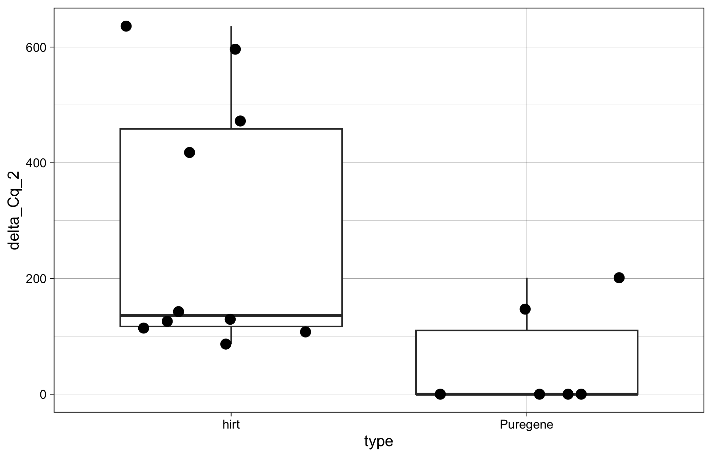
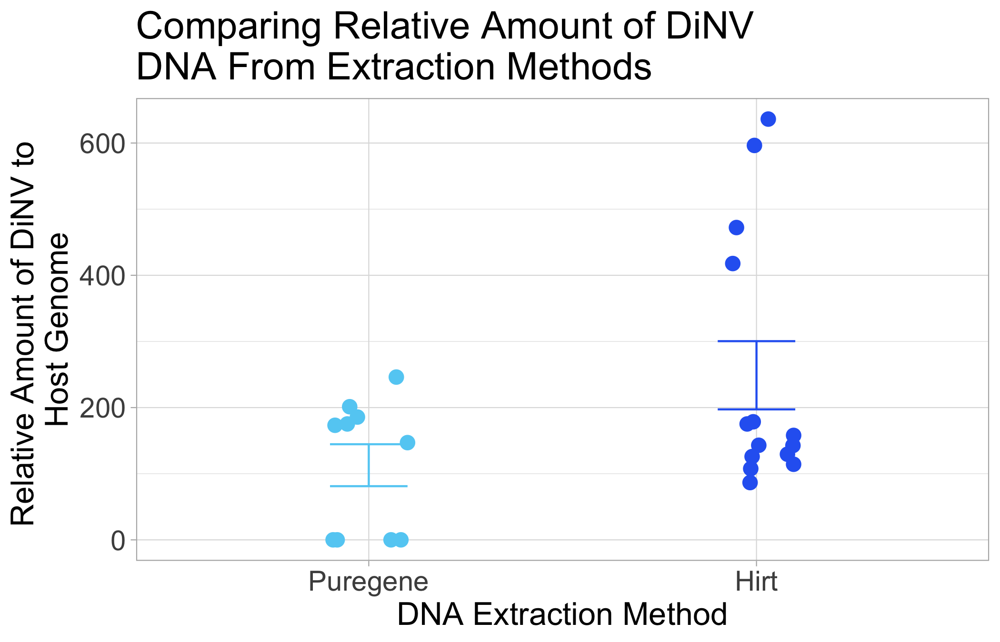

# 20240406-hirt-puregene

``` r
library(ggplot2)
library(dplyr)
```


    Attaching package: 'dplyr'

    The following objects are masked from 'package:stats':

        filter, lag

    The following objects are masked from 'package:base':

        intersect, setdiff, setequal, union

``` r
library(tidyr)
library(Rmisc)
```

    Loading required package: lattice

    Loading required package: plyr

    ------------------------------------------------------------------------------

    You have loaded plyr after dplyr - this is likely to cause problems.
    If you need functions from both plyr and dplyr, please load plyr first, then dplyr:
    library(plyr); library(dplyr)

    ------------------------------------------------------------------------------


    Attaching package: 'plyr'

    The following objects are masked from 'package:dplyr':

        arrange, count, desc, failwith, id, mutate, rename, summarise,
        summarize

``` r
library(rstatix)
```


    Attaching package: 'rstatix'

    The following objects are masked from 'package:plyr':

        desc, mutate

    The following object is masked from 'package:stats':

        filter

Load in dataset

``` r
# from this test
Cq_values <- read.csv("/Users/maggieschedl/Desktop/Github/Unckless_Lab_Resources/qPCR_analysis/20240406-hirt-puregene/20240406-hirt-puregene.csv")
# data from previous qPCR of samples either puregene or hirt extracted 
Further_samples <- read.csv("/Users/maggieschedl/Desktop/Github/Unckless_Lab_Resources/qPCR_analysis/20240406-hirt-puregene/other-hirt-and-puregene-dinn-cell-qPCR-samples.csv")
```

Look at raw Cq values by primer and sample type

``` r
# if you want to also include another varaible to separate out the histogram by, you can include a facet 
ggplot(Cq_values, aes(x= Cq, fill = primer)) + geom_histogram(position = "dodge") + facet_grid(~type) 
```

    `stat_bin()` using `bins = 30`. Pick better value with `binwidth`.


Not really able to tell, seems like there could be more variability with
the puregene

Calculate variance and mean of Cq value between the technical replicates

``` r
# use the variance function, and calculates the variance in Cq by the unique.name (each sample/primer has 3 Cq values to 
# calculate the variance by)
Cq_values$Cq_var <- ave(Cq_values$Cq, Cq_values$unique_name, FUN=var)

# use the mean function, and calculates the mean of Cq values by the unique.name (each sample/primer has 3 Cq values to 
# calculate the mean by)
Cq_values$Cq_mean <- ave(Cq_values$Cq, Cq_values$unique_name, FUN=mean)

# Keep all rows where the replicate is 1 (or you could do 2 or 3)
# make into new Df so we keep the original with all the Cq values
Cq_values_1rep <- Cq_values[which(Cq_values$replicate == "1"),]

# histogram of all variances
ggplot(Cq_values_1rep, aes(x=Cq_var)) + geom_histogram(bins = 50)
```


``` r
# these are all very low compared to qPCR analysis I have done before, so I would say these are ok 

# plot variances and means as a scatterplot 
ggplot(Cq_values_1rep, aes(x=Cq_mean, y=Cq_var)) +
  geom_point(size=2, shape=23)
```


``` r
# no real relationship, looks good 
```

Calculating Delta Cqs between TPI and PIF3

``` r
# samples are not ordered properly
# they need to be ordered with the two primer samples next to each other for each sample 
# order them by the sample
Cq_values_1rep <- Cq_values_1rep[order(Cq_values_1rep$sample),]
Cq_values_1rep
```

       well sample replicate primer     type    unique_name    Cq       Cq_var
    1   A01     32         1    TPI Puregene Puregene-TPI-1 21.15 0.0122333333
    25  C01     32         1  PIF 3 Puregene Puregene-PIF-1 13.68 0.0377333333
    4   A04     33         1    TPI Puregene Puregene-TPI-2 19.81 0.0273000000
    28  C04     33         1  PIF 3 Puregene Puregene-PIF-2 11.65 0.0881333333
    7   A07     34         1    TPI Puregene Puregene-TPI-3 19.65 0.0211000000
    31  C07     34         1  PIF 3 Puregene Puregene-PIF-3 12.20 0.6390333333
    10  A10     35         1    TPI Puregene Puregene-TPI-4 22.40 0.0104333333
    34  C10     35         1  PIF 3 Puregene Puregene-PIF-4 14.81 0.0244000000
    13  B01     36         1    TPI     hirt     Hirt-TPI-1 21.90 0.0036000000
    37  D01     36         1  PIF 3     hirt     Hirt-PIF-1 14.54 0.0042333333
    16  B04     37         1    TPI     hirt     Hirt-TPI-2 21.22 0.0027000000
    40  D04     37         1  PIF 3     hirt     Hirt-PIF-2 13.80 0.0066333333
    19  B07     38         1    TPI     hirt     Hirt-TPI-3 21.51 0.0002333333
    43  D07     38         1  PIF 3     hirt     Hirt-PIF-3 14.10 0.0202333333
    22  B10     39         1    TPI     hirt     Hirt-TPI-4 21.47 0.0276333333
    46  D10     39         1  PIF 3     hirt     Hirt-PIF-4 14.47 0.0004333333
        Cq_mean
    1  21.16333
    25 13.72667
    4  19.92000
    28 11.97667
    7  19.64000
    31 12.10333
    10 22.44333
    34 14.99000
    13 21.84000
    37 14.53667
    16 21.16000
    40 13.70667
    19 21.51333
    43 14.03333
    22 21.62333
    46 14.46333

``` r
# looks good, for each sample TPI is first, and PIF 3 is second 
nrow(Cq_values_1rep)
```

    [1] 16

``` r
# Separate that dataframe, incriminating by 2, every number between 1-16 (number of rows in dataframe)
Cq_values_1rep$Cq_mean[seq(1,16,2)] # these are the TPI Cq means 
```

    [1] 21.16333 19.92000 19.64000 22.44333 21.84000 21.16000 21.51333 21.62333

``` r
Cq_values_1rep$Cq_mean[seq(2,16,2)] # these are the PIF 3 primer Cq means 
```

    [1] 13.72667 11.97667 12.10333 14.99000 14.53667 13.70667 14.03333 14.46333

``` r
# make the delta Cq by subtracting the PIF 3 values from the TPI primer values
# and this is saved as a vector in R 
delta_Cqs <- Cq_values_1rep$Cq_mean[seq(1,16,2)] - Cq_values_1rep$Cq_mean[seq(2,16,2)]
#vector
delta_Cqs
```

    [1] 7.436667 7.943333 7.536667 7.453333 7.303333 7.453333 7.480000 7.160000

``` r
# Keep only rows that are PIF3 because now we have two rows per sample
Cq_values1rep_Delta <- Cq_values_1rep[which(Cq_values_1rep$primer == "PIF 3"),]
# And then add in the delta Cqs as a new column
Cq_values1rep_Delta$delta_Cq <- delta_Cqs

# do 2^ delta Cq
Cq_values1rep_Delta$delta_Cq_2 <- 2^(delta_Cqs)

# simple plot 
ggplot(Cq_values1rep_Delta, aes(y= delta_Cq_2, x=type)) + geom_boxplot()  + theme_linedraw() + geom_point(position="jitter", size=3) 
```


Ok so it actually looks like puregene has a better ratio, but probabily
in any significant way

Plot

``` r
# statistics on variance 
stats <- summarySE(Cq_values1rep_Delta, measurevar="delta_Cq_2", groupvars=c("type"))
stats
```

          type N delta_Cq_2       sd        se       ci
    1     hirt 4   163.6871 16.47661  8.238307 26.21797
    2 Puregene 4   195.0802 34.47308 17.236539 54.85436

``` r
# plot 
legend_title <- "DNA type"

ggplot(Cq_values1rep_Delta, aes(y= delta_Cq_2, x=type)) +
  geom_errorbar(aes(ymin = delta_Cq_2-se, ymax = delta_Cq_2+se, color = type),data = stats, position = position_dodge(0.3), width = 0.2)+
  geom_point(aes(color = type), position = position_dodge(0.3), size = 3) +
  scale_color_manual(legend_title,values = c( "#62CFF4", "#2C67F2" )) + theme_light() + 
  theme(axis.text=element_text(size=14),axis.title=element_text(size=16), legend.position = "none") +
  labs(title = "Comparing Ammount of DiNV DNA From Extraction Methods",y = "2^delta Cq", x = "DNA Extraction Method") + scale_y_continuous(expand=c(0, 0), limits=c(0, 250))
```


I have more dinn cells infected with DiNV samples that I have run on
qPCR that are either hirt extracted or puregene extracted that I can
probably add into this plot

Look at raw Cq values by primer and sample type

``` r
# if you want to also include another varaible to separate out the histogram by, you can include a facet 
ggplot(Further_samples, aes(x= Cq, fill = primer)) + geom_histogram(position = "dodge") + facet_grid(~type) 
```

    `stat_bin()` using `bins = 30`. Pick better value with `binwidth`.


Again, you can’t really tell until you do the ratio between cell and
DiNV primer, but they look similar (as above)

Calculate variance and mean of Cq value between the technical replicates
for more data

``` r
# use the variance function, and calculates the variance in Cq by the unique.name (each sample/primer has 3 Cq values to 
# calculate the variance by)
Further_samples$Cq_var <- ave(Further_samples$Cq, Further_samples$unique_name, FUN=var)

# use the mean function, and calculates the mean of Cq values by the unique.name (each sample/primer has 3 Cq values to 
# calculate the mean by)
Further_samples$Cq_mean <- ave(Further_samples$Cq, Further_samples$unique_name, FUN=mean)

# Keep all rows where the replicate is 1 (or you could do 2 or 3)
# make into new Df so we keep the original with all the Cq values
Further_samples_1rep <- Further_samples[which(Further_samples$replicate == "1"),]

# histogram of all variances
ggplot(Further_samples_1rep, aes(x=Cq_var)) + geom_histogram(bins = 50)
```


``` r
# these look pretty great to me, 0.3 is not high

# plot variances and means as a scatterplot 
ggplot(Further_samples_1rep, aes(x=Cq_mean, y=Cq_var)) +
  geom_point(size=2, shape=23)
```


``` r
# no real relationship, looks good 
```

Calculating Delta Cqs between TPI and PIF3 for further data

``` r
# samples are not ordered properly
# they need to be ordered with the two primer samples next to each other for each sample 
# order them by the sample
Further_samples_1rep <- Further_samples_1rep[order(Further_samples_1rep$sample),]
Further_samples_1rep
```

       well     sample replicate primer     type     unique_name    Cq      Cq_var
    19  A07    10 hirt         1    TPI     hirt     10 hirt TPI 23.64 0.018533333
    37  E07    10 hirt         1  PIF 3     hirt    10 hirt PIF3 16.70 0.009100000
    22  A10    11 hirt         1    TPI     hirt     11 hirt TPI 23.70 0.004133333
    40  E10    11 hirt         1  PIF 3     hirt    11 hirt PIF3 16.66 0.039900000
    25  B01    12 hirt         1    TPI     hirt     12 hirt TPI 23.17 0.006533333
    43  F01    12 hirt         1  PIF 3     hirt    12 hirt PIF3 16.60 0.013733333
    28  B04    13 hirt         1    TPI     hirt     13 hirt TPI 23.04 0.012900000
    46  F04    13 hirt         1  PIF 3     hirt    13 hirt PIF3 16.03 0.002033333
    1   A01         16         1    TPI     hirt     16 cell TPI 21.46 0.007233333
    7   C01         16         1  PIF 3     hirt    16 cell PIF3 14.24 0.018900000
    4   A04         17         1    TPI     hirt     17 cell TPI 21.25 0.010300000
    10  C04         17         1  PIF 3     hirt    17 cell PIF3 14.55 0.003700000
    73  H01         29         1  PIF 3 Puregene  Dinn-pif-D-5-1 18.41 0.018233333
    85  H01         29         1    TPI Puregene  Dinn-tpi-D-5-1 22.82 0.003733333
    76  H04         30         1  PIF 3 Puregene  Dinn-pif-D-5-2 18.46 0.007033333
    88  H04         30         1    TPI Puregene  Dinn-tpi-D-5-2 23.00 0.004433333
    79  H07         31         1  PIF 3 Puregene  Dinn-pif-D-5-3 18.03 0.004033333
    91  H07         31         1    TPI Puregene  Dinn-tpi-D-5-3 22.98 0.013433333
    82  H10         32         1  PIF 3 Puregene  Dinn-pif-D-5-4 17.51 0.034633333
    94  H10         32         1    TPI Puregene  Dinn-tpi-D-5-4 22.21 0.017033333
    13  A01 A puregene         1    TPI Puregene  A puregene TPI 22.78 0.010000000
    31  E01 A puregene         1  PIF 3 Puregene A puregene PIF3 15.58 0.004900000
    16  A04 B puregene         1    TPI Puregene  B puregene TPI 23.11 0.001733333
    34  E04 B puregene         1  PIF 3 Puregene B puregene PIF3 15.44 0.003233333
    49  A01     pool 1         1    TPI     hirt      pool 1 TPI 19.17 0.300700000
    61  C01     pool 1         1  PIF 3     hirt    pool 1 PIF 3 11.13 0.003033333
    52  A04     pool 2         1    TPI     hirt      pool 2 TPI 20.29 0.001433333
    64  C04     pool 2         1  PIF 3     hirt    pool 2 PIF 3 11.31 0.007900000
    55  A07     pool 3         1    TPI     hirt      pool 3 TPI 20.76 0.027700000
    67  C07     pool 3         1  PIF 3     hirt    pool 3 PIF 3 11.56 0.006100000
    58  A10     pool 4         1    TPI     hirt      pool 4 TPI 20.63 0.014433333
    70  C10     pool 4         1  PIF 3     hirt    pool 4 PIF 3 11.37 0.004900000
        Cq_mean
    19 23.68667
    37 16.71000
    22 23.72667
    40 16.89000
    25 23.08333
    43 16.64667
    28 23.09000
    46 16.07333
    1  21.42667
    7  14.27000
    4  21.34000
    10 14.59000
    73 18.27333
    85 22.76667
    76 18.50333
    88 23.07333
    79 18.10333
    91 22.96333
    82 17.68333
    94 22.33333
    13 22.78000
    31 15.58000
    16 23.15667
    34 15.50333
    49 19.80000
    61 11.09333
    52 20.26333
    64 11.38000
    55 20.83000
    67 11.61000
    58 20.75333
    70 11.44000

``` r
# looks good, for each sample TPI is first, and PIF 3 is second 
nrow(Further_samples_1rep)   
```

    [1] 32

``` r
# 24

# Separate that dataframe, incriminating by 2, every number between 1-32 (number of rows in dataframe)
Further_samples_1rep$Cq_mean[seq(1,32,2)] # these are the TPI Cq means 
```

     [1] 23.68667 23.72667 23.08333 23.09000 21.42667 21.34000 18.27333 18.50333
     [9] 18.10333 17.68333 22.78000 23.15667 19.80000 20.26333 20.83000 20.75333

``` r
Further_samples_1rep$Cq_mean[seq(2,32,2)] # these are the PIF 3 primer Cq means 
```

     [1] 16.71000 16.89000 16.64667 16.07333 14.27000 14.59000 22.76667 23.07333
     [9] 22.96333 22.33333 15.58000 15.50333 11.09333 11.38000 11.61000 11.44000

``` r
# make the delta Cq by subtracting the PIF 3 values from the TPI primer values
# and this is saved as a vector in R 
Fdelta_Cqs <- Further_samples_1rep$Cq_mean[seq(1,32,2)] - Further_samples_1rep$Cq_mean[seq(2,32,2)]
#vector
Fdelta_Cqs
```

     [1]  6.976667  6.836667  6.436667  7.016667  7.156667  6.750000 -4.493333
     [8] -4.570000 -4.860000 -4.650000  7.200000  7.653333  8.706667  8.883333
    [15]  9.220000  9.313333

``` r
# Keep only rows that are PIF3 because now we have two rows per sample
Further_samples_1rep_Delta <- Further_samples_1rep[which(Further_samples_1rep$primer == "PIF 3"),]
# And then add in the delta Cqs as a new column
Further_samples_1rep_Delta$delta_Cq <- Fdelta_Cqs

# do 2^ delta Cq
Further_samples_1rep_Delta$delta_Cq_2 <- 2^(Fdelta_Cqs)

# plot 
ggplot(Further_samples_1rep_Delta, aes(y= delta_Cq_2, x=type)) + geom_boxplot()  + theme_linedraw() + geom_point(position="jitter", size=3) 
```



Combine both datasets

``` r
# combine datasets 
combo_data <- rbind(Cq_values1rep_Delta,Further_samples_1rep_Delta)

# stats and plot
# statistics on variance 
stats2 <- summarySE(combo_data, measurevar="delta_Cq_2", groupvars=c("type"))
stats2
```

          type  N delta_Cq_2       sd       se        ci
    1     hirt 14   248.8563 192.9616 51.57117 111.41273
    2 Puregene 10   112.8833 100.2839 31.71255  71.73877

``` r
# order x axis 
level_order <- c('Puregene', 'hirt') 

# plot 
legend_title <- "DNA type"

ggplot(combo_data, aes(y= delta_Cq_2, x=factor(type, level = level_order))) +
  geom_errorbar(aes(ymin = delta_Cq_2-se, ymax = delta_Cq_2+se, color = type),data = stats2, position = position_dodge(0.3), width = 0.2)+
  geom_jitter(aes(color=type), position = position_jitter(0.1), size =3)  + 
  scale_color_manual(legend_title,values = c( "#2C67F2", "#62CFF4" )) +theme_light() + 
  theme(axis.text=element_text(size=14),axis.title=element_text(size=16), title =element_text(size =16), legend.position = "none") +
  labs(title = "Comparing Relative Amount of DiNV \nDNA From Extraction Methods",y = "Relative Amount of DiNV to \nHost Genome", x = "DNA Extraction Method") + 
  scale_x_discrete(labels=c("hirt" = "Hirt", "Puregene" = "Puregene"))
```



T test statistics

``` r
# doing pairwise t-tests between dilution methods, within each day
# for delta Cq
stat.test <- combo_data %>%
  t_test(delta_Cq_2 ~ type) %>%
  adjust_pvalue(method = "bonferroni") %>%
  add_significance("p.adj")
stat.test
```

    # A tibble: 1 × 10
      .y.       group1 group2    n1    n2 statistic    df      p  p.adj p.adj.signif
      <chr>     <chr>  <chr>  <int> <int>     <dbl> <dbl>  <dbl>  <dbl> <chr>       
    1 delta_Cq… hirt   Pureg…    14    10      2.25  20.5 0.0359 0.0359 *           

``` r
# p value is 0.035 significance
# I think this really does depend on how much virus is in the sample and if the method actually works to separate out the viral DNA or not 
```

what is the mean for each extraction type?

``` r
# separate puregene 
pure <- combo_data[which(combo_data$type == "Puregene"),]
pmean <- mean(pure$delta_Cq_2)
pmean
```

    [1] 112.8833

``` r
# separate hirt 
hirt <- combo_data[which(combo_data$type != "Puregene"),]
hmean <- mean(hirt$delta_Cq_2)
hmean
```

    [1] 248.8563
