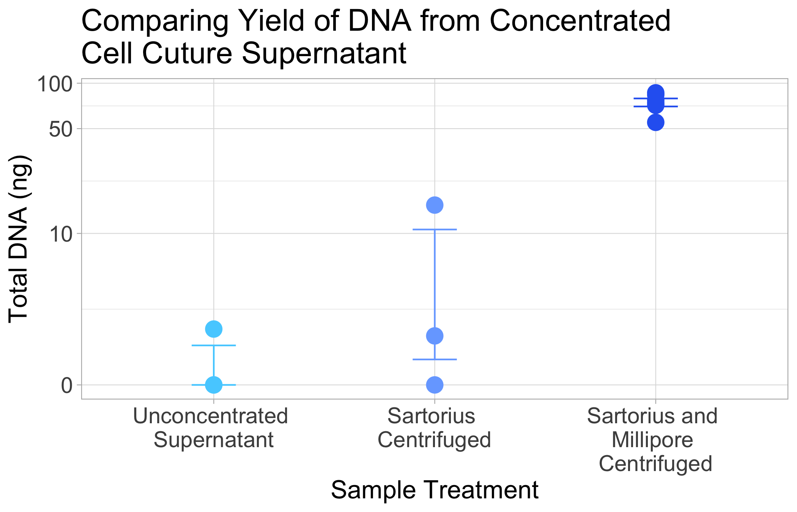

# Fluid-concentration-analysis

``` r
library(ggplot2)
library(dplyr)
```


    Attaching package: 'dplyr'

    The following objects are masked from 'package:stats':

        filter, lag

    The following objects are masked from 'package:base':

        intersect, setdiff, setequal, union

``` r
library(tidyr)
library(scales)
library(Rmisc)
```

    Loading required package: lattice

    Loading required package: plyr

    ------------------------------------------------------------------------------

    You have loaded plyr after dplyr - this is likely to cause problems.
    If you need functions from both plyr and dplyr, please load plyr first, then dplyr:
    library(plyr); library(dplyr)

    ------------------------------------------------------------------------------


    Attaching package: 'plyr'

    The following objects are masked from 'package:dplyr':

        arrange, count, desc, failwith, id, mutate, rename, summarise,
        summarize

``` r
library(rstatix)
```


    Attaching package: 'rstatix'

    The following objects are masked from 'package:plyr':

        desc, mutate

    The following object is masked from 'package:stats':

        filter

Load in dataset

``` r
DNA <- read.csv("/Users/maggieschedl/Desktop/Github/Unckless_Lab_Resources/qPCR_analysis/fluid_concentration/fluid_concentration.csv")
```

Plot total DNA yield

``` r
# make order of type of sample treatment 
DNA$type <- factor(DNA$type, levels=c("raw supernatant", "Sartorius centrifuged", "millipore small centrifuged"))

# get statistics on this for standard error bars 
stats <- summarySE(DNA, measurevar="total.DNA", groupvars=c("type"))
stats
```

                             type N total.DNA        sd       se        ci
    1             raw supernatant 3  0.640000  1.108513 0.640000  2.753698
    2       Sartorius centrifuged 3  5.713333  8.515077 4.916182 21.152623
    3 millipore small centrifuged 6 74.666667 11.193331 4.569658 11.746681

``` r
# plot 
ggplot(DNA, aes(y=total.DNA, x=type, fill=type)) + 
  geom_errorbar(aes(ymin = total.DNA-se, ymax = total.DNA+se, color = type),data = stats, position = position_dodge(0.3), width = 0.2)+
  geom_point(aes(color = type), position = position_dodge(0.3), size = 4.5) +
  scale_color_manual(values = c("#55d0ff","#77aaff", "#2C67F2")) + theme_light() + 
  theme(axis.text=element_text(size=16),axis.title=element_text(size=16)) + labs(title = "Comparing Yield of DNA from Concentrated Cell Cuture Supernatant",y = "Total DNA (ng)", x = "Sample Treatment")  + theme(legend.position = "none") + scale_y_continuous(
    trans = pseudo_log_trans(base = 10), breaks = c(0,10, 50, 100)) + scale_x_discrete(labels=c("raw supernatant" = "Unconcentrated \nSupernatant", "Sartorius centrifuged" = "Sartorius \nCentrifuged", "millipore small centrifuged" = "Sartorius and \nMillipore \nCentrifuged"))
```



``` r
stat.test <- DNA %>%
  t_test(total.DNA ~ type) %>%
  adjust_pvalue(method = "bonferroni") %>%
  add_significance("p.adj")
stat.test
```

    # A tibble: 3 × 10
      .y.     group1 group2    n1    n2 statistic    df       p   p.adj p.adj.signif
      <chr>   <chr>  <chr>  <int> <int>     <dbl> <dbl>   <dbl>   <dbl> <chr>       
    1 total.… raw s… Sarto…     3     3     -1.02  2.07 4.11e-1 1   e+0 ns          
    2 total.… raw s… milli…     3     6    -16.0   5.19 1.27e-5 3.81e-5 ****        
    3 total.… Sarto… milli…     3     6    -10.3   5.35 1.01e-4 3.03e-4 ***         

what is the mean for each type?

``` r
# separate supernatant only
sup <- DNA[which(DNA$type == "raw supernatant"),]
supmean <- mean(sup$total.DNA)
supmean
```

    [1] 0.64

``` r
# separate sartorius centrifuged
sart <- DNA[which(DNA$type == "Sartorius centrifuged"),]
smean <- mean(sart$total.DNA)
smean
```

    [1] 5.713333

``` r
# separate sartorius and millipore
mill <- DNA[which(DNA$type == "millipore small centrifuged"),]
milmean <- mean(mill$total.DNA)
milmean
```

    [1] 74.66667
