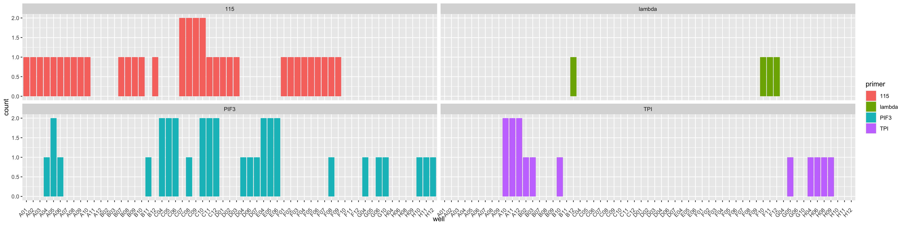
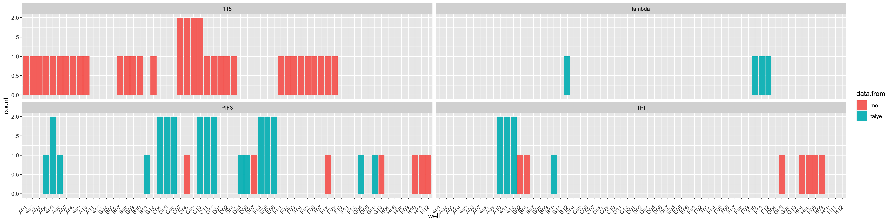
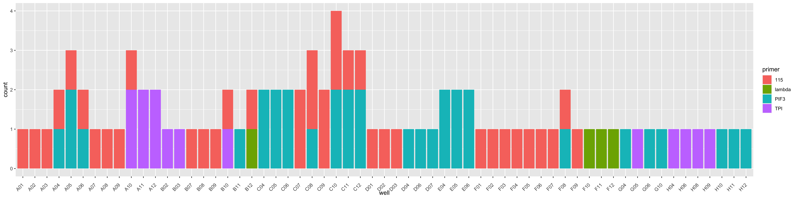
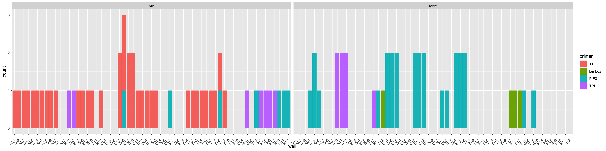
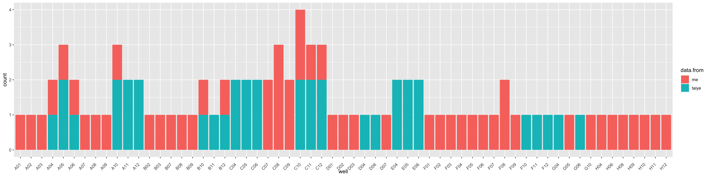

# qPCR-check

libraries

``` r
library(ggplot2)
library(ggforce)
library(scales)
```

Load in data

``` r
df <- read.csv("/Users/maggieschedl/Desktop/Github/Unckless_Lab_Resources/qPCR_analysis/well-check/qPCR-well-check.csv")
```

plot count of well by primer?

``` r
ggplot(df, aes(x = well, fill = primer)) +
  geom_bar() + facet_wrap(~primer) + theme(axis.text.x = element_text(angle = 45, vjust = 0.5, hjust=1))
```



``` r
ggplot(df, aes(x = well, fill = data.from)) +
  geom_bar() + facet_wrap(~primer) + theme(axis.text.x = element_text(angle = 45, vjust = 0.5, hjust=1))
```



I don’t see any pattern. I think the only reason some wells are missing
is because I never put a control in those wells yet.

``` r
ggplot(df, aes(x = well, fill = primer)) +
  geom_bar() + theme(axis.text.x = element_text(angle = 45, vjust = 0.5, hjust=1))
```



``` r
ggplot(df, aes(x = well, fill = primer)) +
  geom_bar() + facet_wrap(~data.from) + theme(axis.text.x = element_text(angle = 45, vjust = 0.5, hjust=1))
```



``` r
ggplot(df, aes(x = well, fill = data.from)) +
  geom_bar()  + theme(axis.text.x = element_text(angle = 45, vjust = 0.5, hjust=1))
```



Plot “heatmap style” the counts of times a well has come up with a Cq
value lower than 40 for something it should have been 40. I took the
spreadsheet above and changed it into counts, so I made one row per
well, and did the count of times that well was in the dataset. Then I
made new columns that were the row in the plate (1-8 corresponding to
A-H) and column in the plate (1-12). The example code I used did the
numbering like this for the rows and later changed it to be letter and
reordered it to go reverse (A at the top, which was 1). Using code to
make the plot from this
https://rpubs.com/artur_matysik/plot-96well-heatmap

``` r
heatmap_df <- read.csv("/Users/maggieschedl/Desktop/Github/Unckless_Lab_Resources/qPCR_analysis/well-check/well_heatmap.csv")
heatmap_df <- heatmap_df[1:96,] # remove unneeded wells

# make plot, see link above to what each code means
ggplot(data = heatmap_df) + 
  geom_circle(aes(x0 = columns, y0 = rows, r = 0.45, fill = count)) + coord_equal() + scale_fill_gradient(low = "white", high = "purple") +
  scale_x_continuous(breaks = 1:12, expand = expansion(mult = c(0.01, 0.01))) +
  scale_y_continuous(breaks = 1:8, labels = LETTERS[1:8], expand = expansion(mult = c(0.01, 0.01)), trans = reverse_trans()) +
  theme_bw() + 
  theme(panel.grid.major = element_blank(),
        panel.grid.minor = element_blank())
```


